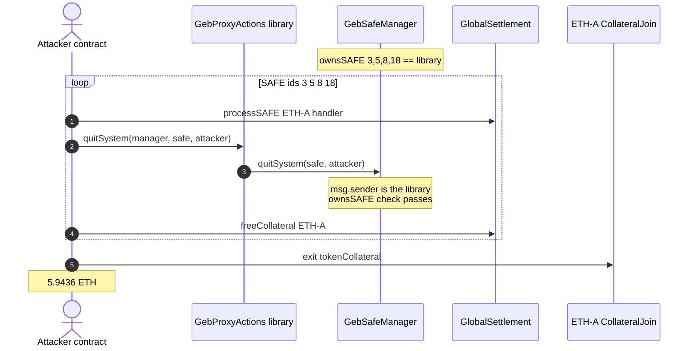
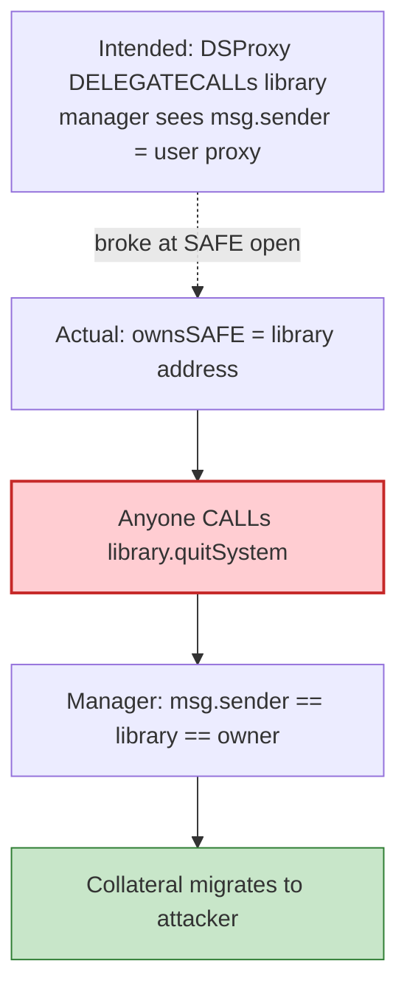

# Reflexer GEB — unauthenticated `GebProxyActions.quitSystem` drains library-owned SAFEs

> **Vulnerability classes:** vuln/access-control/missing-auth · vuln/access-control/missing-owner-check · vuln/logic/missing-check

> **Reproduction:** the PoC compiles & runs in an isolated Foundry project at
> [this project folder](.). Full verbose trace: [output.txt](output.txt).
> Source test: [test/ReflexerGEB_exp.sol](test/ReflexerGEB_exp.sol).

---

## Key info

| | |
|---|---|
| **Loss** | **5.943599831844387377 ETH** (~$14K) leftover ETH-A collateral [output.txt](output.txt) |
| **Vulnerable contract** | Shared library `GebProxyActions` — [`0x84FE452d9fb495A335C74a225e6AD52C35eB8616`](https://etherscan.io/address/0x84fe452d9fb495a335c74a225e6ad52c35eb8616) |
| **SAFE manager** | `GebSafeManager` — [`0xdF88b73462abD08f145b4b31edf4966C7129B255`](https://etherscan.io/address/0xdF88b73462abD08f145b4b31edf4966C7129B255) |
| **Attacker EOA** | [`0xB929C7215c0ec8EbAD5fBf73b1Da63bccfFf1896`](https://etherscan.io/address/0xB929C7215c0ec8EbAD5fBf73b1Da63bccfFf1896) |
| **Attack contract** | [`0x6a213f0b5bd9eed865d3e2efc867b73dfe9039e7`](https://etherscan.io/address/0x6a213f0b5bd9eed865d3e2efc867b73dfe9039e7) |
| **Attack tx** | [`0xfbce28e35c26358110dd9ed91f9ceef588acb264c3cf6c573df65ca21335058f`](https://etherscan.io/tx/0xfbce28e35c26358110dd9ed91f9ceef588acb264c3cf6c573df65ca21335058f) |
| **Chain / block / date** | Ethereum / fork **25,883,378** (attack−1) / 2026-09-01 |
| **Bug class** | Stateless proxy-actions library is the registered `ownsSAFE` owner; its public `quitSystem` is callable directly, so `msg.sender == library` passes `safeAllowed` |

---

## TL;DR

GebProxyActions is a **shared, stateless** "proxy actions" library. It is meant to be **DELEGATECALLed** through each user's DSProxy so that, from `GebSafeManager`'s point of view, `msg.sender` is the per-user proxy that owns the SAFE.

Several ETH-A SAFEs (ids **3, 5, 8, 18**) were instead registered with `ownsSAFE[safe] ==` the library's **own** address `0x84FE…`. `GebProxyActions.quitSystem(manager, safe, dst)` is a plain **public** function with **no authentication**. Called **directly** on the library (not via a proxy), the manager sees `msg.sender == library == ownsSAFE[safe]`, so `safeAllowed` passes. Anyone can migrate those SAFEs' collateral to an address they choose.

The system has been in **Global Settlement since January 2021**. Per SAFE the flow is:

1. `GlobalSettlement.processSAFE` — clears debt, leaving free collateral in the handler.
2. `GebProxyActions.quitSystem` — moves that collateral into the attacker's SAFEEngine balance (**the bug**).
3. `GlobalSettlement.freeCollateral` — converts it to internal ETH-A `tokenCollateral`.

Then one `CollateralJoin.exit` + `WETH.withdraw` turns the pile into ETH. **5.9436 ETH**.

Dormant leftover of a shut-down protocol — still a permissionless theft of other users' funds.

---

## Background

Reflexer GEB is a RAI-style CDP: `SAFEEngine` holds locked collateral / generated debt; `GebSafeManager` maps SAFE ids to handlers and owners; users normally act through a DSProxy that DELEGATECALLs into GebProxyActions so the manager attributes `msg.sender` to the proxy.

`quitSystem(safe, dst)` on the manager migrates a SAFE's collateral to `dst`, gated by `ownsSAFE[safe] == msg.sender` (or an allowance). That gate is correct **if** the owner is a per-user proxy. It is catastrophic if the owner is a **shared library** whose helpers are public.

---

## The vulnerable code

GebProxyActions (verified; conceptual):

```solidity
function quitSystem(address manager, uint safe, address dst) public {
    // NO auth. Forwards as msg.sender == this library.
    GebSafeManagerLike(manager).quitSystem(safe, dst);
}
```

GebSafeManager:

```solidity
function quitSystem(uint safe, address dst) public {
    require(ownsSAFE[safe] == msg.sender || safeCan[ownsSAFE[safe]][msg.sender] == 1, "not allowed");
    // migrate collateral from safes[safe] handler to dst
}
```

When `ownsSAFE[3] == address(GebProxyActions)` and a stranger calls `GebProxyActions.quitSystem(manager, 3, attacker)`, `msg.sender` on the manager **is** the library. The require passes.

---

## Root cause


## Secondary analysis (@exvulsec)

> Missing auth on GebProxyActions.quitSystem: library-owned SAFEs make the shared proxy-actions contract a public withdraw button (msg.sender == ownsSAFE[safe])

Source: https://x.com/exvulsec/status/2094819509031117198


Two mistakes:

1. **Mis-registered owners.** Those four SAFEs should have been owned by user DSProxies. They were owned by the singleton actions library (likely a constructor/open-SAFE path that used `address(this)` of the library instead of the proxy).
2. **Unauthenticated library API.** Proxy-action helpers that mutate positions must either be `internal` (only DELEGATECALL) or check `msg.sender` is a known proxy. A public `quitSystem` on a contract that *is* an owner is a public withdraw button.

Global Settlement does not cause the bug; it only makes `processSAFE` + `freeCollateral` the cash-out path for leftover ETH-A.

---

## Preconditions

- `ownsSAFE[id] == GebProxyActions` for ids 3, 5, 8, 18 (true at the fork).
- System in Global Settlement so `processSAFE` / `freeCollateral` succeed.
- Attacker contract allows the manager as a SAFEEngine modifier (`approveSAFEModification` + `allowHandler`).

---

## Attack walkthrough

From [test/ReflexerGEB_exp.sol](test/ReflexerGEB_exp.sol):

```
SAFE ids = [3, 5, 8, 18]
for each:
  require ownsSAFE[id] == PROXY_ACTIONS
  processSAFE(ETH-A, handler)
  PROXY_ACTIONS.quitSystem(manager, id, this)   // THE BUG
  freeCollateral(ETH-A)
CollateralJoin.exit(this, tokenCollateral)
WETH.withdraw
```

```
Attacker ETH profit: 5.943599831844387377
[PASS] testExploit()
```

Matches the live tx to the wei (within 1e15).

---

## Diagrams





---

## Remediation

1. **Never register a shared library as `ownsSAFE`.** Opening a SAFE from a DELEGATECALL context must store the proxy (`address(this)` in the proxy's storage), not the library.
2. **Do not expose mutating helpers as `public` on the library.** Make them `internal`, or require the caller is a factory-created DSProxy.
3. **Migrate leftover library-owned SAFEs** to a timelocked recovery contract (too late here).
4. After Global Settlement, sweep remaining collateral through a governed process rather than leaving `quitSystem` live.

---

## How to reproduce

```bash
_shared/run_poc.sh 2026-08-ReflexerGEB_exp --mt testExploit -vvvvv
```

Expected: `[PASS] testExploit()` with `Attacker ETH profit: 5.943599831844387377`.

---

*Reference: https://x.com/exvulsec/status/2094819509031117198*
