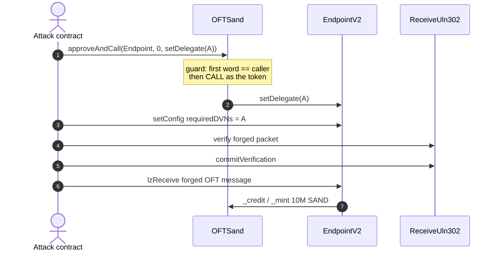
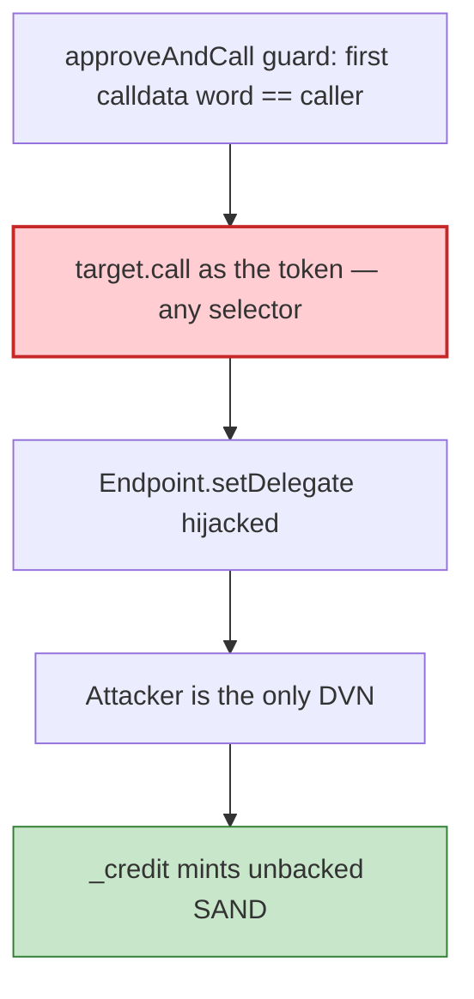

# The Sandbox SAND OFT — `approveAndCall` hijacks LayerZero delegate and mints unbacked SAND

> **Vulnerability classes:** vuln/access-control/missing-auth · vuln/bridge/message-spoofing · vuln/input-validation/missing

> **Reproduction:** the PoC compiles & runs in an isolated Foundry project at
> [this project folder](.). Full verbose trace: [output.txt](output.txt).
> Source test: [test/SandboxOFT_exp.sol](test/SandboxOFT_exp.sol).
> Sibling playground of the same campaign: [`2026-08-UnknownHack`](../2026-08-UnknownHack_exp/) (this folder is the typed reconstruction of **one** 10M-SAND mint tx).

---

## Key info

| | |
|---|---|
| **Loss** | This tx mints **10,000,000 unbacked SAND**. Campaign: ~$49B face value across 400+ txs; ~$670k realized |
| **Vulnerable contract** | OFTSand (SAND OFT on Base) — [`0xac531Eb26Ca1d21b85126De8FB87E80E09002DcF`](https://basescan.org/address/0xac531Eb26Ca1d21b85126De8FB87E80E09002DcF) |
| **EndpointV2** | [`0x1a44076050125825900e736c501f859c50fE728c`](https://basescan.org/address/0x1a44076050125825900e736c501f859c50fE728c) |
| **ReceiveUln302** | [`0xc70AB6f32772f59fBfc23889Caf4Ba3376C84bAf`](https://basescan.org/address/0xc70AB6f32772f59fBfc23889Caf4Ba3376C84bAf) |
| **Attacker EOA** | [`0x638Ccb18370eE228378a565c1d4D0F9620d7F296`](https://basescan.org/address/0x638Ccb18370eE228378a565c1d4D0F9620d7F296) (tx.origin + mint recipient) |
| **Attack contract** | [`0xd7Cb71EE00a812FC22ACcfE08A2f59A5Add2f6Ca`](https://basescan.org/address/0xd7Cb71EE00a812FC22ACcfE08A2f59A5Add2f6Ca) (CREATE'd this tx; becomes delegate + DVN) |
| **Attack tx** | [`0x76ed03844ff61520a0fb99278f92f2f1453b24ccbacd20b91131703e4a56a446`](https://basescan.org/tx/0x76ed03844ff61520a0fb99278f92f2f1453b24ccbacd20b91131703e4a56a446) (Base block **50,289,412**) |
| **Chain / block / date** | Base / fork **50,289,411** / 2026-08-21 |
| **Bug class** | ERC677-style `approveAndCall` is an arbitrary CALL-as-token primitive; first-param==caller guard does not constrain target or selector |

---

## TL;DR

`OFTSand.approveAndCall(target, amount, data)` does `target.call{value: msg.value}(data)` with `msg.sender ==` the token. Its **only** guard is `doFirstParamEqualsAddress(data, _msgSender())` — the first 32-byte word of `data` must equal the caller. That stops spending someone else's approval. It does **not** stop calling **any function on any contract as the token**.

The token is the LayerZero OApp. Attacker:

1. `approveAndCall(Endpoint, 0, setDelegate(attacker))` — first param is the attacker, guard passes, Endpoint records the attacker as SAND's delegate (normally `onlyOwner`).
2. As delegate, `Endpoint.setConfig(OFTSand, ReceiveUln302, UlnConfig{requiredDVNs:[attacker]})`.
3. As that DVN, `verify` + `commitVerification` a **forged** inbound packet (srcEid 30101 = Ethereum). Peer check passes because SAND OFT is deployed at the **same address** on Ethereum and Base.
4. `Endpoint.lzReceive` → `OFTSand._credit` → bare `_mint`. **10,000,000 SAND** (`amountSD 1e13 * decimalConversionRate 1e12`).

No key/admin compromise. Every step is a public call.

---

## Background

LayerZero OFTs credit the destination token when a verified inbound packet arrives. Security is the ULN config: required DVNs must attest the packet. `setDelegate` / `setConfig` are supposed to be owner-only on the OApp.

SAND OFT added an ERC677 `approveAndCall` helper so dapps can approve-and-hook in one tx. Combined with "the token *is* the OApp", that helper is a confused-deputy primitive against EndpointV2.

---

## The vulnerable code

```solidity
function approveAndCall(address target, uint256 amount, bytes calldata data)
    external payable returns (bytes memory)
{
    // ... optional approve ...
    require(BytesUtil.doFirstParamEqualsAddress(data, _msgSender()), "first param != sender");
    (bool ok, bytes memory ret) = target.call{value: msg.value}(data); // msg.sender == token
    require(ok);
    return ret;
}
```

`setDelegate(address)`'s first ABI word **is** an address. Passing `setDelegate(attacker)` satisfies the guard and runs as the OApp.

`OFTSand._credit` is `_mint(to, amountLD)` with no backing check — correct **if** the packet was DVN-attested. After step 2, the DVN **is** the attacker.

---

## Root cause

1. **Unrestricted `target`/`selector`** on a helper that executes as the token.
2. **OApp identity = token identity**, so a CALL-as-token is a CALL-as-OApp.
3. **Same address on two chains** makes a forged Ethereum→Base packet pass the peer check (`sender == address(this)`).
4. **`_credit` trusts the packet** once the Endpoint delivers it.

---

## Preconditions

- Attacker can CREATE a contract whose address they pass as `setDelegate`'s first arg (so the guard matches `msg.sender` of `approveAndCall`).
- Receive ULN allows `setConfig` by the OApp delegate.
- Peer[30101] is the OFT's own address.

---

## Attack walkthrough

Exact calldata from [test/SandboxOFT_exp.sol](test/SandboxOFT_exp.sol) (prank as attack contract, tx.origin = EOA):

| # | Call | Result |
|---|---|---|
| 1 | `SAND.approveAndCall(Endpoint, 0, setDelegate(0xd7Cb71…))` | `delegates[SAND] == attack contract` |
| 2 | `Endpoint.setConfig(SAND, ReceiveUln, UlnConfig requiredDVNs=[attack])` | attacker is sole DVN for eid 30101 |
| 3 | `ReceiveUln.verify(header, payloadHash, 1)` then `commitVerification` | forged packet committed |
| 4 | `Endpoint.lzReceive(origin, SAND, guid, message, "")` | `_mint(EOA, 10_000_000e18)` |

```
SAND balance of attacker before: 70000000
SAND balance of attacker after : 80000000
Unbacked SAND minted            : 10000000
[PASS] testExploit()
```

(The EOA already held 70M from earlier campaign txs; this PoC is one mint.)

---

## Diagrams





---

## Remediation

1. **Remove `approveAndCall`, or whitelist `(target, selector)`.** Never allow a generic CALL-as-token into the bridging stack.
2. **Keep `setDelegate` / `setConfig` strictly `onlyOwner`** on the OApp; do not let the token's `msg.sender` be spoofable via helpers.
3. **Require independent DVNs**; reject a config with a single untrusted required DVN.
4. **Don't treat same-address deployment as a peer proof** without packet/payload authentication beyond DVN attestations the OApp itself can rewrite.

---

## How to reproduce

```bash
_shared/run_poc.sh 2026-08-SandboxOFT_exp --mt testExploit -vvvvv
```

Fork is Base (`127.0.0.1:8548`). Expected: `[PASS] testExploit()` with 10,000,000 SAND minted.

---

*Reference: https://x.com/GoPlusSecurity/status/2091350029617500439*
