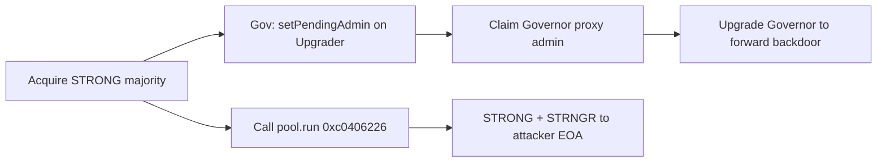

# StrongBlock Governance Takeover — Abandoned Governor → Malicious Upgrade → Pool Drain

<!-- non-defihacklabs: Crypto Training original detection & analysis (Twitter hack alerting) -->

> **Vulnerability classes:** vuln/access-control/missing-auth · vuln/governance · vuln/logic/incorrect-state-transition

---

## Key info

| | |
|---|---|
| **Loss** | **~$72K** — **32,695.76 STRONG** + **383,447.17 STRNGR** |
| **Chain** | Ethereum mainnet |
| **Protocol** | StrongBlock (`@Strongblock_io`) |
| **Attacker EOA** | [`0xACBCa357…810c`](https://etherscan.io/address/0xacbca357981870f30130b145762d671891ca810c) |
| **Governor proxy** | [`0xBDDC7Ef8…B8C1`](https://etherscan.io/address/0xBDDC7Ef8BaCeacE16DCE005102639a4bB86CB8C1) |
| **Upgrader** | [`0x75C53809…1C61`](https://etherscan.io/address/0x75C53809A047c3d422B91Eda50A20914fBe91C61) |
| **Drain pool / helper** | [`0x53cA51Ba…38Fc`](https://etherscan.io/address/0x53cA51Ba980B6475C13d158c1825013cf81038Fc) |
| **Malicious impl** | [`0xf6c7c78f…e285`](https://etherscan.io/address/0xf6c7c78f8cec262eafc90f87a88fb5ef43f2e285) (`forward(address,bytes)` gated to attacker) |
| **Drain tx** | [`0x3ffa7f6d…0401`](https://etherscan.io/tx/0x3ffa7f6da3f0747660917dd331e060e45ffca8a195578ec8db4c9fbc623b0401) (block **25691527**, `run()`) |
| **Upgrade tx** | [`0x92be5e37…94c6`](https://etherscan.io/tx/0x92be5e374e260192f8fdb5ffdc33504c768ecad091cc7dbc37282e5ca8ea94c6) (block **25691700**, Upgrader `upgrade`) |
| **Alert** | [DefimonAlerts 2026-08-06](https://x.com/DefimonAlerts/status/2085246380231004319) |
| **Bug class** | Abandoned on-chain Governor + cheap majority of near-worthless STRONG vote token → admin seizure → malicious proxy upgrade → arbitrary calls / pool drain |

---

## TL;DR

1. StrongBlock left an **on-chain Governor** with live upgrade authority, while the **STRONG** vote token was economically worthless — so majority voting power was cheap.
2. Attacker used governance to call **`setPendingAdmin`** on the Governor’s **Upgrader**, then claimed admin of the **Governor proxy**.
3. They **upgraded** the proxy to a minimal implementation exposing **`forward(address,bytes)`** hard-gated to the attacker EOA (arbitrary-call backdoor under Governor authority).
4. Separately (and in this PoC’s economic replay), the attacker called **`run()`** on a StrongBlock pool helper that transferred **~32.7k STRONG + ~383k STRNGR** to the attacker.

---

## Attack walkthrough



### A. Governance / upgrade path (on-chain narrative)

1. Acquire majority STRONG voting weight (abandoned protocol economics).
2. Propose / vote / queue / execute Upgrader admin change toward attacker.
3. `upgrade(GovernorProxy, MaliciousImpl)` via Upgrader (`0x99a88ec4`).
4. Malicious impl: only `forward(address,bytes)` for `msg.sender == attacker`.

### B. Economic drain (PoC reproduces this)

1. Pre-state (block **25691526**): inventory proxy `0x53cA…38Fc` (OpenZeppelin `AdminUpgradeabilityProxy`) holds the STRONG/STRNGR balances.
2. Implementation `0xE89C…4106` exposes **`run()`** (`0xc0406226`) with **hardcoded** pool / STRONG / STRNGR / attacker addresses — no access control; recipient is baked into bytecode.
3. Attacker (or any caller) invokes `run()` on the proxy → DELEGATECALL → transfers full STRONG + STRNGR balances to the attacker EOA.
4. Attacker later sells inventory (1inch / Uniswap paths) and continues upgrade cleanup.

> **PoC scope.** The Foundry / EVM Playground PoC replays the economic drain at the pre-drain block. Governance control is already established on-chain by that point; the playground story anchors on the verified proxy + ERC-20 transfers (the drain impl is unverified bytecode-only).

---

## PoC

```bash
cd 2026-08-StrongBlockGovernanceTakeover_exp
MAINNET_RPC_URL=... forge test --match-test testExploit -vvv
```

Expected: `[PASS] testExploit()` with **32695.76 STRONG** and **383447.17 STRNGR** profit.

---

## References

- https://x.com/DefimonAlerts/status/2085246380231004319
- https://etherscan.io/tx/0x3ffa7f6da3f0747660917dd331e060e45ffca8a195578ec8db4c9fbc623b0401
- https://etherscan.io/tx/0x92be5e374e260192f8fdb5ffdc33504c768ecad091cc7dbc37282e5ca8ea94c6
- https://etherscan.io/address/0xBDDC7Ef8BaCeacE16DCE005102639a4bB86CB8C1
- https://etherscan.io/address/0xACBCa357981870f30130B145762d671891CA810c
