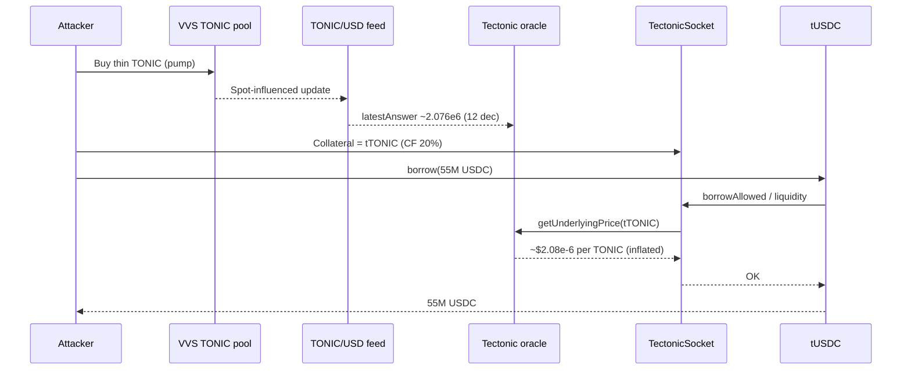

# Tectonic TONIC Thin-Oracle Collateral Manipulation — Over-Borrow Against Inflated Spot Mark

<!-- non-defihacklabs: Crypto Training original detection & analysis (Twitter hack alerting) -->

> **Vulnerability classes:** vuln/oracle/spot-price · vuln/oracle/price-manipulation · vuln/oracle/missing-validation · vuln/oracle/single-source

> **Reproduction:** [this folder](.) · offline `[PASS]` in [`output.txt`](output.txt) · `_shared/run_poc.sh 2026-08-TectonicTonicOracleManipulation_exp -vvvvv`

---

## Key info

| | |
|---|---|
| **Loss** | **~$75M** (PeckShield ~$74M; researcher Weilin Li ~$66M then +~$8M → ~$75M). PoC drains **55M USDC + 45M USDT** from tToken cash at the pre-borrow fork. |
| **Chain** | Cronos (chainId **25**) |
| **Protocol** | Tectonic (`@TectonicFi`) — Compound-fork money market |
| **Attacker EOA** | [`0x4266a0E6…3652`](https://explorer.cronos.org/address/0x4266a0E6A0f0ef90AbCFF3BB089932cA0CCe3652) |
| **Attack contract** | [`0xd3aaC8a1…f1F3`](https://explorer.cronos.org/address/0xd3aaC8a1a9e412E2C590463a8B6F90125e23f1F3) (deployed in setup tx) |
| **Position / borrower** | [`0x2dc6A36F…b618`](https://explorer.cronos.org/address/0x2dc6A36F4e5eeEFE112C01569de96dEa496Bb618) |
| **Profit sink (Cronos)** | [`0x7D4E7e5D…F2DC`](https://explorer.cronos.org/address/0x7D4E7e5DcB0CCc66B4F0f8b0F30DA5078Ad4F2DC) (~$60M trapped after halt) |
| **ETH bridge wallet** | [`0xc404160B…72DD`](https://etherscan.io/address/0xc404160B79BD8905061a1cAecBeCa2EEab3f72DD) (~$6M → ~2,600 ETH) |
| **TectonicSocket** | [`0xb3831584…eEc0`](https://explorer.cronos.org/address/0xb3831584acb95ED9cCb0C11f677B5AD01DeaeEc0) |
| **tTONIC / TONIC** | [`0xfe6934FD…20Ad`](https://explorer.cronos.org/address/0xfe6934FDf050854749945921fAA83191Bccf20Ad) / [`0xDD73dEa1…c5B2`](https://explorer.cronos.org/token/0xDD73dEa10ABC2Bff99c60882EC5b2B81Bb1Dc5B2) |
| **Borrow markets (PoC)** | `tUSDC` [`0xB3bbf1bE…F4c8e`](https://explorer.cronos.org/address/0xB3bbf1bE947b245Aef26e3B6a9D777d7703F4c8e) · `tUSDT` [`0xA683fdfD…44E5`](https://explorer.cronos.org/address/0xA683fdfD9286eeDfeA81CF6dA14703DA683c44E5) |
| **Oracle** | [`0xD360D8cA…754A`](https://explorer.cronos.org/address/0xD360D8cABc1b2e56eCf348BFF00D2Bd9F658754A) |
| **TONIC/USD feed** | [`0x14f75394…123F`](https://explorer.cronos.org/address/0x14f753940720C1Fa4247Cd464C7EA28c806d123F) (docs: **VVS Finance + Crypto.com**) |
| **Setup tx** | [`0x0fce5ae8…7d06`](https://explorer.cronos.org/tx/0x0fce5ae8d2eeb82c838e750d0e25af1564a2c7d05bf843dd1cfea102ce587d06) @ **90,896,190** |
| **Over-borrow tx** | [`0xddc9dc47…eca20`](https://explorer.cronos.org/tx/0xddc9dc47d330116332ae687ba939f6d6196c4cc5950b2cdb04ae826520eeca20) @ **90,897,110** |
| **Fork block** | **90,897,109** (one before over-borrow; oracle already pumped, tTONIC collateral posted) |
| **Alert** | [GoPlus](https://x.com/GoPlusSecurity/status/2094268398662537542) · [Weilin Li](https://x.com/hklst4r/status/2094079327176466563) · [The Block](https://www.theblock.co/news/defi/2026-08-30-crypto-com-linked-cronos-network-halts-after-tectonic-exploit-estimated-at-75-million-413069) |
| **Bug class** | Thin-liq TONIC as Compound-fork collateral (CF 20%) priced by manipulable VVS-sourced internal oracle → over-borrow |

---

## TL;DR

1. Tectonic listed **TONIC** (its own illiquid governance token) as collateral with a **20% collateral factor**.
2. The protocol’s **internal oracle** priced TONIC from a **VVS + Crypto.com** feed — effectively a **spot / thin-market** mark with no meaningful on-chain deviation/TWAP guard for this path.
3. Attacker **pumped TONIC ~100–200×** in ~20 minutes, posted huge **tTONIC** collateral on position `0x2dc6…`, then **borrowed real USDC/USDT/…** against the inflated mark (Mango-style).
4. Cronos **halted** block production; only ~**$6M** reached Ethereum; most funds stayed on Cronos.
5. This PoC forks at **90,897,109** (oracle inflated + collateral live) and re-borrows **55M USDC + 45M USDT**.

---

## Background

Tectonic is Cronos’s dominant Compound-fork lending market (pre-incident TVL ~$120M). Like Compound, borrows are gated by account liquidity: collateral value × collateral factor must cover debt, and collateral value comes from `oracle.getUnderlyingPrice(tToken)`.

Tectonic’s docs list **TONIC/USD** at `0x14f753…` with sources **VVS Finance** and **Crypto.com Exchange**. That feed is what the socket oracle (`0xD360D8…`) surfaces into `getUnderlyingPrice(tTONIC)`. Listing a thin DEX-traded governance token as borrowable collateral is the same economic failure mode as **Mango Markets (2022)** and the contemporaneous **Moonwell MAMO** drain.

---

## The vulnerable code

Cronos contracts are **not** available via Etherscan V2 / Sourcify at build time. Behaviour below is confirmed on a live Cronos archive fork; Solidity under [`sources/`](sources/) is **RECONSTRUCTED** teaching stubs marked as such.

**Oracle path (reconstructed):**

```solidity
// sources/TectonicOracle_D360D8/PriceOracle.sol (RECONSTRUCTED)
function getUnderlyingPrice(address tToken) public view returns (uint256) {
    int256 answer = AggregatorInterface(feeds[tToken]).latestAnswer();
    require(answer > 0, "price <= 0");
    uint8 feedDecimals = AggregatorInterface(feeds[tToken]).decimals(); // 12 for TONIC/USD
    // No TWAP / deviation / thin-liquidity circuit breaker
    return uint256(answer) * (10 ** (18 - feedDecimals));
}
```

On-fork at `90,897,109`:

| | Pre-pump (~90,896,189) | PoC fork |
|---|---|---|
| Feed `latestAnswer` (12 dec) | `10622` | `2076321` |
| `getUnderlyingPrice(tTONIC)` | `1.0622e10` (~$1.06e-8) | `2.076321e12` (~$2.08e-6) |
| Approx. multiple | 1× | **~195×** |

**Collateral factor** (live): `markets(tTONIC) = (true, 0.2e18, …)` — 20% CF.

**Borrow gate** (reconstructed Comptroller/Socket): `borrowAllowed` → `getAccountLiquidity`, which multiplies tTONIC balances by the oracle mark and CF. Inflated mark → huge liquidity → `tUSDC.borrow` / `tUSDT.borrow` succeed.

---

## Root cause

1. **Listing risk:** Illiquid TONIC accepted as collateral (CF 20%) despite thin VVS liquidity (reports: ~$1.3M liquidity / ~$11k daily volume).
2. **Oracle risk:** Internal TONIC/USD path tracks **VVS spot (+ CEX)** without an effective on-chain bound that would reject a ~100× move before borrows clear.
3. **Compound-fork amplification:** Once the mark is wrong, `getAccountLiquidity` trusts it; there is no separate “realizable liquidity” check on collateral.

Same family as Mango / Moonwell-MAMO: **thin collateral + manipulable mark + over-borrow**.

---

## Preconditions

- TONIC listed with non-trivial CF (20%).
- Ability to move the VVS-influenced TONIC mark (capital + thin pool).
- Capacity to mint/post **tTONIC** and enter markets on a borrower account.
- Deep enough tUSDC/tUSDT (and other) cash to drain — at fork, ~**55.24M USDC** and ~**45.65M USDT** sat in those markets.

---

## Attack walkthrough

```mermaid
flowchart TD
  A[Setup tx: deploy attack contracts\nseed USDC, buy TONIC on VVS] --> B[Mint/post tTONIC collateral\non position 0x2dc6…]
  B --> C[Pump continues — feed rises\n~100-200x over ~20 min]
  C --> D[Oracle getUnderlyingPrice(tTONIC)\nreturns inflated 1e18 mark]
  D --> E[Socket getAccountLiquidity\nshows ~$137M borrow capacity]
  E --> F[Over-borrow tx: tUSDC/tUSDT/… borrow]
  F --> G[Stables/other assets to sinks\n~$6M bridged to ETH before halt]
```

### Historical path

1. **Setup** [`0x0fce5ae8…`](https://explorer.cronos.org/tx/0x0fce5ae8d2eeb82c838e750d0e25af1564a2c7d05bf843dd1cfea102ce587d06) @ 90,896,190 — deploy `0xd3aa…`, spend ~5M USDC from `0x7D4E…`, build position; position receives ~**3.09e22** raw tTONIC (8 decimals).
2. **Pump window** — feed moves `10622` → `2076321` by block 90,897,109.
3. **Drain** [`0xddc9dc47…`](https://explorer.cronos.org/tx/0xddc9dc47d330116332ae687ba939f6d6196c4cc5950b2cdb04ae826520eeca20) @ 90,897,110 — position borrows across markets; Transfer nets show ~**55.24M USDC** and ~**45.65M USDT** leaving tTokens alone (plus WCRO/WETH/WBTC/…).
4. **Containment** — Cronos validators halt; ~$6M already on Ethereum at `0xc404…`.

### PoC path (`test/TectonicTonicOracleManipulation_exp.sol`)

Fork **90,897,109**, prank as position `0x2dc6…`, call:

- `tUSDC.borrow(55_000_000e6)`
- `tUSDT.borrow(45_000_000e6)`

[`output.txt`](output.txt) (offline anvil):

```
Oracle TONIC underlying price (1e18): 0.000002076321000000
tTONIC collateral factor: 0.200000000000000000
Position tTONIC collateral: 309201610258517.41101656
Account liquidity (USD 1e18): 136835847.149861835932153050
USDC borrowed (profit): 55000000.000000
USDT borrowed (profit): 45000000.000000
[PASS] testExploit()
```

---

## Diagrams



---

## Remediation

- **Delist** or set **CF = 0** for thin governance tokens; Tectonic’s own docs warned about low-liquidity oracle risk.
- Prefer **manipulation-resistant** oracles (bounded TWAP, multi-venue median with hard deviation caps, circuit breakers on >X% moves).
- Add **borrow caps** and **supply caps** tight enough that a full mark attack cannot clear eight-figure cash.
- Pause / guardian path for oracle anomalies (Cronos halt contained bridging but is not a substitute for protocol-level guards).

---

## How to reproduce

```bash
# Offline (preferred)
cd /workspaces/RustroverProjects/audits/evm-hack-registry
anvil --load-state 2026-08-TectonicTonicOracleManipulation_exp/anvil_state.json \
  --port 8561 --chain-id 25 &
cd 2026-08-TectonicTonicOracleManipulation_exp
TECTONIC_FORK_URL=http://127.0.0.1:8561 forge test --match-test testExploit -vvvvv

# Or via shared runner once registered
_shared/run_poc.sh 2026-08-TectonicTonicOracleManipulation_exp -vvvvv

# Online archive fork
CRONOS_RPC_URL=https://cronos.drpc.org forge test --match-test testExploit -vvv
```

**Note:** Official `https://evm.cronos.org` returned unhealthy during the halt window; `https://cronos.drpc.org` and `https://cronos-evm-rpc.publicnode.com` served archive state for this build.

*Reference: https://x.com/GoPlusSecurity/status/2094268398662537542*
