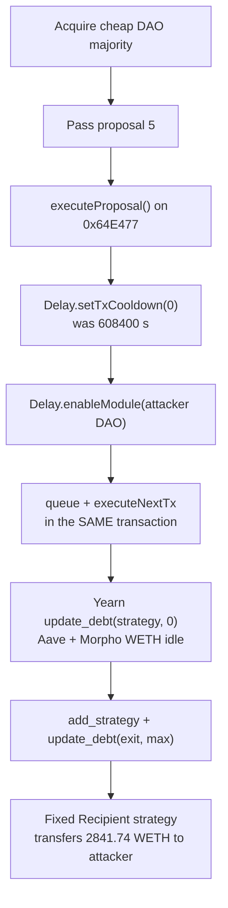
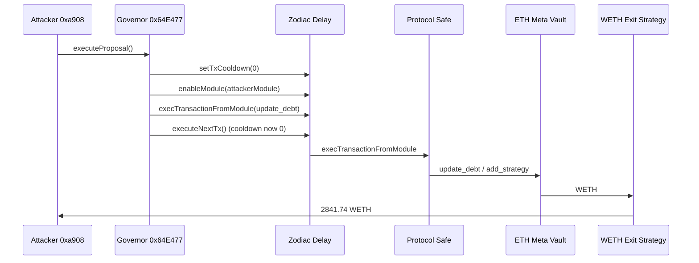

# Term Finance Governance Takeover — Thin gtmvETH Majority → Zero Delay Cooldown → Yearn Vault Drain

<!-- non-defihacklabs: Crypto Training original detection & analysis (Twitter hack alerting) -->

> **Vulnerability classes:** vuln/governance/proposal-manipulation · vuln/governance/timelock-bypass · vuln/access-control/centralization

> **Reproduction:** the PoC compiles & runs in an isolated Foundry project at
> [this project folder](.). Full verbose trace: [output.txt](output.txt).
> Verified sources live under [sources/](sources/) (Yearn V3 ETH Meta Vault, Zodiac Delay, Gnosis Safe, Aragon OSx DAO, WETH).
> The attacker-controlled governor implementation at `0x3e30DDF3…` is **unverified**; `executeProposal()` behaviour below is reconstructed from the on-chain trace.

---

## Key info

| | |
|---|---|
| **Loss** | **~$8.5M** — this PoC reproduces **2,841.743517563533112109 WETH** (~$6.86M at ~$2,414/ETH). A second executor later drained **~1.68M USDC**. Live tx #1 credited 2,841.743535791961701401 WETH (one extra block of Aave/Morpho yield). |
| **Vulnerable contract** | Zodiac Delay (clone) [`0x35C99CF4…9e33`](https://etherscan.io/address/0x35C99CF4a5DF2D9bCd822BeE32676D9590229e33) → master [`0xd54895B1…1BED6`](https://etherscan.io/address/0xd54895B1121A2eE3f37b502F507631FA1331BED6); Yearn V3 **ETH Meta Vault** [`0x26fCb50e…7Db2`](https://etherscan.io/address/0x26fCb50eEC367ddAB060ccf5E7394Cecd95F7Db2); protocol Safe [`0x46DA347d…8613`](https://etherscan.io/address/0x46DA347d1Db6EdCA62BF6Cd5892Dc284fC938613) |
| **Attacker EOA (tx #1)** | [`0xa908b347…612B`](https://etherscan.io/address/0xa908b3472d76e7744baB0A5911768a4a6300612B) |
| **Attacker EOA (tx #2)** | [`0x686457a7…0691`](https://etherscan.io/address/0x686457a7468B9B31c5dbA43b1b16077B48520691) |
| **Governor / proposal proxy** | [`0x64E47780…b4dF`](https://etherscan.io/address/0x64E477800051EFb06Ae4086f4b258b270668b4dF) (unverified impl [`0x3e30DDF3…7cF1`](https://etherscan.io/address/0x3e30DDF30172F54C50cB490fF56E10f1a4737cF1)) |
| **Vote token** | [`gtmvETH`](https://etherscan.io/address/0x5b96c5bBdcB361E1E9944bAa071b237E27829Be0) — GovernanceWrappedERC20 of tmvETH vault shares (~0.535 total supply) |
| **TokenVoting plugin** | [`0x21377169…2171`](https://etherscan.io/address/0x213771693A4411446b4ECce5bce4a405778b2171) (Aragon OSx) |
| **Propose / vote (2026-08-17)** | [`0x284fc544…a8b8`](https://etherscan.io/tx/0x284fc544f39c21388e17ca9669970dda9fe0f31921c38676f56073573f73a8b8) / [`0x6e735333…2a8d`](https://etherscan.io/tx/0x6e73533304c28686928bf274ec89e8baedbccaed6e8b9211ef54ca90a54e2a8d) |
| **Attacker Zodiac / Aragon module** | [`0x0ae12AF3…c0a6`](https://etherscan.io/address/0x0ae12AF3878a2d896f5C4DCE3Be7250FB187c0a6) (ERC1967 → Aragon OSx `DAO` [`0x52Af1666…2D3a`](https://etherscan.io/address/0x52af16664155608b845be18aa29620ebf6ea2d3a)) |
| **WETH exit strategy** | [`0x184f2E57…6338`](https://etherscan.io/address/0x184f2E57b4cE135181FA2A2166AC394339016338) ("Fixed Recipient WETH Exit Strategy") |
| **Attack tx #1** | [`0xd354a15b…4129`](https://etherscan.io/tx/0xd354a15b15cb73d30908f411aee3f795ec86737a4d080e9a818ac4d6d3014129) — `executeProposal()`, block **25816049** (2026-08-23) |
| **Attack tx #2** | [`0x9f273f9a…e8a0`](https://etherscan.io/tx/0x9f273f9a5a20c2fc957b06bbfa45db486390eede4a7f44fbe1a2eb6744c2e8a0) — block **25816159**, ~1.68M USDC |
| **Chain / block / date** | Ethereum mainnet (chainId 1) / fork block **25,816,048** (pre-tx #1) / 23 Aug 2026 |
| **Compiler** | Delay: Solidity **v0.8.0**, optimizer **off**; Yearn V3 vault: **vyper:0.3.7**; Safe: **v0.7.6**; Aragon DAO: **v0.8.17** |
| **Bug class** | Cheap majority of thinly held **gtmvETH** (wrapped vault shares, ~0.535 supply) → pass a malicious Aragon proposal that **zeros Zodiac Delay `txCooldown`** (was 608,400 s ≈ 7 days) → enable attacker module → `update_debt` Yearn/Morpho/Aave positions into a hardcoded-recipient exit strategy |
| **Alert** | [DefimonAlerts](https://x.com/DefimonAlerts/status/2091422624249217259) · [Term Labs](https://x.com/term_labs/status/2091428394130886740) · [CertiK](https://x.com/CertiKAlert/status/2091433962795106499) · [@PeckShieldAlert](https://x.com/PeckShieldAlert/status/2091452165932175659) · [@GoPlusSecurity](https://x.com/GoPlusSecurity/status/2091702007728140293)|

---

## TL;DR

Term Finance parked ETH in a Yearn V3 **ETH Meta Vault**, administered by a Gnosis Safe sitting behind a Zodiac **Delay** module (`txCooldown` = **608,400 seconds ≈ 7 days**). DAO governance could change that Delay.

Vote power is **gtmvETH**, a wrap of Yearn tmvETH vault shares. Almost nobody wrapped: `totalSupply ≈ 0.535`. The attacker spent ~0.5 ETH for ~0.485 tmvETH, wrapped it, and held ~90% of voting power. They proposed on **2026-08-17**, voted, then six days later called `executeProposal()`:

1. **Zero the timelock** — `Delay.setTxCooldown(0)` then `setTxExpiration(0)` ([output.txt:427](output.txt), [output.txt:437](output.txt)). Storage slot 105: `608400 → 0`.
2. **Install a backdoor** — `Delay.enableModule(0x0ae12AF3…)` ([output.txt:448](output.txt)).
3. **Unwind every strategy** — Delay `execTransactionFromModule` + immediate `executeNextTx` (legal now that cooldown is 0) calls Yearn `update_debt(strategy, 0)` against Aave stataWETH and Morpho positions, then `add_strategy` + `update_max_debt` + `update_debt(max)` on a **Fixed Recipient WETH Exit Strategy**.
4. **Walk away with WETH** — the exit strategy `transfer`s **2,841.743517563533112109 WETH** to the attacker EOA ([output.txt:1435](output.txt), [output.txt:1484](output.txt)).

A follow-up tx ~22 minutes later drained ~1.68M USDC from a sibling vault via a second governor (`0x4F4B614d…`).

---

## Background

Term Finance (`@term_labs`) is a fixed-rate lending protocol. Idle WETH sat in Yearn V3 vaults (the ETH Meta Vault at `0x26fCb50e…`) that allocated into Aave static-aToken wrappers and Morpho Blue markets. Admin of those vaults is a **Safe**, and the Safe is gated by a Zodiac Delay so that a module transaction is *queued* and can only be executed after `txCooldown`.

That design is sound **only if**:

- governance that can call `setTxCooldown` is expensive to capture, **and**
- the cooldown is not itself a governance-settable parameter that a captured DAO can zero in the same proposal that drains.

Both failed. The vote token was sparsely held; capturing a majority was cheap. The Delay owner (the protocol Safe / role router) accepted `setTxCooldown(0)` as a legitimate governance action, after which `executeNextTx` no longer waits.

---

## The vulnerable code

Zodiac Delay queues module transactions and is supposed to enforce a cooldown before `executeNextTx`:

```solidity
function execTransactionFromModule(
    address to,
    uint256 value,
    bytes calldata data,
    Enum.Operation operation
) public override moduleOnly returns (bool success) {
    bytes32 hash = getTransactionHash(to, value, data, operation);
    txHash[queueNonce] = hash;
    txCreatedAt[queueNonce] = block.timestamp;
    emit TransactionAdded(queueNonce, hash, to, value, data, operation);
    queueNonce++;
    success = true;
}

function executeNextTx(
    address to,
    uint256 value,
    bytes calldata data,
    Enum.Operation operation
) public {
    require(txNonce < queueNonce, "Transaction queue is empty");
    uint256 txCreationTimestamp = txCreatedAt[txNonce];
    require(
        block.timestamp - txCreationTimestamp >= txCooldown,
        "Transaction is still in cooldown"
    );
    // ...
    require(exec(to, value, data, operation), "Module transaction failed");
}
```

Source: [sources/Delay_35C99C/contracts_Delay.sol](sources/Delay_35C99C/contracts_Delay.sol) (and the master copy at `0xd54895B1…`).

The cooldown is **not a constant**. The owner can set it:

```solidity
function setTxCooldown(uint256 cooldown) public onlyOwner {
    txCooldown = cooldown;
}
```

At the fork block, `txCooldown` was **608,400**. Proposal #5's first action set it to **0** ([output.txt:427](output.txt)). After that, `block.timestamp - txCreationTimestamp >= 0` is always true, so the attacker queued and executed the vault `update_debt` calls **in the same transaction**.

Yearn V3 then does exactly what a `DEBT_MANAGER` is allowed to do — pull assets out of strategies:

```vyper
@external
@nonreentrant("lock")
def update_debt(
    strategy: address,
    target_debt: uint256,
    max_loss: uint256 = MAX_BPS
) -> uint256:
    self._enforce_role(msg.sender, Roles.DEBT_MANAGER)
    return self._update_debt(strategy, target_debt, max_loss)
```

Source: [sources/Yearn V3 Vault_26fCb5](sources/Yearn%20V3%20Vault_26fCb5). The Safe *is* the debt manager. Once Delay executes as the Safe, `update_debt(strategy, 0)` unwinds Aave/Morpho into idle WETH, and `update_debt(exitStrategy, type(uint256).max)` pushes that WETH into the attacker-controlled "Fixed Recipient" strategy, which transfers it to `0xa908…612B`.

The governor implementation that stores proposal #5 and exposes parameterless `executeProposal()` is **unverified**. The trace shows it checking `canExecute(5)` then calling Aragon OSx `DAO.execute` on the attacker module ([output.txt:412](output.txt)–[output.txt:419](output.txt)).

---

## Root cause

1. **Cheap majority.** Vote power is **gtmvETH**, an optional wrap of tmvETH vault shares. Almost nobody wrapped (`totalSupply ≈ 0.535`), so ~0.5 ETH of shares bought ~90% of the DAO. Same class as Beanstalk (2022) and the StrongBlock takeover in this registry.
2. **Governance can disable its own timelock.** Delay's only safety property is `txCooldown`. That value is owner-settable, and the owner is the same Safe/DAO the Delay is meant to slow down. A single passed proposal can `setTxCooldown(0)` and then drain.
3. **Vault admin = governance.** Yearn `DEBT_MANAGER` / `ADD_STRATEGY_MANAGER` / `MAX_DEBT_MANAGER` were all reachable from the captured Safe, so there was no second key or immutable strategy allowlist standing between "we passed a vote" and "we redirect 2,842 WETH".

---

## Preconditions

- Attacker already holds a majority of the DAO token and has **passed proposal #5** (propose + vote completed on-chain in the six days before the drain; this PoC starts at the executable state).
- Delay still has `txCooldown = 608400` and `txExpiration = 604800` until the proposal's first two calls.
- Yearn ETH Meta Vault holds Aave stataWETH + Morpho WETH positions, and the Safe is `DEBT_MANAGER`.
- A "Fixed Recipient WETH Exit Strategy" (`0x184f2E57…`) already exists (or is added in the same proposal) with the attacker EOA baked in as recipient.

---

## Attack walkthrough

Numbers from the offline `[PASS]` run in [output.txt](output.txt). Fork is block **25,816,048**.

1. **Prank the attacker and fire `executeProposal()`.** Gas used 2,830,646. The unverified governor impl delegatecalls `executeProposal()`, `canExecute(5)` returns true, then Aragon `DAO.execute` runs the action list ([output.txt:410](output.txt)–[output.txt:419](output.txt)).
2. **Kill the 7-day Delay.** `setTxCooldown(0)` writes slot 105 `608400 → 0` ([output.txt:427](output.txt)). `setTxExpiration(0)` writes slot 106 `604800 → 0` ([output.txt:437](output.txt)).
3. **Enable the attacker module** on Delay (`enableModule(0x0ae12AF3…)`, [output.txt:448](output.txt)). From this point the attacker module can queue Delay transactions.
4. **Unwind Aave/Morpho strategies** with `update_debt(strategy, 0)` via Delay `executeNextTx` in the *same* tx (cooldown is now 0):
   - `0x33073258…` → **44.3748 WETH** ([output.txt:474](output.txt), [output.txt:589](output.txt))
   - `0xfC36C2Ed…` → **43.8777 WETH** ([output.txt:663](output.txt))
   - `0x9F1c3173…` Morpho → **1,445.511 WETH** ([output.txt:851](output.txt), [output.txt:1035](output.txt))
   - `0x76dD9671…` Morpho → **1,307.980 WETH** ([output.txt:1107](output.txt), [output.txt:1269](output.txt))
5. **Install and fill the exit strategy.** `add_strategy(0x184f2E57…)` then `update_max_debt_for_strategy(…, type(uint256).max)` then `update_debt(exit, max)` ([output.txt:1404](output.txt)).
6. **Profit.** `WETH.transfer(attacker, 2841743517563533112109)` ([output.txt:1435](output.txt)). ProposalExecuted(id: 5) ([output.txt:1472](output.txt)). Attacker WETH profit **2841.743517563533112109** ([output.txt:1484](output.txt)).

Tx #2 (not in this PoC) later drains ~1,679,642 USDC via governor `0x4F4B614d…`.

---

## Diagrams





---

## Remediation

- **Do not let the same vote that captures the Safe also disable the Delay.** `setTxCooldown` / `setTxExpiration` / `enableModule` should require a *second*, longer timelock (or an immutable minimum cooldown, e.g. 7 days that governance cannot lower).
- **Separate vault admin from token-weighted DAO.** Yearn `DEBT_MANAGER` and `ADD_STRATEGY_MANAGER` should sit on a dedicated multisig or a Delay whose cooldown cannot be zeroed by the captured governor.
- **Strategy allowlists.** Do not allow governance to `add_strategy` an arbitrary "Fixed Recipient" adapter that forwards `asset()` to an EOA.
- **Raise the cost of a majority.** If a governance token is thinly held, it is not a security boundary for eight-figure TVL. Use a well-distributed token, a high quorum *and* a veto council, or take the vaults off token voting.
- **Monitor `setTxCooldown` and `EnabledModule`.** A cooldown drop from 7 days to 0 is an emergency signal; pause deposits / revoke debt-manager roles.

---

## How to reproduce

```bash
cd 2026-08-TermFinanceGovernanceTakeover_exp
# offline (anvil serves anvil_state.json):
../../_shared/run_poc.sh 2026-08-TermFinanceGovernanceTakeover_exp -vvvvv
```

Expected: `[PASS] testExploit()` with **2841.743517563533112109 WETH** profit ([output.txt:368](output.txt), [output.txt:371](output.txt)).

Online fork (archive RPC):

```bash
# temporarily point createSelectFork at an archive RPC alias, then:
ETH_RPC_URL=<archive> forge test --match-test testExploit -vvv
```

---

*Reference: https://x.com/DefimonAlerts/status/2091422624249217259*


## References

- https://x.com/DefimonAlerts/status/2091823432140820924 (@DefimonAlerts secondary analysis)

- https://x.com/GoPlusSecurity/status/2091701988174200969 (@GoPlusSecurity secondary analysis)

- https://x.com/GoPlusSecurity/status/2091701993136115802 (@GoPlusSecurity secondary analysis)

- https://x.com/GoPlusSecurity/status/2091702003059798123 (@GoPlusSecurity secondary analysis)

- https://x.com/GoPlusSecurity/status/2091702007728140293 (@GoPlusSecurity secondary analysis)

- https://x.com/PeckShieldAlert/status/2091452165932175659 (@PeckShieldAlert secondary analysis)
