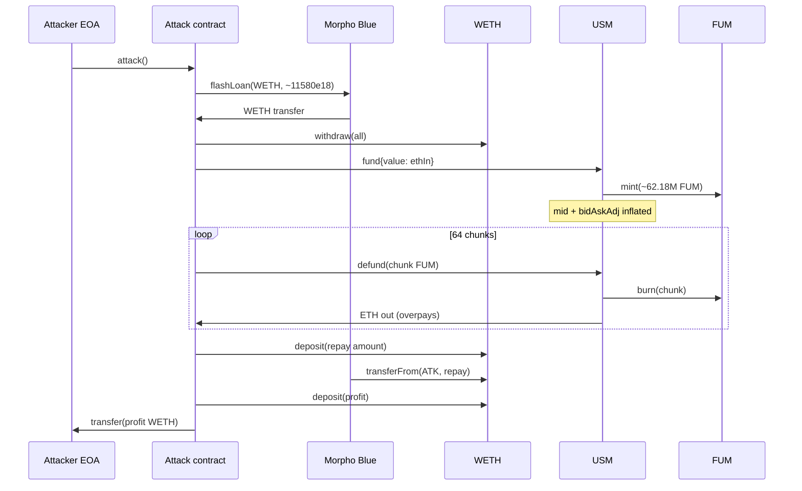
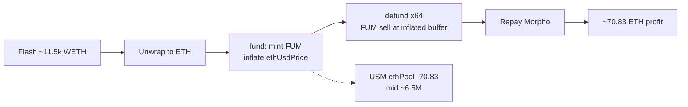

# USM / FUM (Minimalist USD) — Flash-loan fund/defund extracts ETH buffer via inflated mid-price

<!-- non-defihacklabs: Crypto Training original detection & analysis (Twitter hack alerting) -->

> **Vulnerability classes:** vuln/logic/price-calculation · vuln/arithmetic/rounding · vuln/governance/flash-loan-attack · vuln/oracle/price-manipulation

> **Reproduction:** the PoC compiles & runs in an isolated Foundry project at
> [this project folder](.). Full verbose offline trace: [output.txt](output.txt).
> Verified vulnerable source: [contracts_USM.sol](sources/USM_2a7FFf/contracts_USM.sol)
> (USM) and [contracts_FUM.sol](sources/USM_2a7FFf/contracts_FUM.sol) (FUM buffer token).

---

## Key info

| | |
|---|---|
| **Loss** | **~70.83 ETH** (~$160K) drained from the USM ETH pool; PoC profit **70.831554410317728328 WETH** |
| **Vulnerable contract** | `USM` (Minimalist USD) — [`0x2a7FFf44C19f39468064ab5e5c304De01D591675`](https://etherscan.io/address/0x2a7FFf44C19f39468064ab5e5c304De01D591675#code) |
| **Buffer token** | `FUM` — [`0x86729873e3b88DE2Ab85CA292D6d6D69D548eDF3`](https://etherscan.io/token/0x86729873e3b88de2ab85ca292d6d6d69d548edf3) |
| **Flash-loan source** | Morpho Blue — [`0xBBBBBbbBBb9cC5e90e3b3Af64bdAF62C37EEFFCb`](https://etherscan.io/address/0xBBBBBbbBBb9cC5e90e3b3Af64bdAF62C37EEFFCb) |
| **Attacker EOA** | [`0xb92b2E47680c89DA8f951B8963ef469f461a50Fc`](https://etherscan.io/address/0xb92b2E47680c89DA8f951B8963ef469f461a50Fc) |
| **Attack contract** | [`0x5a5e29ba89663a3558273354E990426F3cAc7de7`](https://etherscan.io/address/0x5a5e29ba89663a3558273354E990426F3cAc7de7) |
| **Profit receiver** | [`0xE3C6346b6f282029312d2caf4677ef39BeaBBF99`](https://etherscan.io/address/0xE3C6346b6f282029312d2caf4677ef39BeaBBF99) (received exactly 70.830977… ETH on-chain) |
| **Attack tx** | [`0xfae5e751b8ce01457cbb6b529839f24a0cff50faaabcbd0fd02ca0cf559b050e`](https://etherscan.io/tx/0xfae5e751b8ce01457cbb6b529839f24a0cff50faaabcbd0fd02ca0cf559b050e) |
| **Chain / block / date** | Ethereum / **25,716,150** (fork **25,716,149**) / 2026-08-09 |
| **Compiler** | Solidity **v0.8.9+commit.e5eed63a** |
| **Bug class** | Flash-loaned `fund()` inflates stored ETH/USD mid + bid-ask; `defund()` sells FUM against that inflated buffer price and returns more ETH than was deposited |

---

## TL;DR

1. Minimalist **USM** is an ETH-backed stablecoin; **FUM** is the buffer/equity token. Users `fund()` ETH to mint FUM and `defund()` FUM to redeem ETH from the shared pool.

2. On every `fund()`, USM multiplies both `bidAskAdjustment` **and** the stored mid `ethUsdPrice` by a growth factor derived from pool expansion ([contracts_USM.sol:251-252](sources/USM_2a7FFf/contracts_USM.sol#L251-L252)). That raises the implied ETH buffer (`ethPool − USM/price`) and therefore the FUM sell price used by `defund()`.

3. An attacker flash-borrowed **~11,579.98 WETH** from Morpho Blue, unwrapped it, and called `fund()` once — minting **~62.18M FUM**.

4. They then called `defund()` in **64 equal FUM chunks**. Each chunk re-priced FUM against the still-inflated mid / buffer and over-paid ETH relative to the original deposit (compounded by the arithmetic-average approximation in `ethFromDefund`, [contracts_USM.sol:759-761](sources/USM_2a7FFf/contracts_USM.sol#L759-L761)).

5. After repaying Morpho, residual ETH (~**70.83**) was profit. On-chain it went to `0xE3C6…BF99`; the PoC wraps it to WETH and sends it to the attacker EOA.

6. Post-attack state: USM/FUM supplies unchanged, `ethPool` down by **70.830977… ETH**, stored mid price exploded from **~$1,921.81** to **~$6,579,253**, `bidAskAdjustment` from **1.0** to **~3,423.46**.

---

## Background

**USM (Minimalist USD)** by Alberto Cuesta Cañada / Jacob Eliosoff / Alex Roan is a fully on-chain, ETH-collateralized stablecoin. Design goals:

- **USM** — dollar-stable token, minted/burned against the ETH pool at an oracle-influenced ETH/USD price with sliding bid/ask.
- **FUM** — residual claim on the ETH buffer (pool ETH above the ETH-value of outstanding USM). Funding grows the buffer; defunding shrinks it.
- **Sliding fees** — large fund/mint operations move a `bidAskAdjustment` (and the stored mid) so sequential trades pay super-linear fees.
- **Oracle** — a composite oracle refreshes mid when available; between refreshes the mid can be nudged by trades.

The system had been live with a modest pool (~**132.59 ETH**, ~**200.25k USM**, ~**329.46k FUM** at the fork block). That thin buffer relative to a multi-thousand-ETH flash loan is what made the mid-slide extractable.

---

## The vulnerable code

### 1. `fund()` slides the mid price up with the pool

```solidity
// sources/USM_2a7FFf/contracts_USM.sol — _fundFum
(fumOut, adjGrowthFactor) = fumFromFund(ls, fumSupply, msg.value, debtRatio_, isDuringPrefund());
// ...
ls.bidAskAdjustment = ls.bidAskAdjustment.wadMulUp(adjGrowthFactor);
ls.ethUsdPrice = ls.ethUsdPrice.wadMulUp(adjGrowthFactor);  // ← mid inflated
_storeState(ls);
fum.mint(to, fumOut);
```

`adjGrowthFactor` is roughly `poolChange ** (netFumDelta / 2)` — for a fund that multiplies the pool by ~88×, this factor is huge. The mid is treated as if the fund itself proved ETH more valuable.

### 2. FUM price is buffer / supply — buffer grows when mid grows

```solidity
// fumPrice: buffer = ethPool - usmSupply/ethUsdPrice
int buffer = ethBuffer(ethUsdPrice, ethInPool, usmEffectiveSupply, roundUp);
price = (buffer <= 0 ? 0 : uint(buffer).wadDiv(fumSupply, roundUp));
```

Higher `ethUsdPrice` → lower USM liability in ETH → **higher buffer** → **higher FUM sell price**.

### 3. `defund()` uses arithmetic-average sell pricing

```solidity
// ethFromDefund
uint avgFumSellPrice = fumSellPrice0 + fumSellPrice2;
unchecked { avgFumSellPrice /= 2; }
ethOut = fumIn.wadMulDown(avgFumSellPrice);
```

Combined with the inflated mid, chunked defunds return more ETH than the fund deposited. After 64 chunks the FUM mint/burn nets to zero while the pool is short ~70.83 ETH.

---

## Root cause

The protocol **couples trade-size sliding fees to the mid ETH/USD used for buffer accounting**. A flash-loaned `fund()` is allowed to:

1. Temporarily dominate the pool.
2. Push `ethUsdPrice` and `bidAskAdjustment` orders of magnitude above the oracle.
3. Leave that inflated mid in storage for subsequent same-tx `defund()`s.

Defund then values FUM as if the buffer were much larger (because USM is “cheaper” in ETH at the inflated mid), paying out real ETH. There is **no same-block circuit breaker**, **no max fund relative to pool**, and **no requirement that mid stay within a band of the oracle** after a trade.

Secondary contributors:

- **Arithmetic average** in `ethFromDefund` (chosen to avoid geometric-average collapse to zero) is not path-symmetric with `fumFromFund`’s geometric average.
- **Chunking** re-evaluates price 64 times, harvesting residual asymmetry each step.
- **Morpho 0-fee flash loans** remove capital cost for the ~11.5k ETH war chest.

---

## Preconditions

1. USM `ethPool` holds a meaningful buffer of real ETH (here ~132.59 ETH).
2. Morpho Blue (or any WETH flash lender) can supply multi-thousand ETH in one tx.
3. Attacker can call `fund` / `defund` permissionlessly (post-prefund; prefund ended 2021-11-01).
4. No guardian pause / max-trade limit / mid-oracle band check on the path.

---

## Attack walkthrough

Numbers from the offline PoC run in [output.txt](output.txt) (and matching mainnet balances at blocks 25,716,149 → 25,716,150).

| Step | Action | Result |
|------|--------|--------|
| 0 | Fork @ 25,716,149 | `ethPool` **132.588942983107019337** ETH; mid **1921.813593**; `bidAskAdj` **1.0** |
| 1 | Morpho `flashLoan(WETH, 11579.978…)` | Attack contract holds flash WETH |
| 2 | `WETH.withdraw` | Unwrap full flash amount to ETH |
| 3 | `USM.fund{value: ethIn}(this, 0)` | Mint **~62.18M FUM**; mid + adj explode |
| 4 | Loop 64× `USM.defund(chunk)` | Burn all FUM; pull ETH each time |
| 5 | `WETH.deposit` + Morpho pull | Repay **11579.978…** WETH |
| 6 | Wrap residual ETH → WETH → owner | **70.831554410317728328 WETH** profit |

Post-state (PoC logs):

- `ethPool after`: **61.757965594337344181** ETH  
- `ethPool drained`: **70.830977388769675156** ETH  
- `latestPrice after`: **6,579,253.854629**  
- `bidAskAdj after`: **3,423.460989**  
- Attacker WETH: **70.831554410317728328**

Live tx: same drain (**70.830977…** ETH) to `0xE3C6…BF99`; FUM supply and USM supply unchanged end-to-end.

---

## Diagrams





---

## Remediation

1. **Do not slide the oracle mid with trade size.** Keep `ethUsdPrice` equal to (or tightly banded to) the external oracle; apply sliding only to a separate fee/spread variable that does not enter `ethBuffer`.
2. **Cap single-tx fund/defund** as a fraction of `ethPool` (e.g. ≤ 5–10%) so flash size cannot dominate.
3. **Same-block / same-tx invariant checks:** after any sequence of fund/defund, require `ethPool` and buffer to satisfy conservation relative to FUM mint/burn at oracle mid (or reject if mid drifted beyond X% from oracle).
4. **Circuit breaker** when `bidAskAdjustment` or mid diverges from oracle beyond a threshold — pause fund/defund.
5. **Revisit `ethFromDefund` averaging** so fund→defund of the full FUM position cannot extract value even under extreme size (path-independent or strictly fee-positive).
6. Operational: withdraw residual buffer / wind down if the deployment is abandoned.

---

## How to reproduce

```bash
# Offline (registry runtime — no RPC needed once anvil_state.json is present)
cd /path/to/evm-hack-registry
_shared/run_poc.sh 2026-08-USM_FUM_exp -vvvvv
# Expect: [PASS] testExploit — Attacker WETH profit ~70.83
```

PoC entrypoints:

- Test harness: [test/USM_FUM_exp.sol](test/USM_FUM_exp.sol) — `ContractTest.testExploit`
- Attack contract: `USM_FUM_Exploit.attack` → Morpho callback `onMorphoFlashLoan`
- Fork block: **25,716,149** (mainnet), offline port **8545**

---

*Reference: [TenArmor alert](https://x.com/TenArmorAlert/status/2086627835360456784) · [Attack tx](https://etherscan.io/tx/0xfae5e751b8ce01457cbb6b529839f24a0cff50faaabcbd0fd02ca0cf559b050e)*
