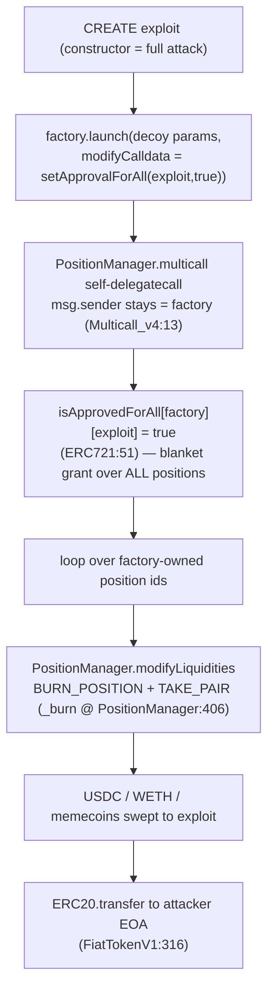

# Unistreets LaunchpadFactoryAuto — Arbitrary Calldata Injection → V4 LP Burn (2-tx, 2-victim confused deputy)

<!-- non-defihacklabs: Crypto Training original detection & analysis (Twitter hack alerting) -->

> **Vulnerability classes:** vuln/access-control/missing-auth · vuln/logic/arbitrary-call · vuln/logic/confused-deputy

---

## Key info

| | |
|---|---|
| **Reproduced tx (primary)** | **~$17.7K** — **17,743.907229 USDC** + **~0.007209570881911319 WETH** (+ seven illiquid launch memecoins) |
| **Full incident** | **19 v4 LP positions drained across 2 victim custodians, in 2 transactions by 2 attacker wallets** — see [Full incident](#full-incident-two-transactions-two-victims-19-positions) below (all counts verified on-chain) |
| **Chain** | Ethereum mainnet |
| **Protocol** | Unistreets (`@unistreetsx`) — one-tx memecoin launchpad, `LaunchpadFactoryAuto` |
| **Attacker EOA (tx#1)** | [`0xc94e23C5…5076`](https://etherscan.io/address/0xc94e23c58b9b2998edb7abc8f99393fead985076) |
| **Victim custodian #1 (factory)** | [`0xFB60CD0B…d825`](https://etherscan.io/address/0xfb60cd0b36ad4bd839b91767a6ad9055ab6ad825) — held **15** positions before the attack |
| **Exploit CREATE (tx#1)** | [`0xc7d8c70f…6b77`](https://etherscan.io/address/0xc7d8c70f4349acc55409800c8768e801b7556b77) |
| **Position manager** | [`0xbD216513…ee9e`](https://etherscan.io/address/0xbd216513d74c8cf14cf4747e6aaa6420ff64ee9e) (Uniswap v4 Positions NFT) |
| **Attack tx #1 (reproduced)** | [`0x9583e95d…6d14`](https://etherscan.io/tx/0x9583e95d5c88c7966e269197f4b09022f26b7a27ad2c13660dda6774e3136d14) (block **25692311**) — burned **7** factory positions |
| **Attack tx #2** | [`0x962eb313…fb0b`](https://etherscan.io/tx/0x962eb313a1290f9e1de336782d2e3fd0c6dc7b7816834bbef50278d28dbefb0b) (block **25692392**, **+81 blocks / ~16 min**) — EOA [`0xfc3fAcD6…e92f`](https://etherscan.io/address/0xfc3facd67138966ab0c841e905b0c4bca1abe92f) burned the remaining **8** factory positions **+ 4** from a second custodian |
| **Victim custodian #2** | [`0xd5799fd8…7ad8`](https://etherscan.io/address/0xd5799fd858d9163e75d28b2e4f68cf8569167ad8) — held **4** positions, drained in tx#2 |
| **PoC fork** | mainnet @ block **25692310** (state one block before tx#1) |
| **Alert** | [DefimonAlerts 2026-08-07](https://x.com/DefimonAlerts/status/2085611173953540541) |
| **Bug class** | Caller-supplied `modifyCalldata` forwarded into `PositionManager.multicall()` with the factory as `msg.sender` while the factory is the ERC-721 owner of every launch's LP position (confused-deputy) |

---

## TL;DR

`LaunchpadFactoryAuto` is the ERC-721 **owner** of the Uniswap v4 liquidity position minted for every token it launches. Its `launch()` function takes a **caller-controlled `modifyCalldata` blob** and hands it to `PositionManager.multicall()` **as the factory**. There is no allowlist on what that blob may do. The attacker passes `setApprovalForAll(exploit, true)`, so the factory grants the exploit contract operator rights over **all** of its positions — including every legitimate user's launch LP. The exploit then burns those positions (`modifyLiquidities` → `BURN_POSITION` + `TAKE_PAIR`) and sweeps the freed USDC/WETH/memecoins to the attacker.

The attacker never put a single one of their own tokens at risk — one decoy launch is enough to unlock the whole custody set.

---

## Full incident: two transactions, two victims, 19 positions

The transaction reproduced by this PoC (`0x9583e95d…`, block 25692311) is the **first and largest-USDC** of **two** drains that exploited the same confused-deputy bug. A single fork snapshot of one tx shows the *mechanism* exactly but cannot show what happened next — and on the indexed chain this was **not one transaction, and the factory was not the only victim**. Every figure below is verified against Ethereum mainnet archive state (`cast`, not the alert thread):

| | Tx #1 (reproduced) | Tx #2 |
|---|---|---|
| **Hash** | `0x9583e95d…` (block 25692311) | `0x962eb313…` (block 25692392, **+81 blocks / ~16 min**) |
| **Attacker EOA** | `0xc94e23C5…5076` | `0xfc3fAcD6…e92f` |
| **Deployed exploit (CREATE)** | `0xc7d8c70f…6b77` | `0xeda1f193…205a` |
| **Positions burned** | **7** (from the factory) | **12** = **8** (factory) + **4** (second custodian) |
| **Victim(s)** | factory `0xfb60cd0b…` | factory `0xfb60cd0b…` **and** custodian `0xd5799fd8…7ad8` |
| **Payload** | 1× `setApprovalForAll` grant | **2×** `setApprovalForAll` (one grant per custodian) → **12×** `modifyLiquidities` |
| **USDC to attacker** | 17,743.907229 | 1,010.267837 (these positions were memecoin-heavy, so little USDC) |
| **WETH** | 0.007209570881911319 | — |

**On-chain custody trail (verified via `PositionManager.balanceOf`):**

- Factory `0xfb60cd0b…` held **15** v4 positions immediately before tx#1 (`balanceOf` @ 25692310 = **15**) → **8** after tx#1 (@ 25692391) → **0** after tx#2 (@ 25692393).
- Second custodian `0xd5799fd8…7ad8` held **4** before tx#2 → **0** after.
- **Both custodians hold zero positions today.** Total drained: **7 + 12 = 19 positions across 2 victims by 2 attacker wallets** — same bug, same primitive; tx#2 simply doubled the payload to grant itself operator rights over both custodians in a single shot.

**Why the PoC replays a single transaction.** An opcode-level replay of one fork snapshot answers *how exactly* the primitive works (tx#1, the largest-USDC drain, is the canonical demonstration). It cannot, by construction, surface the follow-on transaction 81 blocks later or the second custodian — those are established here from indexed chain state. The mechanism the PoC proves is identical in both transactions; only the number of custodians granted and positions burned differs.

---

## Root cause

`contracts/LaunchpadFactoryAuto.sol`, function `launch()`:

```solidity
positionIdOf[token] = IPositionManager(POSITION_MANAGER).nextTokenId(); // L121  factory will own this LP
bytes[] memory calls = new bytes[](2);
calls[0] = initCalldata;      // L123  caller-supplied
calls[1] = modifyCalldata;    // L124  caller-supplied  ← attacker bytes
IPositionManager(POSITION_MANAGER).multicall(calls);                    // L125  runs them AS the factory
```

Three facts combine into a critical confused-deputy:

1. **The factory holds the asset.** `launch()` mints the concentrated-liquidity position to `address(this)` (L114–L121), so `LaunchpadFactoryAuto` is the ERC-721 owner of every launch's LP NFT. Positions from *all* prior legitimate launches sit on the same address.
2. **The factory forwards untrusted bytes with its own authority.** `calls[1]` is `modifyCalldata` verbatim from the caller. `PositionManager.multicall` self-`delegatecall`s each entry (`Multicall_v4.sol:13` — `address(this).delegatecall(data[i])`), so **`msg.sender` inside the payload stays the factory**. Whatever the attacker encodes executes as the LP owner.
3. **No selector allowlist.** Nothing restricts `initCalldata` / `modifyCalldata` to mint/initialize actions. `setApprovalForAll`, `transferFrom`, `approve`, and `modifyLiquidities` are all reachable on the PositionManager with the factory as `msg.sender`.

## Why it works (Uniswap v4 mechanics)

| Step | Where | What happens |
|------|-------|--------------|
| Approval grant | solmate `ERC721.sol:51` — `isApprovedForAll` | The injected `setApprovalForAll(exploit, true)` runs as the factory, writing `isApprovedForAll[factory][exploit] = true`. This is a **blanket** operator grant over every NFT the factory owns, not a per-token approval. |
| Burn gated by that grant | `PositionManager.sol:156` — `onlyIfApproved` | `_burn` is protected by `onlyIfApproved(msgSender(), tokenId)` → `_isApprovedOrOwner(exploit, tokenId)` → `isApprovedForAll[ownerOf(tokenId)][exploit]`. Because `ownerOf == factory`, the check now returns true for **every** factory-owned position. |
| Liquidity extracted | `PositionManager.sol:406` — `_burn` | The exploit calls `modifyLiquidities(BURN_POSITION + TAKE_PAIR)` directly. `BURN_POSITION` decreases liquidity to zero; `TAKE_PAIR` settles the resulting positive currency deltas out of the singleton `PoolManager` to the recipient (the exploit). |
| Profit realized | Circle `FiatTokenV1.sol:316` — `_setBalance(to, …add(value))` | The exploit forwards the swept tokens to the attacker EOA; USDC credits the recipient balance. Repeated across seven positions. |

`msgSender()` in the PositionManager resolves to the transient "locker" (the address that opened the unlock — the exploit). The stolen `isApprovedForAll[factory][exploit]` is exactly what makes `onlyIfApproved` pass for that locker — the access check is present and correct; it was simply handed the wrong operator by the factory.

---

## Attack walkthrough



1. **Deploy** the exploit with `CREATE`; the constructor runs the entire attack in one transaction.
2. **`launch()`** with throwaway token params and `modifyCalldata = setApprovalForAll(exploit, true)`.
3. The factory **multicalls** the PositionManager as itself → the exploit becomes an approved operator for **all** factory positions.
4. The exploit enumerates the factory's held position ids and calls **`modifyLiquidities`** to **burn** each one, using **`TAKE_PAIR`** to pull the underlying tokens out of the PoolManager.
5. The exploit **transfers** the proceeds — 17,743.907229 USDC, ~0.00721 WETH, and seven launch memecoins — to the attacker EOA.

These beats are the marked steps in the interactive Playground (custody → staged calldata → self-delegatecall → approval write → burn → profit).

---

## Impact

- **Direct theft of custodied user funds.** The burned positions belonged to legitimate launches whose liquidity the factory custodies; the blanket `setApprovalForAll` reaches every one of them, not just the attacker's decoy.
- **Realized loss (reproduced tx#1):** 17,743.907229 USDC + ~0.007209570881911319 WETH + seven illiquid memecoins, delivered to the attacker EOA in a single transaction.
- **Realized loss (full incident):** **19 v4 LP positions across 2 victim custodians**, in **2 transactions by 2 attacker wallets** 81 blocks apart — tx#1 (7 positions, ~$17.7K USDC + WETH) and tx#2 (12 positions, ~$1.0K USDC; the rest illiquid memecoins). Both custodians hold **zero positions today**.
- **Scope:** **every** position each custodian owned at attack time — not just the attacker's decoy. The one-shot design (approval + burn in one tx) leaves no window to react, and the confused-deputy primitive is reusable against **any** address that lets the factory custody its LP, as tx#2's second victim demonstrates.

---

## PoC

Registry (Foundry, mainnet fork — reproduces the on-chain attack):

```bash
cd 2026-08-UnistreetsLaunchpadFactory_exp
MAINNET_RPC_URL=... forge test --match-test testExploit -vvvv
```

Expected: `[PASS] testExploit()`. The registry test replays **both** historical CREATE bytecodes in sequence and asserts the full custody trail on-chain: factory **15 → 8 → 0**, second custodian **4 → 0** (**19 positions**, 2 victims). Combined proceeds to the attackers: **18754.175066 USDC** (17743.907229 in tx#1 + 1010.267837 in tx#2) plus **0.007209570881911319 WETH** and the launch memecoins from all 19 positions.

The full 19-position, two-transaction, two-victim incident is reproduced end-to-end by the Foundry test above (it forks one block before tx#1, re-broadcasts tx#1's bytecode as attacker #1, then rolls to tx#2's block and re-broadcasts tx#2's bytecode as attacker #2 against the second custodian). The confused-deputy primitive is byte-identical in both; tx#2 simply doubles the payload (one blanket `setApprovalForAll` grant per custodian).

The browser Playground (opcode-level replay + the marked source lines above) reproduces **tx#1** (`0x9583e95d…`) — the canonical, largest-USDC drain (7 positions, ~17,743.91 USDC) — opcode-for-opcode, generated via `build-poc-runner-data.mjs` / `_verify-poc.mjs` and served at `/hacks/2026-08-UnistreetsLaunchpadFactory/`. tx#2 exercises the identical confused-deputy primitive against a second custodian; the full 19-position count is verified on-chain and reproduced in the Foundry test above.

---

## Remediation

- **Never forward caller-supplied PositionManager calldata.** Build every `multicall` / `modifyLiquidities` payload internally from typed parameters; do not accept `initCalldata` / `modifyCalldata` blobs from users.
- **Do not let the custodian be an unconstrained operator target.** If the factory must own the LP, restrict the actions it will perform on the PositionManager to a hard-coded set (mint/initialize only) and never expose `setApprovalForAll` / `transferFrom` reachability through user input.
- **Prefer a fee-only custody vault.** The post-incident `LaunchpadFactorySafe` locks each launch's LP in a vault that can only *collect fees*, so a burn/transfer primitive is not reachable at all.
- **Defense in depth:** validate the decoded action selectors against an allowlist before any forwarded call, and separate custody (NFT owner) from the entry point that accepts external calldata.

## References

- https://x.com/DefimonAlerts/status/2085611173953540541 — initial drain alert (tx#1)
- https://x.com/unistreetsx/status/2085225140690751793 — Unistreets
- Tx#1 (reproduced): https://etherscan.io/tx/0x9583e95d5c88c7966e269197f4b09022f26b7a27ad2c13660dda6774e3136d14
- Tx#2 (second custodian, +81 blocks): https://etherscan.io/tx/0x962eb313a1290f9e1de336782d2e3fd0c6dc7b7816834bbef50278d28dbefb0b
- Victim custodian #1 (factory): https://etherscan.io/address/0xfb60cd0b36ad4bd839b91767a6ad9055ab6ad825
- Victim custodian #2: https://etherscan.io/address/0xd5799fd858d9163e75d28b2e4f68cf8569167ad8
- Attacker EOA #2: https://etherscan.io/address/0xfc3facd67138966ab0c841e905b0c4bca1abe92f
