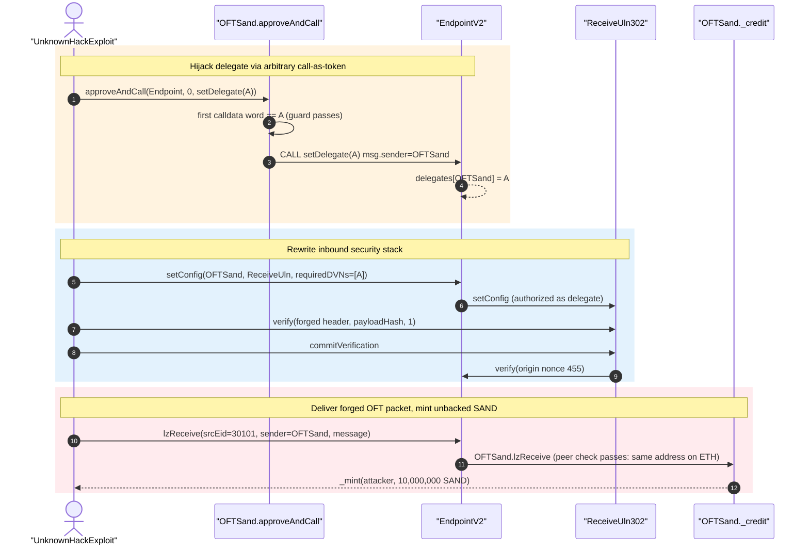
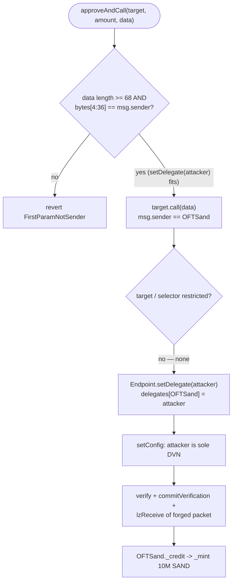

# The Sandbox SAND OFT (Base) — LayerZero Delegate Hijack via `approveAndCall`

<!-- non-defihacklabs: Crypto Training original detection & analysis (Twitter hack alerting) -->
<!-- date: 2026-08 -->

> **Vulnerability classes:** vuln/access-control/missing-auth · vuln/dependency/unsafe-external-call · vuln/bridge/message-spoofing · vuln/logic/missing-validation

> **Reproduction:** Foundry fork replay at Base block **50289411** (one before
> [`0x76ed0384…a446`](https://basescan.org/tx/0x76ed03844ff61520a0fb99278f92f2f1453b24ccbacd20b91131703e4a56a446)).
> `UnknownHackExploit.attack()` uses `OFTSand.approveAndCall` to become the OApp's
> LayerZero delegate, installs itself as the sole required DVN, self-attests a forged
> inbound packet, and mints **10,000,000 unbacked SAND**. Offline `anvil_state.json` +
> `_shared/run_poc.sh` **[PASS]** ([output.txt](output.txt)). Alert:
> [Blockaid](https://x.com/blockaid_/status/2091016046555582891).

---

## Key info

| | |
|---|---|
| **Loss** | **10,000,000 SAND** minted unbacked in this tx (`10000000000000000000000000` wei, [output.txt:9](output.txt)). Campaign printed ~$49B *face-value* SAND across 400+ txs (Blockaid) / ~14.9B SAND on two addresses (PeckShield); extractable value was ~80 ETH / ~$0.67M because Base/BSC liquidity could not absorb the print |
| **Vulnerable contract** | `OFTSand` (SAND OFT on Base) — [`0xac531Eb26Ca1d21b85126De8FB87E80E09002DcF`](https://basescan.org/address/0xac531Eb26Ca1d21b85126De8FB87E80E09002DcF#code) |
| **Bug surface** | `ERC20BasicApproveExtension.approveAndCall` / `paidCall` — generic `target.call{value:}(data)` with only a first-param==sender guard |
| **LayerZero EndpointV2** | [`0x1a44076050125825900e736c501f859c50fE728c`](https://basescan.org/address/0x1a44076050125825900e736c501f859c50fE728c) (behaved as designed) |
| **ReceiveUln302** | [`0xc70AB6f32772f59fBfc23889Caf4Ba3376C84bAf`](https://basescan.org/address/0xc70AB6f32772f59fBfc23889Caf4Ba3376C84bAf) |
| **Attacker EOA** | [`0x638Ccb18370eE228378a565c1d4D0F9620d7F296`](https://basescan.org/address/0x638Ccb18370eE228378a565c1d4D0F9620d7F296) (mint recipient; already held 70M SAND at the fork) |
| **Historical attack contract** | [`0xd7Cb71EE00a812FC22ACcfE08A2f59A5Add2f6Ca`](https://basescan.org/address/0xd7Cb71EE00a812FC22ACcfE08A2f59A5Add2f6Ca) (CREATE'd in the live tx; PoC deploys its own) |
| **Attack tx** | [`0x76ed03844ff61520a0fb99278f92f2f1453b24ccbacd20b91131703e4a56a446`](https://basescan.org/tx/0x76ed03844ff61520a0fb99278f92f2f1453b24ccbacd20b91131703e4a56a446) @ Base block **50289412** |
| **Chain / block / date** | Base (chainId **8453**) / fork **50,289,411** / 22 Aug 2026 |
| **Compiler** | Solidity **v0.8.23+commit.f704f362**, optimizer **enabled**, **2000 runs** |
| **Bug class** | Missing auth on an ERC677-style arbitrary call lets anyone invoke `Endpoint.setDelegate` *as the OFT*, then forge `lzReceive` and `_mint` |
| **Alert** | [Blockaid](https://x.com/blockaid_/status/2091016046555582891) (clarified: **not** a LayerZero bug) |

---

## TL;DR

The Sandbox's SAND OFT on Base inherited an old Sand token helper,
`approveAndCall(target, amount, data)`. It approves `target` and then does
`target.call{value: msg.value}(data)` with `msg.sender == the token`. The only
guard is "the first 32-byte word of `data` must equal the caller" — a check meant
to stop spending someone else's allowance. It does **not** restrict *which
contract* or *which function* the token is made to call.

LayerZero EndpointV2's `setDelegate(address)` is intentionally callable by any
OApp: it writes `delegates[msg.sender] = _delegate`. Calling it *through*
`approveAndCall` makes `msg.sender` the OFT, so the attacker becomes the OFT's
LayerZero delegate without passing `OApp.setDelegate`'s `onlyOwner`.

As delegate they set themselves as the sole required DVN, self-attest a forged
inbound packet (srcEid 30101 = Ethereum; sender = the OFT itself, which is the
configured peer because SAND OFT is deployed at the **same address** on ETH and
Base), and `Endpoint.lzReceive` delivers it. `OFTSand._credit` is a bare
`_mint(to, amountLD)`. **10,000,000 unbacked SAND** appear
([output.txt:9](output.txt), [output.txt:73](output.txt)).

This is a Sandbox OFT-adapter bug, not a LayerZero protocol bug. LZ contracts
enforced their own auth (`delegate == oapp or delegates[oapp]`; DVN in the
configured set; peer check on `_origin.sender`). The OFT handed the attacker
those roles.

---

## Background

SAND on Base is an Omnichain Fungible Token (OFT). A legitimate inbound transfer
burns (or locks) SAND on the source chain, a DVN-attested packet is committed on
the destination, and `OFTSand._lzReceive` credits the recipient by minting. The
OFT is the LayerZero OApp; its owner is supposed to be the only party that can
`setDelegate` on the Endpoint (via `OAppCore.setDelegate`, `onlyOwner`).

The Sandbox reused its Ethereum SAND token surface, including
`ERC20BasicApproveExtension` — an ERC677-style "approve and call the spender"
helper from the original SAND design. That helper is harmless when `target` is a
DEX router whose first argument is the user. It is catastrophic when `target` can
be the LayerZero Endpoint and the first argument of `setDelegate` is also "an
address the caller controls".

---

## The vulnerable code

Verified source:
[`ERC20BasicApproveExtension.sol`](sources/OFTSand_ac531E/sandbox-smart-contracts_oft-sand_contracts_sand_ERC20BasicApproveExtension.sol),
[`BytesUtil.sol`](sources/OFTSand_ac531E/sandbox-smart-contracts_oft-sand_contracts_libraries_BytesUtil.sol),
[`OFTSand.sol`](sources/OFTSand_ac531E/sandbox-smart-contracts_oft-sand_contracts_OFTSand.sol),
[`EndpointV2.sol`](sources/EndpointV2_1a4407/contracts_EndpointV2.sol).

### 1. Arbitrary call-as-token (`approveAndCall`)

```solidity
function approveAndCall(
    address target,
    uint256 amount,
    bytes calldata data
) external payable returns (bytes memory) {
    if (!BytesUtil.doFirstParamEqualsAddress(data, _msgSender())) {
        revert FirstParamNotSender();
    }
    _approveFor(_msgSender(), target, amount);
    (bool success, bytes memory returnData) = target.call{value: msg.value}(data);
    if (!success) {
        revert CallFailed(string(returnData));
    }
    return returnData;
}
```

`doFirstParamEqualsAddress` only checks `data.length >= 68` and that bytes
`[4:36]` equal the caller. No target allowlist, no selector allowlist, no
`nonReentrant`, no block on calling the Endpoint / MessageLib.

`paidCall` is the same primitive with a temporary allowance.

### 2. Endpoint delegate is keyed by `msg.sender`

```solidity
function setDelegate(address _delegate) external {
    delegates[msg.sender] = _delegate;
    emit DelegateSet(msg.sender, _delegate);
}
```

The *intended* path is `OAppCore.setDelegate` (`onlyOwner`) →
`endpoint.setDelegate`. The OFT's `approveAndCall` lets anyone skip the owner
check and hit the Endpoint directly, with `msg.sender == OFTSand`.

`setConfig` then authorizes `msg.sender == oapp || msg.sender == delegates[oapp]`.

### 3. OFT credit is an unconstrained mint

```solidity
function _credit(address _to, uint256 _amountLD, uint32 /*_srcEid*/)
    internal virtual override returns (uint256 amountReceivedLD)
{
    _mint(_to, _amountLD);
    return _amountLD;
}
```

Once a packet is committed, `_lzReceive` decodes `to` / `amountSD` from the
attacker-chosen payload and mints. There is no backing-balance check on Base.

---

## Root cause

Two independently "reasonable" designs compose into an auth bypass:

1. **Token-side:** `approveAndCall` is a generic `CALL` as the token, guarded only
   by "first ABI word == caller". That guard is the wrong property for a contract
   that is also a privileged LayerZero OApp.
2. **Bridge-side:** Endpoint `setDelegate` trusts `msg.sender` as the OApp. That
   is correct *if* the only code that can run as the OApp is the OApp itself
   (or its owner-gated wrapper). An arbitrary-call helper breaks that assumption.

After the delegate hijack, forging `lzReceive` is not a LayerZero vulnerability:
the Endpoint requires a configured receive library, the ULN requires the
configured DVNs to have `verify`'d, and the OApp requires `_origin.sender ==
peers[srcEid]`. The attacker satisfied all three *because they were allowed to
rewrite the config and because the OFT is its own peer at the same address on
eid 30101*.

---

## Preconditions

- `approveAndCall` / `paidCall` still live on the OFT (they were).
- The OFT is a LayerZero OApp whose Endpoint `setDelegate` keys off `msg.sender`.
- Attacker can pass the 68-byte first-param guard — any `function (address)`
  whose first argument is themselves, including `setDelegate(address)`.
- A receive library (here ReceiveUln302) is configured so the new delegate can
  `setConfig` DVNs.
- `peers[30101]` equals `bytes32(uint256(uint160(OFTSand)))` — true because the
  OFT is deployed at the same address on Ethereum and Base.
- Inbound nonce 455 is still unconsumed at the fork block (this PoC's packet).
- No owner pause / mint cap on `_credit` (OFT `_enabled` gates *send*, not
  receive).

No flash loan, no private key, no compromised owner. Every call is
permissionless.

---

## Attack walkthrough (numbers from [output.txt](output.txt))

Fork is Base **50,289,411**. Attacker EOA already holds **70,000,000 SAND** from
earlier campaign txs ([output.txt:8](output.txt)); totalSupply is
**893,654,146.470965 SAND**. The PoC deploys `UnknownHackExploit` and runs the
same four-step hijack as the live tx.

| # | Step | Trace |
|---|------|-------|
| 0 | Fork; attacker SAND = 70,000,000 | [output.txt:8](output.txt), [:33](output.txt) |
| 1 | `approveAndCall(Endpoint, 0, setDelegate(exploit) \|\| 0x00..00)` — first word == exploit so the guard passes; token low-level-calls Endpoint | [output.txt:41](output.txt) |
| 1b | `Endpoint.setDelegate(exploit)` emits `DelegateSet(OFTSand, exploit)` | [output.txt:43](output.txt) |
| 2 | `Endpoint.setConfig(OFTSand, ReceiveUln302, UlnConfig{confirmations:1, requiredDVNs:[exploit], optionalDVNCount:255})` | [output.txt:49](output.txt)–[:50](output.txt) |
| 3 | `ReceiveUln302.verify(header, payloadHash, 1)` as the DVN, then `commitVerification` → `Endpoint.verify` of nonce **455** | [output.txt:57](output.txt)–[:63](output.txt) |
| 4 | `Endpoint.lzReceive(origin={srcEid:30101, sender:OFTSand, nonce:455}, OFTSand, guid, message)` | [output.txt:71](output.txt)–[:72](output.txt) |
| 4b | `OFTSand._credit` `_mint`s **10,000,000 SAND** to the attacker EOA (`amountSD=1e13 * decimalConversionRate 1e12 = 1e25`) | [output.txt:73](output.txt) |
| 5 | Attacker SAND **80,000,000**; totalSupply +10,000,000 | [output.txt:9](output.txt)–[:10](output.txt), [:90](output.txt) |

Gas: **665,388** ([output.txt:6](output.txt)). Packet header, GUID, payload hash
and OFT message are the **exact** bytes from the live tx
`0x76ed0384…a446`; only the delegate/DVN address is the PoC contract instead of
`0xd7Cb71…`.

### Profit / mint accounting (this tx)

| Item | Amount (wei) | Human |
|---|---:|---|
| Attacker SAND before | 70,000,000e18 | 70,000,000 |
| Unbacked mint (`Transfer` from `address(0)`) | 10,000,000e18 | **10,000,000** |
| Attacker SAND after | 80,000,000e18 | 80,000,000 |
| totalSupply delta | 10,000,000e18 | 10,000,000 |

The PoC asserts `minted == 10_000_000 ether` and that `totalSupply` inflates by
the same amount ([UnknownHack_exp.sol](test/UnknownHack_exp.sol)).

---

## Diagrams

### Sequence



### Why the first-param guard is not auth



---

## Remediation

- **Remove or hard-disable** `approveAndCall` / `paidCall` on any contract that is
  also a LayerZero OApp (or any other privileged `msg.sender`-auth system).
- If an ERC677 helper must stay: **allowlist** `target` (routers only) **and**
  **block** the Endpoint, MessageLib, DVN, and the token itself.
- Keep `OApp.setDelegate` as `onlyOwner` **and** treat "code running as this
  contract" as equivalent to owner — there must be no generic `CALL` as `this`.
- Put the LayerZero delegate behind a **multisig + timelock**. Monitor
  `DelegateSet`, `UlnConfigSet`, `PacketVerified` on every OFT.
- `_credit` should not be a free mint without a corresponding lock/burn, or
  should be pauseable independently of `_enabled` (which only gated send).
- Audits must test the **cross-contract** combo: ERC20 extension × Endpoint
  `msg.sender` auth. Auditing either in isolation misses this.

Containment used in the incident: The Sandbox disabled bridging to/from Base and
BSC, isolating unbacked SAND from Ethereum reserves.

---

## How to reproduce

```bash
cd /workspaces/RustroverProjects/audits/evm-hack-registry
bash _shared/run_poc.sh 2026-08-UnknownHack_exp -vvvvv
```

Expect `[PASS] testExploit()` and the log line
`Unbacked SAND minted: 10000000.000000000000000000` ([output.txt](output.txt)).

The test forks Base at block **50289411** via `http://127.0.0.1:8548` (offline
anvil serving [anvil_state.json](anvil_state.json)).

---

*Reference: https://x.com/blockaid_/status/2091016046555582891*
