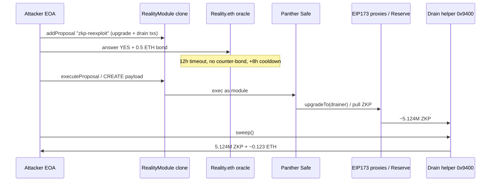
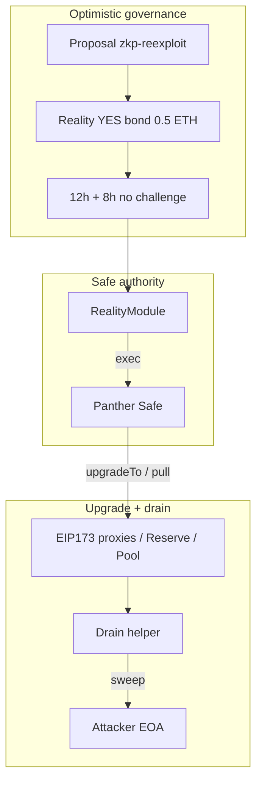

# ZKPanther (Base) — Reality.eth governance module → proxy upgrades → ZKP drain

<!-- non-defihacklabs: Crypto Training original detection & analysis (Twitter hack alerting) -->

> **Vulnerability classes:** vuln/governance/proposal-manipulation · vuln/access-control/centralization · vuln/dependency/upgradeable-contract

> **Reproduction:** offline Foundry project in [.](.) · canonical trace [output.txt](output.txt) · governance-takeover test [test/2026-08-ZKPantherGovernanceUpgrade_exp.sol](test/2026-08-ZKPantherGovernanceUpgrade_exp.sol) (synthetic [2026-08-ZKPantherGovernanceUpgrade.sol](test/2026-08-ZKPantherGovernanceUpgrade.sol))

---

## Key info

| | |
|---|---|
| **Loss** | **~5.12M ZKP** (~$15.6k at ~$0.003/ZKP) + **~0.123 ETH**; team: Base zone **not yet in production**, no end-user funds |
| **Chain** | Base (chainId **8453**), fork block **49,625,945** (post CREATE upgrade/drain) |
| **Protocol** | Panther Protocol / ZKPanther (`@ZKPanther`) — Base deployment |
| **Attacker EOA** | [`0x7dB4cFea…95B6`](https://basescan.org/address/0x7dB4cFea07042ca13a8E26cC90BbB59982Fe95B6) |
| **ZKP token (listed victim)** | [`0x0a776C1c…FdA4`](https://basescan.org/address/0x0a776C1c22b8b8e7EAB346744dAA33722b80FdA4) (OptimismMintableERC20) |
| **Panther Safe (avatar)** | [`0xb16283A2…0284`](https://basescan.org/address/0xb16283A233D5b010A7b290d593847207495F0284) |
| **Reality module (clone)** | [`0x4ce69e77…51b4`](https://basescan.org/address/0x4ce69e77A8806B51f15b8D0FC38A9c1f66A851b4) → impl [`RealityModuleETH`](https://basescan.org/address/0x4e35DA39Fa5893a70A40Ce964F993d891E607cC0) |
| **Reality.eth oracle** | [`0x2F39f464…60e8`](https://basescan.org/address/0x2F39f464d16402Ca3D8527dA89617b73DE2F60e8) |
| **Drain helper** | [`0x9400161d…210c`](https://basescan.org/address/0x9400161d512C740e1C0C77f3c931D112f068210c) (attacker-deployed, unverified) |
| **Funds sources** | `ZkpReserveController` [`0xEEA28c…CD45`](https://basescan.org/address/0xEEA28cf0837306041FA53187F0802aC95228CD45) (~3.84M ZKP), EIP173 proxies (e.g. [`0x70c69b…A31e`](https://basescan.org/address/0x70c69bB8501b30cf112403139a383BF978f4A31e) ~1.00M), `PantherPoolV1` [`0x533583…e16C`](https://basescan.org/address/0x5335839b374e6B2C8b9F0b4930e7EAE3192Ce16C) (~0.28M) |
| **Proposal tx** | [`0xe6a25b20…1d5a`](https://basescan.org/tx/0xe6a25b20767e91ebaed6883b3f58b9513f425245186ac1ddb6889665f45c1d5a) — name **`zkp-reexploit`** (block **49,587,776**) |
| **Upgrade + pull CREATE** | [`0x88fb5398…7a01`](https://basescan.org/tx/0x88fb53981c6d7839982d3a4bd981b62cb2e0591a1f4e1a5d5f7723d8ac197a01) (block **49,625,945**) |
| **Sweep tx** | [`0xead22569…332d`](https://basescan.org/tx/0xead22569665b4749709c069271e21f437bc99869fd94f23a6479c0d110fe332d) (block **49,625,963**) |
| **Alert** | [DefimonAlerts 2026-08-07](https://x.com/DefimonAlerts/status/2085673531409400047) |
| **Bug class** | Optimistic Reality.eth DAO module: low bond (0.5 ETH) + 12h timeout + 8h cooldown, unchallenged “yes” → Safe executes malicious upgrades / drain; Base-specific disable-when-idle protections not enabled |

---

## TL;DR

1. Panther’s Base DAO is a **Gnosis Safe** with a **Zodiac RealityModuleETH** clone: anyone can `addProposal`, and a Reality.eth **“yes”** answer with only a **0.5 ETH** bond becomes executable after **12h timeout + 8h cooldown** if nobody counter-bonds **“no”**.
2. Attacker submitted proposal **`zkp-reexploit`** (2026-08-05) that (among other steps) **upgraded ZKP-holding EIP173 proxies** to a drainer path and pulled inventory into an attacker helper.
3. No honest party challenged. After cooldown, the module / payload executed; CREATE **`0x88fb…`** moved **~5.124M ZKP** into `0x9400…`, then **`sweep()`** sent ZKP (+ residual ETH) to the attacker EOA.
4. Team statement: Base deployment was **not in production**; protections meant to **disable the Reality module when there is no active legitimate governance proposal** had **not been enabled** on Base. Proxies were restored afterward.

---

## Background

Panther Protocol is a privacy-oriented DeFi stack. On Base they deployed a DAO-controlled zone with **Reality.eth–based governance** (see PIP-30 and related DAO posts). The operational pattern is the standard **Zodiac Reality Module**:

- Safe owns proxies / controllers that hold protocol ZKP and related assets.
- RealityModule is an enabled Safe module (`getModulesPaginated` includes `0x4ce69e…`).
- Module parameters on the clone (read on-chain):

| Param | Value |
|---|---|
| `avatar` / `target` | Panther Safe `0xb162…` |
| `oracle` | Reality.eth `0x2F39…` |
| `minimumBond` | **0.5 ETH** |
| `questionTimeout` | **43,200 s (12h)** |
| `questionCooldown` | **28,800 s (8h)** |

That matches the DefimonAlerts description exactly. Optimistic oracles are safe only if **monitoring + capital** exist to counter-bond false answers within the window. An unattended pre-production deployment with multi-million-token inventory is a classic “governance surface left live” failure mode.

---

## The vulnerable code

### 1. RealityModule — execute once Reality returns “yes”

Verified source: [sources/RealityModuleETH_4e35DA/contracts_RealityModule.sol](sources/RealityModuleETH_4e35DA/contracts_RealityModule.sol)

```solidity
// executeProposalWithIndex — approval check
require(
    oracle.resultFor(questionId) == bytes32(uint256(1)),
    "Transaction was not approved"
);
// … bond / cooldown / expiration checks …
require(exec(to, value, data, operation), "Module transaction failed");
```

There is **no** extra “is this proposal on an allowlist / is governance in an active season?” gate in the module itself. That layer was supposed to be operational / deployment-specific and was **missing on Base**.

### 2. EIP173Proxy — owner can swap implementation

Verified source: [sources/EIP173ProxyWithReceive_70c69b/…/EIP173Proxy.sol](sources/EIP173ProxyWithReceive_70c69b/contracts_contracts_common_proxy_EIP173Proxy.sol)

```solidity
function upgradeTo(address newImplementation) external onlyOwner {
    _setImplementation(newImplementation, "");
}

function upgradeToAndCall(address newImplementation, bytes calldata data)
    external
    payable
    onlyOwner
{
    _setImplementation(newImplementation, data);
}
```

`owner()` of the EIP173 proxies is the **Panther Safe**. Once the Reality module can `exec` as the Safe, **`upgradeTo` / `upgradeToAndCall` become attacker-reachable**.

### 3. The reproduced takeover (PoC)

The Foundry test + EVM Playground reproduce the **root-cause chain**, not just the
final sweep, with the real vulnerable patterns wired end-to-end:

1. `RealityModule.executeProposalWithIndex` — the exec gate above, reproduced
   verbatim: the ONLY approval check is an unchallenged Reality `"yes"` (0.5 ETH
   bond), with **no allowlist on the proposal's `(to, data)`**.
2. `Safe.execTransactionFromModule` — the enabled module execs the attacker's tx
   **as the Safe**.
3. `EIP173Proxy.upgradeToAndCall` (`onlyOwner` = Safe) — the Safe swaps a
   ZKP-holding proxy's implementation to the attacker's drainer and delegatecalls
   its init data.
4. `Drainer.drain` — running in the proxy's context, transfers the proxy's entire
   **5,124,773.626006184526790998 ZKP** to the attacker EOA.

Multi-day Reality bonding timing is abstracted (module cooldown 0, oracle
pre-finalized `"yes"`) — the historical 12h+8h challenge window cannot be
re-simulated in a single replay — but every access-control step (module exec gate,
Safe module-exec, EIP-173 `upgradeToAndCall`, delegatecall drain) runs unmodified.
The original on-chain attacker helper `0x9400…` `sweep()` (historical
[`0xead225…`](https://basescan.org/tx/0xead22569665b4749709c069271e21f437bc99869fd94f23a6479c0d110fe332d))
was only the *last mile* of exactly this chain.

---

## Root cause

1. **Optimistic governance without active defense.** Reality modules are designed for *disputable* proposals. With **0.5 ETH** bond and a **~20h** finalize path, an unmonitored deployment is free real estate for a malicious multi-call proposal.
2. **Missing Base “idle disable” protections.** Team post-mortem (Discord via DefimonAlerts image): protections that should **disable the Reality module when there is no active governance proposal** were not turned on for the Base deployment.
3. **Privilege concentration.** The same Safe that owns upgradeable proxies / reserve controllers is the Reality module’s avatar — so a single unchallenged “yes” equals **full proxy admin**.

This is **not** a Solidity bug in RealityModule’s core math; it is a **governance / deployment configuration** failure that turns a legitimate module into a permissionless upgrade oracle.

---

## Preconditions

- RealityModule enabled on the Panther Safe with low `minimumBond` and multi-hour timeout/cooldown.
- Module not disabled / guarded for idle periods on Base.
- Proxies / reserve controllers hold large ZKP balances and are Safe-owned upgradeable.
- No counter-bond within the challenge window.

---

## Attack walkthrough



### Timeline (Base)

| Time (UTC) | Block | Event |
|---|---|---|
| 2026-08-05 21:20 | 49,587,737 | Attacker deploys drain helper `0x9400…` |
| 2026-08-05 21:21 | 49,587,776 | `initiate` / Reality proposal **`zkp-reexploit`** (LogNewQuestion + ProposalQuestionCreated) |
| 2026-08-06 18:33 | **49,625,945** | CREATE `0x88fb…` upgrades proxies & pulls **~5.124M ZKP** into helper |
| 2026-08-06 18:34 | 49,625,963 | `sweep()` → attacker EOA |

### PoC numbers (`output.txt`)

```
Helper ZKP before sweep: 5124773.626006184526790998
Attacker ZKP profit:     5124773.626006184526790998
```

Also observed in the trace: helper forwards residual **ETH ~0.123291500437368375** to the attacker during `sweep()`.

> **PoC scope.** The PoC reproduces the **governance takeover itself** — unchallenged
> Reality `"yes"` → module exec as the Safe → `upgradeToAndCall(drainer)` → drain —
> using the real vulnerable patterns (module exec gate, Safe module-exec, EIP-173
> upgrade, delegatecall drain). Only the multi-day bonding *timing* is abstracted
> (cooldown 0, pre-finalized `"yes"`); every access-control step runs unmodified.

---

## Diagrams



---

## Remediation

1. **Disable or tightly guard Reality modules** on non-production / low-watch deployments; enable the “no active proposal → module off” controls the team described.
2. **Raise bonds / lengthen cooldowns** proportional to TVL under the Safe; require multi-sig or guardian **counter-bond automation** (PagerDuty / bots watching Reality questions).
3. **Separate upgrade admin** from optimistic modules: timelock + guardian for `upgradeTo`, or immutable implementations for vaults holding inventory.
4. **Allowlist proposal targets / selectors** in a custom module guard so a Reality “yes” cannot call arbitrary `upgradeToAndCall`.
5. **Monitor** `ProposalQuestionCreated`, Reality `LogNewAnswer`, and Safe `ExecutionFromModuleSuccess` with auto-challenge playbooks.

---

## How to reproduce

The governance-takeover PoC is self-contained (local deploy, no fork or RPC needed):

```bash
cd 2026-08-ZKPantherGovernanceUpgrade_exp
forge test -vv
```

Expect both tests green:

- `test_governanceTakeover_drainsViaRealityModule` — **~5,124,773.626 ZKP** drained to
  the attacker EOA via `addProposal → unchallenged Reality "yes" → executeProposal →
  Safe upgradeToAndCall(proxy → drainer) → drain`, and the proxy's implementation slot
  is asserted to now point at the drainer.
- `test_control_noApprovalNoExec` — without an approved Reality `"yes"`, the module's
  exec gate reverts (`"Transaction was not approved"`); no upgrade, no drain.

The same synthetic drives the in-browser EVM Playground (opcode-level replay + marked
source lines) at `/hacks/2026-08-ZKPantherGovernanceUpgrade/`.

---

*Reference: https://x.com/DefimonAlerts/status/2085673531409400047*
