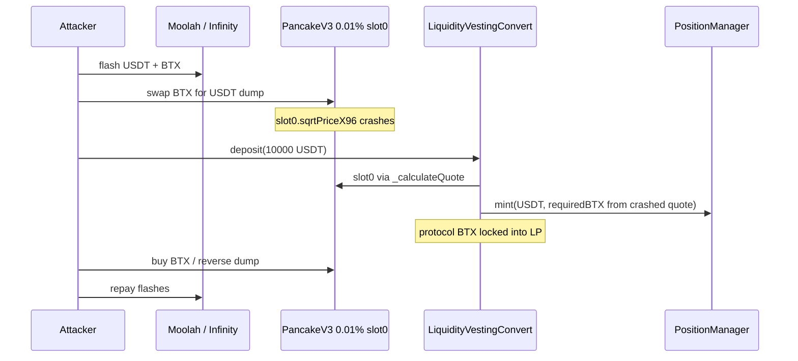
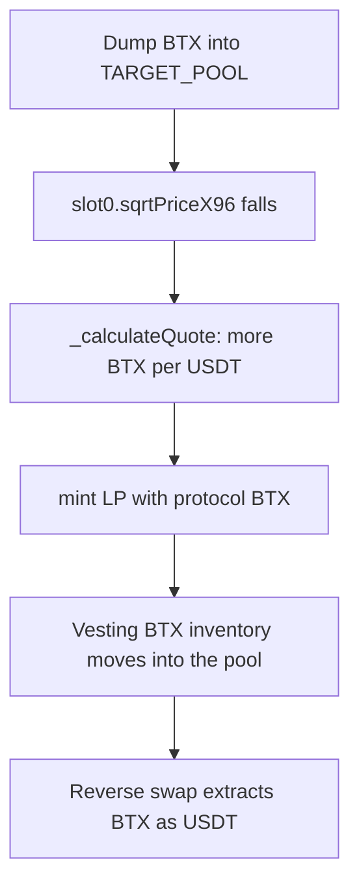

# BeatXswap LiquidityVestingConvert — UniV3 `slot0` spot oracle

<!-- non-defihacklabs: Crypto Training original detection & analysis (Twitter hack alerting) -->
<!-- date: 2026-09 -->

> **Vulnerability classes:** vuln/oracle/spot-price · vuln/oracle/single-source · vuln/oracle/price-manipulation · vuln/logic/price-calculation

> **Reproduction:** Foundry fork at BSC block **120873719** (one before the drain). `deal()` seeds the Moolah/Infinity flash inventory, dumps BTX into the 0.01% oracle pool, then `deposit()` mints LP from the vesting contracts' own BTX at the crashed `slot0` quote. Offline `anvil_state.json` + `_shared/run_poc.sh` **[PASS]**. Alerts: [SlowMist](https://x.com/SlowMist_Team/status/2098314846765015062) · [DefimonAlerts](https://x.com/DefimonAlerts/status/2098273394261102968).

---

## Key info

| | |
|---|---|
| **Loss** | **~2.98M–3.07M BTX** (~**$63.7k–$77.5k**). Live attacker net **63,704.84 USDT**. Teaching PoC drains **163,432.97 BTX** from the two vesting contracts ([output.txt](output.txt)) |
| **Chain** | BNB Smart Chain (chainId **56**) |
| **Protocol** | BeatXswap / BeatSwap — LV Convert (liquidity-backed vesting) |
| **Date** | 2026-09-09 (alerted 2026-09-11) |
| **Attacker EOA** | [`0x67B2f08683A735cfE6f6E57fA86909b62218C2a1`](https://bscscan.com/address/0x67B2f08683A735cfE6f6E57fA86909b62218C2a1) |
| **Attack contract** | [`0xafF5A574941981CF7f994F2820f7FA26FE031DeD`](https://bscscan.com/address/0xaff5a574941981cf7f994f2820f7fa26fe031ded) (created in the attack tx) |
| **Victim (unlimited)** | [`0x1e647FAADb05f2124BFCcFC003EDc06D1A90bf5D`](https://bscscan.com/address/0x1e647faadb05f2124bfccfc003edc06d1a90bf5d#code) `LiquidityVestingConvert` |
| **Victim (one-time)** | [`0x9a7A92240FBAc4030b65A6E61239928d6Bcc716F`](https://bscscan.com/address/0x9a7a92240fbac4030b65a6e61239928d6bcc716f#code) `LiquidityVestingConvertOnce` |
| **Oracle / LP pool** | Pancake V3 BTX/USDT 0.01% [`0xA5Db84d7BCcb799fb31bd3c417D04d5bC29Da96D`](https://bscscan.com/address/0xa5db84d7bccb799fb31bd3c417d04d5bc29da96d) |
| **Dump pool** | Pancake V3 BTX/USDT 0.30% [`0x996A155A2BE7729Ae90884795EA61691FBE84079`](https://bscscan.com/address/0x996a155a2be7729ae90884795ea61691fbe84079) |
| **BTX / USDT** | [`0xAa242a47F4cC074E59cbC7D65309B1F21202AaA3`](https://bscscan.com/token/0xaa242a47f4cc074e59cbc7d65309b1f21202aaa3) · [`0x55d398326f99059fF775485246999027B3197955`](https://bscscan.com/token/0x55d398326f99059ff775485246999027b3197955) |
| **Flash lenders (live)** | Moolah [`0x8F73b65B4caAf64FBA2aF91cC5D4a2A1318E5D8C`](https://bscscan.com/address/0x8f73b65b4caaf64fba2af91cc5d4a2a1318e5d8c) · Pancake Infinity Vault [`0x238a358808379702088667322f80aC48bAd5e6c4`](https://bscscan.com/address/0x238a358808379702088667322f80ac48bad5e6c4) |
| **Attack tx** | [`0xcc71a3bb131c73462b0f25533070113a63c85e942a22e18bc945eec184eb5799`](https://bscscan.com/tx/0xcc71a3bb131c73462b0f25533070113a63c85e942a22e18bc945eec184eb5799) @ block **120873720** |
| **Compiler** | Solidity **v0.8.27+commit.40a35a09** (verified, optimizer 200) |
| **Bug class** | **Spot-price oracle** — `_calculateQuote()` reads `IUniswapV3Pool.slot0()` `sqrtPriceX96` with no TWAP, no deviation bound, no second feed |

---

## TL;DR

BeatSwap's LV Convert lets users deposit USDT. 75% goes to a treasury; 25% is paired with **protocol-owned BTX** and minted as a Pancake V3 LP. The BTX amount is sized by `_calculateQuote()`, which converts USDT→BTX from the 0.01% pool's **live `slot0` sqrtPriceX96**. There is no TWAP and no sanity bound. `amount1Min` is 97% of that already-manipulated quote, so it cannot protect the mint.

The attacker flash-borrowed **~6M BTX** (Pancake Infinity) plus USDT (Moolah), dumped BTX into the V3 book to crash `sqrtPriceX96`, then called `deposit(10_000e18)` on the unlimited converter and `deposit(2_000e18)` on the one-time converter. At the crashed tick the converters minted LP using **their own BTX reserves**. Reversing the dump extracted that BTX through the pool. Live net **~63.7k USDT**; SlowMist counted **~2.98M BTX / $77.5k**.

Teaching PoC at block **120873719**: seed 150k BTX + 15k USDT, dump into the oracle pool, `deposit()` both victims. **163,432.97 BTX** leaves the vesting contracts ([output.txt](output.txt)).

---

## Background

[LV Convert](https://beatswap.gitbook.io/beatswap/tokenomics/usdbtx-tokenomics/lv-convert) is BeatSwap's public-round distribution: deposit USDT, receive a 180-day locked BTX–USDT LP plus linearly vesting BTX (with a 9.8% bonus). Protocol BTX is supplied in advance so depositors do not take swap slippage — which means a **manipulated quote spends the protocol's BTX**, not the user's.

Two live converters share the same oracle:

- `LiquidityVestingConvert` — min **10,000 USDT**, repeatable (`0x1e647…`).
- `LiquidityVestingConvertOnce` — exact **2,000 USDT**, one shot (`0x9a7A…`).

Both hardcode `TARGET_POOL = 0xA5Db84d7…` (Pancake V3 USDT/BTX fee 100).

---

## The vulnerable code

### 1. Quote is a single `slot0` read

`sources/LiquidityVestingConvert_1e647F/project_contracts_LiquidityVestingConvert.sol` — **`_calculateQuote`**:

```solidity
function _calculateQuote(uint256 usdtAmountIn) internal view returns (uint256 btxAmountOut) {
    (uint160 sqrtPriceX96, , , , , , ) = IUniswapV3Pool(TARGET_POOL).slot0();
    uint256 ratioX192 = uint256(sqrtPriceX96) * uint256(sqrtPriceX96);
    address token0 = IUniswapV3Pool(TARGET_POOL).token0();

    if (token0 == address(USDT)) {
        btxAmountOut = Math.mulDiv(usdtAmountIn, ratioX192, 1 << 192);
    } else {
        btxAmountOut = Math.mulDiv(usdtAmountIn, 1 << 192, ratioX192);
    }
}
```

`slot0().sqrtPriceX96` is the **current tick's spot**, freely moved by a same-block dump. No `observe()`, no max-change, no second pool.

### 2. Slippage check is computed from the same quote

```solidity
uint256 requiredBTX = _calculateQuote(usdtAmountToMint);
// ...
uint256 amount1Min = (requiredBTX * 97) / 100;
POSITION_MANAGER.mint(MintParams({
    amount0Desired: usdtAmountToMint,
    amount1Desired: requiredBTX,
    amount0Min: (usdtAmountToMint * 97) / 100,
    amount1Min: amount1Min,
    // ...
}));
```

`amount1Min` is 97% of the **already crashed** `requiredBTX`. It rejects a *further* 3% move during `mint`, not the flash dump that set the quote.

`LiquidityVestingConvertOnce` is the same oracle (`_calculateQuote` / `_executeMint`).

---

## Root cause

1. **Single-source spot oracle.** One V3 pool's `slot0` is the only price.
2. **Same-block manipulability.** A dump in the same transaction moves `sqrtPriceX96` before `deposit()`.
3. **Protocol-owned inventory.** `requiredBTX` is pulled from the converter's BTX balance (`InsufficientReserveBTX` if short) and locked into an LP the attacker can then trade against.
4. **75/25 split does not help.** Treasury takes 75% of USDT; the remaining 25% still sizes a BTX mint from the manipulated quote.

---

## Preconditions

- Converter holds a large BTX reserve (pre-attack: **1.240M** on unlimited, **1.832M** on one-time).
- Attacker can flash BTX (Infinity vault held **~25.3M BTX**) and USDT (Moolah held **~2.59M USDT**).
- `deposit` is unpaused and not `onlyOwner`.
- One-time converter still accepts the attacker's address (`hasDeposited` false).

---

## Attack walkthrough

Live tx **120873720** (constructor + nested `run()`):

1. Deploy exploit; flash USDT from Moolah (`flashLoan`).
2. Flash **~6M BTX** from Pancake Infinity vault / CL (`0xa0ff…` / vault `0x238a…`).
3. Dump BTX on the 0.01% oracle pool and the 0.30% pool — `slot0` crashes.
4. `LiquidityVestingConvert.deposit(10_000e18)` and `LiquidityVestingConvertOnce.deposit(2_000e18)`.
5. Reverse swaps; repay flashes; **63,704.84 USDT** on the EOA.

Teaching PoC (fork **120873719**, 150k BTX + 15k USDT seed):

| Step | Observation |
|---|---|
| Dump into 0.01% pool | tick **38179 → 39979** |
| `deposit(10_000)` unlimited | BTX **1,240,403 → 1,104,209** |
| `deposit(2_000)` one-time | BTX **1,832,090 → 1,804,851** |
| Total drained | **163,432.97 BTX** |

The live 6M dump moved the book far enough to pull **~3.07M BTX** (Defimon) / **2.98M BTX** (SlowMist).

---

## Diagrams





---

## Remediation

- **TWAP** from `IUniswapV3Pool.observe` (or Pancake V3 equivalent) over many minutes; reject `slot0` as a standalone mint oracle.
- **Deviation cap** vs a second venue (0.30% pool, CEX/Chainlink if any).
- **Hard cap** on BTX spent per `deposit` (absolute and vs TWAP).
- Size LP from a **fixed BTX/USDT ratio** set by governance, not a flash-loanable tick.
- Pause `deposit` on abnormal `slot0` moves; keep `amount1Min` relative to a **manipulation-resistant** quote, not the same `slot0` read.

---

## How to reproduce

```bash
cd audits/evm-hack-registry
_shared/run_poc.sh 2026-09-BeatXswapVestingOracle_exp -vvvvv
# expect [PASS] testExploit — 163,432.97 BTX drained from the two converters
```

Fork: BSC **120873719**. Online: `BSC_RPC_URL` / `https://bsc-mainnet.public.blastapi.io`.

---

*Reference: https://x.com/SlowMist_Team/status/2098314846765015062 · https://x.com/DefimonAlerts/status/2098273394261102968*
