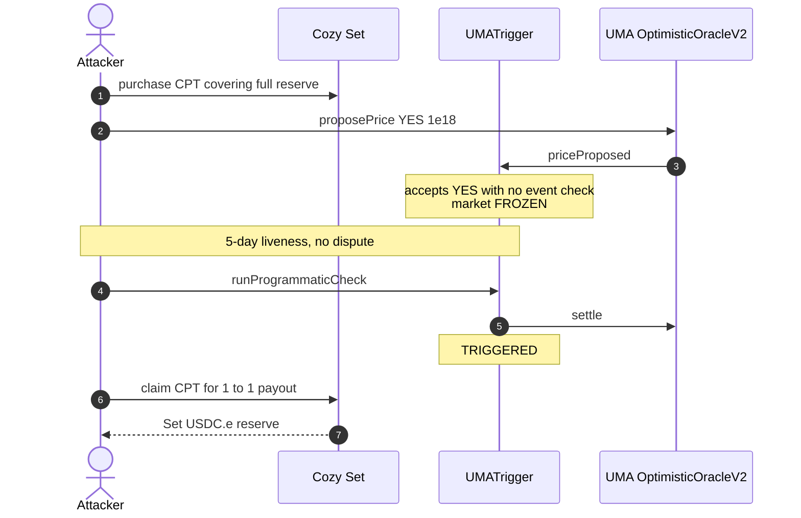
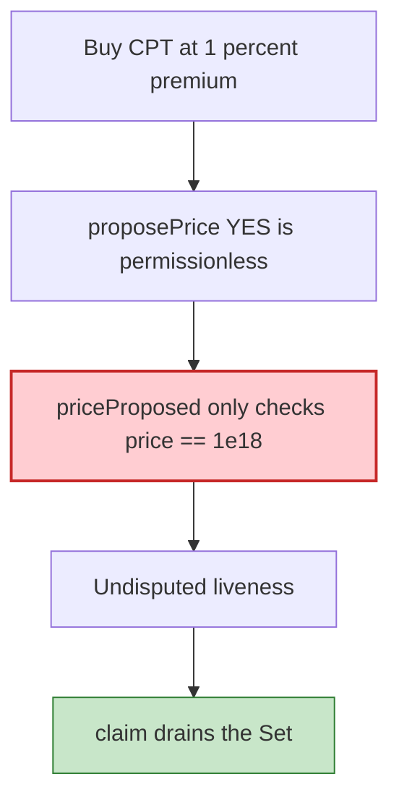

# Cozy Finance v2 — UMA Optimistic Oracle fake YES drains the protection Set

> **Vulnerability classes:** vuln/oracle/missing-validation · vuln/oracle/missing-circuit-breaker · vuln/logic/missing-check · vuln/access-control/missing-auth

> **Reproduction:** the PoC compiles & runs in an isolated Foundry project at
> [this project folder](.). Full verbose trace: [output.txt](output.txt).
> Source test: [test/CozyFinance_exp.sol](test/CozyFinance_exp.sol).

---

## Key info

| | |
|---|---|
| **Loss** | ~$160K USDC.e. PoC: Set drained **158,148.088467 USDC.e**; attacker net **165,718.768963 USDC.e** (bond refunds) [output.txt](output.txt) |
| **Vulnerable contract** | Cozy `UMATrigger` [`0xeb6613FAc35FeD17c276e3fE45D67Da67685F1eF`](https://optimistic.etherscan.io/address/0xeb6613FAc35FeD17c276e3fE45D67Da67685F1eF) (market 5, "Did Aave v2 get hacked?") + sibling [`0xacd105fe…de27`](https://optimistic.etherscan.io/address/0xacd105feea362d5c27caaba0b45f53d91b92de27) (market 0) |
| **Victim Set** | [`0x17705474203f7ff7ba8a940c433ab43d1f58e249`](https://optimistic.etherscan.io/address/0x17705474203f7ff7ba8a940c433ab43d1f58e249) (EIP-1167 clone) |
| **UMA OOv2** | [`0x255483434aba5a75dc60c1391bB162BCd9DE2882`](https://optimistic.etherscan.io/address/0x255483434aba5a75dc60c1391bB162BCd9DE2882) |
| **Attacker EOA** | [`0x003FE7359A4E03C85Ac2f521eC699ED84C7c5ccB`](https://optimistic.etherscan.io/address/0x003FE7359A4E03C85Ac2f521eC699ED84C7c5ccB) |
| **Attack txs** | TX1 freeze [`0x53b454a3…f2cb`](https://optimistic.etherscan.io/tx/0x53b454a3f552c5498994f74ae8737faa60123cac274bdd3b0383ccb226b3f2cb) (block **156,364,035**). TX2 drain [`0x8761164b…ce60`](https://optimistic.etherscan.io/tx/0x8761164b8947a0690b57896a8e7370dd69fe8e9137ce61e0b21ff08581a2ce60) (block **156,580,507**) |
| **Chain / block / date** | Optimism / fork **156,364,034** / 2026-09 |
| **Bug class** | Permissionless UMA `proposePrice(YES=1e18)` accepted by `UMATrigger` with no check that the Aave/Curve event happened; after 5-day liveness, `runProgrammaticCheck` flips TRIGGERED and CPT bought in the same tx as the proposal pays out 1:1 |

---

## TL;DR

Cozy v2 protection markets pay out if a UMA Optimistic Oracle request settles YES. Anyone may `proposePrice`. The trigger's `priceProposed` callback **only** requires `proposedPrice == 1e18` — it does **not** verify that Aave v2 (or whatever the query names) was actually hacked.

The attacker, in TX1:

1. Buys protection (`Set.purchase`) on markets 5 and 0 covering the **entire** Set reserve (96,597 + 65,716 = 162,313 USDC.e) at a ~1.3–1.4% premium.
2. Immediately `proposePrice(..., 1e18)` on each market's UMA request. Markets freeze.

Nobody disputes for **432,000s** (5 days). TX2: `runProgrammaticCheck()` settles YES → TRIGGERED; `Set.claim` redeems the CPT for the full notional, draining the Set.

No Cozy owner, no privileged proposer. Seed capital (~10k USDC.e for premium + UMA bonds) is the attacker's own money.

---

## Background

Cozy Sets hold a reserve (here USDC.e) and sell **protection tokens (CPT)** per market. Each market has a trigger. `UMATrigger` posts a YES_OR_NO_QUERY to UMA OOv2. States: 0=ACTIVE, 1=FROZEN (proposal live), 2=TRIGGERED (YES settled).

CPT is **not snapshotted** at proposal time. Buying CPT in the same tx as the fraudulent YES is allowed.

---

## The vulnerable code

Verified UMATrigger (conceptual, from PoC comments):

```solidity
function priceProposed(...) external {
    require(msg.sender == oracle);
    require(proposedPrice == AFFIRMATIVE_ANSWER); // 1e18 — THE ONLY CHECK
    // freeze market; no "did Aave actually get hacked?"
}

function runProgrammaticCheck() external returns (uint8) {
    // settle OO; on AFFIRMATIVE -> _updateTriggerState(TRIGGERED)
}
```

UMA `proposePrice` is permissionless (post the bond).

---

## Root cause

1. **Event-based UMA query with no secondary verification.** YES is treated as ground truth after liveness.
2. **CPT can be minted after (or in the same tx as) the proposal.** No snapshot of eligible protection.
3. **5-day liveness with no watcher** on a long-tail Optimism market.

---

## Preconditions

- Markets ACTIVE; Set holds ~162k USDC.e.
- Attacker can post UMA bonds (~1k USDC each) and pay ~2.6k premium.
- No dispute during 432,000s.

---

## Attack walkthrough

| Step | Detail |
|---|---|
| TX1 | `purchase` market 5 for 96,596.967870 + market 0 for 65,715.735793; `proposePrice(YES)` on both triggers |
| Wait | warp `proposalDisputeWindow + 1` |
| TX2 | `runProgrammaticCheck` → TRIGGERED; loop `claim` until CPT burned; sweep USDC.e to EOA |

```
Set USDC.e reserve before: 162312.703663
Set USDC.e drained:        158148.088467
attacker USDC.e profit (net of seed): 165718.768963
[PASS] testExploit()
```

---

## Diagrams





---

## Remediation

1. **Snapshot CPT supply / buyers at proposal time**; ignore CPT minted after.
2. **Do not freeze on a bare YES.** Require a second signal (guardian, canonical event hash, or a whitelist of proposers).
3. **Shorter liveness + bonded watchers** for event-based queries.
4. Cap protection outstanding vs reserve; pause purchase while FROZEN.

---

## How to reproduce

```bash
_shared/run_poc.sh 2026-09-CozyFinance_exp --mt testExploit -vvvvv
```

Optimism fork. Expected: `[PASS] testExploit()` with Set drained > 150,000 USDC.e.

---

*Reference: https://x.com/SlowMist_Team/status/2096881310237426062*
