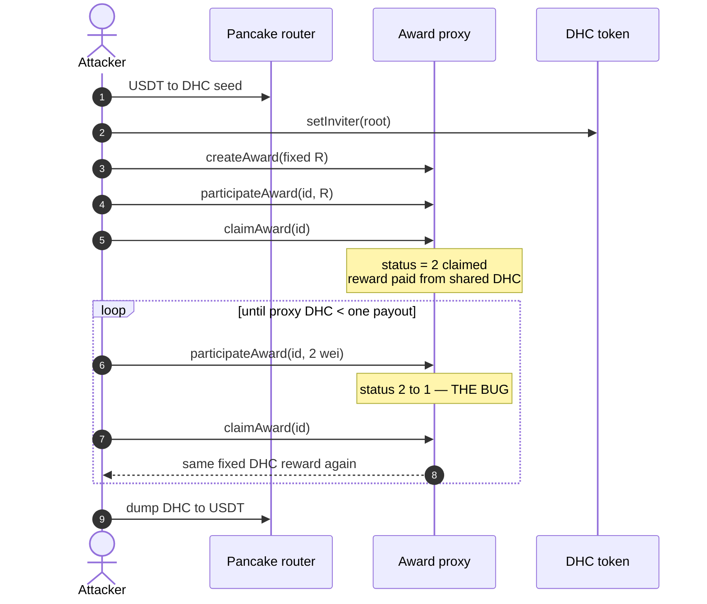
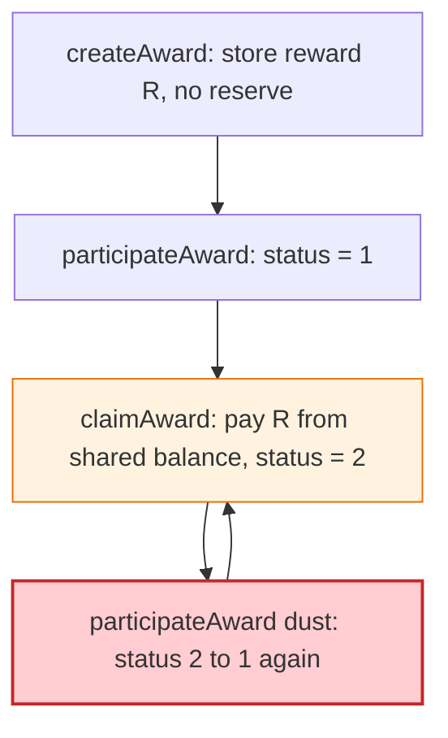

# DHC Award vault — claimed reward can be reset and paid again from the shared pool

> **Vulnerability classes:** vuln/logic/incorrect-state-transition · vuln/logic/reward-calculation · vuln/logic/missing-check

> **Reproduction:** the PoC compiles & runs in an isolated Foundry project at
> [this project folder](.). Full verbose trace: [output.txt](output.txt).
> Source test: [test/DHC_exp.sol](test/DHC_exp.sol).

---

## Key info

| | |
|---|---|
| **Loss** | On-chain **71,851.02 USDT**. PoC reconstruction **71,100.63 USDT** (single-pair dump vs original multi-venue) [output.txt](output.txt) |
| **Vulnerable contract** | Award proxy [`0xe2A047aADbac51b0116Af1cE91eBDAe4B4202094`](https://bscscan.com/address/0xe2A047aADbac51b0116Af1cE91eBDAe4B4202094) → impl [`0x5ABB3fe2…8CE1`](https://bscscan.com/address/0x5ABB3fe2A02E5D4320862944cd3a0B8f6Af28CE1) (**unverified**) |
| **DHC token** | [`0x743F15f4d2481774d970f286f0EbAD9C3Daed6E9`](https://bscscan.com/address/0x743F15f4d2481774d970f286f0EbAD9C3Daed6E9) |
| **Attacker EOA** | [`0xD3A8D0A9F55cf679fff6F277E49AfC95B49D2B07`](https://bscscan.com/address/0xD3A8D0A9F55cf679fff6F277E49AfC95B49D2B07) |
| **Attack contract** | [`0x226923D34A10f3D54B57b9F4b685E82c6Cba968A`](https://bscscan.com/address/0x226923D34A10f3D54B57b9F4b685E82c6Cba968A) |
| **Chain / block / date** | BNB Chain / fork **120,055,459** (parent of block **120,055,460**) / 2026-09-05 |
| **Bug class** | After `claimAward`, `participateAward(id, dust)` resets status 2 → 1 without a new reserve; `claimAward` pays the same fixed reward again from the shared proxy DHC balance |

---

## TL;DR

DHC (DeHealth / RedSonic-style "Award" staking) records a **fixed reward** in `createAward` with **no per-award locked collateral**. `participateAward` does **not** require the award to still be unclaimed: a claimed award (status 2) can be reset to status 1 by anyone who owns the position, for as little as **0–2 wei**. `claimAward` then pays the same fixed reward again out of the **shared** proxy DHC balance.

The live attack was four txs in one block: deploy + `prime` + `pledge` + `cashout`. This PoC keeps that shape as typed calls (selectors inferred from the trace; impl is unverified):

1. `prime`: buy DHC with 10k USDT (flash-loan stand-in), `setInviter`, `createAward(fixed reward)`.
2. `pledge`: `participateAward` full amount, `claimAward` once (status → 2).
3. `cashout`: loop `{ participateAward(id, 2 wei); claimAward(id); }` until the proxy cannot cover another reward, dump DHC→USDT, repay 10k, keep the surplus.

Net **~71.1k USDT** in the reconstruction (on-chain 71,851 USDT).

---

## Background

The award vault is a TransparentUpgradeableProxy. Implementation `0x5abb3fe2…` is **not verified**; none of the four award selectors resolve in 4byte. Behaviour is reconstructed from the trace (argument layout, token movements, status transitions):

| Selector | Helper name | Observed behaviour |
|---|---|---|
| `0x7f200fee` | `createAward(uint256 reward)` | records a fixed reward |
| `0x9ba6df97` | `getAward()` | returns the award tuple; id is the last word |
| `0xe3db9b54` | `participateAward(uint256 id, uint256)` | (re)enters; **resets a claimed award to claimable** |
| `0x43609f36` | `claimAward(uint256 id)` | pays the fixed reward from the shared proxy balance |

`setInviter` lives on the DHC token; participate reverts on a zero inviter. The attacker chained off an already-registered root `0xe099…FA60`.

The USDT flash loan is not the vulnerability; the PoC `deal`s 10,000 USDT.

---

## The vulnerable code

RECONSTRUCTED from trace (impl unverified):

```solidity
// createAward records reward R with no locked backing.
// claimAward pays a fixed fraction of R from IERC20(DHC).balanceOf(proxy)
//   and sets status = 2 (claimed).
// participateAward(id, amount):
//   does NOT require status != 2
//   amount can be dust (2 wei)
//   sets status = 1 (claimable) again
```

There is no `claimed[id][user]` latch, no burn of the award NFT, no decrease of remaining reward budget.

---

## Root cause

A finite, shared inventory (the proxy's DHC) is paid out by a **state machine that can walk backwards**. Status 2 is not terminal. Dust re-participate is cheaper than the reward it re-enables, so the loop drains the vault one fixed reward at a time (~1,401 DHC per claim vs a 14,016 DHC "reward" parameter — the paid fraction is what matters).

Permissionless: the live caller is the attacker's contract, not proxy owner `0x007FA7F9…`.

---

## Preconditions

- Proxy holds a large DHC inventory (the prize).
- Attacker can register an inviter and `createAward`.
- Seed DHC to pledge once (flash-loaned USDT → Pancake).

---

## Attack walkthrough

Fixed reward constant `REWARD = 0x2f7d64a231c0d4801fe`. Reset amount = 2 wei.

```
attacker USDT before: 0
attacker USDT after:  71100.634971777945699789
attacker net profit (USDT): 71100.634971777945699789
[PASS] testExploit()
```

On-chain EOA received 71,851.0167 USDT; reconstruction is within ~1% (dump venue + inviter cut on the first pledge).

---

## Diagrams





---

## Remediation

1. **Make claimed terminal.** After `claimAward`, refuse `participateAward` on that id (or burn the position).
2. **Lock collateral per award** equal to the promised reward; pay from that bucket, not from a shared proxy balance.
3. **Require participate amount ≥ remaining unclaimed reward** (dust must not re-open a full payout).
4. Verify and publish the award impl; add an explicit `status` enum with a one-way `Claimed` latch.

---

## How to reproduce

```bash
_shared/run_poc.sh 2026-09-DHC_exp --mt testExploit -vvvvv
```

Fork is BSC (`127.0.0.1:8546`). Expected: `[PASS] testExploit()` with ~71,100 USDT profit.

---

*Reference: https://x.com/clarahacks/status/2096127358189117721*


## References

- https://x.com/exvulsec/status/2096119185621618858 (@exvulsec secondary analysis)
