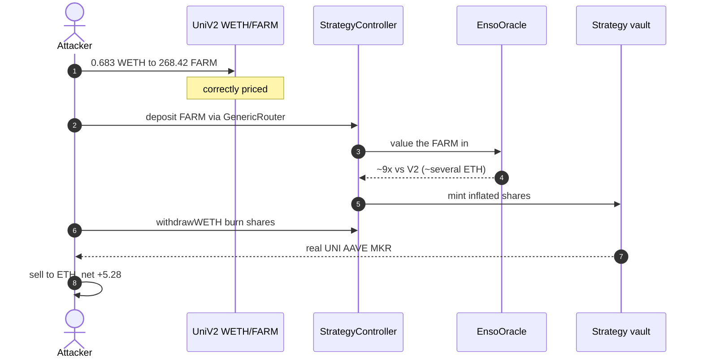
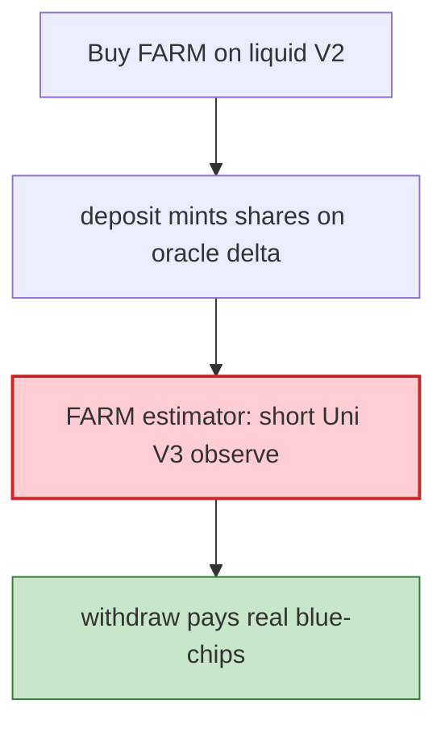

# Enso Finance strategy vault — short Uni V3 TWAP overvalues FARM deposits

> **Vulnerability classes:** vuln/oracle/manipulable-twap · vuln/oracle/spot-price · vuln/oracle/missing-circuit-breaker · vuln/logic/price-calculation

> **Reproduction:** the PoC compiles & runs in an isolated Foundry project at
> [this project folder](.). Full verbose trace: [output.txt](output.txt).
> Source test: [test/EnsoFinance_exp.sol](test/EnsoFinance_exp.sol).

---

## Key info

| | |
|---|---|
| **Loss** | Headline ~**5.6 ETH** spot of UNI/AAVE/MKR pulled, net of 0.683 WETH spent on FARM. PoC realizes **5.277209113875295697 ETH** after sale slippage [output.txt](output.txt) |
| **Vulnerable contracts** | Strategy vault proxy [`0x890ed1Ee…5942`](https://etherscan.io/address/0x890ed1Ee6d435a35d51081ded97Ff7CE53Be5942) · StrategyController [`0x173cAe63…bE8`](https://etherscan.io/address/0x173cAe63801B32752271E32147D0d2e3a77BEbE8) · EnsoOracle [`0xAb7505eB…DC0`](https://etherscan.io/address/0xAb7505eB360cE0D63e8E88f7853677EcD5537DC0) |
| **Attacker** | [`0x3196398321D77a2511d369DCB6eCa9d2aD87b73A`](https://etherscan.io/address/0x3196398321D77a2511d369DCB6eCa9d2aD87b73A) (contract-creation exploit) |
| **Attack tx** | [`0x63fbfc4b47e810d604dbdab0db35b17366f421337d8c60955eb81cd5d6071ad3`](https://etherscan.io/tx/0x63fbfc4b47e810d604dbdab0db35b17366f421337d8c60955eb81cd5d6071ad3) (block **25,934,827**) |
| **Chain / block / date** | Ethereum / fork **25,934,826** / 2026-09-09 |
| **Bug class** | Permissionless `deposit` mints shares on oracle-estimated value delta; FARM is priced off a thin Uni V3 pool with a near-spot TWAP window (~9× vs the V2 market) |

---

## TL;DR

The Enso strategy vault mints deposit shares as:

`mint = amountAddedValue * totalSupply / valueBefore`

Valuation runs `EnsoOracle → per-item estimators → Uniswap V3 TWAP (pool.observe)`. The **FARM** item is priced off an **imbalanced, thinly-observed** V3 pool with a **short, per-pool TWAP window** (trace: `observe(uint32[])` selector `0x883bdbfd`), so it prints ~**9×** the V2 market.

Attacker (1 ETH capital):

1. Buys **268.42 FARM** for **0.6828 WETH** on the correctly-priced Uni V2 WETH/FARM pair.
2. `controller.deposit(strategy, router, 0, 0, abi.encode(Call[{settleTransferFrom(FARM, this, strategy)}]))` — permissionless. Oracle credits the FARM at several ETH.
3. `controller.withdrawWETH` burns the inflated shares; GenericRouter `transferFrom`s the strategy's real **UNI / AAVE / MKR** to the attacker (amounts from the live tx).
4. Sells those tokens back to WETH, unwraps. Net **5.277 ETH** in the PoC.

Controller/oracle impls are **unverified**; signatures are 4-byte-matched from the trace (`deposit=0x71b8dc69`, `withdrawWETH=0x716e2615`, `settleTransferFrom=0xc5067ad4`).

---

## Background

Enso StrategyController-managed baskets hold DeFi blue-chips. Deposits go through a GenericRouter `Call[]` so the controller can pull arbitrary tokens in, then mint shares on the **oracle delta**, not on a conservative min(spot, TWAP) per asset.

A short TWAP on a thin pool is a spot oracle with extra steps.

---

## The vulnerable code

RECONSTRUCTED from 4-byte-matched calls + trace (controller/oracle unverified):

```solidity
function deposit(address strategy, address router, uint256 amount, uint256 slippage, bytes calldata data) external payable;
// data = abi.encode(Call[{target: router, callData: settleTransferFrom(FARM, attacker, strategy)}])
// shares minted from oracle value delta of tokens that landed in the strategy

function withdrawWETH(address strategy, address router, uint256 amount, uint256 slippage, bytes calldata data) external;
// burns `amount` shares; data = transferFrom(strategy, attacker, amt) per underlying
```

Oracle path confirmed in the trace: `pool.observe(uint32[])` with **short, per-pool-varying** windows rather than one long window. Combined with an imbalanced FARM V3 pool this over-values FARM by ~9×.

---

## Root cause

1. **Permissionless deposit** mints on estimated value, not on a bounded basket of known tokens with haircuts.
2. **FARM estimator uses a manipulable / stale-thin TWAP** that diverges ~9× from the liquid V2 pool the attacker actually traded.
3. **Withdraw pays real reserves** (UNI/AAVE/MKR) against those inflated shares.
4. No circuit breaker comparing deposit token's V2 price vs the oracle print.

---

## Preconditions

- Strategy still holds UNI/AAVE/MKR worth extracting.
- FARM V3 TWAP remains dislocated vs V2.
- 1 ETH of attacker capital (the live tx).

---

## Attack walkthrough

| # | Step | Amount |
|---|---|---|
| 1 | Wrap 1 ETH, Uni V2 swap | 0.682823567760593530 WETH → 268.422447447061825167 FARM |
| 2 | `deposit` via GenericRouter `settleTransferFrom` | FARM into strategy; inflated shares minted |
| 3 | `withdrawWETH` with 3 pulls | 859.918 UNI, 31.676 AAVE, 3.452 MKR |
| 4 | Sell all three → WETH, unwrap, net out 1 ETH | **5.277 ETH** profit |

```
attacker profit (ETH): 5.277209113875295697
[PASS] testExploit()
```

---

## Diagrams





---

## Remediation

1. **Price deposits off the same venue the token is actually liquid on**, or `min(V2, V3 TWAP)` with a long window.
2. **Haircut / cap** any single item's contribution to `valueBefore` / `amountAddedValue`.
3. **Whitelist deposit tokens** that have deep, consistent oracles; drop FARM-like thin TWAPs.
4. Compare oracle print vs a spot sanity bound and revert on >X% divergence.

---

## How to reproduce

```bash
_shared/run_poc.sh 2026-09-EnsoFinance_exp --mt testExploit -vvvvv
```

Expected: `[PASS] testExploit()` with profit > 4 ETH (observed 5.277).

---

*Reference: https://x.com/telemnews/status/2097611731707048169*


## References

- https://x.com/SlowMist_Team/status/2097602957311455640 (@SlowMist_Team secondary analysis)
