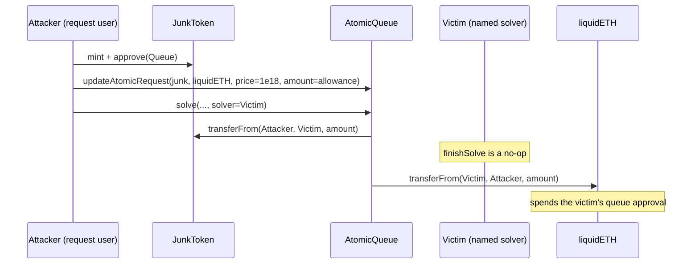
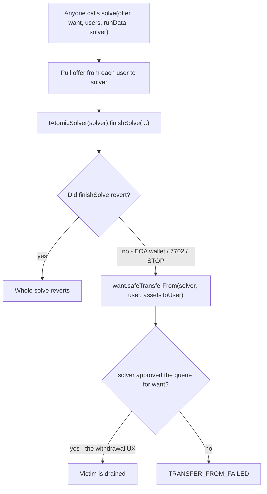

# ether.fi Liquid / Veda AtomicQueue — Unauthenticated `solver` Drain

<!-- non-defihacklabs: Crypto Training original detection & analysis (Twitter hack alerting) -->
<!-- date: 2026-09 -->

> **Vulnerability classes:** vuln/access-control/missing-auth · vuln/logic/missing-validation · vuln/dependency/unsafe-external-call

> **Reproduction:** Foundry fork replay at Ethereum block **25952623** (one before
> [`0x7cbe0b43…5599b`](https://etherscan.io/tx/0x7cbe0b4349513fed6d03ba8bf9ed708e10e07a501d10b5f344a25ae10595599b)).
> `EtherFiVedaAtomicQueueExploit.attack()` mints a worthless ERC20, opens a
> self-request on the Veda `AtomicQueue`, and names each prior approver as
> `solver` so `want.safeTransferFrom` pulls their liquidETH (and dust USDC).
> Offline `anvil_state.json` + `_shared/run_poc.sh` **[PASS]**
> ([output.txt](output.txt)). Alert:
> [@exvulsec](https://x.com/exvulsec/status/2098318467556692298).

---

## Key info

| | |
|---|---|
| **Loss** | **14.445541086626480232 liquidETH** + **7.047848 USDC** in the PoC (`14445541086626480232` wei + `7047848` USDC wei, [output.txt:9](output.txt)–[output.txt:10](output.txt)). The live attacker swapped that inventory to **15.453645063405167626 ETH** (~$38.2k at ~$2,471/ETH) |
| **Vulnerable contract** | `AtomicQueue` (tagged ether.fi Withdrawal Queue) — [`0xD45884B592E316eB816199615A95C182F75dea07`](https://etherscan.io/address/0xd45884b592e316eb816199615a95c182f75dea07#code) |
| **Stolen asset** | ether.fi Liquid / `liquidETH` — [`0xf0bb20865277aBd641a307eCe5Ee04E79073416C`](https://etherscan.io/token/0xf0bb20865277abd641a307ece5ee04e79073416c) (BoringVault) |
| **Dust asset** | USDC — [`0xA0b86991c6218b36c1d19D4a2e9Eb0cE3606eB48`](https://etherscan.io/token/0xa0b86991c6218b36c1d19d4a2e9eb0ce3606eb48) |
| **Attacker EOA** | [`0xa5CC6e490Bce9185fA47b421f2EaC677A83B64Ea`](https://etherscan.io/address/0xa5CC6e490Bce9185fA47b421f2EaC677A83B64Ea) (nonce 0 on the live tx) |
| **Attacker contracts** | CREATE'd in the live tx then self-destructed: [`0x7f5A5f66…DEC1`](https://etherscan.io/address/0x7f5A5f66ebF8afc301fFe3739305c356B110DEC1) (wrapper) → [`0x679c53fF…663E`](https://etherscan.io/address/0x679c53fF03c5c60aAC538a019cA9d69C5DFa663E) (drain + swap helper) → [`0xd9b51a9b…3f64`](https://etherscan.io/address/0xd9b51a9b11b6af45750bfe06d0459fdce0d03f64) (junk ERC20). PoC deploys its own `EtherFiVedaAtomicQueueExploit` |
| **Attack tx** | [`0x7cbe0b4349513fed6d03ba8bf9ed708e10e07a501d10b5f344a25ae10595599b`](https://etherscan.io/tx/0x7cbe0b4349513fed6d03ba8bf9ed708e10e07a501d10b5f344a25ae10595599b) @ Ethereum block **25952624** (2026-09-11 07:20 UTC) |
| **Chain / block / date** | Ethereum (chainId **1**) / fork **25,952,623** / 11 Sep 2026 |
| **Compiler** | Solidity **v0.8.21+commit.d9974bed**, optimizer **enabled**, **200 runs**, `shanghai` (per [sources/AtomicQueue_d45884/_meta.json](sources/AtomicQueue_d45884/_meta.json)) |
| **Bug class** | Missing authentication on `AtomicQueue.solve`'s `solver` argument: after a no-op `finishSolve`, the queue `transferFrom`s that address for `want` |
| **Alert** | [@exvulsec](https://x.com/exvulsec/status/2098318467556692298) · [@SlowMist_Team](https://x.com/SlowMist_Team/status/2098344499923784048)|

---

## TL;DR

1. ether.fi Liquid withdrawals on Ethereum share a Veda `AtomicQueue`
   ([AtomicQueue.sol](sources/AtomicQueue_d45884/src_modules_atomic-queue_AtomicQueue.sol)).
   Users who want to sell `liquidETH` (or other vault shares) for a `want` asset
   **approve the queue** and open an `AtomicRequest`.

2. `solve(offer, want, users, runData, solver)` is **permissionless**. The last
   argument is an unauthenticated address. The queue (a) pulls `offer` from each
   listed user to `solver`, (b) calls `IAtomicSolver(solver).finishSolve(...)`,
   then (c) pulls `want` **from `solver`** to each user via
   `want.safeTransferFrom` ([AtomicQueue.sol:230](sources/AtomicQueue_d45884/src_modules_atomic-queue_AtomicQueue.sol#L230)).

3. Step (c) reuses the **same allowance** users granted so the queue could take
   their *offer* tokens. Nothing binds that allowance to "only when I am the
   request owner". Naming a prior approver as `solver` spends it as *want*.

4. `finishSolve` is a high-level interface call. On this 0.8.21 bytecode an
   empty-code EOA reverts (`extcodesize == 0`), but the live victims were
   EIP-7702 smart accounts / tiny wallets whose unknown-selector path was a
   **no-op**. The queue then continues as if a real solver had sourced `want`.

5. The attacker needed **no capital**. They minted a worthless ERC20, opened a
   self-request offering that junk and wanting `liquidETH` at `atomicPrice = 1e18`
   (1:1 in 18-decimal space), sized `offerAmount` to each victim's
   `min(balance, allowance)`, and passed `solver = victim`.
   `assetsToUser = 1e18 * offerAmount / 1e18 = offerAmount`.

6. Eleven approvers were drained in one transaction: **14.445541086626480232
   liquidETH** from nine holders and **7.047848 USDC** from two more
   ([output.txt:9](output.txt)–[output.txt:10](output.txt)). The live helper then
   dumped `liquidETH` through Uniswap v4 and the USDC dust through Uniswap v3,
   forwarding **15.45 ETH** to the EOA.

---

## Background — what the AtomicQueue is for

Veda's `AtomicQueue` is a limit-order style withdrawal helper used by
ether.fi Liquid (and other BoringVault deployments). A user who wants to exit
vault shares for a stable asset (or the reverse) posts:

```solidity
struct AtomicRequest {
    uint64 deadline;
    uint88 atomicPrice; // want-token units per 1e{offerDecimals} of offer
    uint96 offerAmount;
    bool inSolve;
}
```

`updateAtomicRequest(offer, want, req)` writes `userAtomicRequest[msg.sender][offer][want]`
([AtomicQueue.sol:157-174](sources/AtomicQueue_d45884/src_modules_atomic-queue_AtomicQueue.sol#L157-L174)).
It is `nonReentrant` and otherwise **unrestricted** — any address may post a
request for any token pair.

A "solver" (normally a keeper / `AtomicSolverV3` that actually holds the `want`
inventory, or redeems shares through the Teller) is then supposed to:

1. Receive the users' `offer` tokens.
2. In `finishSolve`, source `want` (swap, redeem, P2P) and `approve` the queue.
3. Let the queue `transferFrom` that `want` back to the users at each request's
   `atomicPrice`.

The payout math is
`atomicPrice.mulDivDown(offerAmount, 10 ** offerDecimals)`
([AtomicQueue.sol:308-314](sources/AtomicQueue_d45884/src_modules_atomic-queue_AtomicQueue.sol#L308-L314)).
With an 18-decimal fake offer token and `atomicPrice = 1e18`, one wei of junk
clears one wei of `want`.

Users approved the queue because that is how a *legitimate* withdrawal is
funded: the queue must be able to `transferFrom` their `liquidETH` when they
are the **user**. The bug is that the same spender is also used when they are
named as the **solver**.

---

## The vulnerable code

Verified source lives at
[sources/AtomicQueue_d45884/src_modules_atomic-queue_AtomicQueue.sol](sources/AtomicQueue_d45884/src_modules_atomic-queue_AtomicQueue.sol)
(compiler v0.8.21, 200 runs, shanghai). This deployment has **no `Auth` /
`requiresAuth`** — later Veda revisions gated `solve` behind a role, which this
ether.fi queue never did.

### 1. `solver` is a free parameter

```solidity
function solve(
    ERC20 offer,
    ERC20 want,
    address[] calldata users,
    bytes calldata runData,
    address solver
) external nonReentrant {
    uint8 offerDecimals = offer.decimals();
    uint256 assetsToOffer;
    uint256 assetsForWant;
    for (uint256 i; i < users.length; ++i) {
        AtomicRequest storage request = userAtomicRequest[users[i]][offer][want];
        // deadline / zero-amount / duplicate checks only…
        assetsForWant += _calculateAssetAmount(request.offerAmount, request.atomicPrice, offerDecimals);
        assetsToOffer += request.offerAmount;
        request.inSolve = true;
        offer.safeTransferFrom(users[i], solver, request.offerAmount);
    }

    IAtomicSolver(solver).finishSolve(runData, msg.sender, offer, want, assetsToOffer, assetsForWant);

    for (uint256 i; i < users.length; ++i) {
        AtomicRequest storage request = userAtomicRequest[users[i]][offer][want];
        if (request.inSolve) {
            uint256 assetsToUser = _calculateAssetAmount(request.offerAmount, request.atomicPrice, offerDecimals);
            want.safeTransferFrom(solver, users[i], assetsToUser);
            // …zero the request…
        }
    }
}
```

([AtomicQueue.sol:190-246](sources/AtomicQueue_d45884/src_modules_atomic-queue_AtomicQueue.sol#L190-L246))

There is no:

- `msg.sender == solver` (or `solver` whitelist / `QUEUE_ROLE`)
- check that `solver` approved this particular fill
- check that `want` is the asset the named solver intended to sell
- check that `solver` even consented to being a solver

The comment above the function says solvers are "required to approve this
contract to spend enough of want assets" — that is an **assumption**, not an
invariant. Any prior `approve(queue, type(uint256).max)` satisfies it.

### 2. `finishSolve` does not have to pay

```solidity
IAtomicSolver(solver).finishSolve(runData, msg.sender, offer, want, assetsToOffer, assetsForWant);
```

([AtomicQueue.sol:219](sources/AtomicQueue_d45884/src_modules_atomic-queue_AtomicQueue.sol#L219),
interface at [IAtomicSolver.sol](sources/AtomicQueue_d45884/src_modules_atomic-queue_IAtomicSolver.sol))

A real `AtomicSolverV3` would swap/redeem here and approve `want`. A wallet
whose fallback / 7702 target does not revert on an unknown selector just
returns. The queue then `transferFrom`s `want` anyway.

Solc 0.8.21 inserts an `extcodesize` check on that high-level call, so a
*pure* EOA would revert. The eleven live victims were 7702-delegated accounts
or small proxies; the unknown selector was a no-op (gas 0, `[Stop]` in the
PoC, [output.txt:114](output.txt)). The teaching PoC `vm.etch`es a single
`STOP` byte to reproduce that callback. Accounting is unchanged:
`transferFrom` still pulls from the victim address.

### 3. Payout size is attacker-controlled

```solidity
function _calculateAssetAmount(uint256 offerAmount, uint256 atomicPrice, uint8 offerDecimals)
    internal pure returns (uint256)
{
    return atomicPrice.mulDivDown(offerAmount, 10 ** offerDecimals);
}
```

The attacker is the request *user*, so they pick both `offerAmount` and
`atomicPrice`. Setting `atomicPrice = 1e18` and `offerAmount = stealable`
makes `assetsToUser = stealable` — exactly `min(victim.balance, victim.allowance)`
capped at `uint96`.

---

## Root cause


## Secondary analysis (@SlowMist_Team)

> Missing auth on AtomicQueue.solve(solver): attacker-chosen solver plus leftover ERC-20 allowance lets transferFrom drain prior approvers after a no-op finishSolve

Source: https://x.com/SlowMist_Team/status/2098344499923784048


The queue treats "address that will be `transferFrom`'d for `want`" as a
**caller-supplied solver role**, but the only access control on that role is
"does this address currently have an ERC-20 allowance to the queue?". Users
granted that allowance for a *different* role (request owner offering
`liquidETH`). There is no binding between (user, offer, want) and the solver
that is allowed to source `want`, and `finishSolve` is not required to move
value.

Later Veda code (`AtomicSolverV5`, `requiresAuth` on `solve`) is a tacit
admission: a rogue queue + unauthenticated solver is a known drain. This
ether.fi deployment is the original ungated `AtomicQueue`.

---

## Preconditions

1. Victims previously `approve`'d `AtomicQueue` (`0xD458…ea07`) to spend
   `liquidETH` and/or USDC — the normal UX for posting a withdrawal request.
2. `solve` and `updateAtomicRequest` are callable by anyone (no `Auth`).
3. `isPaused` is false.
4. The named `solver` has *some* code whose `finishSolve` / fallback does not
   revert (7702 delegation, proxy, or, in the PoC, `STOP`).
5. The attacker can mint an ERC-20 they fully control (no market, no value).
6. Victim `min(balance, allowance) > 0` and fits in `uint96`.

No flash loan, no oracle, no governance. The live attacker EOA was nonce 0.

---

## Attack walkthrough

Fork block **25,952,623**. The PoC keeps the stolen `liquidETH` / USDC (the live
tx additionally swapped to ETH). Profit is measured on the attacker EOA.

### 1. Mint worthless offer inventory

`attack()` deploys `JunkToken`, mints **100e18**, and `approve`s the queue
([EtherFiVedaAtomicQueue_exp.sol:169-171](test/EtherFiVedaAtomicQueue_exp.sol#L169-L171),
[output.txt:93](output.txt)–[output.txt:96](output.txt)).

### 2. Open a self-request against the largest approver

Victim `0x69da…47D4` had `allowance = 12.366762997907905993` liquidETH
(balance was larger: `145.99`, [output.txt:98](output.txt)–[output.txt:100](output.txt)).
The exploit writes:

- `deadline = type(uint64).max`
- `atomicPrice = 1e18`
- `offerAmount = 12366762997907905993`

([output.txt:101](output.txt),
[EtherFiVedaAtomicQueue_exp.sol:183](test/EtherFiVedaAtomicQueue_exp.sol#L183)).

### 3. `solve` with `solver = victim`

```text
queue.solve(junk, liquidETH, [exploit], "", 0x69da…47D4)
```

([EtherFiVedaAtomicQueue_exp.sol:187](test/EtherFiVedaAtomicQueue_exp.sol#L187),
[output.txt:106](output.txt))

Inside `solve`:

1. Junk `transferFrom(exploit → victim, 12.366…)` — the victim is paid in
   worthless tokens ([output.txt:109](output.txt)).
2. `finishSolve` on the victim: **gas 0, `[Stop]`** ([output.txt:114](output.txt)).
3. `liquidETH.transferFrom(victim → exploit, 12.366…)` — the drain
   ([output.txt:117](output.txt)). `AtomicRequestFulfilled` emits the same
   amount in and out ([output.txt:125](output.txt)).

### 4. Repeat for the remaining ten approvers

The same `_drain` helper walks the other eight `liquidETH` holders and two
USDC holders ([EtherFiVedaAtomicQueue_exp.sol:189-194](test/EtherFiVedaAtomicQueue_exp.sol#L189-L194)).
Each fill is independent because `solve` zeroes `offerAmount` after a
success.

| Victim | Asset | Amount stolen | Trace |
|---|---|---|---|
| `0x69da2912…47D4` | liquidETH | 12.366762997907905993 | [output.txt:125](output.txt) |
| `0x1226C763…B3B1` | liquidETH | 1.872359702113513087 | [output.txt:157](output.txt) |
| `0xeE8D39AB…553D` | liquidETH | 0.108561548097609073 | [output.txt:189](output.txt) |
| `0x0EACbaA9…b468` | liquidETH | 0.071654265569543118 | [output.txt:221](output.txt) |
| `0x13B90df2…9E23` | liquidETH | 0.01055940568308056 | [output.txt:253](output.txt) |
| `0x0ec7E8C2…CfD1` | liquidETH | 0.009912991721213508 | [output.txt:285](output.txt) |
| `0x516E726f…8Cc7` | liquidETH | 0.003565365329596464 | [output.txt:317](output.txt) |
| `0x4D4Ef453…A9E7` | liquidETH | 0.001606368347210355 | [output.txt:349](output.txt) |
| `0x2cFb075E…9a1A` | liquidETH | 0.000558441856808074 | [output.txt:381](output.txt) |
| `0x047e7CFA…FF72` | USDC | 5.692181 | [output.txt:417](output.txt) |
| `0xEaBf4c3e…0F1A` | USDC | 1.355667 | [output.txt:453](output.txt) |
| **Total** | | **14.445541086626480232 liquidETH + 7.047848 USDC** | [output.txt:9](output.txt) |

### 5. Forward profit

`liquidETH.transfer(owner, balance)` /
`usdc.transfer(owner, balance)`
([EtherFiVedaAtomicQueue_exp.sol:196-197](test/EtherFiVedaAtomicQueue_exp.sol#L196-L197)).
The test asserts `liquidProfit > 14 ether` and `usdcProfit > 7e6`
([output.txt:6](output.txt), gas **2,478,578**).

The historical transaction additionally routed `liquidETH` through Uniswap v4
Pool Manager `0x000000000004444c5dc75cB358380D2e3dE08A90` and the USDC dust
through Uniswap v3 `SwapRouter` `0xE592427A0AEce92De3Edee1F18E0157C05861564`,
unwrapping WETH, and sent **15.453645063405167626 ETH** to
`0xa5CC…64Ea`. That swap is incidental; the bug is the queue `transferFrom`.

---

## Diagrams





---

## Remediation

- **Do not take `solver` from the caller.** Hard-code `solver = msg.sender`, or
  restrict `solve` to a `SOLVER_ROLE` / `requiresAuth` keeper set (as later
  Veda `AtomicQueue` + `AtomicSolverV5` do).
- **Do not reuse user allowances as solver inventory.** Pull `want` from
  `msg.sender` (the party that just ran `finishSolve` and can `approve` in
  that callback), never from an arbitrary third party.
- **Require `finishSolve` to actually pay.** For example, measure
  `want.balanceOf(queue)` (or allowance) before/after the callback and revert
  if the solver did not provision `assetsForWant`.
- **Split spenders.** A "user offer" allowance must not authorize a "solver
  want" `transferFrom`. Use a dedicated solver vault or `permit` bound to
  `(user, offer, want, amount, nonce)`.
- **Pause + revoke.** If this queue is still live, `pause()` it and tell
  every approver to `approve(queue, 0)` for `liquidETH`, USDC, and any other
  listed asset.
- **On-chain allowlists.** `isAtomicRequestValid` already checks the *user's*
  offer allowance; add a symmetric check that `solver` is a known
  `IAtomicSolver` implementation, not a wallet.

---

## How to reproduce

```bash
cd /workspaces/RustroverProjects/audits/evm-hack-registry
_shared/run_poc.sh 2026-09-EtherFiVedaAtomicQueue_exp -vvvvv
```

Expect `[PASS] testExploit()` and:

```
liquidETH profit: 14.445541086626480232
USDC profit: 7.047848
```

The test forks `http://127.0.0.1:8545` at block **25,952,623** from
`anvil_state.json`. Verified `AtomicQueue` sources are under
[sources/AtomicQueue_d45884](sources/AtomicQueue_d45884). The PoC is
[test/EtherFiVedaAtomicQueue_exp.sol](test/EtherFiVedaAtomicQueue_exp.sol).

*Reference: https://x.com/exvulsec/status/2098318467556692298*


## References

- https://x.com/SlowMist_Team/status/2098344499923784048 (@SlowMist_Team secondary analysis)
