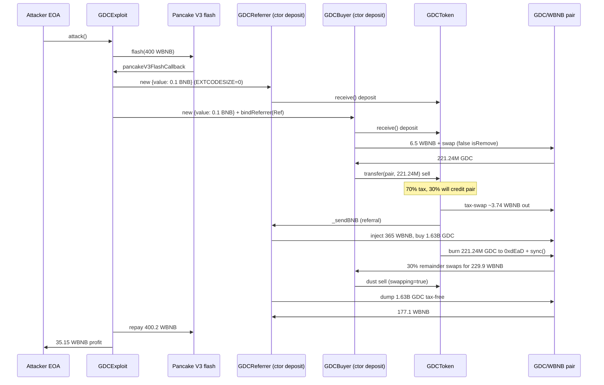
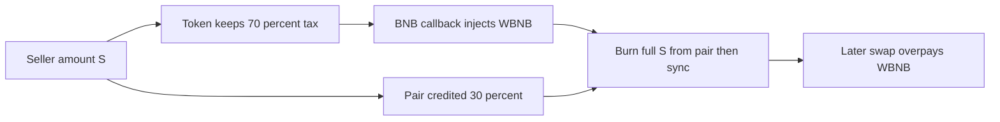

# GDCToken — sell-tax credits 30% to the pair then burns 100% from it and `sync()`s

<!-- non-defihacklabs: Crypto Training original detection & analysis (Twitter hack alerting) -->

> **Vulnerability classes:** vuln/logic/fee-calculation · vuln/logic/incorrect-state-transition · vuln/reentrancy/single-function · vuln/access-control/broken-logic

> **Reproduction:** the PoC compiles & runs in an isolated Foundry project at
> [this project folder](.). Full verbose trace: [output.txt](output.txt).
> Verified vulnerable source: [sources/GDCToken_e33423/contracts_gdc_GDCToken.sol](sources/GDCToken_e33423/contracts_gdc_GDCToken.sol).
> Source test: [test/GDCToken_exp.sol](test/GDCToken_exp.sol).

---

## Key info

| | |
|---|---|
| **Loss** | Pair drained **38.075473326480291171 WBNB** (~$27k). PoC attacker profit **35.153338226531554776 WBNB** after a 0.2 WBNB V3 flash fee. Live tx netted **~35.34 BNB**. |
| **Vulnerable contract** | GDCToken — [`0xE3342358E7CcBAEbDD1139aD0274c53c5b3EF822`](https://bscscan.com/address/0xe3342358e7ccbaebdd1139ad0274c53c5b3ef822#code) |
| **Victim pool** | PancakeSwap V2 GDC/WBNB — [`0x9CD8D04C30ED78AfeF7eD00Ab1A2a028d476331C`](https://bscscan.com/address/0x9cd8d04c30ed78afef7ed00ab1a2a028d476331c) (token0=WBNB, token1=GDC) |
| **Attacker EOA** | [`0xe327b58233DE729D58d35e36E4B6D45c8e00cDbb`](https://bscscan.com/address/0xe327b58233de729d58d35e36e4b6d45c8e00cdbb) |
| **Attack contract** | [`0x5fe1deb9d9a58e9424b7fafc77494ff782b7dc14`](https://bscscan.com/address/0x5fe1deb9d9a58e9424b7fafc77494ff782b7dc14) (live CREATE from the EOA; Foundry deploys the reconstructed `GDCExploit` to the same address) |
| **Attack tx** | [`0xf12ccb683c51cc1c5907d362f3219b3a49a597be1fdfe1fb36bb2361bb3db877`](https://bscscan.com/tx/0xf12ccb683c51cc1c5907d362f3219b3a49a597be1fdfe1fb36bb2361bb3db877) |
| **Chain / block / date** | BSC (chainId 56) / attack block **121,253,214** / fork **121,253,213** / 2026-09-11 |
| **Compiler** | Solidity **v0.8.22+commit.4fc1097e**, optimizer **enabled**, **1 run**, **viaIR** (per `sources/GDCToken_e33423/_meta.json` + verified settings) |
| **Bug class** | Sell path takes a 70% tax so only 30% of the nominal amount reaches the pair, then `_burnSellAgainstPair(user, amount)` burns the **full nominal** from the pair and `sync()`s. A later swap therefore overpays WBNB. Chained with an EXTCODESIZE EOA-check bypass, false LP-removal classification of buys, and a BNB-reward reentrancy that dumps inventory while `swapping=true`. |

---

## TL;DR

GDC is a BSC “deposit / deflation / node-reward” token paired against WBNB. Ordinary buys from the pair revert `BuyingProhibited`. Sells into the pair run `swapSellAward`: 70% of the seller’s GDC is pulled to the token, 30% is what actually arrives at the pair — but `_burnSellAgainstPair` then moves the **entire original amount** from the pair to `0xdEaD` and calls `pair.sync()`.

The attacker:

1. Deploys helper contracts whose **constructors** send the on-chain `minAmount` (0.1 BNB) into `GDC.receive()`. `isContract` is `EXTCODESIZE > 0`, which is **0 during construction**, so the EOA-only deposit check is skipped and `addLiquidityUnlockTime[helper]` is set.
2. Buys GDC from the pair. Because the helper has a deposit record, `_update` sets `isRemove = true` even though no LP was burned — `BuyingProhibited` never fires.
3. Sells the seed GDC. During the sell-tax BNB callback (`_sendBNB` → referrer `receive()`), a second helper dumps 365 WBNB into the pair (buying ~1.63B GDC) **before** the burn.
4. `_burnSellAgainstPair` then destroys the full nominal seed sell (~221M GDC) from the pair and syncs. The remaining 30% (~66M, plus the injected inventory) swaps against a collapsed GDC reserve and overpays WBNB.

PoC numbers ([output.txt:357](output.txt)–[output.txt:360](output.txt)):

| | WBNB |
|---|---|
| Pair before | 51.257477451742533534 |
| Pair after | 13.182004125262242363 |
| **Drained from pair** | **38.075473326480291171** |
| **Attacker profit** (after 0.2 WBNB V3 fee) | **35.153338226531554776** |

---

## Background

GDCToken (`GDC`) is an Ownable ERC-20 with:

- **Deposits:** `receive()` / `depositFor` wrap BNB, buy GDC, add LP, and credit “power”. Deposits are rejected if `msg.sender` is a contract (`isContract` = `EXTCODESIZE`).
- **No open market buys:** a transfer `from == uniswapPair` reverts `BuyingProhibited` unless the recipient is classified as removing liquidity.
- **Sells:** a transfer `to == uniswapPair` (and not an add-LP) calls `swapSellAward`, which:
  - books 30% (`SELL_USER_PERCENT = 3000 / 10000`) as the amount that will actually be credited to the pair
  - keeps 70% as tax, swaps most of it to BNB, and pays company / referral / node / reward accounts via `_sendBNB` (raw `.call{value:}("")`)
  - then `_burnSellAgainstPair(user, amount)` with the **original** `amount`
- **Deflation floor:** burns stop at `LP_MIN_BALANCE = 21_000_000e18` GDC in the pair. At the fork the pair still held ~1.974B GDC, so stage-1 1:1 sell-burns were live (`stage1Ended == false`).

Fork-block pair state:

| | |
|---|---|
| token0 / token1 | WBNB / GDC |
| reserves | **51.257477451742533534 WBNB** · **1,974,050,757.418265 GDC** |

---

## The vulnerable code

### 1. EXTCODESIZE “EOA” check (constructor bypass)

```solidity
// sources/GDCToken_e33423/contracts_gdc_GDCToken.sol:573-576, 788-794
if (value < minAmount || value > maxAmount || isContract(msg.sender)) {
    payable(msg.sender).transfer(value);
    return;
}

function isContract(address _address) private view returns (bool) {
    uint32 size;
    assembly { size := extcodesize(_address) }
    return (size > 0);
}
```

`EXTCODESIZE` is 0 for a contract **while its constructor is running**. A helper that `GDC.call{value: 0.1 ether}("")` in its constructor is treated as an EOA, the deposit proceeds, and `addLiquidityUnlockTime[helper]` is written.

### 2. False LP-removal classification (buys allowed)

```solidity
// contracts_gdc_GDCToken.sol:721-728, 766-767
} else if (from == uniswapPair) {
    if (hasDepositRecord) {
        uint256 removeLPLiquidity = _isRemoveLiquidity(amount);
        if (removeLPLiquidity > 0 || hasDepositRecord) {
            isRemove = true; // hasDepositRecord already true → always
        }
    }
}
} else if (from == uniswapPair) {
    revert BuyingProhibited();
}
```

Any address with `addLiquidityUnlockTime > 0` that receives GDC **from the pair** is labelled `isRemove`. The `BuyingProhibited` branch is skipped. The deposit helpers can therefore buy GDC on the open market.

### 3. 70% tax vs 100% burn-against-pair (the drain)

```solidity
// swapSellAward — contracts_gdc_GDCToken.sol:827-876
uint256 userGW = (amount * SELL_USER_PERCENT) / BASE_PERCENT; // 30%
uint256 taxGW = amount - userGW;                               // 70%
super._update(transferFrom, address(this), taxGW);
// ... swap tax to BNB, _sendBNB to company / referrers / nodes / reward ...
_burnSellAgainstPair(user, amount); // FULL nominal
return userGW;                      // only 30% is later _update'd to the pair

// _burnSellAgainstPair — contracts_gdc_GDCToken.sol:523-541
function _burnSellAgainstPair(address user, uint256 amount) internal {
    if (deflationStopped || stage1Ended || amount == 0) return;
    (, uint256 reserveGdc) = _getReserves();
    uint256 maxBurn = reserveGdc - LP_MIN_BALANCE;
    uint256 burn = amount < maxBurn ? amount : maxBurn;
    _deflationTransfer(pair, BLACK_ADDRESS, burn); // pair → 0xdEaD
    IUniswapV2Pair(pair).sync();
}
```

Net GDC in the pair for a sell of `S`: **+0.3S (user credit) − S (burn)** plus whatever the tax-swap and leftover-return do. Reserves are then `sync()`’d to that deflated GDC balance while WBNB in the pair is whatever the attacker just injected.

### 4. Reward-callback reentrancy (`swapping=true` tax skip)

```solidity
// contracts_gdc_GDCToken.sol:768-773, 1109-1114
} else if (to == uniswapPair) {
    if (!swapping) {
        swapping = true;
        amount = swapSellAward(from, actualUser, amount);
        swapping = false;
    }
}
super._update(from, to, amount);

function _sendBNB(address recipient, uint256 amount) internal {
    (bool ok, ) = payable(recipient).call{value: amount}("");
    require(ok, "BNB transfer failed");
}
```

`_sendBNB` is an unguarded ETH call in the middle of `swapSellAward` (after the tax swap, **before** the burn). The referrer’s `receive()` can buy a large GDC inventory (false LP-remove) and, on a second tiny sell, dump that inventory to the pair while `swapping` is still true — so 100% of the dump credits the pair with **no** 70% tax.

---

## Root cause

Three independent bugs compose into one drain:

1. **Accounting mismatch.** Sell tax and sell-burn use different notionals: 30% credited vs 100% burned from the *pair*, not from the seller. `sync()` publishes the poisoned GDC reserve.
2. **Access-control via `EXTCODESIZE`.** Constructor helpers pass the EOA deposit gate and obtain a deposit record.
3. **Deposit record ⇒ “LP removal”.** That record is then reused to classify *any* pair→user GDC transfer as a withdrawal, which is the only way to buy. The same record plus `_sendBNB` reentrancy lets the attacker inject WBNB and dump GDC while the sell lock (`swapping`) is held.

The AMM invariant `reserveGdc * reserveWbnb ≈ k` is updated from balances that the token itself mutated outside `pair.swap`.

---

## Preconditions

- Stage 1 still active (`stage1Ended == false`) so `_burnSellAgainstPair` actually burns.
- Pair GDC reserve above `LP_MIN_BALANCE` (21M). At the fork: ~1.974B.
- On-chain `minAmount` / `maxAmount` allow a constructor deposit (owner had raised `minAmount` to **0.1 BNB**).
- A flash source of a few hundred WBNB (PoC uses Pancake V3 USDT/WBNB `0x3669…2050`; live used a 241k WBNB flash at `0x8f73…5d8c`).
- Attacker can bind a helper as referrer so `_accumulateReferralRewards` delivers BNB into `receive()`.

---

## Attack walkthrough

Numbers from [output.txt](output.txt). The reconstructed `GDCExploit` is `CREATE`’d from the live attacker EOA at nonce 0, so it lands on the historical attack address `0x5fE1…dc14` ([output.txt:382](output.txt)).

1. **Flash 400 WBNB** from Pancake V3 USDT/WBNB ([output.txt:394](output.txt)). Fee paid at the end: **0.2 WBNB** (0.05%).
2. **Constructor deposits (EXTCODESIZE bypass).** `GDCReferrer` and `GDCBuyer` each send 0.1 BNB to `GDC.receive()` in their constructors ([output.txt:413](output.txt), [output.txt:560](output.txt)). Buyer binds the referrer first so the seller’s referral BNB will callback into `GDCReferrer.receive()`.
3. **Seed buy (false LP-removal).** Buyer pushes 6.5 WBNB into the pair and `swap`s out **221,244,666.270 GDC** ([output.txt:735](output.txt)). `from == pair` + deposit record ⇒ `isRemove = true`.
4. **Sell the seed.** `GDCBuyer.sellToPair(221.24M)` ([output.txt:780](output.txt)):
   - 70% (154.87M) pulled to GDC as tax; tax-swap takes **3.739772 WBNB** out ([output.txt:809](output.txt)).
   - Referral `_sendBNB` hits `GDCReferrer.receive()` ([output.txt:839](output.txt)), which injects **365 WBNB** and buys **1,631,643,455.272 GDC** ([output.txt:852](output.txt)) — still classified as LP-removal.
   - `_burnSellAgainstPair` then burns the **full 221,244,665.270 GDC** from the pair (`SellBurn`, [output.txt:995](output.txt)) and `sync()`s. Pair GDC reserve collapses; WBNB reserve still holds the injected 365.
   - The 30% user credit (~66M) is `swap`’d for **229.904 WBNB** ([output.txt:1012](output.txt)).
5. **Tax-free unwind.** A 1 GDC dust sell re-enters `receive()` while `swapping=true` ([output.txt:1033](output.txt), [output.txt:1092](output.txt)). Referrer transfers the **entire 1.631B GDC** to the pair (no 70% tax) and swaps it for **177.072 WBNB** ([output.txt:1118](output.txt)).
6. **Repay and take profit.** Sweep helpers, repay 400.2 WBNB to V3 ([output.txt:1307](output.txt)), send **35.153338226531554776 WBNB** to the EOA ([output.txt:1315](output.txt)). Pair WBNB: 51.257 → 13.182 ([output.txt:1339](output.txt)–[output.txt:1342](output.txt)).

---

## Diagrams





---

## Remediation

- **Burn what the pair actually received.** `_burnSellAgainstPair` must use `userGW` (30%), not the nominal `amount`. Better: burn from the *seller* / tax bucket, never from `uniswapPair`.
- **Do not `sync()` after a one-sided pair balance change** unless the AMM move went through `pair.swap` / `mint` / `burn`.
- **Replace `EXTCODESIZE` with a real EOA check** (or drop the check). Constructor bypass is a known footgun; `extcodesize == 0` is not “is EOA”.
- **Do not treat “has a deposit record” as “is removing LP”.** Require a positive `_isRemoveLiquidity` result (and/or a drop in the user’s LP balance) *without* the `|| hasDepositRecord` short-circuit.
- **No unguarded ETH calls inside `swapping`.** Use a pull-payment / queued rewards pattern, or set `swapping=true` around `_sendBNB` in a way that also blocks pair buys/sells from the callee (or use `ReentrancyGuard` and never call out before the burn/sync).
- Keep `BuyingProhibited` as a hard invariant for `from == pair` unless a verified LP-burn is in the same transaction.

---

## How to reproduce

```bash
# from evm-hack-registry
_shared/run_poc.sh 2026-09-GDCToken_exp -vvvvv
# → [PASS] Pair WBNB drained 38.075… / attacker profit 35.153…
```

Offline: `anvil_state.json` is a fork snapshot at BSC block **121,253,213**. The test forks `http://127.0.0.1:8546`.

*Reference: [ExVul alert](https://x.com/exvulsec/status/2098391015954809048) · [attack tx](https://bscscan.com/tx/0xf12ccb683c51cc1c5907d362f3219b3a49a597be1fdfe1fb36bb2361bb3db877)*
