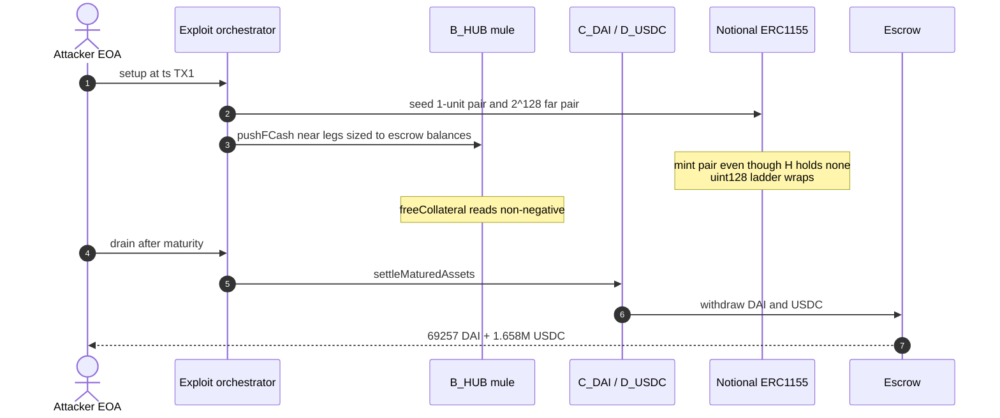
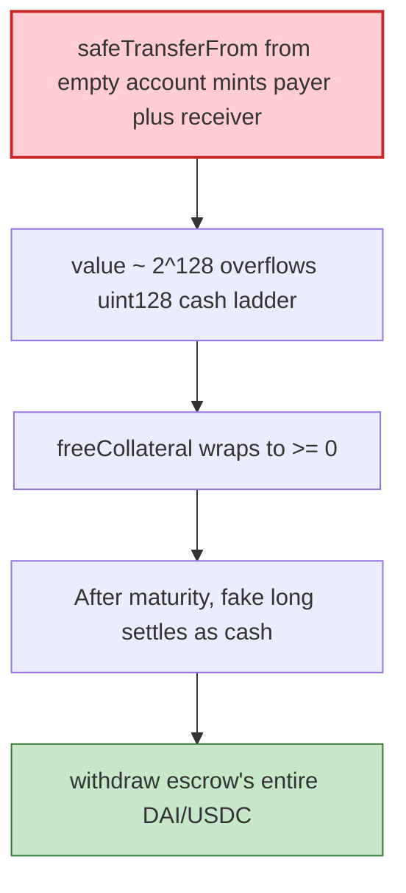

# Notional V1 escrow — unbacked fCash mint overflows uint128 ladders and settles as cash

> **Vulnerability classes:** vuln/arithmetic/overflow · vuln/logic/missing-validation · vuln/input-validation/missing

> **Reproduction:** the PoC compiles & runs in an isolated Foundry project at
> [this project folder](.). Full verbose trace: [output.txt](output.txt).
> Source test: [test/NotionalFinance_exp.sol](test/NotionalFinance_exp.sol).

---

## Key info

| | |
|---|---|
| **Loss** | **$1.727M** — **69,257.372677950923155658 DAI** + **1,658,524.864122 USDC** (exact) [output.txt](output.txt) |
| **Vulnerable contracts** | ERC-1155 trade proxy [`0xBbA89957…f08`](https://etherscan.io/address/0xBbA899578bd3fA3DAa863A340f5600797993eF08) · Portfolios [`0x0A472111…920`](https://etherscan.io/address/0x0A4721117040ABF319b954aBF13F654505C34920) · Escrow [`0x9abd0b88…683`](https://etherscan.io/address/0x9abd0b8868546105F6F48298eaDC1D9c82f7f683) |
| **Attacker EOA** | [`0xDaCC235a494750193695A111D715c2ca12b5Ce38`](https://etherscan.io/address/0xDaCC235a494750193695A111D715c2ca12b5Ce38) |
| **Attack txs** | TX1 [`0xe1589a19…d60a`](https://etherscan.io/tx/0xe1589a19fe742f0d553889214abade69551fe944acffac014c28cc07b325d60a) (block **25,900,220**) mints overflowed fCash. TX2 [`0xc3f3e318…4efa`](https://etherscan.io/tx/0xc3f3e318f7ab2d0daaba59e6ec901d25d1fe8a89aafe2b2b62e3b9aee1a24efa) (block **25,900,234**) settles + withdraws |
| **Chain / block / date** | Ethereum / fork **25,900,219** / 2026-09-03 |
| **Bug class** | `safeTransferFrom` of fCash from an account that does not hold it still **mints a payer/receiver pair**. A ~2^128 short overflows the escrow's **uint128** cash ladder so the unbacked long settles at maturity as a real, withdrawable claim sized to the escrow's entire live balance |

---

## TL;DR

Notional V1 books an ERC-1155 fCash transfer as a **minted pair**: a CASH_PAYER (debt / short, assetType 2) on `from` and a CASH_RECEIVER (claim / long, assetType 3) on `to` — **even when `from` never held the token**. Escrow nets each account's fCash in **uint128** cash ladders.

Minting a short of value **~2^128** overflows that ladder. The offsetting long on a helper account is then a real cash claim. After the near-market maturity (`ts 1788480000`, ~73s after TX1), `Portfolios.settleMaturedAssets` + `Escrow.withdraw` pull the escrow's **entire** DAI and USDC balances.

Two permissionless txs from the attacker EOA. Four helper contracts (A1 seed counterparty, B_HUB mule, C_DAI / D_USDC claim holders) keep per-account ladders separate. Overflow-triggering sizes are the escrow's own live balances.

---

## Background

Notional V1 (this is the legacy ERC-1155 / Portfolios / Escrow stack; CertiK labeled the mint path `mintfCashPair`). fCash is a dated cashflow token. Transfers that the protocol treats as **pair mints** (not moving an existing position) must be collateralized. Here they are not: `safeTransferFrom` from an empty account still creates both legs.

Cash ladders are `uint128`. A short of `type(uint128).max` wraps the net to a **non-negative** free-collateral reading — the mule looks over-collateralized instead of deep in debt, so protocol checks pass.

---

## The vulnerable code

Public surface the PoC calls (verified Notional V1):

```solidity
// IERC1155Trade
function safeTransferFrom(address from, address to, uint256 id, uint256 value, bytes calldata data) external;
function encodeAssetId(uint8 assetType, uint16 instrumentGroupId, uint32 maturity, bytes1 tradeType) external view returns (uint256);

// IPortfolios
function settleMaturedAssets(address account) external;
function freeCollateralViewAggregateOnly(address account) external view returns (int256);

// IEscrow
function withdraw(address token, uint128 amount) external;
```

The mint-from-empty-`from` path is the bug: Notional creates CASH_PAYER on `from` and CASH_RECEIVER on `to` regardless of prior holdings. Netting `value ≈ 2^128 - 1` through a uint128 ladder wraps.

CertiK's public note matches: `mintfCashPair(1)` rounds a −1 liability to 0 in DAI→ETH free collateral; `mintfCashPair(2^256-1)` truncates −2^128 via `uint128(abs())`.

---

## Root cause

1. **Unbacked pair mint** via ERC-1155 transfer from an account that does not hold the id.
2. **uint128 cash ladder** cannot represent a 2^128-scale short; wrap makes free-collateral non-negative.
3. **Maturity settlement treats the wrapped long as cash**, withdrawable up to the escrow's real ERC-20 balance.
4. **No identity / occupancy check** tying a receiver claim to a solvent payer.

---

## Preconditions

- Escrow still holds DAI + USDC (69,257 DAI and 1,658,524 USDC at the fork).
- An active cash-market maturity that falls inside a short window (near market matures at 1788480000; TX1 at 1788479927, TX2 at 1788480095).
- Ability to deploy four helper accounts so ladders stay separate.

---

## Attack walkthrough

TX1 (`setup`, warp 1_788_479_927):

1. Deploy helpers A1, B_HUB, C_DAI, D_USDC; wire `setApprovalForAll`.
2. Read active maturities; size drains to `DAI.balanceOf(escrow)` / `USDC.balanceOf(escrow)`.
3. Seed: 1-unit payer near (this → A1); `OVERFLOW_SEED = 2^128-1` payer far (this → B_HUB). Orchestrator still free-collateral 0.
4. B_HUB `pushFCash` of escrow-sized **payer near** to C_DAI and **receiver near** to D_USDC. B_HUB holds no near fCash — pair is minted anyway; uint128 wraps. B_HUB free-collateral ≥ 0.

TX2 (`drain`, warp 1_788_480_095):

5. C_DAI / D_USDC `settleMaturedAssets` then `escrow.withdraw` the full remaining DAI / USDC to the attacker EOA.

```
attacker DAI gain:  69257.372677950923155658
attacker USDC gain: 1658524.864122
[PASS] testExploit()
```

Wei-exact vs the incident.

---

## Diagrams





---

## Remediation

1. **Do not mint a payer/receiver pair unless `from` already holds the id** (or post explicit collateral that covers the short).
2. **Use int256 (or checked uint256) for cash ladders**; revert on overflow instead of wrapping.
3. **`uint128(abs())` / rounding in free-collateral must not map a huge short to 0.**
4. Cap a single mint against escrow inventory and against a max notional.

---

## How to reproduce

```bash
_shared/run_poc.sh 2026-09-NotionalFinance_exp --mt testExploit -vvvvv
```

Expected: `[PASS] testExploit()` with DAI/USDC gains matching the stolen constants to the wei.

---

*Reference: https://x.com/CertiKAlert/status/2095797115788443893*


## References

- https://x.com/PeckShieldAlert/status/2095678080241303915 (@PeckShieldAlert secondary analysis)

- https://x.com/CertiKAlert/status/2095797981241094651 (@CertiKAlert secondary analysis)

- https://x.com/GoPlusSecurity/status/2095805166754972012 (@GoPlusSecurity secondary analysis)
