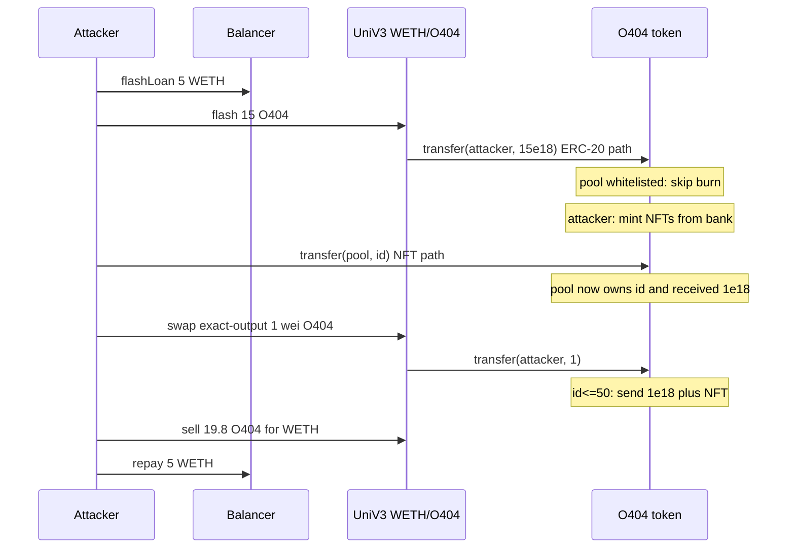
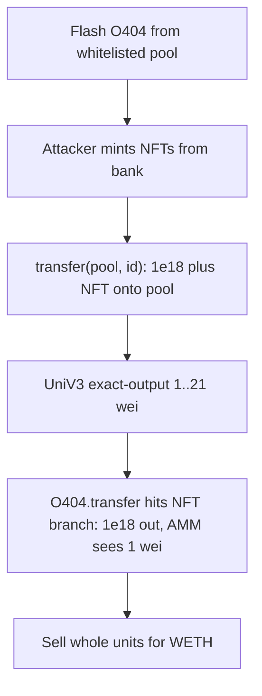

# OMNI404 (O404) — ERC-404 `transfer(id≤50)` + whitelist rounding drain

<!-- non-defihacklabs: Crypto Training original detection & analysis (Twitter hack alerting) -->
<!-- date: 2026-09 -->

> **Vulnerability classes:** vuln/input-validation/wrong-type · vuln/arithmetic/rounding · vuln/logic/incorrect-state-transition · vuln/defi/fee-manipulation

> **Reproduction:** Foundry fork at Ethereum block **25951647** (one before the four-tx drain). Balancer flash of 5 WETH, UniV3 flash of O404 to mint NFTs from the bank, seed ids onto the (whitelisted) pool via `transfer(pool, id)`, then exact-output swaps of **1..21 wei** that deliver **1e18** O404 each. Offline `anvil_state.json` + `_shared/run_poc.sh` **[PASS]** (~**1.342 WETH**). Alerts: [SlowMist](https://x.com/SlowMist_Team/status/2098300936720695573) · [ExVul](https://x.com/exvulsec/status/2098273797753405607).

---

## Key info

| | |
|---|---|
| **Loss** | **~2.4–3.02 WETH**. Main tx **+2.427 WETH**; three `drain()` follow-ups in the same block. Teaching PoC **1.342 WETH** ([output.txt](output.txt)) |
| **Chain** | Ethereum (chainId **1**) |
| **Protocol** | OMNI404 / O404 (ERC-404 + LayerZero OFT) |
| **Date** | 2026-09-11 04:04 UTC |
| **Attacker EOA** | [`0xFB26db4EAb18Cb50d29Ff431888dD643A7e9C9f8`](https://etherscan.io/address/0xfb26db4eab18cb50d29ff431888dd643a7e9c9f8) |
| **Attack contract** | [`0x505B2EBea0EC6e30D02768f1de8DdE8Dd9122aD4`](https://etherscan.io/address/0x505b2ebea0ec6e30d02768f1de8dde8dd9122ad4) (`run()` / `drain()`) |
| **Vulnerable token** | [`0xd5C02bB3e40494D4674778306Da43a56138A383E`](https://etherscan.io/address/0xd5c02bb3e40494d4674778306da43a56138a383e#code) `OMNI404` / `O404` |
| **Victim pool** | UniV3 WETH/O404 1% [`0xB3f613b9Bc84ddB29D78fA4685b01d98412BBa0b`](https://etherscan.io/address/0xb3f613b9bc84ddb29d78fa4685b01d98412bba0b) |
| **Flash lender** | Balancer Vault [`0xBA12222222228d8Ba445958a75a0704d566BF2C8`](https://etherscan.io/address/0xba12222222228d8ba445958a75a0704d566bf2c8) |
| **Main attack tx** | [`0x4cbc3d8db832eb5442ce1c11d79fda05cafabfe7906933ed25881d60bf41d6f3`](https://etherscan.io/tx/0x4cbc3d8db832eb5442ce1c11d79fda05cafabfe7906933ed25881d60bf41d6f3) @ **25951648** |
| **Follow-ups** | `0x8fb27ec5…` · `0xaf873efb…` · `0xc38dd1a7…` (same block, `drain()`) |
| **Compiler** | Solidity **v0.8.23+commit.f704f362** (paris, optimizer 1000) |
| **Bug class** | **Overloaded `transfer(to, valueOrId)`** treats `valueOrId ≤ 50` as an NFT id **and** moves `1e18` ERC-20. UniV3 exact-output of 1..21 wei therefore delivers a whole unit. Coupled with **whitelist skip** of mint/burn on the pool, buy/sell leaks rounding into the NFT bank |

---

## TL;DR

O404 is an ERC-404: one contract, ERC-20 balances in `1e18` units and up to **50** ERC-721 ids. `transfer(to, valueOrId)` **guesses intent** from the magnitude of the second argument:

- `1 ≤ valueOrId ≤ 50` → treat as **token id**, transfer that NFT **and `units` (1e18) ERC-20**.
- otherwise → treat as an ERC-20 amount and run `_transfer` (floor-based mint/burn).

Uniswap V3 pays token-out with `token.transfer(recipient, amount)`. Exact-output swaps of **1, 2, …, 21 wei** therefore hit the NFT branch. If the pool owns that id (the attacker first flashes O404, mints NFTs from the bank because the pool is **whitelisted**, then `transfer(pool, id)` seeds the id + 1e18 onto the pool), the pool sends **1e18 O404 + the NFT** while the AMM accounts **i wei** and charges dust WETH.

The attacker then sells the whole units into the still-high AMM and extracts WETH. ExVul: pool O404 **21.0349** unchanged in ERC-20 terms after a full cycle, **+3.02 WETH** stolen, NFT bank **15 → 21**. SlowMist: same `transfer(id≤50)` / 1e18 confusion.

---

## Background

`maxTotalSupplyERC721 = 50`, `units = 1e18`. The UniV3 pool is `whitelist[pool] = true` so `_transfer` **skips** mint/burn on the pool side (gas "optimisation" for pairs). NFTs live in a bank queue (`_storedERC721Ids`) on the token contract itself — pre-attack `ownerOf(1..15) == O404`.

---

## The vulnerable code

### 1. `transfer` overload (SlowMist)

`sources/OMNI404_d5c02b/src_O404.sol`:

```solidity
function transfer(address to_, uint256 valueOrId_) public virtual returns (bool) {
    if (to_ == address(0)) revert InvalidRecipient();

    if (valueOrId_ <= maxTotalSupplyERC721) {
        uint256 id = valueOrId_;
        if (msg.sender != _ownerOf[id]) revert Unauthorized();
        _transferERC20(msg.sender, to_, units); // always 1e18
        _transferERC721(msg.sender, to_, id);
    } else {
        _transfer(msg.sender, to_, valueOrId_);
    }
    return true;
}
```

UniV3 `TransferHelper.safeTransfer(token1, recipient, uint256(-amount1))` with `amount1 = 1..21` is exactly this branch.

### 2. Whitelist skips mint/burn (ExVul)

```solidity
function _transfer(address from, address to, uint256 amount) internal returns (bool) {
    uint256 erc20BalanceOfSenderBefore = erc20BalanceOf(from);
    uint256 erc20BalanceOfReceiverBefore = erc20BalanceOf(to);
    _transferERC20(from, to, amount);

    if (!whitelist[from]) {
        uint256 num721ToBurn = (erc20BalanceOfSenderBefore / units) - (balanceOf[from] / units);
        for (uint256 i = 0; i < num721ToBurn; i++) _burnERC721(from);
    }
    if (!whitelist[to]) {
        uint256 num721ToMint = (balanceOf[to] / units) - (erc20BalanceOfReceiverBefore / units);
        for (uint256 i = 0; i < num721ToMint; i++) _mintERC721(to);
    }
    return true;
}
```

A flash of N whole O404 from the pool (whitelist) **mints N NFTs to the attacker** and does **not** burn on the pool. Those ids can then be parked on the pool with `transfer(pool, id)` (NFT path — whitelist is irrelevant here).

---

## Root cause

1. **One `uint256` for two types.** Amount vs id is inferred from `≤ 50`, not from `msg.sig` / a dedicated `transferFromNFT`.
2. **NFT path always moves `units`.** A 1-wei AMM transfer becomes a 1e18 ERC-20 transfer.
3. **Whitelist asymmetry.** Pool skips mint/burn; the attacker does not. Flashing ERC-20 from the pool mints bank NFTs the attacker can seed back.
4. **UniV3 does not re-read `balanceOf` for the swapped amount.** It trusts the `transfer` it issued. Extra 1e18 leaving the pool is invisible to tick math until the next real swap.

---

## Preconditions

- Pool is whitelisted; attacker is not.
- Bank holds ids (or `minted` can increase up to 50).
- UniV3 pool has WETH (pre-attack **3.295 WETH**, **21.035 O404**).
- Balancer has WETH to flash (fee 0).

---

## Attack walkthrough

Block **25951648**, four txs (deploy · `run()` +2.427 · `drain()` ×3):

1. Flash **5 WETH** from Balancer.
2. Buy **0.2 O404**, then flash **~15–21 O404** from the pool. Pool skip-burn; attacker mints NFTs from the bank.
3. `transfer(pool, id)` for each owned id — parks the NFT **and 1e18** on the pool (returns flash principal). UniV3 is **locked** (`LOK`) during flash, so no swaps yet.
4. After flash returns: exact-output **1..21 wei** O404. Each successful call delivers **1e18** (NFT path) for dust WETH.
5. Sell **~19.8 O404** for WETH. Repeat `drain()`.
6. Repay Balancer; unwrap. **+3.018 ETH** across the block.

Teaching PoC (one `attack()`): **1.342 WETH** to the attacker EOA; pool WETH **3.295 → 1.953**; `minted` **15 → 16**.

---

## Diagrams





---

## Remediation

- **Split ERC-20 and ERC-721 entrypoints.** `transfer(address,uint256)` must be ERC-20 only. Use `transferFrom(address,address,uint256)` / `safeTransferFrom` for ids, and never infer type from `value <= maxSupply`.
- If a combined function remains, treat `valueOrId <= maxTotalSupplyERC721` as NFT **only when `ownerOf` matches and the caller requested an NFT**, and **do not** move `units` of ERC-20 on that path unless the caller also holds those units as a native NFT sale.
- **Do not whitelist the UniV3 pool** (or any AMM) unless mint/burn is conserved some other way (DN-404-style skip amounts, or a dedicated pair hook).
- AMMs integrating ERC-404 should use `transferFrom` with amounts **always > max id**, or a wrapper that only exposes ERC-20.

---

## How to reproduce

```bash
cd audits/evm-hack-registry
_shared/run_poc.sh 2026-09-OMNI404Erc404Rounding_exp -vvvvv
# expect [PASS] testExploit — ~1.342 WETH to the attacker EOA
```

Fork: Ethereum **25951647**. Online: `https://eth.drpc.org`.

---

*Reference: https://x.com/SlowMist_Team/status/2098300936720695573 · https://x.com/exvulsec/status/2098273797753405607*
