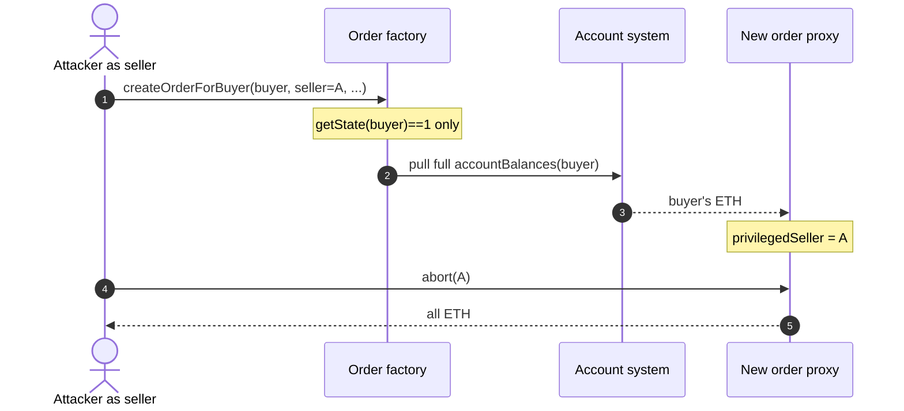
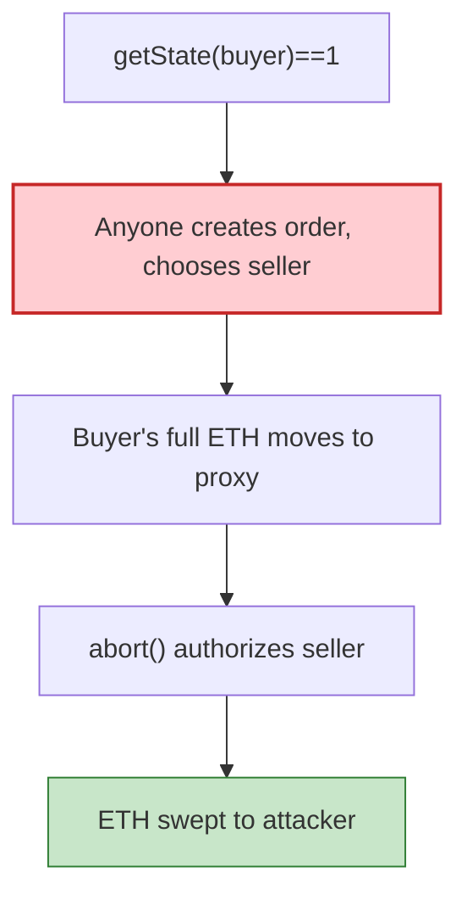

# Order factory — permissionless `createOrderForBuyer` sets attacker as seller and `abort`s the buyer's ETH

> **Vulnerability classes:** vuln/access-control/missing-auth · vuln/access-control/missing-signer · vuln/logic/missing-check

> **Reproduction:** the PoC compiles & runs in an isolated Foundry project at
> [this project folder](.). Full verbose trace: [output.txt](output.txt).
> Source test: [test/OrderFactory_exp.sol](test/OrderFactory_exp.sol).

---

## Key info

| | |
|---|---|
| **Loss** | Incident ~**24.7 ETH**. This tx: **20.247 ETH** from 5 buyers (10.05 + 5.05 + 3.05 + 1.547 + 0.55) [output.txt](output.txt) |
| **Vulnerable contract** | Order factory (unverified) [`0xa27BCD590195b2A9BDc29379De4F040b2D8066e0`](https://etherscan.io/address/0xa27BCD590195b2A9BDc29379De4F040b2D8066e0) |
| **Account system** | [`0xFcF3d97c6Db4C3bF6020a2b99af074B595bDA163`](https://etherscan.io/address/0xFcF3d97c6Db4C3bF6020a2b99af074B595bDA163) (holds buyer ETH) |
| **Order deployer** | [`0xDd3068d772764443E4c4B18B8c96AeE153D83056`](https://etherscan.io/address/0xDd3068d772764443E4c4B18B8c96AeE153D83056) (CREATE of each order proxy) |
| **Attacker** | [`0x77071d2bbd8f3c296c8cd7d0abd21bc172420cda`](https://etherscan.io/address/0x77071d2bbd8f3c296c8cd7d0abd21bc172420cda) via helper [`0xde26cf7c…`](https://etherscan.io/address/0xde26cf7c) |
| **Attack tx** | [`0x201c7a9b4114c76fcda2b5de5d765505f4c5f7c194dddf505043501de6cbbb1a`](https://etherscan.io/tx/0x201c7a9b4114c76fcda2b5de5d765505f4c5f7c194dddf505043501de6cbbb1a) (block **25,933,639**) |
| **Chain / block / date** | Ethereum / fork **25,933,638** / 2026-09-09 |
| **Bug class** | Factory creates an order *for* an arbitrary buyer with only `getState(buyer)==1`; attacker-supplied `seller` is written to the privileged slot; `abort(to)` sweeps the buyer's pulled ETH |

---

## TL;DR

The factory's order-creation entry (`selector 0xbde886fc`, name unknown — factory unverified) lets **any caller** create an order "for" a buyer. It checks `getState(buyer) == 1` (active request) and **does not** check `msg.sender == buyer`, take a buyer signature/nonce, or validate the attacker-supplied `seller`.

The factory then:

1. Pulls the buyer's **full** ETH balance out of the Account System into a freshly CREATE'd order proxy.
2. Writes the attacker-chosen `seller` into the order's privileged slot.

The attacker (as that seller) calls `order.abort(attacker)`. Authorization is against the seller slot, so it passes and forwards **all** of the proxy's ETH.

One tx, five buyers, **20.247 ETH**. Matching the rest of the ~24.7 ETH incident (other txs) is unnecessary for the bug.

---

## Background

This looks like an OTC / structured-order product: buyers lock a request (`getState==1`) and an amount in an Account System; a factory materializes an order proxy when matched with a seller. The security assumption is that **only the buyer** (or a signed quote) can bind a seller. The implementation binds whatever `seller` the *caller* passes.

`abort(address)=0x90cbfa19`, `getState=0x1bab58f5`, `accountBalances=0x6ff96d17` match keccak of those names. `createOrderForBuyer`'s 9-arg tuple was recovered from the trace and re-encoded byte-for-byte.

---

## The vulnerable code

RECONSTRUCTED (factory unverified):

```solidity
// selector 0xbde886fc — any caller
function createOrderForBuyer(
    address buyer,
    address seller,          // attacker-controlled
    address p2,
    uint256 zero,
    address extra,
    bytes32[] symbols,
    uint256[] prices,
    uint256[] params,        // params[0] must match the buyer's stored request amount
    uint256 zero2
) external {
    require(getState(buyer) == 1); // ONLY GATE
    // pull accountBalances(buyer) ETH into new order proxy (CREATE from deployer)
    // order.privilegedSeller = seller;
}

function abort(address to) external {
    require(msg.sender == privilegedSeller);
    payable(to).transfer(address(this).balance);
}
```

---

## Root cause


## Secondary analysis (@TenArmorAlert)

> Missing auth on createOrderForBuyer: any caller binds attacker as seller and abort() drains buyer ETH

Source: https://x.com/TenArmorAlert/status/2097501179521732792


1. **Missing buyer authorization** on order creation (no `msg.sender==buyer`, no signature).
2. **Attacker-chosen seller** becomes the privileged principal.
3. **Full account balance** is moved, not merely `params[0]`.
4. **`abort` is a sweep** to an arbitrary `to`, not a return-to-buyer.

---

## Preconditions

- Targeted buyers have `getState==1` and a non-zero `accountBalances`.
- Attacker knows `params[0]` per buyer (public in the stored request / previous txs). Other order-config args are identical across buyers (taken from the live tx).
- Order proxy address is `CREATE(deployer, nonce)` — predictable.

---

## Attack walkthrough

Buyers and amounts from the live tx:

| Buyer | ETH pulled |
|---|---:|
| `0x448F48d9…8753` | 10.05 |
| `0x8F7dB812…4836` | 5.05 |
| `0x5C8D3b20…17D1` | 3.05 |
| `0x9D8f6E98…6729` | 1.547 |
| `0x3eD7571B…145D` | 0.55 |
| **Total** | **20.247** |

For each: predict `computeCreateAddress(DEPLOYER, nonce)`, `createForBuyer(buyer, orderAmount)`, `abort(exploit)`.

```
total ETH drained: 20.247000000000000000
[PASS] testExploit()
```

---

## Diagrams





---

## Remediation

1. **Require `msg.sender == buyer` or a buyer EIP-712 signature** (nonce + seller + amount) to create.
2. **Do not take `seller` from the caller** unless the buyer signed that seller.
3. **Pull `params[0]`, not `accountBalances(buyer)`.**
4. **`abort` should return ETH to the buyer**, not to `msg.sender`'s chosen `to`.
5. Pause the factory; buyers should revoke / withdraw remaining account balances.

---

## How to reproduce

```bash
_shared/run_poc.sh 2026-09-OrderFactory_exp --mt testExploit -vvvvv
```

Expected: `[PASS] testExploit()` with `total ETH drained: 20.247`.

---

*Reference: https://etherscan.io/tx/0x201c7a9b4114c76fcda2b5de5d765505f4c5f7c194dddf505043501de6cbbb1a*


## References

- https://x.com/TenArmorAlert/status/2097501179521732792 (@TenArmorAlert secondary analysis)
