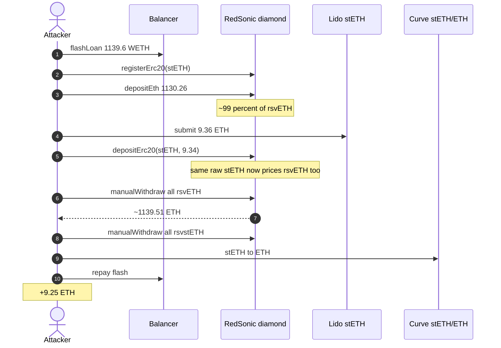
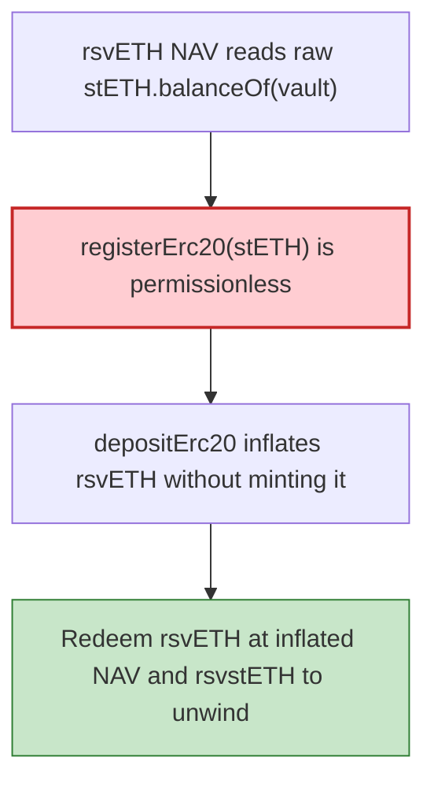

# Reddio RedSonic Vault — permissionless `registerErc20(stETH)` double-counts one balance

> **Vulnerability classes:** vuln/logic/price-calculation · vuln/access-control/missing-auth · vuln/logic/missing-check

> **Reproduction:** the PoC compiles & runs in an isolated Foundry project at
> [this project folder](.). Full verbose trace: [output.txt](output.txt).
> Source test: [test/Reddio_exp.sol](test/Reddio_exp.sol).

---

## Key info

| | |
|---|---|
| **Loss** | **9.253090281137114614 ETH** (~$23K; reported ~9.25 ETH) [output.txt](output.txt) |
| **Vulnerable contract** | RedSonic Vault diamond [`0x4315990D9eeAFFdFAfD49958b4851F203FA1126f`](https://etherscan.io/address/0x4315990D9eeAFFdFAfD49958b4851F203FA1126f) |
| **Pricing facet** | InvestmentManagerFacet [`0x47F018dc…98De`](https://etherscan.io/address/0x47F018dc00307cd48Fd71d489d92e550646598De) (verified `getTotalAssetBalance` / `getRemainingBalance`) |
| **Attacker EOA** | [`0x70f2333d21Ed7E7D105F6578227A9A747687982C`](https://etherscan.io/address/0x70f2333d21Ed7E7D105F6578227A9A747687982C) |
| **Attack tx** | [`0xe3cba90e865c6cba950ebce36a52607f51f1fd33cd9fb920c78803f19b57791a`](https://etherscan.io/tx/0xe3cba90e865c6cba950ebce36a52607f51f1fd33cd9fb920c78803f19b57791a) (block **25,912,201**, contract-creation) |
| **Chain / block / date** | Ethereum / fork **25,912,200** / 2026-09-05 |
| **Bug class** | ETH-class share price reads the vault's **raw stETH balance**; `registerErc20(stETH)` is permissionless, so a second share class is backed by the **same** ERC-20 balance |

---

## TL;DR

RedSonic Vault (EIP-2535 diamond) prices rsvETH from `getTotalAssetBalance`, which for the Lido leg is `IERC20(stETH).balanceOf(vault)` — **no per-share-class accounting**. `registerErc20(address)` is **permissionless** (attacker contract, not owner, calls it in the trace).

Registering stETH creates rsvstETH backed by that same raw balance. Flow in one Balancer flash of **1,139.6159 WETH**:

1. Unwrap; `registerErc20(stETH)`.
2. `depositEth{value: 1,130.2592 ETH}` — buy ~99% of rsvETH at the pre-inflation price.
3. Lido `submit` ~9.3566 ETH → stETH; `depositErc20(stETH, ~9.3366)` — inflates rsvETH's share price **without minting rsvETH**.
4. `manualWithdraw(rsvETH, all)` — redeem at the inflated rate (~1,139.51 ETH).
5. `manualWithdraw(rsvstETH, all)` — recover the deposited stETH.
6. Curve stETH→ETH; repay Balancer; leftover **~9.25 ETH** to the EOA.

Deposit/redeem/register facet `0x92ecC5DE…` is **unverified**; names are 4-byte-directory matches for selectors in the trace (`registerErc20=0xa4a3c9ef`, `depositEth=0x439370b1`, `depositErc20=0x6548b40d`, `manualWithdraw=0x735fd189`).

---

## Background

A diamond vault with an ETH share class (rsvETH) that is internally backed in part by Lido stETH. Pricing getters on the verified InvestmentManagerFacet:

- `getTotalAssetBalance(asset)` — sum of provider legs + `getRemainingBalance(asset)`.
- `getRemainingBalance` for a non-native asset is `IERC20(asset).balanceOf(vault)`.

Nothing tracks "this many stETH wei belong to the ETH class vs the stETH class."

---

## The vulnerable code

Verified pricing (InvestmentManagerFacet):

```solidity
function getRemainingBalance(address asset) public view returns (uint256) {
    if (asset == address(0) /* native */) { /* ... */ }
    return IERC20(asset).balanceOf(address(this)); // RAW vault balance
}
```

Permissionless registration (unverified facet; selector `0xa4a3c9ef`):

```solidity
function registerErc20(address erc20) external; // no onlyOwner in the trace
```

Once stETH is a second tracked asset, `depositErc20(stETH, x)` credits rsvstETH **and** increases the raw stETH balance the ETH class already prices off.

---

## Root cause

**One inventory, two liabilities.** Permissionless listing of an asset that the ETH class already counts as backing is an inflation vector: deposit under class B, redeem class A at the new NAV, redeem class B to unwind the deposit.

---

## Preconditions

- `vTokenFromErc20(stETH) == 0` (or the attacker can still deposit into the existing class — the PoC registers if missing).
- Enough ETH-class TVL that owning ~99% of rsvETH captures the inflated NAV.
- Balancer WETH flash (~1,139.6 WETH) + Curve stETH/ETH exit.

---

## Attack walkthrough

Constants from the trace ([test/Reddio_exp.sol](test/Reddio_exp.sol)):

| Constant | Wei |
|---|---|
| FLASH_WETH | 1,139.615952950658009506 |
| DEPOSIT_ETH | 1,130.259297504314263299 |
| STETH_SUBMIT | 9.356655446343746207 |
| STETH_DEPOSIT | 9.336655446343746204 |

```
attacker net gain (ETH): 9.253090281137114614
[PASS] testExploit()
```

(On-chain the EOA also paid gas; the harness does not charge the pranked EOA.)

---

## Diagrams





---

## Remediation

1. **`registerErc20` must be `onlyOwner`** (or a governed listing with an asset-that-is-already-backing-ETH-class check).
2. **Per-share-class accounting.** stETH held for the ETH class must not sit in the same `balanceOf(vault)` bucket that a second ERC-20 class prices off — use a per-asset internal ledger.
3. **Haircut / virtual offset** so a donation or same-asset deposit cannot move rsvETH NAV by more than X% in one block.
4. Snapshot total assets before listing a new ERC-20.

---

## How to reproduce

```bash
_shared/run_poc.sh 2026-09-Reddio_exp --mt testExploit -vvvvv
```

Expected: `[PASS] testExploit()` with ~9.25 ETH gain.

---

*Reference: https://x.com/exvulsec/status/2096277307757572517*
