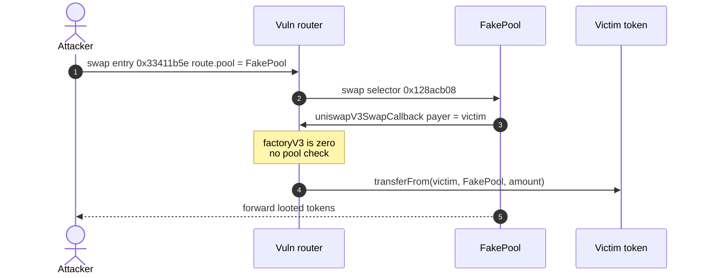
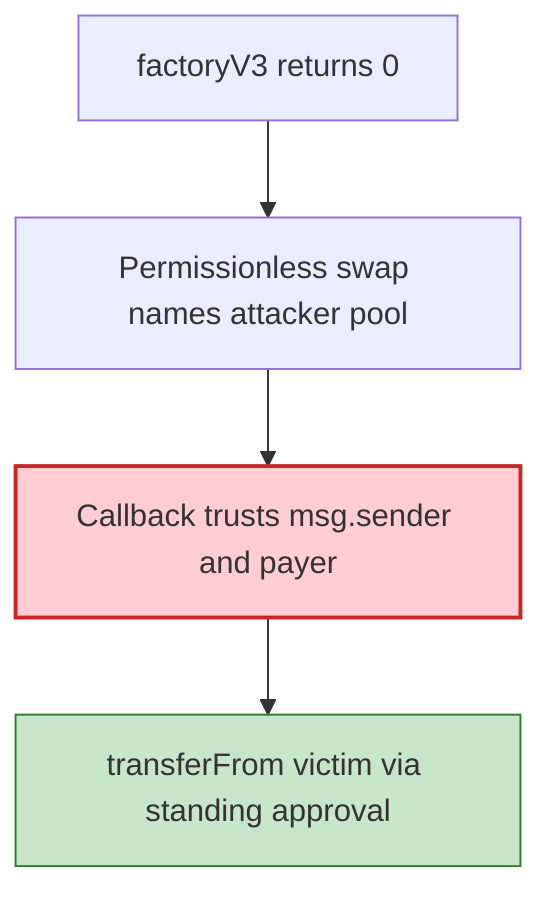

# DEX router drain — unverified V3 callback trusts a fake pool and `transferFrom`s any approver

> **Vulnerability classes:** vuln/access-control/missing-auth · vuln/input-validation/missing · vuln/logic/missing-check

> **Reproduction:** the PoC compiles & runs in an isolated Foundry project at
> [this project folder](.). Full verbose trace: [output.txt](output.txt).
> Source test: [test/RouterDrain_exp.sol](test/RouterDrain_exp.sol).

---

## Key info

| | |
|---|---|
| **Loss** | Incident **~62.28 WBNB** from **29** victims. This PoC drains a **representative 3** (OCEAN, Kandura, SATURN) in full [output.txt](output.txt) |
| **Vulnerable contract** | Router proxy [`0xa331fde028e6F17425AB9333c39ae43722340d24`](https://bscscan.com/address/0xa331fde028e6F17425AB9333c39ae43722340d24) → impl `0x241f743e…` (**unverified**) |
| **Attacker** | [`0xB929C7215c0ec8EbAD5fBf73b1Da63bccfFf1896`](https://bscscan.com/address/0xB929C7215c0ec8EbAD5fBf73b1Da63bccfFf1896) |
| **Attack tx** | [`0x40eb22369da422a8275d5679054aa3a8c8906d93abc0bac3a3f2cad879389319`](https://bscscan.com/tx/0x40eb22369da422a8275d5679054aa3a8c8906d93abc0bac3a3f2cad879389319) (block **120,524,634**) |
| **Chain / block / date** | BNB Chain / fork **120,524,633** / 2026-09-07 |
| **Bug class** | `factoryV3() == 0`; swap entry `0x33411b5e` calls attacker-chosen `pool.swap` with no factory check; `uniswapV3SwapCallback` `transferFrom`s a callback-supplied `payer` |

---

## TL;DR

The router exposes a permissionless swap entry (`selector 0x33411b5e`). Routes carry an attacker-chosen `pool`. The router calls `pool.swap(0x128acb08)` **without** checking that `pool` is factory-derived. `factoryV3()` is the **zero address**, so no legitimate pool address could even be recomputed.

A fake contract that only implements `swap()` re-enters `router.uniswapV3SwapCallback(int256,int256,bytes)=0xfa461e33`. The callback decodes a `payer` from the echoed `data` and does `transferFrom(payer, msg.sender, amount)` — binding **neither** `msg.sender` to a real pool **nor** `payer` to the original swap initiator. The fake pool names the **victim** as payer. Anyone who ever approved the router is drainable.

This PoC models three victims (standing max approval granted via `prank`), seeds a tiny balance so the router's `balanceOf(recipient) >= amountIn` gate passes, and loops until each victim is empty. Original tx bootstrapped with a 1 WBNB PancakeV2 flash-swap and dumped loot to WBNB; those are monetisation, omitted here.

---

## Background

Aggregator routers that speak Uniswap V3 typically:

1. Verify `msg.sender` of the callback is `Factory.getPool(tokenA, tokenB, fee)` (or a cached allowlist).
2. Pull tokens from the **swap initiator**, not from an arbitrary `payer` in callback data.

This router does neither, and ships with `factoryV3 == 0x0`.

---

## The vulnerable code

RECONSTRUCTED from the trace (router unverified). Confirmed on-chain: `factoryV3()` returns `address(0)` at the fork.

```solidity
function factoryV3() external view returns (address); // == 0

// selector 0x33411b5e — permissionless
// Route { kind, tokenIn, tokenOut, pool, fee, a, b, data }
// router calls pool.swap(...) with no factory check

function uniswapV3SwapCallback(int256 amount0Delta, int256 amount1Delta, bytes calldata data) external {
    PayInfo memory info = abi.decode(data, (PayInfo)); // {path, payer, recipient, amount}
    // NO: require(msg.sender == Factory.getPool(...))
    // NO: require(info.payer == originalInitiator)
    IERC20(tokenIn).transferFrom(info.payer, msg.sender, info.amount);
}
```

---

## Root cause

1. **Zero factory** → callback cannot authenticate a pool.
2. **Attacker-chosen pool** in the route.
3. **Callback-supplied payer** replaces the initiator.
4. **Standing user approvals** to the router are a hot wallet for this path.

No price manipulation, no oracle, no privilege.

---

## Preconditions

- Victim holds a token balance and has `approve(router, max)` (or any remaining allowance).
- Attacker holds a seed of that token (real tx: flash-swap ~1 WBNB into the token) because the router **gates** on `balanceOf(recipient) >= amountIn` without spending the recipient's tokens.

---

## Attack walkthrough

Victims in this PoC (full balances stolen):

| Victim | Token | Drained (raw) |
|---|---|---|
| `0x75EE8381…8e05` | OCEAN `0xb81139F4…6666` | 463712630900287455799 |
| `0xE32D7274…BA5C` | Kandura `0xeC98fbAA…7777` | 4136465745046839277137256 |
| `0x50782465…7777` | SATURN `0xF23E4A84…7777` | 29910904943654694204808 |

Loop: `amountIn = min(victimBal, attackerHoldings)` (doubles each iteration until empty).

```
[PASS] testExploit()
```

Each victim's token balance is 0; attacker FakePool/orchestrator holds the stolen amount minus the dealt seed.

---

## Diagrams





---

## Remediation

1. **Set `factoryV3` to the real Pancake/Uni V3 factory** and `require(msg.sender == factory.getPool(token0, token1, fee))` in the callback.
2. **Ignore callback `payer`.** Always pull from the original swap initiator (or a permit the initiator signed).
3. **Allowlist pools**; never take `pool` from user calldata without verification.
4. Users: **revoke approvals** to `0xa331fde0…0d24`.

---

## How to reproduce

```bash
_shared/run_poc.sh 2026-09-RouterDrain_exp --mt testExploit -vvvvv
```

Fork is BSC (`127.0.0.1:8546`). Expected: `[PASS] testExploit()` with each of the three victims fully drained.

---

*Reference: https://x.com/exvulsec/status/2097004102240842230*


## References

- https://x.com/SlowMist_Team/status/2097153762746159228 (@SlowMist_Team secondary analysis)
