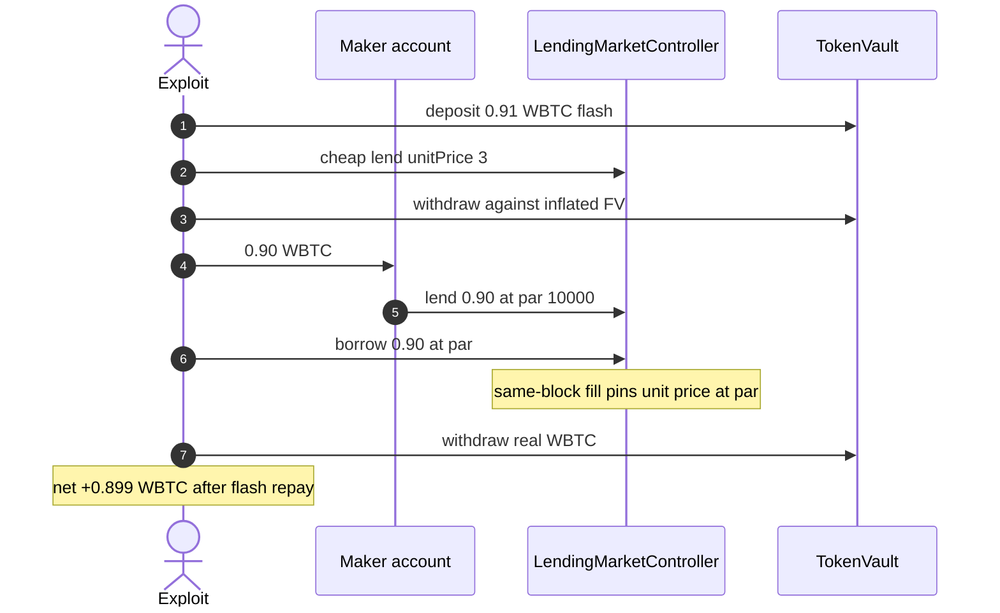
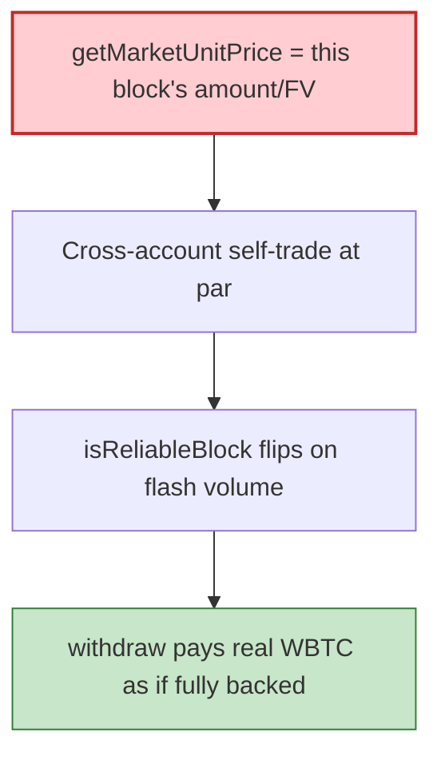

# Secured.Fi — same-block self-trade pins `getMarketUnitPrice` at par and drains WBTC

> **Vulnerability classes:** vuln/oracle/price-manipulation · vuln/logic/price-calculation · vuln/oracle/missing-circuit-breaker

> **Reproduction:** the PoC compiles & runs in an isolated Foundry project at
> [this project folder](.). Full verbose trace: [output.txt](output.txt).
> Source test: [test/SecuredFi_exp.sol](test/SecuredFi_exp.sol).

---

## Key info

| | |
|---|---|
| **Loss** | Incident ~$104K across bots. This PoC: **0.89899004 WBTC** (~$72K) from TokenVault [output.txt](output.txt) |
| **Vulnerable contract** | `LendingMarketController` [`0x35e9D8e0223A75E51a67aa731127C91Ea0779Fe2`](https://etherscan.io/address/0x35e9D8e0223A75E51a67aa731127C91Ea0779Fe2) (impl / `OrderBookLib.getMarketUnitPrice`) |
| **Victim pool** | TokenVault [`0xB74749b2213916b1dA3b869E41c7c57f1db69393`](https://etherscan.io/address/0xB74749b2213916b1dA3b869E41c7c57f1db69393) |
| **Attacker** | MEV searcher `coffeebabe` [`0xc0ffeebabe…0000`](https://etherscan.io/address/0xc0ffeebabe000000000000000000000000000000) |
| **Attack tx** | [`0xcd6159860783d8d481cc4bf4dceddc88acdca6bb08f6445525b2904cfd75b1da`](https://etherscan.io/tx/0xcd6159860783d8d481cc4bf4dceddc88acdca6bb08f6445525b2904cfd75b1da) (block **25,914,192**) |
| **Chain / block / date** | Ethereum / fork **25,914,191** then `vm.roll(25914192)` / 2026-09 |
| **Bug class** | `getMarketUnitPrice` = same-block `blockTotalAmount / blockTotalFutureValue` with no TWAP. Cross-account self-trade at par (10000) makes a cheap lend look fully-backed; `withdraw` takes real WBTC |

---

## TL;DR

Secured.Fi values lending-order-book collateral from `getMarketUnitPrice()`. Within a block that is:

`unitPrice = blockTotalAmount * 10000 / blockTotalFutureValue`

as soon as `isReliableBlock` (volume ≥ `minimumReliableAmount`, or a fresh market). **No time-weighting.** The collateral path reads it `isReadOnly = true`, so it always takes that same-block ratio.

A **cross-account** self-trade (two attacker contracts so LEND and BORROW do not net out) fills enough volume at **par (10000)** to pin the ratio. A cheaply acquired lend (unitPrice=3, huge future value per principal) is then treated as fully-backed collateral. `TokenVault.withdraw` pays **real WBTC**.

Flash-loan 0.91 WBTC from Balancer (fee 0), repay, keep **0.899 WBTC**. Downstream WETH swap / builder bribe omitted (not the bug). Copycat USDC drains omitted.

---

## Background

Fixed-rate order book: `executeOrder(ccy, maturity, side, amount, unitPrice)` with side 0=LEND, 1=BORROW, `unitPrice` in 1e4 (`10000` = par). TokenVault `deposit`/`withdraw` uses the controller's unit price as the collateral haircut.

One-account LEND+BORROW nets to nothing. Two accounts make a real fill.

---

## The vulnerable code

Verified `OrderBookLib` (from PoC comments):

```solidity
function getMarketUnitPrice(self, isReadOnly) {
    unitPrice = blockUnitPriceHistory[0];
    if ((lastOrderTimestamp != block.timestamp || unitPrice == 0 || isReadOnly) && isReliableBlock)
        unitPrice = blockTotalAmount * 10000 / blockTotalFutureValue; // PRICE_DIGIT
}

// updateBlockUnitPriceHistory: SUMS fills in this block;
// isReliableBlock = true once blockTotalAmount >= minimumReliableAmount
```

Collateral reads `isReadOnly = true` → always the manipulated same-block ratio.

---

## Root cause

1. **Same-block volume-weighted price is attacker-controlled** if the attacker is both sides.
2. **`isReliableBlock` is a volume gate**, not a manipulation bound — flash liquidity clears it.
3. **Withdraw trusts that unit price** as if it were a TWAP.

---

## Preconditions

- Open WBTC book (`bytes32("WBTC")`, maturity 1830211200).
- TokenVault holds ~0.91 WBTC.
- Two attacker accounts; Balancer WBTC flash.

PoC `vm.roll`s to 25,914,192 so per-block totals reset (`lastOrderTimestamp != block.timestamp`).

---

## Attack walkthrough

From [test/SecuredFi_exp.sol](test/SecuredFi_exp.sol) `receiveFlashLoan`:

1. Deposit 0.91 WBTC. Post a **unitPrice=3** lend (huge future value) plus dust orders; withdraw against the inflated valuation.
2. Transfer 0.90 WBTC to `SecuredFiMaker`; maker `depositAndLend(0.90, 10000)`; exploit `BORROW` 0.90 at par — real fill pins `getMarketUnitPrice` at 10000. Withdraw 0.90.
3. Dust orders + `_withdraw(max)` empty the vault's remaining WBTC.
4. Repay Balancer 0.91; keep **0.89899004 WBTC**.

```
TokenVault WBTC after: 0.01271959
attacker WBTC profit:  0.89899004
[PASS] testExploit()
```

---

## Diagrams





---

## Remediation

1. **TWAP / previous-block price** for collateral, never the in-progress block's fill ratio.
2. **Exclude self-matched volume** (same beneficiary / same tx.origin) from `blockTotalAmount`.
3. **Cap unit-price move per block**; revert withdraw if price jumped more than X bps.
4. Value collateral off deposit principal, not off manipulated future-value.

---

## How to reproduce

```bash
_shared/run_poc.sh 2026-09-SecuredFi_exp --mt testExploit -vvvvv
```

Expected: `[PASS] testExploit()` with attacker WBTC profit ≈ 0.899.

---

*Reference: https://x.com/DefimonAlerts/status/2096855557575458950*
