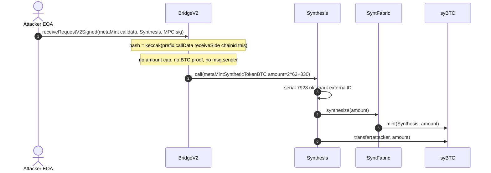
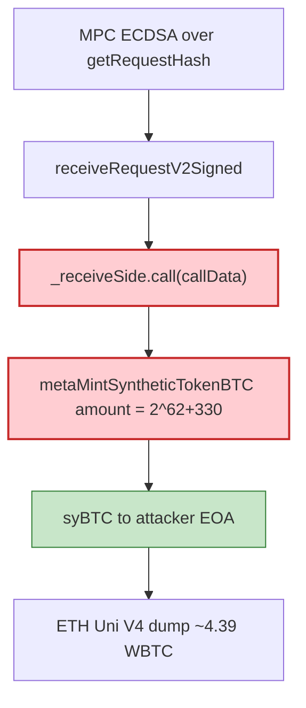

# Symbiosis BridgeV2 — signed receive mints unbounded syBTC (BSC)

<!-- non-defihacklabs: Crypto Training original detection & analysis (Twitter hack alerting) -->

> **Vulnerability classes:** vuln/bridge/missing-validation · vuln/logic/missing-validation · vuln/input-validation/missing · vuln/auth/signature-validation

> **Reproduction:** the PoC compiles & runs in an isolated Foundry project at
> [this project folder](.). Full verbose trace: [output.txt](output.txt).
> Source test: [test/SymbiosisBridgeV2SyBtc_exp.sol](test/SymbiosisBridgeV2SyBtc_exp.sol).
> Verified sources: [BridgeV2.sol](sources/BridgeV2_291a42/contracts_synth-core_bridge_BridgeV2.sol)
> (signed receive + unconstrained transmitter call),
> [Synthesis.sol](sources/Synthesis_24f6f8/contracts_synth-core_Synthesis.sol)
> (`metaMintSyntheticTokenBTC` 1:1 mint),
> [SyntFabric.sol](sources/SyntFabric_DA1C70/contracts_synth-core_SyntFabric.sol),
> [SyntERC20.sol](sources/SyntERC20_A67c48/contracts_synth-core_SyntERC20.sol) (syBTC).

---

## Key info

| | |
|---|---|
| **Loss** | Headline ~**$336k** realized (4.39 WBTC dumped on Ethereum Uni V4). This PoC reproduces the **BSC-side unbounded syBTC mint**: **4,611,686,018,427,388,234** raw units (8 decimals = **46,116,860,184.27388234 syBTC**, `2^62 + 330`) [output.txt](output.txt) |
| **Vulnerable contracts** | BridgeV2 proxy [`0xb8f275fB…81A8`](https://bscscan.com/address/0xb8f275fBf7A959F4BCE59999A2EF122A099e81A8) · impl [`0x291A42bD…6608`](https://bscscan.com/address/0x291A42bDFFe3754eb3C8B69b4D232Fa1d4a46608#code) · Synthesis proxy [`0x6B1bbd30…bfaA`](https://bscscan.com/address/0x6B1bbd301782FF636601fC594Cd7Bfe74871bfaA) · impl [`0x24f6f8Ee…2dd9`](https://bscscan.com/address/0x24f6f8Ee4Af3a1A277EC1648133df87b1B582dd9#code) · syBTC [`0xA67c48F8…32c7`](https://bscscan.com/address/0xA67c48F86Fc6d0176Dca38883CA8153C76a532c7) |
| **Attacker** | [`0x025122b6…3Ba2`](https://bscscan.com/address/0x025122b60470EEe9e7947fbD922FE0d35F5d3Ba2) (fresh EOA beneficiary; live submitter was the relayer) |
| **Attack tx** | [`0x9a2bc0ac…b959`](https://bscscan.com/tx/0x9a2bc0ac8112131d664096a66e50e44c3580a2c20b629c963421abf821b9b959) (BSC block **121,198,122**) |
| **Chain / block / date** | BNB Chain / fork **121,198,121** / 2026-09 |
| **Compiler** | BridgeV2 / Synthesis impl `v0.8.19` (optimizer 2000 runs); SyntFabric / SyntERC20 `v0.8.7` |
| **Bug class** | `receiveRequestV2Signed` executes arbitrary transmitter calldata if an MPC ECDSA over `keccak256("receiveRequestV2"\|\|callData\|\|receiveSide\|\|chainid\|\|bridge)` is valid. No amount cap, no BTC inclusion proof, no `msg.sender` binding, no consumed-hash beyond the caller-chosen `externalID`. Synthesis then mints `amount` syBTC 1:1 |

---

## TL;DR

Symbiosis BridgeV2 treats an MPC signature as sufficient to mint synthetic BTC.

`receiveRequestV2Signed(callData, receiveSide, signature)` checks `SignatureChecker.isValidSignatureNow(mpc(), getRequestHash(...), signature)` and then does `_receiveSide.call(_callData)` with **no amount bound**. The live payload is `Synthesis.metaMintSyntheticTokenBTC` with `amount = 2^62 + 330`, `serial = 7923`, `to =` the attacker EOA. Fabric mints that many **8-decimal** syBTC and transfers them to `to`.

The hash does **not** bind `msg.sender`, so any account that holds the signature can submit it before `externalID` / serial is consumed. The on-chain contracts never see a BTC inclusion proof or a max-mint ceiling.

This PoC replays the **BSC mint** (the smart-contract bug). The later Ethereum Uni V4 dump of ~4.39 WBTC is the cash-out, not reproduced here.

---

## Background

Symbiosis synthesizes BTC as `syBTC` on BSC. The intended path is: BTC lock on the origin side → MPC signs a `receiveRequestV2` payload → BridgeV2 calls Synthesis → Fabric mints the synthetic representation.

`getRequestHash` is:

```solidity
keccak256(bytes.concat(
    "receiveRequestV2",
    _callData,
    bytes20(_receiveSide),
    bytes32(block.chainid),
    bytes20(address(this))
));
```

That binds calldata, the transmitter, chain id, and this bridge. It does **not** bind:

- a protocol-level amount cap
- a BTC transaction / inclusion proof
- `msg.sender` (anyone can broadcast a captured signature)
- a dedicated consumed-hash nonce (only the inner `externalID` mapping)

`Synthesis.metaMintSyntheticTokenBTC` is `onlyBridge` and checks that `realToMintSerialBTC[tokenReal] == serial`, then increments. The serial lives **inside** the signed struct, so a signature over a huge `amount` at the next serial is enough.

---

## The vulnerable code

[BridgeV2.sol](sources/BridgeV2_291a42/contracts_synth-core_bridge_BridgeV2.sol) (impl `0x291A42bD…`):

```solidity
function getRequestHash(bytes memory _callData, address _receiveSide) external view returns (bytes32) {
    return keccak256(bytes.concat(
        "receiveRequestV2", _callData, bytes20(_receiveSide),
        bytes32(block.chainid), bytes20(address(this))
    ));
}

function receiveRequestV2Signed(bytes memory _callData, address _receiveSide, bytes memory signature)
    external
    onlySignedByMPC(this.getRequestHash(_callData, _receiveSide), signature)
{
    _processRequest(_callData, _receiveSide);
}

function _processRequest(bytes memory _callData, address _receiveSide) private {
    require(isTransmitter[_receiveSide], "BridgeV2: untrusted transmitter");
    (bool success, bytes memory data) = _receiveSide.call(_callData);
    if (!success) {
        revert(RevertMessageParser.getRevertMessage(data, "BridgeV2: call failed"));
    }
}
```

[Synthesis.sol](sources/Synthesis_24f6f8/contracts_synth-core_Synthesis.sol) (impl `0x24f6f8Ee…`):

```solidity
function metaMintSyntheticTokenBTC(
    MetaRouteStructs.MetaMintTransactionBTC memory _metaMintTransaction
) external onlyBridge whenNotPaused {
    require(synthesizeStates[_metaMintTransaction.externalID] == SynthesizeState.Default, "...");
    synthesizeStates[_metaMintTransaction.externalID] = SynthesizeState.Synthesized;
    // ...
    require(realToMintSerialBTC[_metaMintTransaction.tokenReal] == _metaMintTransaction.serial, "Symb: nonsequential mint serial");
    realToMintSerialBTC[_metaMintTransaction.tokenReal] = realToMintSerialBTC[_metaMintTransaction.tokenReal].inc();

    ISyntFabric(fabric).synthesize(
        address(this),
        _metaMintTransaction.amount - _metaMintTransaction.stableBridgingFee,
        syntReprAddr
    );
    // fee mint to bridge, then TransferHelper.safeTransfer(syntReprAddr, to, amount)
}
```

[SyntFabric.synthesize](sources/SyntFabric_DA1C70/contracts_synth-core_SyntFabric.sol) is `SyntERC20(_stoken).mint(_to, _amount)` with no cap.

Live inner values (from [test/SymbiosisBridgeV2SyBtc_exp.sol](test/SymbiosisBridgeV2SyBtc_exp.sol)):

| Field | Value |
|---|---|
| `amount` | `4611686018427388234` (`2^62 + 330`) |
| `serial` | `7923` |
| `tokenReal` | `0x1DfC1e32d75b3f4Cb2F2B1BCEcAD984E99eeba05` |
| `to` | attacker EOA `0x025122b6…3Ba2` |
| MPC | `0x855eeeAe34D08597Db031094efbd8B6D15f849f6` |
| Relayer (live `msg.sender`) | `0x67f9b3E561383493B3f874fEAE0c53c2cD23851D` |

---

## Root cause

1. **MPC signature is the only mint gate.** There is no on-chain amount ceiling, no BTC proof, and no sanity bound versus `2^62`-scale values.
2. **Unconstrained `.call(_callData)`** to any transmitter (Synthesis is one). The bridge does not decode or bound the inner `amount`.
3. **Request hash omits `msg.sender`.** A captured signature is submittable by any EOA until `externalID` is marked `Synthesized`.
4. **Serial is attacker/MPC-chosen inside the signed struct**, not an independent on-chain nonce the signer cannot pick.
5. **1:1 synt mint** (`SyntFabric.synthesize` → `SyntERC20.mint`) with 8 decimals turns a single bad signature into tens of billions of face syBTC, which can then be bridged / swapped (the Ethereum WBTC dump).

---

## Preconditions

- BridgeV2 not paused; Synthesis is a registered transmitter; `isTransmitter[Synthesis] == true`.
- `realToMintSerialBTC[tokenReal] == 7923` (the next serial in the signed payload).
- `synthesizeStates[externalID] == Default` (this `externalID` unused).
- A valid MPC ECDSA over `getRequestHash(innerCalldata, Synthesis)`.
- syBTC representation exists for `tokenReal`.

---

## Attack walkthrough

| # | Step | Detail |
|---|---|---|
| 1 | Fork BSC **121,198,121** | Live mint is in the next block. Serial is still `7923`. Attacker already holds `46,116,860,184.27388234` syBTC from an earlier mint of the same size |
| 2 | `receiveRequestV2Signed(INNER_CALLDATA, Synthesis, MPC_SIGNATURE)` | Hash binds calldata + Synthesis + chainid + this bridge. Signature verifies against MPC `0x855eeeAe…` |
| 3 | `_processRequest` | `Synthesis.call(metaMintSyntheticTokenBTC(… amount=2^62+330 …))` |
| 4 | `metaMintSyntheticTokenBTC` | Marks `externalID` synthesized, checks serial `7923`, increments, Fabric mints, transfers syBTC to the EOA |
| 5 | Profit | **4,611,686,018,427,388,234** raw syBTC minted this call. Face after: `92,233,720,368.54776468` |

From [output.txt](output.txt):

```
MPC: 0x855eeeAe34D08597Db031094efbd8B6D15f849f6
mint serial before: 7923
Minted syBTC (8 decimals): 46116860184.27388234
minted raw: 4611686018427388234
[PASS] testExploit() (gas: 421364)
```

Cash-out (not in this PoC): the attacker dumped ~4.39 WBTC on Ethereum Uniswap V4 for ~$336k realized.

---

## Diagrams





---

## Remediation

1. **Cap mint amounts on-chain** (absolute and per-serial). Reject `amount` above a BTC-realistic ceiling.
2. **Require a BTC inclusion proof** (or a light-client / attested lock event) — an MPC signature must not be sufficient to print synthetic BTC.
3. **Bind `msg.sender` (or a dedicated relayer set) and a consumed request hash** independent of caller-chosen `externalID`.
4. **Decode inner calldata in the bridge** and bound `amount` / `to` / `tokenReal` before `.call`.
5. **Circuit-break** when minted face value diverges from observed BTC locks.

---

## How to reproduce

```bash
_shared/run_poc.sh 2026-09-SymbiosisBridgeV2SyBtc_exp --mt testExploit -vvvvv
```

Expected: `[PASS] testExploit()` minting **4611686018427388234** raw syBTC (8 decimals).

---

*Reference: https://x.com/blockaid_/status/2098275381417513149*
