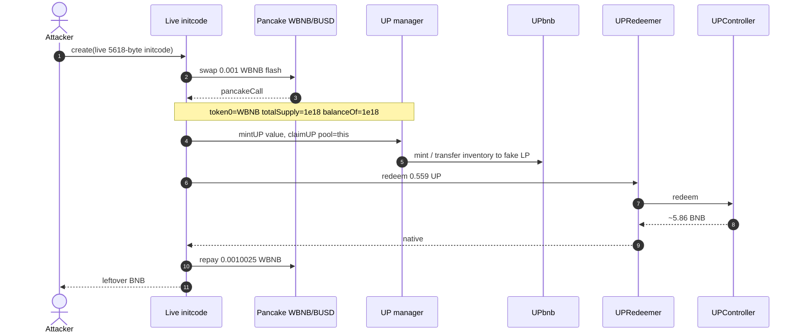
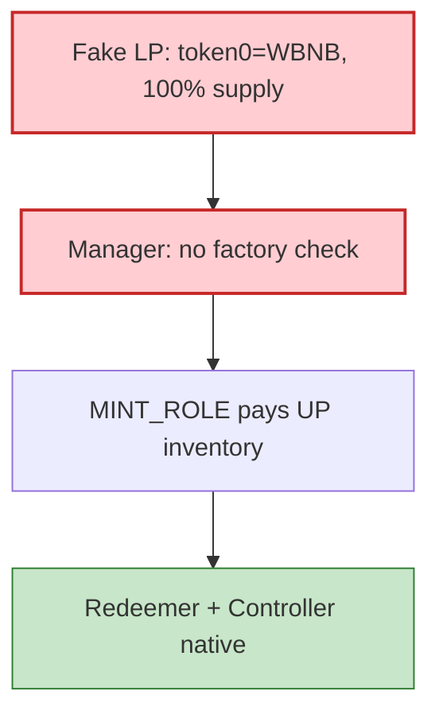

# Unifi Protocol — fake LP drains UP rewards for ~5.86 BNB (BSC)

<!-- non-defihacklabs: Crypto Training original detection & analysis (Twitter hack alerting) -->

> **Vulnerability classes:** vuln/logic/reward-calculation · vuln/input-validation/missing · vuln/logic/missing-check · vuln/access-control/broken-logic

> **Reproduction:** the PoC compiles & runs in an isolated Foundry project at
> [this project folder](.). Full verbose trace: [output.txt](output.txt).
> Source test: [test/UnifiFakeLpRewards_exp.sol](test/UnifiFakeLpRewards_exp.sol).
> Live initcode: [test/fixtures/attack_initcode.hex](test/fixtures/attack_initcode.hex).
> Verified sources: [UP.sol](sources/UP_36F206/UP.sol) (`MINT_ROLE` mint),
> [UPRedeemer.sol](sources/UPRedeemer_1b8c68/UPRedeemer.sol),
> [UPController.sol](sources/UPController_f199c5/UPController.sol) (native redeem),
> [PancakePair.sol](sources/PancakePair_58F876/PancakePair.sol) (0.001 WBNB flash).
> The reward **manager** at `0x5D8aA155…6EAE` is **unverified**.

---

## Key info

| | |
|---|---|
| **Loss** | ~**5.86 BNB**. PoC realizes **5.859108237446175701 BNB**; controller native **15.024751453223642762 → 9.165640709511802899** [output.txt](output.txt) |
| **Vulnerable contracts** | UP reward manager [`0x5D8aA155…6EAE`](https://bscscan.com/address/0x5D8aA15505aFEc01Bab0dE21F9377673B5246EAE) (unverified) · UPbnb [`0x36F20660…33A7`](https://bscscan.com/address/0x36F20660b9947929Ab3edd8727B5Af60260333A7) · UPController [`0xf199c50b…9E95`](https://bscscan.com/address/0xf199c50bA225cb44e06A74b77C86525A72DF9E95) · UPRedeemer [`0x1b8c6808…419A`](https://bscscan.com/address/0x1b8c6808b48C7A9b6997b6dAEF6401307B2B419A) |
| **Attacker** | [`0xB78E77dE…dd81`](https://bscscan.com/address/0xB78E77dEdDaf20f238e1D8f9d1De7606c23Cdd81) |
| **Attack contract** | Fake LP [`0x44ED72d8…b324`](https://bscscan.com/address/0x44ED72d81a32A284f3fb50f9c6E6f2EF739bb324) (inner CREATE from the live deploy) |
| **Attack tx** | [`0x74634e4c…02e8`](https://bscscan.com/tx/0x74634e4ccc7e8922798c7043f839219b1a1a4d6087f57cdbf3bd1544198b02e8) (BSC block **121,045,767**) |
| **Chain / block / date** | BNB Chain / fork **121,045,766** / 2026-09 |
| **Compiler** | UP / UPController / UPRedeemer `v0.8.7` (optimizer off). Manager unverified. Live initcode is 5,618 bytes |
| **Bug class** | Manager trusts a **caller-supplied pool** for eligibility (`token0`/`token1` == WBNB) and reward math (`balanceOf` + `totalSupply`). No factory / pair-code check. A fake LP reporting `token0 = WBNB`, `totalSupply = 1e18`, `balanceOf(this) = 1e18` is paid the manager's UP inventory (`MINT_ROLE`); UP is redeemed against controller native backing |

---

## TL;DR

Unifi's UP reward manager lets the caller pick the LP. It checks that the pool *looks* like a WBNB pair and sizes the reward from `balanceOf` / `totalSupply` on that same address. It never asks Pancake's factory whether the pair is real.

The attacker deploys a contract that:

1. Flash-borrows **0.001 WBNB** from the WBNB/BUSD Pancake pair.
2. Implements `token0() = WBNB`, `token1() = 1`, `totalSupply() = 1e18`, `balanceOf(self) = 1e18`.
3. Calls `mintUP{value}(fakeLP)` then 3-arg `claimUP(to, upRecipient, pool = fakeLP)`.
4. The manager (holds `MINT_ROLE`) credits its entire **0.559116757634477509 UP** inventory plus new-fee dust onto the fake LP.
5. `UPRedeemer.redeem` burns that UP through `UPController.redeem` and pays **~5.86 BNB** of native backing.
6. Wraps ~0.0010025 WBNB and repays the flash.

A readable Solidity fake-LP that only implements `token0`/`totalSupply`/`balanceOf` and then calls 3-arg `claimUP` receives **new-fee delta only** (~9.25e13 UP), not the vault inventory. The live constructor sweeps inventory + fees in one transfer. This PoC therefore **replays the live 5,618-byte creation bytecode** from tx `0x74634e4c…`.

---

## Background

UPbnb is a native-backed token. `UPController` holds BNB and redeems UP 1:1 against `getVirtualPrice`. `UPRedeemer.redeem` pulls UP, calls the controller, and forwards native to `msg.sender`.

The reward manager is the operational minter: it has `MINT_ROLE` on UP and is supposed to stream UP to **real** WBNB LPs. Because the manager is unverified, the interface is reconstructed from the live trace:

| Selector | Signature (from bytecode / trace) |
|---|---|
| `0xaba2f2d4` | `mintUP(address toLP) payable` |
| `0xc53f57ee` | `claimUP(address to, address upRecipient, address pool)` |

Eligibility and math both read the **caller-supplied** `pool`. There is no `factory.getPair(token0, token1) == pool` (or equivalent bytecode/codehash) check.

---

## The vulnerable code

**RECONSTRUCTED** (manager unverified). The fake-LP surface the manager trusts is documented in [test/UnifiFakeLpRewards_exp.sol](test/UnifiFakeLpRewards_exp.sol):

```solidity
contract UnifiFakeLpRewardsExploit {
    address public token0 = WBNB;
    address public token1 = address(1);
    uint256 public totalSupply = 1e18;
    mapping(address => uint256) public balanceOf;
    // manager treats this as a 100% WBNB-pair LP and pays its UP inventory
}
```

Verified cash-out path — [UP.sol](sources/UP_36F206/UP.sol):

```solidity
modifier onlyMint() {
    require(hasRole(MINT_ROLE, msg.sender), "UP: ONLY_MINT");
    _;
}

function mint(address to, uint256 amount) public payable onlyMint returns (bool) {
    _mint(to, amount);
    return true;
}
```

[UPRedeemer.redeem](sources/UPRedeemer_1b8c68/UPRedeemer.sol):

```solidity
function redeem(uint256 upAmount) public whenNotPaused {
    UP_TOKEN.transferFrom(msg.sender, address(this), upAmount);
    UP_TOKEN.approve(address(UP_CONTROLLER), upAmount);
    uint256 prevBalance = address(this).balance;
    UP_CONTROLLER.redeem(upAmount);
    uint256 redeemAmount = address(this).balance - prevBalance;
    (bool success, ) = msg.sender.call{value: redeemAmount}("");
    require(success, "UPRedeemer: FAIL_SENDING_NATIVE");
}
```

[UPController.redeem](sources/UPController_f199c5/UPController.sol):

```solidity
function redeem(uint256 upAmount) public onlyRedeemer whenNotPaused {
    uint256 redeemAmount = (getVirtualPrice() * upAmount) / 1e18;
    UP(UP_TOKEN).burnFrom(msg.sender, upAmount);
    (bool success, ) = msg.sender.call{value: redeemAmount}("");
    require(success, "UPController: REDEEM_FAILED");
}
```

Live inner calls (receipt / bytecode): unwrap 0.001 WBNB, `mintUP{value}(fakeLP)`, 3-arg `claimUP`, `UPRedeemer.redeem(559209321435491586)`, wrap 0.0010025 WBNB, repay Pancake.

---

## Root cause

1. **Caller-supplied pool** with no factory / pair-codehash / allowlist check.
2. **Reward math uses the pool's own `balanceOf` + `totalSupply`**, which a fake LP can set to "I am 100% of a WBNB pair".
3. **Manager holds `MINT_ROLE`** and already sits on ~0.559 UP of inventory; claim transfers that inventory (plus fee mint) to the fake LP.
4. **UP is immediately redeemable** for controller native — no delay, no LP lock, no oracle on the pair.

---

## Preconditions

- Manager holds `MINT_ROLE` on UPbnb and a non-trivial UP inventory (~0.559 at the fork).
- UPController holds native backing (~15.02 BNB at the fork).
- `mintUP` / 3-arg `claimUP` are permissionless for a pool that returns `token0 == WBNB`.
- 0.001 WBNB flash liquidity exists on Pancake WBNB/BUSD (`0x58F87685…Dc16`).

---

## Attack walkthrough

| # | Step | Amount |
|---|---|---|
| 1 | Fork BSC **121,045,766** | Manager UP **0.559116757634477509**; controller **15.024751453223642762** BNB; attacker **0** BNB |
| 2 | `create(live initcode)` | 5,618-byte constructor from tx `0x74634e4c…` (inner fake LP `0x44ED72d8…` on the live nonce) |
| 3 | Pancake `swap(0.001 WBNB, 0, fakeLP, data)` | Flash seed; callback is the rest of the drain |
| 4 | `mintUP{value}` + 3-arg `claimUP(pool=fakeLP)` | Manager credits inventory + fees onto the fake LP |
| 5 | `UP.approve` + `UPRedeemer.redeem(0.559209… UP)` | Controller pays **5.859110743711839863** native |
| 6 | `WBNB.deposit` ~0.0010025 + transfer to pair | Repay flash; leftover BNB forwarded to the attacker EOA |

From [output.txt](output.txt):

```
Manager UP before: 0.559116757634477509
Controller native before: 15.024751453223642762
Attacker profit (BNB): 5.859108237446175701
Controller drained: 5.859110743711839863
Controller native after: 9.165640709511802899
[PASS] testExploit() (gas: 3085884)
```

---

## Diagrams





---

## Remediation

1. **Require `factory.getPair(token0, token1) == pool`** (or a pair-codehash / beacon allowlist). Never trust a caller-supplied pool for token identity or balances.
2. **Account rewards from protocol-owned LP snapshots**, not from `pool.balanceOf(pool)` / `totalSupply` the pool can lie about.
3. **Do not let the manager sit on redeemable UP inventory** that a single claim can sweep.
4. **Decouple mint from instant native redeem** (delay / haircut / LP lock).

---

## How to reproduce

```bash
_shared/run_poc.sh 2026-09-UnifiFakeLpRewards_exp --mt testExploit -vvvvv
```

Expected: `[PASS] testExploit()` with attacker profit **> 5 BNB** (observed **5.859108237446175701**).

---

*Reference: https://x.com/exvulsec/status/2097995560154509770*
