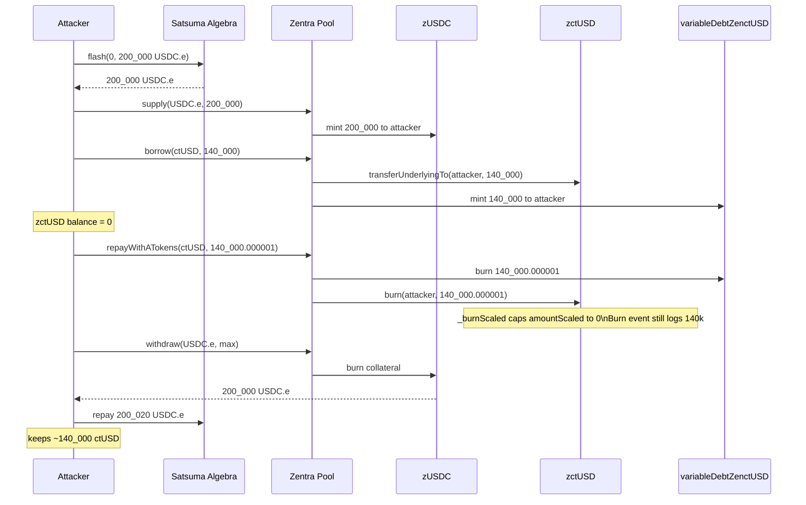
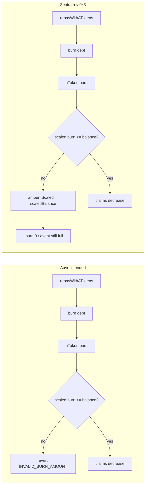

# Zentra Finance — Custom AToken `_burnScaled` silently caps oversize burns

<!-- non-defihacklabs: Crypto Training original detection & analysis (Twitter hack alerting) -->

> **Vulnerability classes:** vuln/logic/missing-check · vuln/logic/incorrect-state-transition · vuln/input-validation/boundary · vuln/arithmetic/rounding

> **Reproduction:** the PoC compiles & runs in an isolated Foundry project at
> [this project folder](.). The fork is served offline from the bundled
> `anvil_state.json` (Citrea block `12,428,144`). Full verbose trace:
> [output.txt](output.txt). Verified AToken source:
> [sources/AToken_62Ff71](sources/AToken_62Ff71).

---

## Key info

| | |
|---|---|
| **Loss** | **~$140,000** ctUSD. PoC extracts **139,999.999999 ctUSD**; zctUSD vault **147,152.479895 → 7,152.479896** ([output.txt](output.txt)) |
| **Vulnerable contract** | Custom AToken implementation [`0x62Ff719aBCaedEad9055BA980FCE3821eBdDA694`](https://explorer.mainnet.citrea.xyz/address/0x62Ff719aBCaedEad9055BA980FCE3821eBdDA694) (`ATOKEN_REVISION 0x3`) |
| **Victim vault** | zctUSD (ctUSD aToken proxy) [`0xBA2a69b92e0071924c387A200409B658E4f6cac8`](https://explorer.mainnet.citrea.xyz/address/0xBA2a69b92e0071924c387A200409B658E4f6cac8) |
| **Pool** | Zentra Pool (EIP-1967) [`0xfb7908150b738e7dB9862007c66C9eb7850706F5`](https://explorer.mainnet.citrea.xyz/address/0xfb7908150b738e7dB9862007c66C9eb7850706F5) → impl [`0x93C562dC08D7B25370CeE0132dDabfb85839dB18`](https://explorer.mainnet.citrea.xyz/address/0x93C562dC08D7B25370CeE0132dDabfb85839dB18) |
| **Attacker EOA** | [`0xA73d72d6A858Df742fe756dA5Cb61C2288A95C17`](https://explorer.mainnet.citrea.xyz/address/0xA73d72d6A858Df742fe756dA5Cb61C2288A95C17) |
| **Attack contract** | Live [`0x8d85840F4c05a5D7385498F2a75daa54c6507b4b`](https://explorer.mainnet.citrea.xyz/address/0x8d85840F4c05a5D7385498F2a75daa54c6507b4b); PoC `ZentraFinanceExploit` at `0x5615dEB798BB3E4dFa0139dFa1b3D433Cc23b72f` |
| **Profit wallet** | [`0x4Eb55301D7848750059300e5CA62ec8De3B4f56A`](https://explorer.mainnet.citrea.xyz/address/0x4Eb55301D7848750059300e5CA62ec8De3B4f56A) (~55.18 ETH after bridge) |
| **Attack tx** | [`0x9ac5df7e93988cd977e4b1b0564f559ec3096db2fe1abdd97e45c348e3074aa1`](https://explorer.mainnet.citrea.xyz/tx/0x9ac5df7e93988cd977e4b1b0564f559ec3096db2fe1abdd97e45c348e3074aa1) (Citrea block **12,428,145**, 2026-09-09 12:59:37 UTC) |
| **Chain / block / date** | **Citrea** (chainId **4114**, Bitcoin Type-2 zkEVM) / fork **12,428,144** / **9 September 2026** |
| **Compiler** | AToken **Solidity v0.8.19+commit.7dd6d404**, optimizer **enabled, 1 run**, **viaIR: true** |
| **Bug class** | Custom AToken `_burnScaled` silently caps an oversize burn to the remaining scaled balance instead of reverting, so `repayWithATokens` with **zero aTokens** still clears the debt |

---

## TL;DR

Zentra Finance is an Aave v3 fork on Citrea. Its zTokens do **not** run the AToken implementation listed in the docs (`0xe4f00a8e…`, revision `0x1`). They run [`0x62Ff719a…`](https://explorer.mainnet.citrea.xyz/address/0x62Ff719aBCaedEad9055BA980FCE3821eBdDA694), revision `0x3` — a rewrite with custom floor/ceil rounding **and a four-line “safety guard”** in `_burnScaled`.

Aave’s original burns **revert** when `amountScaled` exceeds the user’s scaled balance. Zentra **caps** it:

```solidity
if (amountScaled > scaledBalance) {
    amountScaled = scaledBalance;
}
```

The comment says this is for a 1-wei ceil-rounding overshoot on `withdraw(max)`. The guard applies to **every** aToken burn, including `repayWithATokens`.

One transaction:

1. Flash-loan **200,000 USDC.e** from Satsuma Algebra.
2. `supply` it as collateral (85% LTV).
3. `borrow` **140,000 ctUSD** out of the zctUSD vault.
4. `repayWithATokens(ctUSD, debt, VARIABLE)` while holding **zero zctUSD**. The guard sets the scaled burn to 0; the variable-debt token is still burned in full.
5. `withdraw` the USDC.e collateral.
6. Repeat the same trick for **30 USDC.e** to cover the 20 USDC.e flash fee.
7. Repay the flash loan. Profit: **139,999.999999 ctUSD**.

`zctUSD.scaledTotalSupply` is **1,357,533,941,399 before and after** — the repayment destroyed no aToken claims. The vault is ~140k short against depositors.

---

## Background

Zentra is Citrea’s native over-collateralized money market (Aave v3 architecture: Pool, aTokens, variable-debt tokens, RedStone oracles). Launch markets: ctUSD, USDC.e, wcBTC.

The ctUSD aToken (`zctUSD`) is an EIP-1967 proxy whose implementation is the custom revision-`0x3` AToken. Docs still list `0xe4f00a8e…` (revision `0x1`). The rewrite:

- Rounds aToken mints **down** and burns **up** (`rayDivFloor` / `rayDivCeil`) to match Aave v3.5-style predictable rounding.
- Adds the silent cap in `_burnScaled` so a 1-wei ceil overshoot on `withdraw(max)` does not underflow `_burn`.
- Emits `Burn` from `amount - balanceIncrease`, **not** from `amountScaled`, so a no-op burn still logs the full figure.

Aave v3 `repayWithATokens` is designed so a borrower who *also* holds aTokens of the debt asset can retire debt by burning those aTokens instead of transferring underlying. The Pool:

1. Sizes `paybackAmount` from the user’s **debt** (and only substitutes `aToken.balanceOf` when `amount == type(uint256).max`).
2. **Burns the variable-debt token first.**
3. Then calls `IAToken.burn(msg.sender, aToken, paybackAmount, liquidityIndex)`.

That ordering is safe **only if** `aToken.burn` cannot succeed without destroying `paybackAmount` of claims. Zentra’s cap breaks that invariant.

The live attacker (`execute()` on `0x8d85840F…`, 1,320,590 gas) followed this path at block 12,428,145. Proceeds were swapped to USDC.e, bridged to Ethereum over LayerZero OFT, and swept as **55.182876 ETH** to `0x4Eb55301…`. Citrea paused bridging ~69 minutes later; Zentra paused the Pool. Citrea’s own protocol and bridge were unaffected.

---

## The vulnerable code

Verified on the Citrea explorer (AToken impl, `ATOKEN_REVISION = 0x3`). Source in this bundle: [ScaledBalanceTokenBase.sol](sources/AToken_62Ff71/contracts_aave_protocol_tokenization_base_ScaledBalanceTokenBase.sol).

```solidity
function _burnScaled(address user, address target, uint256 amount, uint256 index) internal {
    uint256 amountScaled = _scaleForBurn(amount, index);
    require(amountScaled != 0, Errors.INVALID_BURN_AMOUNT);

    uint256 scaledBalance = super.balanceOf(user);
    // Safety guard: ceil-rounding the burn (aToken withdraw/liquidation) can overshoot
    // the user's scaled balance by 1 wei because SupplyLogic sizes `amount` with a
    // half-up rayMul. Cap the scaled burn to avoid underflowing `_burn` on withdraw(max)
    // / full liquidation. For floor-rounding callers (vToken repay) this is a no-op.
    if (amountScaled > scaledBalance) {
        amountScaled = scaledBalance;
    }
    // ...
    _burn(user, amountScaled.toUint128());

    if (balanceIncrease > amount) {
        // mint interest
    } else {
        uint256 amountToBurn = amount - balanceIncrease;
        emit Transfer(user, address(0), amountToBurn);
        emit Burn(user, target, amountToBurn, balanceIncrease, index);
    }
}
```

`require(amountScaled != 0)` runs **before** the cap, so a 140,000 ctUSD burn of a zero-balance user is not rejected as `INVALID_BURN_AMOUNT`. After the cap, `_burn(user, 0)` is a no-op. The `Burn` event still uses `amount` (the requested underlying), so logs show a 140,000.000001 burn that moved nothing.

The Pool side (verified [BorrowLogic.sol](sources/Pool_93C562/contracts_aave_protocol_libraries_logic_BorrowLogic.sol)) still treats the repay as successful:

```solidity
// debt is burned FIRST
reserveCache.nextScaledVariableDebt = IVariableDebtToken(
    reserveCache.variableDebtTokenAddress
).burn(params.onBehalfOf, paybackAmount, reserveCache.nextVariableBorrowIndex);

if (params.useATokens) {
    IAToken(reserveCache.aTokenAddress).burn(
        msg.sender,
        reserveCache.aTokenAddress, // receiver = aToken itself → no underlying transfer
        paybackAmount,
        reserveCache.nextLiquidityIndex
    );
}
```

`repayWithATokens` on the Pool ([Pool.sol](sources/Pool_93C562/contracts_aave_protocol_pool_Pool.sol) L327) only sets `useATokens: true`. There is no check that the caller’s aToken balance covers `paybackAmount` unless the caller passed `type(uint256).max` (which this exploit deliberately does **not**).

---

## Root cause

A **fail-open rounding patch** was applied to a function that is also the accounting backstop for `repayWithATokens`.

- **Intended invariant:** burning `amount` of aTokens destroys `amount` of claims (scaled by the index). If the user does not have those claims, revert.
- **Patched behaviour:** if the scaled burn exceeds the user’s scaled balance, destroy whatever they have (possibly **zero**) and continue.
- **Pool assumption:** after `aToken.burn(paybackAmount)`, claims are down by `paybackAmount` and it is therefore safe to have already burned `paybackAmount` of debt.

With a zero aToken balance the two sides diverge: **debt is gone, claims are not**. The borrower keeps the underlying that `borrow()` transferred out of the vault, and can `withdraw` collateral because health factor is restored.

The `Burn` event cannot be trusted as a balance proof — it is derived from `amount`, not from `amountScaled`.

---

## Preconditions

1. Zentra Pool unpaused, USDC.e and ctUSD reserves active (true at block 12,428,144: USDC LTV 85%, ctUSD LTV 80%, both borrowing-enabled, not paused).
2. Enough **liquid ctUSD** in the zctUSD vault to cover the borrow (147,152.479895 ctUSD at the fork; the attacker takes 140,000).
3. A flash-loan source of USDC.e large enough to collateralize that borrow (Satsuma Algebra ctUSD/USDC.e pool held 309,946 USDC.e; fee 0.01%).
4. Caller must pass a **concrete** repay amount, not `type(uint256).max`. Max would be rewritten to `aToken.balanceOf(msg.sender) == 0` and pay back nothing.
5. No need for existing aTokens, oracle manipulation, or admin keys. Zentra’s own before-borrow/before-supply security hook returned success (`SecurityCheckPassed` on the live tx).

---

## Attack walkthrough

Fork: Citrea block **12,428,144**. Offline run: [output.txt](output.txt) `[PASS] testExploit()` (gas 2,219,696).

| Step | What happens | Trace |
|---|---|---|
| 0 | `zctUSD` vault holds **147,152.479895 ctUSD**. `scaledTotalSupply` = **1,357,533,941,399**. | [output.txt:455](output.txt) area / pre-attack logs |
| 1 | `algebra.flash(this, 0, 200_000e6)` — token1 is USDC.e, fee **20 USDC.e**. | [output.txt:505](output.txt) |
| 2 | `pool.supply(USDC.e, 200_000e6)` — 200,000 zUSDC minted, collateral enabled. | [output.txt:540](output.txt) |
| 3 | `pool.borrow(ctUSD, 140_000e6, VARIABLE)` — 140,000 ctUSD leaves the vault; 140,000.000001 variable debt after 1 wei of index. | [output.txt:603](output.txt) |
| 4 | `pool.repayWithATokens(ctUSD, 140000000001, 2)` with **zero zctUSD**. Debt token burned; aToken `_burnScaled` caps to 0. | [output.txt:701](output.txt) |
| 5 | `pool.withdraw(USDC.e, max)` — collateral returns. | [output.txt:767](output.txt) |
| 6 | Same bug on USDC: supply 50 ctUSD, borrow 30 USDC.e, `repayWithATokens(USDC.e, 30000001)`, withdraw the 50 ctUSD. Covers the 20 USDC.e flash fee. | [output.txt:827](output.txt)–[output.txt:1038](output.txt) |
| 7 | Repay Algebra `200_000e6 + 20e6`. Transfer remaining ctUSD to the attacker EOA. | [output.txt:1166](output.txt) |

Final balances from the offline run:

```
Attacker Final ctUSD Balance: 139999.999999
zctUSD vault ctUSD before:    147152.479895
zctUSD vault ctUSD after:       7152.479896
zctUSD scaledTotalSupply before: 1357533941399
zctUSD scaledTotalSupply after:  1357533941399
```

Vault delta **139,999.999999 ctUSD**, matching the live incident (Rarma: 147,152.479895 → 7,152.479896; scaled supply delta exactly zero). The 1-wei dust is index rounding on the debt token, not a failed steal.

---

## Diagrams





---

## Remediation

1. **Revert on oversize burns.** Restore Aave’s check (`require(amountScaled <= scaledBalance)`) or let `_burn` underflow. A 1-wei withdraw overshoot should be fixed by **sizing the burn from the user’s scaled balance**, not by silently truncating an arbitrary `amount`.
2. **Do not emit `Burn`/`Repay` for value that was not destroyed.** Derive the event from `amountScaled` (and the actual `_burn` argument), not from the caller’s requested `amount`.
3. **In `repayWithATokens`, burn aTokens before (or atomically with) debt, and require the burned scaled amount to cover `paybackAmount`.** A zero aToken balance must make the repay revert.
4. **Cap `paybackAmount` to `aToken.balanceOf` for every `useATokens` repay**, not only `amount == type(uint256).max`.
5. **Pause / upgrade.** Zentra paused after identifying the root cause. Depositors in the ctUSD market should treat claims as impaired (~140k shortfall on ~1.37M claims) until a solvency path is published. Do not treat `SecurityCheckPassed` as evidence the Pool is safe.

---

## How to reproduce

```bash
cd evm-hack-registry
_shared/run_poc.sh 2026-09-ZentraFinance_exp -vvvvv
```

Requires no RPC: anvil loads [anvil_state.json](anvil_state.json) (Citrea block 12,428,144). Expected: `[PASS] testExploit()` and attacker ctUSD **139,999.999999**.

PoC source: [test/ZentraFinance_exp.sol](test/ZentraFinance_exp.sol).

---

*Reference: https://x.com/DefimonAlerts/status/2098414497199247690*
*Root-cause write-up: https://x.com/Rarma_/status/2097796641973744102*
*Citrea pause: https://x.com/citrea_xyz/status/2097692050389110982*
*Live tx: https://explorer.mainnet.citrea.xyz/tx/0x9ac5df7e93988cd977e4b1b0564f559ec3096db2fe1abdd97e45c348e3074aa1*


## References

- https://x.com/DefimonAlerts/status/2098415749421244566 (@DefimonAlerts secondary analysis)
