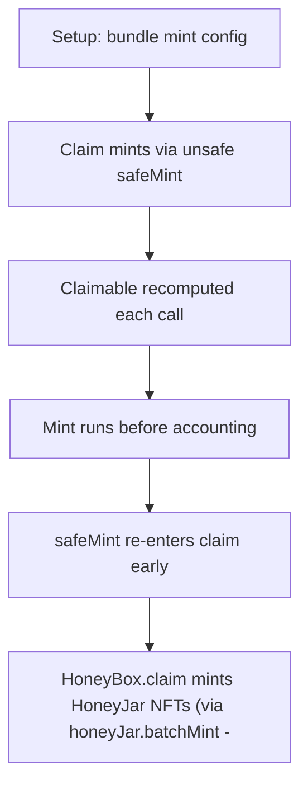

# BearCave: reentrancy in claim mints the whole HoneyJar supply for free

> **Vulnerability classes:** vuln/logic
>
> **Reproduction:** a faithful minimal reproduction of the vulnerable finding — the vulnerable code is reproduced **verbatim** (marked `@>`) with faithful minimal doubles; local deploy, no fork.

<!-- source-auditvault: https://github.com/solodit/solodit_content/blob/main/reports/Pashov/2023-03-01-BearCave.md -->

## Root cause

HoneyBox.claim mints HoneyJar NFTs (via honeyJar.batchMint -> _safeMint, an unsafe external call to the recipient's onERC721Received) BEFORE it updates claimed[bundleId_] and before it records the claim in the Gatekeeper. An attacker entitled to exactly ONE free HoneyJar re-enters claim from the onERC721Received callback; each re-entry sees stale claimed/gatekeeper state so _getNumClaimable keeps returning the full entitlement and _canMintHoneyJar only bounds against the live minted supply. The attacker mints the entire maxHoneyJar supply (10) to himself for free, paying nothing.

```solidity
        // If for some reason this fails, GG no honeyJar for you
        _mintHoneyJarForBear(msg.sender, bundleId_, numClaim); // @> VULN (this line)
```

## Why it's exploitable here

HoneyBox.claim mints HoneyJar NFTs (via honeyJar.batchMint -> _safeMint, an unsafe external call to the recipient's onERC721Received) BEFORE it updates claimed[bundleId_] and before it records the claim in the Gatekeeper. An attacker entitled to exactly ONE free HoneyJar re-enters claim from the onERC721Received callback; each re-entry sees stale claimed/gatekeeper state so _getNumClaimable keeps returning the full entitlement and _canMintHoneyJar only bounds against the live minted supply. The attacker mints the entire maxHoneyJar supply (10) to himself for free, paying nothing.

## Attack path



## Marked-line walkthrough (Playground)

The EVM Playground pins each step to the exact executed source line in `0xce01759b82…`:

1. **L151** — Setup: bundle mint config: Setup: the bundle is configured with a maxHoneyJar supply cap of 10.
2. **L175** — Claim mints via unsafe safeMint: claim mints HoneyJar NFTs through _safeMint, which calls the recipient's onERC721Received callback.
3. **L190** — Claimable recomputed each call: The number of claimable jars is recomputed from claimed/gatekeeper state on every entry.
4. **L198** — Mint runs before accounting: The mint executes before claimed[bundleId] and the gatekeeper record are updated.
5. **L199** — safeMint re-enters claim early: Root cause: the unsafe _safeMint fires the attacker's onERC721Received, which re-enters claim before claimed/gatekeeper state is written.
6. **L203** — Accounting update comes too late: Each re-entry sees stale state, so _getNumClaimable keeps returning the full entitlement before this line ever runs.
7. **L212** — Whole supply minted for free: The attacker, entitled to one jar, recursively mints the entire maxHoneyJar supply of 10 to himself.
8. **L221** — 10 NFTs stolen at zero cost: All 10 HoneyJar NFTs are minted for free, paying nothing — a full free-mint of the bundle.

## PoC

Registry (Foundry, local deploy — verbatim vulnerable source + harm-asserting test):

```bash
cd 20530-c-02-reentrancy-allows-any-user-allowed-even-one-free-honeyj_exp
forge test -vvv
```

The browser Playground replays the same synthetic opcode-for-opcode and measures the harm. Both gates are green (registry `forge test` PASS + Playground `_verify-poc` **VERDICT: PASS**).
