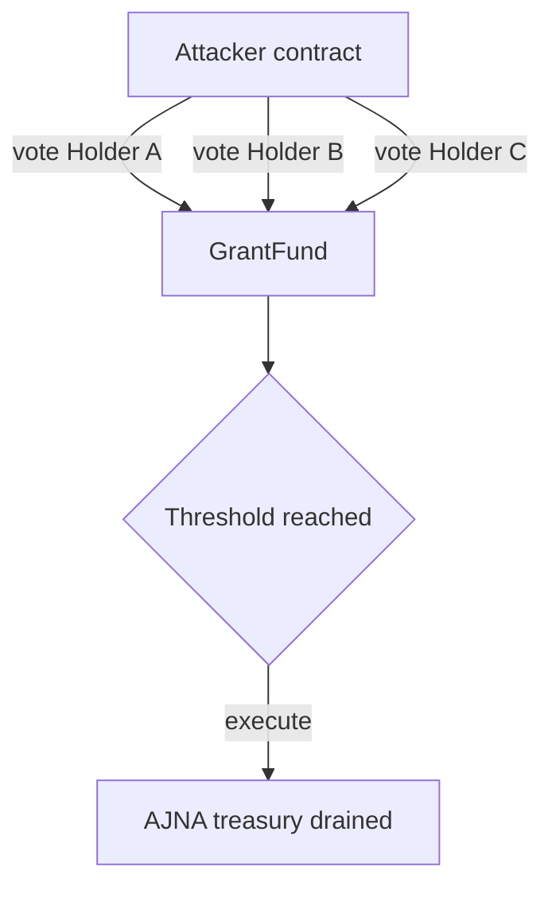

# Ajna ExtraordinaryFunding — caller-supplied voter accounts drain the treasury

> **Vulnerability classes:** vuln/governance/proposal-manipulation · vuln/access-control/missing-owner-check
>
> **Reproduction:** local synthetic Foundry reduction; the complete passing trace is in [output.txt](output.txt).

<!-- non-defihacklabs -->
<!-- source-auditvault: https://github.com/Auditware/AuditVault/blob/main/findings/21301-extraordinary-proposal-can-be-used-to-steal-extraordinary-am.md -->
<!-- date: 2023-04 -->

## Key info

| Field | Value |
|---|---|
| Loss | One caller fabricates 1,000 votes and transfers the entire modeled AJNA treasury. |
| Vulnerable contract | `ExtraordinaryFunding.voteExtraordinary` in [test/21301-extraordinary-proposal-steal-ajna.sol](test/21301-extraordinary-proposal-steal-ajna.sol) |
| Attacker EOA | `0x1111111111111111111111111111111111111111` |
| Attack contract | `Exploit` |
| Attack tx | Local Foundry `Exploit.run()` |
| Chain · block · date | Ethereum model · block 0 · synthetic |
| Compiler | Solidity `^0.8.24` |
| Bug class | Extraordinary vote account not bound to caller |

## TL;DR

`voteExtraordinary(account_, proposalId_)` credits the nominated account's voting power rather than `msg.sender`. A contract can loop over every holder, reach the threshold, and execute a treasury transfer.

## Background

Extraordinary proposals are intentionally fast and one-way. That makes correct voter identity binding essential; delegated voting power must be explicit and non-forgeable.

## The vulnerable code

```solidity
function voteExtraordinary(address account, uint256 proposalId) external returns (uint256 votesCast) {
    require(!voted[proposalId][account], "already voted");
    // @> VULN: caller can nominate any account instead of msg.sender.
    voted[proposalId][account] = true;
    votesCast = votingPower[account];
}
```

## Root cause

The API treats `account` as an authenticated voter identity without requiring a delegation signature or `account == msg.sender`.

## Preconditions

- Holders have voting power recorded in the grant fund.
- The attacker can create an extraordinary proposal.
- `voteExtraordinary` accepts arbitrary account arguments.

## Attack walkthrough

1. Fund the grant with 1,000 AJNA and assign power to three holders.
2. The attacker calls `voteExtraordinary` three times naming those holders.
3. Threshold passes and `executeExtraordinary` transfers all AJNA; see [output.txt:4](output.txt#L4).

## Diagrams



## Remediation

Use `msg.sender` as the voter identity, or require a valid delegation signature tied to `account`. Add invariants that total votes cannot exceed caller-authorized voting power.

## How to reproduce

```bash
cd evm-hack-registry/21301-extraordinary-proposal-steal-ajna_exp
forge test -vvvvv
```

## Sources

- [AuditVault finding #21301](https://github.com/Auditware/AuditVault/blob/main/findings/21301-extraordinary-proposal-can-be-used-to-steal-extraordinary-am.md)
- [Trail of Bits Ajna review](https://github.com/trailofbits/publications/blob/master/reviews/2023-04-ajnalabs-securityreview.pdf)
- [Synthetic test](test/21301-extraordinary-proposal-steal-ajna.sol)

*Reference: https://github.com/trailofbits/publications/blob/master/reviews/2023-04-ajnalabs-securityreview.pdf*
