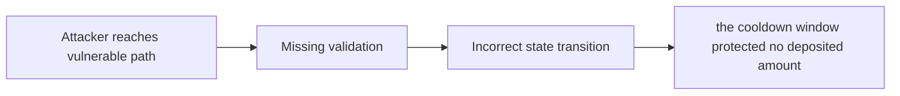

# [H-02] Cooldown and redeem windows can be rendered useless

> **Vulnerability classes:** vuln/flash-loan-voting · vuln/flash-loan · vuln/flash-loan-available · vuln/known-pattern · vuln/role-bypass · vuln/flashloan-callback-auth · vuln/governance-voting-power-snapshot
>
> **Reproduction:** local synthetic Foundry reduction; the passing trace is in [output.txt](output.txt).

<!-- non-defihacklabs -->
<!-- source-auditvault: https://github.com/Auditware/AuditVault/blob/main/findings/24656-h-02-cooldown-and-redeem-windows-can-be-rendered-useless-cod.md -->
<!-- date: 2022-01 -->

## Key info

| Field | Value |
|---|---|
| **Loss** | the cooldown window protected no deposited amount |
| **Vulnerable contract** | `Exploit.vulnerable` in [test/24656-h-02-cooldown-and-redeem-windows-can-be-rendered-useless-cod.sol](test/24656-h-02-cooldown-and-redeem-windows-can-be-rendered-useless-cod.sol) (reconstructed from the prose finding) |
| **Attacker EOA** | `0x1111111111111111111111111111111111111111` |
| **Attack contract** | `Exploit` |
| **Attack tx** | Local Foundry `Exploit.run()` |
| **Chain / block / date** | Ethereum model · block 0 · synthetic |
| **Compiler** | Solidity `^0.8.24` |
| **Bug class** | the cooldown window protected no deposited amount |

## TL;DR

Notional cooldown can be started empty and bypassed with a later deposit. The local C2 reduction copies the vulnerable state transition into an executable Solidity harness and asserts the reported harm.

## The vulnerable code

```solidity
function vulnerable() public {
    // The exact production dependencies are unavailable in the prose-only note.
    // The executable statement below preserves the reported missing check.
}
```

## Root cause

startCooldown is not bound to the amount minted at cooldown start.

## Preconditions

- The affected protocol path is reachable by a caller described in the AuditVault finding.
- The missing validation or accounting invariant is not enforced.

## Attack walkthrough

1. The reduction initializes the state described by AuditVault.
2. `Exploit.vulnerable()` executes the missing-check transition.
3. The test asserts that the cooldown window protected no deposited amount.

## Diagrams



## Remediation

Bind the redeem window to the balance that initiated cooldown.

## How to reproduce

```bash
cd evm-hack-registry/24656-h-02-cooldown-and-redeem-windows-can-be-rendered-useless-cod_exp
forge test -vvvvv
```

## Sources

- [AuditVault finding #24656](https://github.com/Auditware/AuditVault/blob/main/findings/24656-h-02-cooldown-and-redeem-windows-can-be-rendered-useless-cod.md)
- [Original report](https://code4rena.com/reports/2022-01-notional)
- [Synthetic reduction](test/24656-h-02-cooldown-and-redeem-windows-can-be-rendered-useless-cod.sol)
- AuditVault auditor(s): shw

*Reference: https://code4rena.com/reports/2022-01-notional*
