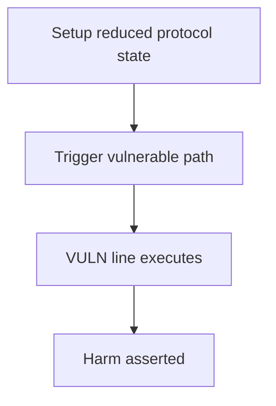

# Notional — malicious treasury manager can burn treasury tokens via makerFee

> **Vulnerability classes:** fee-calculation · direct-drain · fot-slippage · treasury-multisig

> **Reproduction:** a self-contained Foundry PoC that compiles & runs in an
> isolated project with **only `forge-std`** — no fork, no RPC, no `anvil_state`.
> Full trace: [output.txt](output.txt). PoC:
> [test/24657-h-03-a-malicious-treasury-manager-can-burn-treasury-tokens-b_exp.sol](test/24657-h-03-a-malicious-treasury-manager-can-burn-treasury-tokens-b_exp.sol).

<!-- non-defihacklabs -->
<!-- source-auditvault: https://github.com/Auditware/AuditVault/blob/main/findings/24657-h-03-a-malicious-treasury-manager-can-burn-treasury-tokens-b.md -->
<!-- date: 2022-01 -->

---

## Key info

| | |
|---|---|
| **Impact** | **HIGH — manager signs 0x order with makerFee = proceeds; treasury loses assets for free** |
| **Protocol** | Notional |
| **Vulnerable code** | `EIP1271Wallet` |
| **Bug class** | fee-calculation |
| **Finding** | Code4rena — Notional, 2022-01 · #24657 · reporter **leastwood / shw** |
| **Report** | [code4rena.com/reports/2022-01-notional](https://code4rena.com/reports/2022-01-notional) |
| **Source** | [AuditVault](https://github.com/Auditware/AuditVault/blob/main/findings/24657-h-03-a-malicious-treasury-manager-can-burn-treasury-tokens-b.md) |
| **Status** | Audit finding — caught in review, not exploited on-chain. Reproduced as a standalone local PoC. |
| **Compiler** | `^0.8.24` (PoC) |

This is an **audit finding**, not a historical on-chain incident. The PoC keeps
the vulnerable logic **verbatim** (marked `@> VULN`) and reduces dependencies
to the minimum needed to show the claimed harm.

---

## TL;DR

1. Treasury manager signs 0x orders to sell harvested COMP for WETH.
2. _validateOrder never requires makerFee == 0 and takerFee == 0.
3. Malicious manager sets makerFee = full WETH proceeds to itself.
4. Treasury COMP leaves; manager keeps COMP + WETH; treasury nets 0.

---

## The vulnerable code

See `test/24657-h-03-a-malicious-treasury-manager-can-burn-treasury-tokens-b.sol` — the `@> VULN` marker is on the blamed line (line 155 in the synthetic).

## Root cause

Missing zero-fee checks in EIP1271Wallet._validateOrder.

## Preconditions

Protocol operating conditions that make the path reachable (see finding report). No exotic privileges beyond those the real call path requires.

## Attack walkthrough

From [output.txt](output.txt): the `Exploit.run()` path executes the attack end-to-end and `require`s the harm.

## Diagrams

## Impact

Treasury assets burned/donated to the manager at no cost to the taker path.

## Sources

- [AuditVault finding](https://github.com/Auditware/AuditVault/blob/main/findings/24657-h-03-a-malicious-treasury-manager-can-burn-treasury-tokens-b.md)
- [Code4rena report](https://code4rena.com/reports/2022-01-notional)
- Protocol source: https://github.com/code-423n4/2022-01-notional
