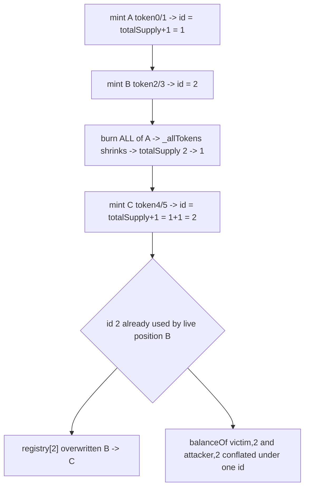

# Timeswap V2 — LiquidityToken uses `totalSupply()+1` as tokenId (collision after burn)

> **Vulnerability classes:** vuln/logic/reused-identifier · vuln/accounting/tokenid-collision · vuln/loss-of-funds/balance-manipulation

> **Reproduction:** a self-contained Foundry PoC that compiles & runs in an
> isolated project with **only `forge-std`** — no fork, no RPC, no `anvil_state`.
> Full trace: [output.txt](output.txt). PoC:
> [test/24902-h-02-timeswapv_exp.sol](test/24902-h-02-timeswapv_exp.sol).

<!-- non-defihacklabs -->
<!-- source-auditvault: https://github.com/Auditware/AuditVault/blob/main/findings/24902-h-02-timeswapv.md -->
<!-- date: 2023-01 -->

---

## Key info

| | |
|---|---|
| **Impact** | **HIGH** — a newly created liquidity position is assigned an ERC-1155 tokenId already in use by a live position; the two liquidities share one id, corrupting LP accounting (registry overwrite + conflated balances) |
| **Protocol** | [Timeswap V2](https://timeswap.io) — options/AMM liquidity token (`v2-token` package) |
| **Vulnerable code** | `TimeswapV2LiquidityToken.mint` — `id = totalSupply() + 1` |
| **Bug class** | Reused identifier: a monotonically-*decreasing* value used as a unique id |
| **Finding** | Code4rena — Timeswap, 2023-01 · #24902 · severity increased to High by judge **Picodes** |
| **Report** | [code4rena.com/reports/2023-01-timeswap](https://code4rena.com/reports/2023-01-timeswap) |
| **Source** | [AuditVault](https://github.com/Auditware/AuditVault/blob/main/findings/24902-h-02-timeswapv.md) |
| **Status** | Audit finding — caught in review, confirmed & fixed by Timeswap ([PR #293](https://github.com/Timeswap-Labs/Timeswap-V2-Monorepo/pull/293)). Reproduced here as a standalone local PoC. |
| **Compiler** | `^0.8.8` (PoC) |

This is an **audit finding**, not a historical on-chain incident. The PoC copies the
vulnerable tokenId-assignment block of `mint()` verbatim and replaces the pool/option
factories, reentrancy guard, mint/burn callbacks and `Error.checkEnough` (all
irrelevant to the tokenId bug) with nothing — the liquidity amount is minted directly.
A minimal `ERC1155Enumerable` reproduces `totalSupply() == _allTokens.length`.

---

## TL;DR

1. `TimeswapV2LiquidityToken.mint` assigns a new position's ERC-1155 tokenId with
   `id = totalSupply() + 1`.
2. `totalSupply()` (from `ERC1155Enumerable`) is `_allTokens.length`, which
   **decreases** when a tokenId is fully burned.
3. Attack: mint A → id 1; mint B → id 2; **burn all of A** → totalSupply drops to 1;
   mint C → `id = totalSupply()+1 = 2` — the **same** tokenId as the still-live B.
4. Two distinct liquidities (B and C) now share tokenId 2. The `id → position`
   registry entry is overwritten (B's identity destroyed) and the two positions'
   ERC-1155 balances are conflated under one id — corrupt LP accounting the protocol
   cannot untangle.

---

## The vulnerable code

`TimeswapV2LiquidityToken.mint` (tokenId-assignment block copied verbatim; `@>` is the bug):

```solidity
bytes32 key = timeswapV2LiquidityTokenPosition.toKey();
uint256 id = _timeswapV2LiquidityTokenPositionIds[key];

// if the position does not exist, create it
if (id == 0) {
    id = totalSupply() + 1;   // @> tokenId derived from a value that can DECREASE
    _timeswapV2LiquidityTokenPositions[id] = timeswapV2LiquidityTokenPosition;
    _timeswapV2LiquidityTokenPositionIds[key] = id;
}
...
_mint(param.to, id, param.liquidityAmount, bytes(""));
```

`totalSupply()` in `ERC1155Enumerable`:

```solidity
function totalSupply() public view override returns (uint256) {
    return _allTokens.length; // shrinks when a tokenId is fully burned
}
```

---

## Root cause

`totalSupply()` is a *live count* of currently-tracked tokenIds, not a monotonic
counter. Using `totalSupply() + 1` as a unique id assumes the count only grows;
burning a tokenId to zero removes it from `_allTokens`, so the next fresh position
re-derives a previously-issued id. The fix is a monotonic counter:
`id = ++tokenIdCounter`.

> Note on exploitability: the *deployed* `ERC1155Enumerable._removeTokenEnumeration`
> checks `_idTotalSupply[id] == 0` **before** subtracting `amount`, so it never
> actually removes a fully-burned id and totalSupply never shrinks — which masks this
> bug. The finding rates it **HIGH** because that masking is itself a defect; its PoC
> applies the one-line patch (decrement first, then check) to expose the collision.
> This synthetic uses the patched enumerable, exactly as the finding's PoC does.

## Attack walkthrough

From [output.txt](output.txt):

1. Attacker mints position **A** (token0/1) → `id = totalSupply()+1 = 1`; totalSupply = 1.
2. Victim mints position **B** (token2/3) → `id = 2`; totalSupply = 2.
3. Attacker fully burns **A** → its id is removed from enumeration → totalSupply = 1.
4. Attacker mints position **C** (token4/5) → `id = totalSupply()+1 = 2` — **collides**
   with the live position B.
5. **HARM:** `positionIds[keyB] == positionIds[keyC] == 2`; `positions[2]` is
   overwritten from B to C; `idTotalSupply[2] == victimB + attackerC` — two unrelated
   positions/holders now share one tokenId's accounting.

## Diagrams



## Remediation

```diff
+ uint256 public tokenIdCounter;
  ...
  if (id == 0) {
-     id = totalSupply() + 1;
+     id = ++tokenIdCounter;
      _timeswapV2LiquidityTokenPositions[id] = timeswapV2LiquidityTokenPosition;
      _timeswapV2LiquidityTokenPositionIds[key] = id;
  }
```

(The same fix applies to `TimeswapV2Token`.)

## How to reproduce

```bash
cd ~/RustroverProjects/audits/evm-hack-registry/24902-h-02-timeswapv_exp
forge test -vvv
# Fully local — no fork, no RPC, no anvil_state required.
# Expected: test PASSES — position C collides on tokenId 2 (== B's id), the
#           id->position registry is overwritten, and id-2 supply conflates B + C.
```

PoC source: [test/24902-h-02-timeswapv_exp.sol](test/24902-h-02-timeswapv_exp.sol)
— the verbatim vulnerable `mint()` tokenId-assignment plus a minimal enumerable and
the finding's mint/mint/burn/mint sequence.

> Note: pool/option factories, the reentrancy guard, the mint/burn callbacks and
> `Error.checkEnough` are stripped (they do not affect tokenId assignment); the
> liquidity amount is minted directly. The `totalSupply() == _allTokens.length`
> semantics and the vulnerable `id = totalSupply() + 1` line are faithful.

---

*Reference: finding **#24902** ([H-02]) in the [Code4rena Timeswap contest (Jan 2023)](https://code4rena.com/reports/2023-01-timeswap) · curated by [AuditVault](https://github.com/Auditware/AuditVault/blob/main/findings/24902-h-02-timeswapv.md)*
