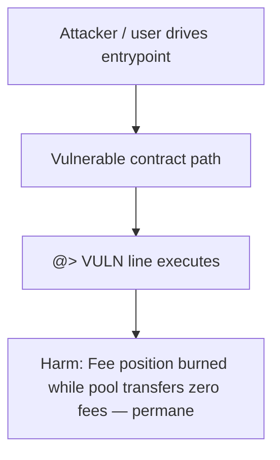

# Timeswap V2 — collect() always transfers zero fees then burns the fee position

> **Vulnerability classes:** fee-calculation, fee-theft, fee-accounting

> **Reproduction:** self-contained Foundry PoC (only `forge-std`) — no fork, no RPC.
> Full trace: [output.txt](output.txt). PoC: [test/24903-h-03-the-collect-function-will-always-transfer-zero-fees-los_exp.sol](test/24903-h-03-the-collect-function-will-always-transfer-zero-fees-los_exp.sol).

<!-- non-defihacklabs -->
<!-- source-auditvault: https://github.com/Auditware/AuditVault/blob/main/findings/24903-h-03-the-collect-function-will-always-transfer-zero-fees-los.md -->
<!-- date: 2023-01 -->

---

## Key info

| | |
|---|---|
| **Impact** | **HIGH** — Fee position burned while pool transfers zero fees — permanent fee loss |
| **Protocol** | Timeswap V2 |
| **Vulnerable code** | `TimeswapV2LiquidityToken` (see `@>` in synthetic) |
| **Finding** | Code4rena · #24903 |
| **Report** | [https://code4rena.com/reports/2023-01-timeswap](https://code4rena.com/reports/2023-01-timeswap) |
| **Source** | [AuditVault](https://github.com/Auditware/AuditVault/blob/main/findings/24903-h-03-the-collect-function-will-always-transfer-zero-fees-los.md) |
| **Status** | Audit finding — reproduced as a standalone local PoC |
| **Compiler** | `^0.8.24` |

---

## TL;DR

collect() always transfers zero fees then burns the fee position. Harm demonstrated: **Fee position burned while pool transfers zero fees — permanent fee loss**.

---

## The vulnerable code

See `test/24903-h-03-the-collect-function-will-always-transfer-zero-fees-los.sol` — the blamed line is marked `// @> VULN`.

---

## Root cause

See the synthetic header comment and the AuditVault finding for the full root-cause write-up. The Playground preserves the vulnerable line verbatim and asserts the concrete harm in `Exploit.run()`.

## Attack walkthrough

1. Deploy the reduced vulnerable system (CREATE order: MockPool, TimeswapV2LiquidityToken).
2. Seed the preconditions from the finding (approvals, balances, whitelist).
3. Execute the attack path; the `@>` line runs.
4. `require(...)` asserts the harm.

## Diagrams

## Impact

Fee position burned while pool transfers zero fees — permanent fee loss

## Taxonomy

- fee-calculation, fee-theft, fee-accounting

## Sources

- [AuditVault finding](https://github.com/Auditware/AuditVault/blob/main/findings/24903-h-03-the-collect-function-will-always-transfer-zero-fees-los.md)
- [Code4rena report](https://code4rena.com/reports/2023-01-timeswap)
- Reduced from: `code-423n4/2023-01-timeswap packages/v2-token/src/TimeswapV2LiquidityToken.sol collect()`
