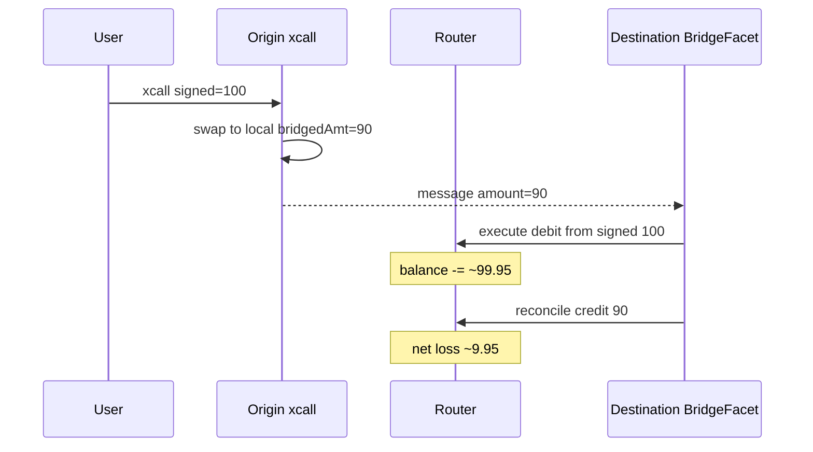

# Connext — routers pay signed amount on `execute`, credited only `bridgedAmt` on reconcile

> **Vulnerability classes:** vuln/bridge/amount-mismatch · vuln/logic/wrong-condition · genome: wrong-condition · fot-slippage · direct-drain

> **Reproduction:** a self-contained Foundry PoC that compiles & runs in an
> isolated project with **only `forge-std`** — no fork, no RPC, no `anvil_state`.
> Full trace: [output.txt](output.txt). PoC:
> [test/25133-h-04-in-execute-the-amount-routers-pay-is-what-user-signed-b_exp.sol](test/25133-h-04-in-execute-the-amount-routers-pay-is-what-user-signed-b_exp.sol).

<!-- non-defihacklabs -->
<!-- source-auditvault: https://github.com/Auditware/AuditVault/blob/main/findings/25133-h-04-in-execute-the-amount-routers-pay-is-what-user-signed-b.md -->
<!-- date: 2022-06 -->

**AuditVault taxonomy:** `lang/solidity` · `platform/code4rena` · `has/github` · `has/poc` · `severity/high` · `sector/bridge` · genome: `wrong-condition` · `specific-token-type` · `fot-slippage` · `direct-drain`

---

## Key info

| | |
|---|---|
| **Impact** | **HIGH** — fast-path routers systematically lose the origin-swap slippage gap |
| **Protocol** | [Connext](https://code4rena.com/reports/2022-06-connext) |
| **Vulnerable code** | `BridgeFacet._handleExecuteLiquidity` debits routers from `_args.amount` |
| **Bug class** | Signed vs bridged amount mismatch across execute / reconcile |
| **Finding** | Code4rena 2022-06-connext · H-04 · #25133 |
| **Report** | [code4rena.com/reports/2022-06-connext](https://code4rena.com/reports/2022-06-connext) |
| **Source** | [AuditVault](https://github.com/Auditware/AuditVault/blob/main/findings/25133-h-04-in-execute-the-amount-routers-pay-is-what-user-signed-b.md) |
| **Status** | Resolved (sponsor). Reproduced as standalone local PoC. |
| **Compiler** | `^0.8.24` (PoC) |

---

## TL;DR

1. Origin `xcall` swaps adopted → local; only `bridgedAmt` is messaged.
2. Destination `execute` (fast path) debits routers from the **user-signed** `_args.amount`.
3. `_reconcile` credits routers only `action.amnt()` (= bridgedAmt).
4. HARM: signed 100, bridged 90 → router net loss ≈ 9.95 after liq fee (debit 99.95, credit 90).

---

## The vulnerable code

```solidity
// _handleExecuteLiquidity (fast path)
toSwap = _getFastTransferAmount(_args.amount, feeNum, feeDen);
uint256 routerAmount = toSwap / pathLen;
for (...) {
    routerBalances[_args.routers[i]][_args.local] -= routerAmount; // @> VULN: uses signed amount
}
// reconcile later: credit bridgedAmt only
```

**Fix:** debit (and identify) transfers using the bridged/message amount, not the pre-slippage signed amount.

---

## Root cause

ExecuteArgs carries the amount the user signed on origin. After `swapToLocalAssetIfNeeded`, the nomad message amount can be smaller (swap slippage / deflationary transfer). Fast liquidity uses the larger figure; reconciliation uses the smaller one — routers fund the difference.

---

## Preconditions

- Origin path incurs slippage (or fee-on-transfer) so `bridgedAmt < signed amount`.
- Destination uses fast-path routers (not pure slow reconcile-first).

---

## Attack walkthrough

1. `xcall` with signed 100; swap yields bridged 90.
2. Fast `execute` debits router ≈ 99.95 local.
3. `reconcile` credits 90.
4. **HARM:** router inventory down by ≈ 9.95.

---

## Diagrams



---

## Impact

Routers providing fast liquidity on low-liquidity / high-slippage assets lose inventory equal to the origin slippage gap. Can be abused to drain router balances on thin markets.

---

## How to reproduce

```bash
cd evm-hack-registry/25133-h-04-in-execute-the-amount-routers-pay-is-what-user-signed-b_exp
forge test -vvv
```

---

## Sources

- [AuditVault finding #25133](https://github.com/Auditware/AuditVault/blob/main/findings/25133-h-04-in-execute-the-amount-routers-pay-is-what-user-signed-b.md)
- [Code4rena report 2022-06-connext](https://code4rena.com/reports/2022-06-connext)
- Reduced from [code-423n4/2022-06-connext@b4532655](https://github.com/code-423n4/2022-06-connext/blob/b4532655071566b33c41eac46e75be29b4a381ed/contracts/contracts/core/connext/facets/BridgeFacet.sol) `xcall` / `_handleExecuteLiquidity` / `_reconcile`
