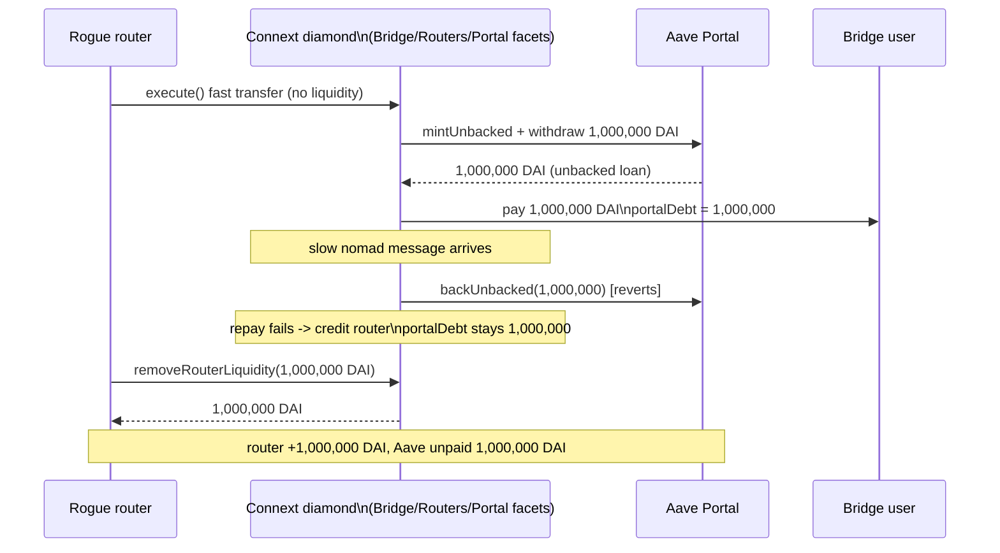

# [H-05] Connext routers are not enforced to repay the Aave Portal loan

Real-source PoC. It deploys the **actual audited Connext facets** — `BridgeFacet`,
`RoutersFacet`, `PortalFacet` over the real `LibConnextStorage` `AppStorage`, plus the real
`TokenRegistry` and `ConnextMessage`/`AssetLogic` libraries — and drives the real
`execute → Aave Portal loan → reconcile → withdraw` path. Only the **external Aave pool**
interface (`IAavePool`) is a boundary double; every line of Connext loan/repayment/credit
logic is the unmodified audited source.

- Repo: `github.com/code-423n4/2022-06-connext` @ `4dd6149748b635f95460d4c3924c7e3fb6716967`
- Vulnerable source:
  - `contracts/core/connext/facets/BridgeFacet.sol` — `_reconcile` (router credit, L606-616) and
    `_reconcileProcessPortal` (repay-failure branch returns the full `_amount`, L1016-1022 / L1035-1061)
  - `contracts/core/connext/facets/PortalFacet.sol` — `repayAavePortal` (the out-of-band,
    unenforced repayment)
- AuditVault finding: [#25134](https://github.com/Auditware/AuditVault/blob/main/findings/25134-h-05-routers-are-not-enforced-to-repay-aave-portal-loan-code.md)
  · [Code4rena report](https://code4rena.com/reports/2022-06-connext)

## Root cause

To provide fast liquidity when a router is under-collateralized, `BridgeFacet.execute` draws an
**unbacked Aave Portal loan** on Connext's credit line (`_executePortalTransfer`: `mintUnbacked`
+ `withdraw`), pays the user, and records `portalDebt[transferId]`. Connext — not the router —
is the borrower on Aave's books.

When the slow nomad message later arrives, `_reconcile` calls `_reconcileProcessPortal`, which is
*supposed* to use the bridged funds to repay Aave. But if the swap **or** the
`aavePool.backUnbacked` call fails, the function resets `amountIn = 0` and returns the **entire**
`_amount` (`BridgeFacet.sol#L1022` / `#L1061`). `_reconcile` then credits that full amount to the
router's balance (`s.routerBalances[router][token] += routerAmt`, L611) while `portalDebt` stays
outstanding. Repayment is left to the router calling `PortalFacet.repayAavePortal` **out-of-band**
— which nothing enforces (see Connext's own `FIXME` at `BridgeFacet.sol#L594`). A rogue router
simply `removeRouterLiquidity`-withdraws the credited funds and never repays.

## Exploit walkthrough (numbers)

1. A 1,000,000 DAI transfer routes through the Portal. `_executePortalTransfer` borrows 1,000,000
   DAI from Aave (reserve → 0) and pays the user; `portalDebt = 1,000,000 DAI`.
2. The slow message reconciles. The `backUnbacked` repayment call reverts, so
   `_reconcileProcessPortal` returns the full 1,000,000 DAI and `_reconcile` credits the router's
   balance with 1,000,000 DAI. `portalDebt` remains 1,000,000 DAI.
3. The rogue router calls `removeRouterLiquidityFor` and withdraws the 1,000,000 DAI escrow.
4. **Harm:** the router keeps **1,000,000 DAI**, Aave's reserve is drained by **1,000,000 DAI**
   with no repayment, and Connext is left owing Aave **1,000,000 DAI** it can no longer cover.

Asserted by the test: `router recipient balance == 1,000,000 DAI`,
`getAavePortalDebt(transferId) == 1,000,000 DAI`, Aave reserve `== 0`, diamond escrow `== 0`,
the bridge user still holds their legitimate 1,000,000 DAI.



## Reproduce

```bash
_shared/run-poc/run_poc.sh 25134-h-05-routers-are-not-enforced-to-repay-aave-portal-loan-code_exp -vvvvv
```

The registry test deploys the real facets and drives the **full** `execute` (with a real router
ECDSA signature) → `_reconcile` → `removeRouterLiquidityFor`. The browser Playground injects the
combined 36 KB facet runtime at a fixed address (it exceeds the EIP-170 code-size limit) and calls
the audited internal `_executePortalTransfer` directly — the ECDSA/whitelist checks in `execute`
are access control, not the bug; the loan draw, the repay-gap, and the withdrawal all run from the
unmodified audited source.
