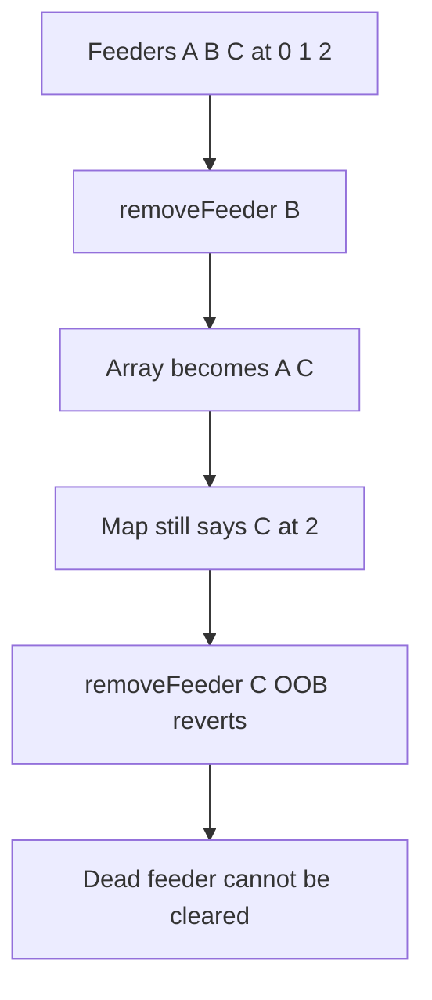

# ParaSpace — [H-01] Data corruption in NFTFloorOracle; Denial of Service

> **Vulnerability classes:** missing index update · data-corruption · DoS

> **Reproduction:** self-contained Foundry PoC with **only `forge-std`** — no fork.
> Full trace: [output.txt](output.txt).

<!-- non-defihacklabs -->
<!-- source-auditvault: https://github.com/Auditware/AuditVault/blob/main/findings/25723-h-01-data-corruption-in-nftfloororacle-denial-of-service-cod.md -->
<!-- date: 2022-11 -->

**AuditVault taxonomy:** `lang/solidity` · `platform/code4rena` · `severity/high` · `sector/lending` · genome: `missing-modifier` · `data-corruption/price-manipulation` · `dos-resistance`

---

## Key info

| | |
|---|---|
| **Impact** | **HIGH** — swap+pop without map fixup makes further feeder removals OOB-revert |
| **Protocol** | [ParaSpace](https://code4rena.com/reports/2022-11-paraspace) |
| **Vulnerable code** | `NFTFloorOracle._removeFeeder` — no index update after swap |
| **Bug class** | Incomplete swap-and-pop bookkeeping |
| **Finding** | Code4rena 2022-11-paraspace · #25723 (H-01) · reporter **csanuragjain** |
| **Compiler** | `^0.8.24` (PoC) |

---

## TL;DR

1. Remove feeder B (middle): last feeder C is swapped into B's slot.
2. `feederPositionMap[C].index` still says 2 while array length is 2.
3. `removeFeeder(C)` reads `feeders[2]` → out of bounds revert; C stuck forever.

---

## The vulnerable code

```solidity
feeders[feederIndex] = feeders[feeders.length - 1]; // @> VULN: no map update for moved feeder
// FIX: feederPositionMap[feeders[feederIndex]].index = feederIndex;
feeders.pop();
```

---

## Diagrams



---

## Impact

Malfunctioning/malicious feeders cannot be removed after any middle-index removal; oracle integrity breaks over normal operations.

## Remediation

After swap, set `feederPositionMap[feeders[feederIndex]].index = feederIndex` before `pop`.

## Sources

- [AuditVault #25723](https://github.com/Auditware/AuditVault/blob/main/findings/25723-h-01-data-corruption-in-nftfloororacle-denial-of-service-cod.md)
- [Code4rena 2022-11-paraspace](https://code4rena.com/reports/2022-11-paraspace)
- `code-423n4/2022-11-paraspace@c6820a2` `paraspace-core/contracts/misc/NFTFloorOracle.sol`
