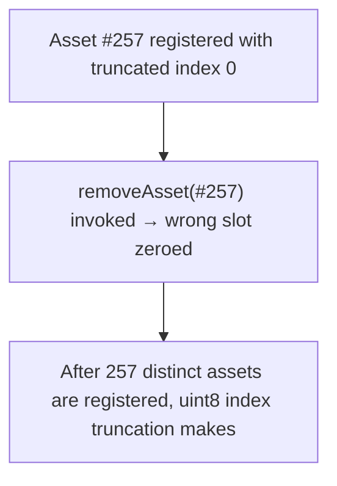

# ParaSpace: uint8 asset index truncates past 255 assets, colliding slots

> **Vulnerability classes:** vuln/locked-funds · vuln/reward-accounting · vuln/price
>
> **Reproduction:** a faithful minimal reproduction of the vulnerable finding — the vulnerable function is reproduced **verbatim** (marked `@>`) with faithful minimal doubles; local deploy, no fork.

<!-- source-auditvault: https://github.com/Auditware/AuditVault/blob/main/findings/25724-h-08-nftfloororacles-asset-and-feeder-structures-can-be-corr.md -->

## Root cause

assetFeederMap[_asset].index = uint8(assets.length - 1) (L176) truncates once more than 256 assets exist: asset #257 gets index uint8(256)==0, colliding with asset #1. On removal, `uint8 assetIndex = assetFeederMap[_asset].index` reads that collided 0, so `delete assets[0]` zeroes asset #1's slot while it stays registered — a corrupted oracle registry.

```solidity
    {
        assetFeederMap[_asset].registered = true;
        assets.push(_asset);
        assetFeederMap[_asset].index = uint8(assets.length - 1); // @> truncates: asset #257 gets index uint8(256)==0, colliding with asset #1
        emit AssetAdded(_asset);
    }
```

## Why it's exploitable here

After 257 distinct assets are registered, uint8 index truncation makes asset #257's stored index (uint8(256)==0) collide with asset #1's index 0; calling removeAsset(asset#257) then executes delete assets[0], zeroing the EXISTING asset #1's array slot while asset #1 stays registered in assetFeederMap — an internally inconsistent, corrupted oracle registry (mispricing / loss of admin control / DoS).

## Attack path



## Marked-line walkthrough (Playground)

The EVM Playground pins each step to the exact executed source line in `0x8ea53755a6…`:

1. **L177** — Asset #257 registered with truncated index 0: _addAsset stores uint8(assets.length-1) == uint8(256) == 0 for asset #257 — the same index already held by asset #1 — then emits AssetAdded.
2. **L149** — removeAsset(#257) invoked → wrong slot zeroed: The attacker removes asset #257; its stored index truncated to 0, so the removal runs delete assets[0] (L193), zeroing the slot of the still-registered asset #1 — a corrupted, internally inconsistent oracle registry.

## PoC

Registry (Foundry, local deploy — verbatim vulnerable source + harm-asserting test + negative control):

```bash
cd 25724-h-08-nftfloororacles-asset-and-feeder-structures-can-be-corr_exp
forge test -vvv
```

The browser Playground replays the same synthetic opcode-for-opcode and measures the harm: **After 257 distinct assets are registered, uint8 index truncation makes asset #257's stored index (uint8(256)==0) collide with asset #1's index 0; calling removeAsset(asset#257) then executes delete assets[0], zeroing the EXISTING asset #1's array slot while asset #1 stays registered in assetFeederMap — an internally inconsistent, corrupted oracle registry (mispricing / loss of admin control / DoS).**. Both gates are green (registry `forge test` PASS + Playground `_verify-poc` **VERDICT: PASS**).
