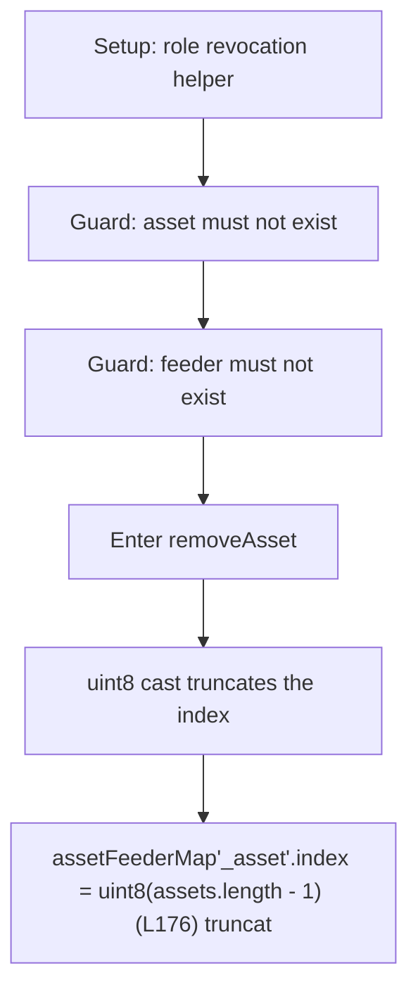

# ParaSpace: uint8 asset index truncates past 255 assets, colliding slots

> **Vulnerability classes:** vuln/locked-funds · vuln/reward-accounting · vuln/price
>
> **Reproduction:** a faithful minimal reproduction of the vulnerable finding — the vulnerable function is reproduced **verbatim** (marked `@>`) with faithful minimal doubles; local deploy, no fork.

<!-- source-auditvault: https://github.com/Auditware/AuditVault/blob/main/findings/25724-h-08-nftfloororacles-asset-and-feeder-structures-can-be-corr.md -->

## Root cause

assetFeederMap[_asset].index = uint8(assets.length - 1) (L176) truncates once more than 256 assets exist: asset #257 gets index uint8(256)==0, colliding with asset #1. On removal, `uint8 assetIndex = assetFeederMap[_asset].index` reads that collided 0, so `delete assets[0]` zeroes asset #1's slot while it stays registered — a corrupted oracle registry.

```solidity
    {
        assetFeederMap[_asset].registered = true;
        assets.push(_asset);
        assetFeederMap[_asset].index = uint8(assets.length - 1); // @> truncates: asset #257 gets index uint8(256)==0, colliding with asset #1
        emit AssetAdded(_asset);
    }
```

## Why it's exploitable here

After 257 distinct assets are registered, uint8 index truncation makes asset #257's stored index (uint8(256)==0) collide with asset #1's index 0; calling removeAsset(asset#257) then executes delete assets[0], zeroing the EXISTING asset #1's array slot while asset #1 stays registered in assetFeederMap — an internally inconsistent, corrupted oracle registry (mispricing / loss of admin control / DoS).

## Attack path



## Marked-line walkthrough (Playground)

The EVM Playground pins each step to the exact executed source line in `0x8ea53755a6…`:

1. **L45** — Setup: role revocation helper: Setup: `_roles[role][account] = false` is access-control plumbing used while wiring up the oracle's admin and feeder roles.
2. **L129** — Guard: asset must not exist: Setup: `onlyWhenAssetNotExisted` limits registration to new assets, but checks the map — not the truncated array index — so it misses collisions.
3. **L140** — Guard: feeder must not exist: Setup: registration also requires the feeder be new — routine wiring that runs for each of the 257 assets being added.
4. **L149** — Enter removeAsset: `removeAsset` is the sink: it reads the asset's stored `index` and runs `delete assets[index]`, where a collided index corrupts the registry.
5. **L176** — uint8 cast truncates the index: Root cause: casting `assets.length - 1` to `uint8` wraps past 255, so asset #257 stores index 0, colliding with asset #1's slot.
6. **L177** — Emit AssetAdded event: The asset logs as added while its map entry holds a truncated index that silently aliases an earlier asset's array slot.
7. **L204** — Same truncation for feeders: The identical `uint8(feeders.length - 1)` cast corrupts the feeder registry the same way once more than 256 feeders exist.

## PoC

Registry (Foundry, local deploy — verbatim vulnerable source + harm-asserting test + negative control):

```bash
cd 25724-h-08-nftfloororacles-asset-and-feeder-structures-can-be-corr_exp
forge test -vvv
```

The browser Playground replays the same synthetic opcode-for-opcode and measures the harm: **After 257 distinct assets are registered, uint8 index truncation makes asset #257's stored index (uint8(256)==0) collide with asset #1's index 0; calling removeAsset(asset#257) then executes delete assets[0], zeroing the EXISTING asset #1's array slot while asset #1 stays registered in assetFeederMap — an internally inconsistent, corrupted oracle registry (mispricing / loss of admin control / DoS).**. Both gates are green (registry `forge test` PASS + Playground `_verify-poc` **VERDICT: PASS**).
