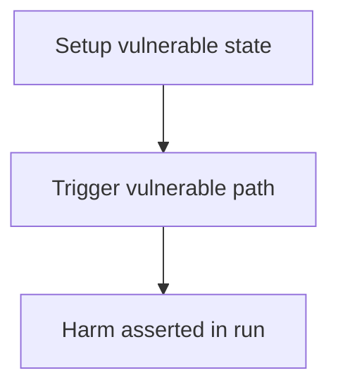

# Maia DAO — redeem() in beforeRedeem uses the wrong owner parameter

> **Vulnerability classes:** see taxonomy below

> **Reproduction:** a self-contained Foundry PoC that compiles & runs in an
> isolated project with **only `forge-std`** — no fork, no RPC, no `anvil_state`.
> Full trace: [output.txt](output.txt). PoC:
> [test/26041-h-07-redeem-in-beforeredeem-is-using-the-wrong-owner-paramet_exp.sol](test/26041-h-07-redeem-in-beforeredeem-is-using-the-wrong-owner-paramet_exp.sol).

<!-- non-defihacklabs -->
<!-- source-auditvault: https://github.com/Auditware/AuditVault/blob/main/findings/26041-h-07-redeem-in-beforeredeem-is-using-the-wrong-owner-paramet.md -->
<!-- date: 2023-05 -->

---

## Key info

| | |
|---|---|
| **Impact** | **HIGH** — beforeRedeem(receiver) accrues the wrong address; owner shares burned without accrue; 100 RWD stranded |
| **Protocol** | Maia DAO |
| **Finding** | Code4rena · reporter **bin2chen** |
| **Report** | [https://code4rena.com/reports/2023-05-maia](https://code4rena.com/reports/2023-05-maia) |
| **Source** | [AuditVault](https://github.com/Auditware/AuditVault/blob/main/findings/26041-h-07-redeem-in-beforeredeem-is-using-the-wrong-owner-paramet.md) |
| **Status** | Audit finding — reproduced as a standalone local PoC. |
| **Compiler** | `^0.8.24` (PoC) |

This is an **audit finding**, not a historical on-chain incident.

---

## TL;DR

1. redeem burns _owner shares but calls beforeRedeem(receiver).\n2. flywheel.accrue hits receiver (0 shares).\n3. Owner never accrues; rewards stranded in flywheel.

## Diagrams

## Impact

beforeRedeem(receiver) accrues the wrong address; owner shares burned without accrue; 100 RWD stranded

## Sources

- [AuditVault finding](https://github.com/Auditware/AuditVault/blob/main/findings/26041-h-07-redeem-in-beforeredeem-is-using-the-wrong-owner-paramet.md)
- [Code4rena report](https://code4rena.com/reports/2023-05-maia)
- Reduced synthetic: `test/26041-h-07-redeem-in-beforeredeem-is-using-the-wrong-owner-paramet.sol` (C2 local-deploy)
