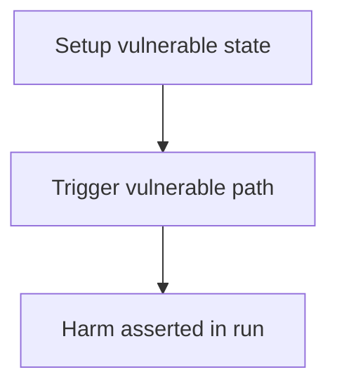

# Maia DAO — Adversary can poison depositNonce via retrieveDeposit and lock user deposits

> **Vulnerability classes:** see taxonomy below

> **Reproduction:** a self-contained Foundry PoC that compiles & runs in an
> isolated project with **only `forge-std`** — no fork, no RPC, no `anvil_state`.
> Full trace: [output.txt](output.txt). PoC:
> [test/26042-h-08-due-to-inadequate-checks-an-adversary-can-call-branchbr_exp.sol](test/26042-h-08-due-to-inadequate-checks-an-adversary-can-call-branchbr_exp.sol).

<!-- non-defihacklabs -->
<!-- source-auditvault: https://github.com/Auditware/AuditVault/blob/main/findings/26042-h-08-due-to-inadequate-checks-an-adversary-can-call-branchbr.md -->
<!-- date: 2023-05 -->

---

## Key info

| | |
|---|---|
| **Impact** | **HIGH** — Permissionless retrieveDeposit marks future nonce executed; user deposit of 1000 DEP locked on branch |
| **Protocol** | Maia DAO |
| **Finding** | Code4rena · reporter **xuwinnie** |
| **Report** | [https://code4rena.com/reports/2023-05-maia](https://code4rena.com/reports/2023-05-maia) |
| **Source** | [AuditVault](https://github.com/Auditware/AuditVault/blob/main/findings/26042-h-08-due-to-inadequate-checks-an-adversary-can-call-branchbr.md) |
| **Status** | Audit finding — reproduced as a standalone local PoC. |
| **Compiler** | `^0.8.24` (PoC) |

This is an **audit finding**, not a historical on-chain incident.

---

## TL;DR

1. Attacker calls retrieveDeposit(60) with no ownership check.\n2. Root marks nonce 60 executed.\n3. User deposit with nonce 60 is rejected on root; tokens locked on branch.

## Diagrams

## Impact

Permissionless retrieveDeposit marks future nonce executed; user deposit of 1000 DEP locked on branch

## Sources

- [AuditVault finding](https://github.com/Auditware/AuditVault/blob/main/findings/26042-h-08-due-to-inadequate-checks-an-adversary-can-call-branchbr.md)
- [Code4rena report](https://code4rena.com/reports/2023-05-maia)
- Reduced synthetic: `test/26042-h-08-due-to-inadequate-checks-an-adversary-can-call-branchbr.sol` (C2 local-deploy)
