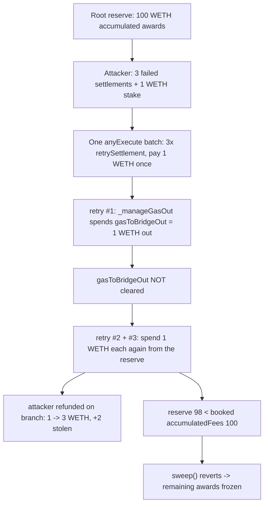

# Maia DAO — An attacker can steal Accumulated Awards from RootBridgeAgent by abusing retrySettlement()

> **Vulnerability classes:** vuln/accounting/gas-double-spend · vuln/loss-of-funds/reward-drain · vuln/dos/frozen-funds

> **Reproduction:** a self-contained Foundry PoC that compiles & runs in an
> isolated project with **only `forge-std`** — no fork, no RPC, no `anvil_state`.
> Full trace: [output.txt](output.txt). PoC:
> [test/26045-h-11-an-attacker-can-steal-accumulated-awards-from-rootbridg_exp.sol](test/26045-h-11-an-attacker-can-steal-accumulated-awards-from-rootbridg_exp.sol).

<!-- non-defihacklabs -->
<!-- source-auditvault: https://github.com/Auditware/AuditVault/blob/main/findings/26045-h-11-an-attacker-can-steal-accumulated-awards-from-rootbridg.md -->
<!-- date: 2023-05 -->

---

## Key info

| | |
|---|---|
| **Impact** | **HIGH** — an attacker reuses a single gas payment across many `retrySettlement` calls in one `anyExecute`, draining the RootBridgeAgent's accumulated awards and bricking `sweep()` on the resulting reserve/accounting mismatch |
| **Protocol** | [Maia DAO](https://maiadao.io/) — Ulysses omnichain (RootBridgeAgent gas accounting) |
| **Vulnerable code** | `RootBridgeAgent._retrySettlement` — `userFeeInfo.gasToBridgeOut` is read every retry but never cleared |
| **Bug class** | Gas-fee double-spend: one deposited `gasToBridgeOut` funds N bridge-outs |
| **Finding** | Code4rena — Maia, 2023-05 · #26045 · [H-11] · reporter **Voyvoda** |
| **Report** | [code4rena.com/reports/2023-05-maia](https://code4rena.com/reports/2023-05-maia) |
| **Source** | [AuditVault](https://github.com/Auditware/AuditVault/blob/main/findings/26045-h-11-an-attacker-can-steal-accumulated-awards-from-rootbridg.md) |
| **Status** | Audit finding — confirmed by Maia (judge: "Loss of yield = loss of funds. High"). Reproduced here as a standalone local PoC. |
| **Compiler** | `^0.8.24` (PoC) |

This is an **audit finding**, not a historical on-chain incident. The PoC keeps the
`retrySettlement` / `_retrySettlement` / `_manageGasOut` gas accounting verbatim
(including the blamed `settlementReference.gasToBridgeOut = userFeeInfo.gasToBridgeOut`
line) and reduces the omnichain plumbing (Multichain/anyCall relaying, AMM gas swaps,
`tx.gasprice`/`gasleft` fee math, VirtualAccount/MulticallRootRouter routing, branch
execution) to its economic effect so the double-spend is a measurable token drain.

---

## TL;DR

1. Inside a single `anyExecute` (`initialGas > 0`), `userFeeInfo.gasToBridgeOut` is set
   **once** from the user's single branch-chain gas payment.
2. Each `_retrySettlement` calls `_manageGasOut`, which swaps `userFeeInfo.gasToBridgeOut`
   worth of `wrappedNative` **out** of the Root reserve to fund the branch, then records
   `settlementReference.gasToBridgeOut = userFeeInfo.gasToBridgeOut` — but **never clears
   `userFeeInfo.gasToBridgeOut`**.
3. So a crafted `anyExecute` carrying **N** `retrySettlement` calls spends the same
   `gasToBridgeOut` **N times**, funded once by the user and **(N−1) times from the
   accumulated awards**.
4. The attacker is refunded the unused gas on the branch, netting **(N−1)·gasToBridgeOut**.
5. The Root's `wrappedNative` reserve no longer backs the booked `accumulatedFees`, so
   `sweep()` reverts and the remaining awards are **frozen**.
6. In the PoC: reserve = 100 WETH, `gasToBridgeOut` = 1 WETH, N = 3 → attacker **1 → 3
   WETH (+2 stolen)**, reserve left at **98** vs booked **100**, `sweep()` bricked.

---

## The vulnerable code

`_retrySettlement` records the gas but never resets it (verbatim):

```solidity
//Update Gas To Bridge Out
settlementReference.gasToBridgeOut = userFeeInfo.gasToBridgeOut; // @> never cleared -> reused by the next retry in the same anyExecute
```

`_manageGasOut` spends `userFeeInfo.gasToBridgeOut` from the reserve on every call (verbatim shape):

```solidity
if (_initialGas > 0) {
    (amountOut, gasToken) = _gasSwapOut(userFeeInfo.gasToBridgeOut, _toChain); // pulls the same value each retry
}
```

---

## Root cause

The gas-fee bookkeeping assumes `retrySettlement` is called at most once per `anyExecute`.
When several retries are batched into one `anyExecute` (routed via the VirtualAccount /
MulticallRootRouter), `userFeeInfo.gasToBridgeOut` is not consumed/zeroed between them, so
each retry re-spends the same paid gas out of the shared reserve — the accumulated awards.

## Attack walkthrough

From [output.txt](output.txt), reserve = 100 WETH of accumulated awards:

1. The attacker owns three "failed" settlements (targeting a remote branch) and a single
   1 WETH stake.
2. They submit one `anyExecute` carrying three `retrySettlement` calls, paying just one
   1 WETH `gasToBridgeOut`.
3. Each `_manageGasOut` sends 1 WETH out of the Root reserve to fund the branch, refunding
   the attacker; `userFeeInfo.gasToBridgeOut` is never cleared, so all three retries spend
   1 WETH each.
4. **Harm:** attacker **1 → 3 WETH (+2 stolen)**; the Root holds **98** WETH but still books
   **100** `accumulatedFees`, so `sweep()` reverts — the remaining awards are frozen.

A control test shows a **single** retry is fair (payment funds exactly one bridge-out, no
reserve touched) — proving the batching is what enables the theft.

## Diagrams



## Impact

- **Award theft:** the attacker drains `(N−1)·gasToBridgeOut` of accumulated awards per
  batched `anyExecute`; N is bounded only by block gas, so the drain can be large.
- **Frozen funds:** the reserve/`accumulatedFees` mismatch makes `sweep()` revert, locking
  whatever awards remain.

## Remediation

Clear the consumed gas after each retry — set `userFeeInfo.gasToBridgeOut = 0` (or track and
subtract available gas) inside `_retrySettlement` so a second retry in the same `anyExecute`
cannot re-spend it. Maia acknowledged the finding (migration to LayerZero planned).

## How to reproduce

```bash
cd ~/RustroverProjects/audits/evm-hack-registry/26045-h-11-an-attacker-can-steal-accumulated-awards-from-rootbridg_exp
forge test -vv
# Fully local — no fork, no RPC, no anvil_state required.
# Expected: both tests PASS; logs show attacker 1 -> 3 WETH, reserve 98 vs book 100, sweep bricked.
```

> Note: the omnichain relaying, AMM gas swaps, and `tx.gasprice`/`gasleft` fee math are
> reduced to their economic effect (each remote `_manageGasOut` moves `gasToBridgeOut` of
> wrappedNative out of the reserve and refunds it to the attacker); the `retrySettlement` /
> `_retrySettlement` / `_manageGasOut` gas-reuse logic and the blamed line are verbatim, so
> the one-payment / N-outflow double-spend and the reserve/accounting mismatch are faithful.

---

## Sources

- **AuditVault finding:** <https://github.com/Auditware/AuditVault/blob/main/findings/26045-h-11-an-attacker-can-steal-accumulated-awards-from-rootbridg.md>
- **Contest report:** <https://code4rena.com/reports/2023-05-maia>
- **Reduced source provenance:** `code-423n4/2023-05-maia@54a45beb1428d85999da3f721f923cbf36ee3d35` — `src/ulysses-omnichain/RootBridgeAgent.sol` (`retrySettlement` L244-252, `_retrySettlement` L550-585, `_manageGasOut` L743-767, `sweep` L1259-1264)

*Reference: finding **#26045** [H-11] by **Voyvoda** in the [Code4rena Maia review (May 2023)](https://code4rena.com/reports/2023-05-maia) · curated by [AuditVault](https://github.com/Auditware/AuditVault/blob/main/findings/26045-h-11-an-attacker-can-steal-accumulated-awards-from-rootbridg.md)*
