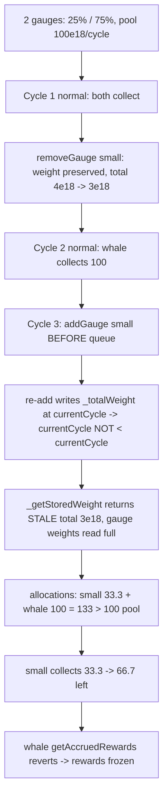

# Maia DAO — Re-adding a deprecated gauge in a new epoch before queueRewardsForCycle() leaves gauges without rewards

> **Vulnerability classes:** vuln/logic/reward-calculation · vuln/dos/frozen-funds · vuln/timing/stale-cycle-read

> **Reproduction:** a self-contained Foundry PoC that compiles & runs in an
> isolated project with **only `forge-std`** — no fork, no RPC, no `anvil_state`.
> Full trace: [output.txt](output.txt). PoC:
> [test/26047-h-13-re-adding-a-deprecated-gauge-in-a-new-epoch-before-call_exp.sol](test/26047-h-13-re-adding-a-deprecated-gauge-in-a-new-epoch-before-call_exp.sol).

<!-- non-defihacklabs -->
<!-- source-auditvault: https://github.com/Auditware/AuditVault/blob/main/findings/26047-h-13-re-adding-a-deprecated-gauge-in-a-new-epoch-before-call.md -->
<!-- date: 2023-05 -->

---

## Key info

| | |
|---|---|
| **Impact** | **HIGH** — re-adding a deprecated gauge in a new cycle before rewards are queued makes the reward math read a stale (too-low) total weight, over-allocating the pool so a gauge's `getAccruedRewards` reverts and its rewards are frozen (also front-runnable to DoS a chosen gauge) |
| **Protocol** | [Maia DAO](https://maiadao.io/) — ERC-20 Gauges / FlywheelGaugeRewards |
| **Vulnerable code** | `ERC20Gauges._addGauge` → `_writeGaugeWeight(_totalWeight, _add112, weight, currentCycle)` vs `_getStoredWeight` |
| **Bug class** | Stale-cycle read: the re-add bumps `_totalWeight.currentCycle` to the current cycle, so the stored (old) total is used |
| **Finding** | Code4rena — Maia, 2023-05 · #26047 · [H-13] · reporter **Voyvoda** |
| **Report** | [code4rena.com/reports/2023-05-maia](https://code4rena.com/reports/2023-05-maia) |
| **Source** | [AuditVault](https://github.com/Auditware/AuditVault/blob/main/findings/26047-h-13-re-adding-a-deprecated-gauge-in-a-new-epoch-before-call.md) |
| **Status** | Audit finding — confirmed and addressed by Maia. Reproduced here as a standalone local PoC. |
| **Compiler** | `^0.8.24` (PoC) |

This is an **audit finding**, not a historical on-chain incident. The PoC keeps the
`ERC20Gauges` weight/cycle accounting (`_addGauge`, `_writeGaugeWeight`,
`_getStoredWeight`, `calculateGaugeAllocation`) and the `FlywheelGaugeRewards`
queue/claim logic (`queueRewardsForCycle`, `_queueRewards`, `getAccruedRewards`)
verbatim; the minter stream is a fixed per-cycle mint and time is a settable clock
(so cycles advance without cheatcodes).

---

## TL;DR

1. When a gauge is deprecated (`removeGauge`), its weight is subtracted from
   `_totalWeight` but the gauge's own vote weight is **preserved** in storage.
2. Re-adding it (`addGauge` → `_addGauge`) re-applies that preserved weight with
   `_writeGaugeWeight(_totalWeight, _add112, weight, currentCycle)` — which sets
   `_totalWeight.currentCycle = currentCycle`.
3. If the re-add happens in a **new cycle but before `queueRewardsForCycle`**, then
   `calculateGaugeAllocation`'s `_getStoredWeight(_totalWeight, currentCycle)` takes
   the `currentCycle < currentCycle == false` branch and returns the **stale
   `storedWeight`** (the total *before* the re-add), while each gauge's own weight
   still reads at full value.
4. Per-gauge allocations therefore sum to **more than the reward pool** (here 4/3×),
   so the last gauge(s) to call `getAccruedRewards` **revert** — their rewards are frozen.
5. In the PoC (2 gauges, 25%/75%): the re-added 25% gauge takes 33.3e18 of the 100e18
   pool; the **75% whale** is booked 100e18 but only 66.7e18 remains → its claim reverts.

---

## The vulnerable code

`_addGauge` re-adds the preserved weight at the current cycle (verbatim):

```solidity
weight = _getGaugeWeight[gauge].currentWeight;
if (weight > 0) {
    _writeGaugeWeight(_totalWeight, _add112, weight, currentCycle); // @> sets _totalWeight.currentCycle = currentCycle
}
```

`_getStoredWeight` then returns the stale stored total this cycle (verbatim):

```solidity
function _getStoredWeight(Weight storage gaugeWeight, uint32 currentCycle) internal view returns (uint112) {
    return gaugeWeight.currentCycle < currentCycle ? gaugeWeight.currentWeight : gaugeWeight.storedWeight;
    //                              ^ false after the re-add -> returns the OLD storedWeight
}
```

---

## Root cause

`_getStoredWeight` assumes that if a `Weight`'s `currentCycle` equals the query cycle,
its `currentWeight` is not yet "committed" for this cycle and the `storedWeight`
should be used. The re-add writes `_totalWeight` at the current cycle, tripping that
condition, so the freshly increased total is ignored while each gauge's weight (last
written in an earlier cycle) is read at full value — an inconsistent snapshot that
over-allocates rewards.

## Attack walkthrough

From [output.txt](output.txt): two gauges split 25% / 75%, reward pool 100e18/cycle.

1. **Cycle 1** (normal): both gauges queue and collect (25 / 75).
2. The 25% gauge is **deprecated** (`removeGauge`) — its vote weight stays in storage.
3. **Cycle 2** (normal): only the 75% gauge is active; it collects 100.
4. **Cycle 3**: the 25% gauge is **re-added before** `queueRewardsForCycle`. The re-add
   sets `_totalWeight.currentCycle` to cycle 3, so the queue reads the **stale total
   (3e18)** instead of 4e18.
5. Allocations: 25% gauge = 100·1e18/3e18 = **33.3e18**, 75% gauge = 100·3e18/3e18 =
   **100e18** (sum 133e18 > 100e18 pool).
6. **Harm:** the re-added gauge collects 33.3e18 first; the **75% whale** then tries to
   collect its booked 100e18 but only 66.7e18 remains → `getAccruedRewards` reverts and
   the whale's rewards are frozen for the cycle. A malicious actor can front-run to force
   this on a chosen gauge.

## Diagrams



## Impact

- **Frozen rewards:** one or more gauges cannot withdraw their earned rewards for the
  cycle (`getAccruedRewards` reverts on the over-allocated pool).
- **Targeted DoS:** a malicious actor can watch for a re-add and front-run
  `getAccruedRewards` for every gauge except a chosen "whale", guaranteeing the whale is
  the one left short.

## Remediation

Only re-add gauges **after** rewards are queued in a cycle, or write the re-added weight
against the previous cycle so `_getStoredWeight` returns the correct current total. Maia
confirmed and addressed the finding.

## How to reproduce

```bash
cd ~/RustroverProjects/audits/evm-hack-registry/26047-h-13-re-adding-a-deprecated-gauge-in-a-new-epoch-before-call_exp
forge test -vv
# Fully local — no fork, no RPC, no anvil_state required.
# Expected: test PASSES; logs show small alloc 33.3e18 + whale alloc 100e18 vs pool 100e18,
# 66.7e18 left after the small gauge, and the whale gauge's claim bricked.
```

> Note: the minter reward stream is reduced to a fixed per-cycle mint and cycle
> progression uses an injected settable clock (no cheatcodes); the gauge weight/cycle
> accounting and the reward queue/claim logic are verbatim, so the stale-total
> over-allocation and the frozen-gauge revert are faithful.

---

## Sources

- **AuditVault finding:** <https://github.com/Auditware/AuditVault/blob/main/findings/26047-h-13-re-adding-a-deprecated-gauge-in-a-new-epoch-before-call.md>
- **Contest report:** <https://code4rena.com/reports/2023-05-maia>
- **Reduced source provenance:** `code-423n4/2023-05-maia@54a45beb1428d85999da3f721f923cbf36ee3d35` — `src/erc-20/ERC20Gauges.sol` (`_addGauge` L407-421, `_getStoredWeight` L92-94, `_writeGaugeWeight` L363-377, `calculateGaugeAllocation` L174-181) and `src/rewards/rewards/FlywheelGaugeRewards.sol` (`queueRewardsForCycle` L72-104, `_queueRewards` L169-197, `getAccruedRewards` L200-231)

*Reference: finding **#26047** [H-13] by **Voyvoda** in the [Code4rena Maia review (May 2023)](https://code4rena.com/reports/2023-05-maia) · curated by [AuditVault](https://github.com/Auditware/AuditVault/blob/main/findings/26047-h-13-re-adding-a-deprecated-gauge-in-a-new-epoch-before-call.md)*
