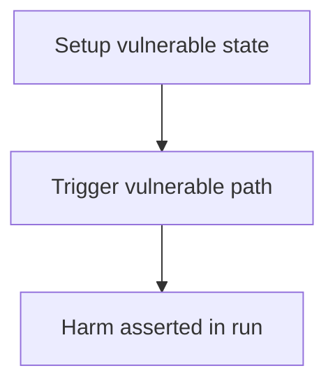

# Maia DAO — User may underpay for remote call ExecutionGas (missing Anycall premium)

> **Vulnerability classes:** see taxonomy below

> **Reproduction:** a self-contained Foundry PoC that compiles & runs in an
> isolated project with **only `forge-std`** — no fork, no RPC, no `anvil_state`.
> Full trace: [output.txt](output.txt). PoC:
> [test/26048-h-14-user-may-underpay-for-the-remote-call-executiongas-on-t_exp.sol](test/26048-h-14-user-may-underpay-for-the-remote-call-executiongas-on-t_exp.sol).

<!-- non-defihacklabs -->
<!-- source-auditvault: https://github.com/Auditware/AuditVault/blob/main/findings/26048-h-14-user-may-underpay-for-the-remote-call-executiongas-on-t.md -->
<!-- date: 2023-05 -->

---

## Key info

| | |
|---|---|
| **Impact** | **HIGH** — minExecCost omits premium; Anycall charges gasprice+premium; premium gap drains shared execution budget |
| **Protocol** | Maia DAO |
| **Finding** | Code4rena · reporter **xuwinnie** |
| **Report** | [https://code4rena.com/reports/2023-05-maia](https://code4rena.com/reports/2023-05-maia) |
| **Source** | [AuditVault](https://github.com/Auditware/AuditVault/blob/main/findings/26048-h-14-user-may-underpay-for-the-remote-call-executiongas-on-t.md) |
| **Status** | Audit finding — reproduced as a standalone local PoC. |
| **Compiler** | `^0.8.24` (PoC) |

This is an **audit finding**, not a historical on-chain incident.

---

## TL;DR

1. _payExecutionGas deposits gasprice * gas only.\n2. Anycall charges (gasprice+premium)*gas.\n3. Gap taken from other users shared executionBudget.

## Diagrams

## Impact

minExecCost omits premium; Anycall charges gasprice+premium; premium gap drains shared execution budget

## Sources

- [AuditVault finding](https://github.com/Auditware/AuditVault/blob/main/findings/26048-h-14-user-may-underpay-for-the-remote-call-executiongas-on-t.md)
- [Code4rena report](https://code4rena.com/reports/2023-05-maia)
- Reduced synthetic: `test/26048-h-14-user-may-underpay-for-the-remote-call-executiongas-on-t.sol` (C2 local-deploy)
