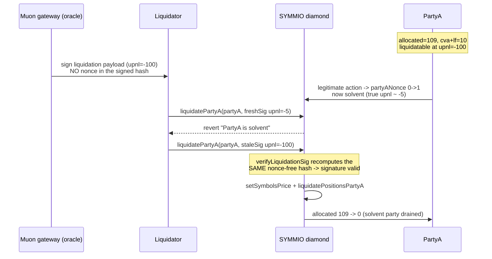

# SYMMIO `liquidatePartyA` accepts a replayable, nonce-free Muon liquidation signature

> **Vulnerability classes:** vuln/signature/replay · vuln/defi/liquidation · impact/loss-of-funds
>
> **Reproduction:** the test deploys the REAL audited SYMMIO liquidation facet + `LibMuon`
> signature verification, produces a genuinely-valid Muon *gateway* signature (the test holds
> the gateway key), and replays it after the liquidated party has become solvent — draining
> the party's entire allocated balance through the real liquidation path.

<!-- source-auditvault: https://github.com/Auditware/AuditVault/blob/main/findings/26346-h-1-liquidatepartya-requires-signature-which-doesnt-have-non.md -->
<!-- date: 2023-08 -->

## Root cause

`LibMuon.verifyLiquidationSig` builds the hash the Muon oracle signs from
`reqId`, `liquidationId`, `upnl`, `totalUnrealizedLoss`, `symbolIds`, `prices`, `timestamp`
and the chain id — **but no `partyANonces[partyA]` / `partyBNonces` term**
([`src/symm/contracts/libraries/LibMuon.sol`](src/symm/contracts/libraries/LibMuon.sol), the
`verifyLiquidationSig` payload). Every *other* Muon schema in the same file
(`verifyPartyAUpnl`, `verifyPairUpnl`, …) DOES include the party nonce, so their signatures
are invalidated the moment a party acts. The liquidation schema is the exception.

Because the signed hash is invariant under the nonce, a single valid liquidation signature
stays valid across a party's legitimate state changes. A liquidator (or the protocol, or a
malicious party racing a close) can therefore submit a **stale** liquidation authorization —
carrying an out-of-date, more-negative `upnl` — against a party that is no longer
liquidatable. `liquidatePartyA` trusts the signature's stale `upnl` for the
`availableBalance < 0` solvency check, so the solvent party is liquidated anyway and loses
its funds. The recommended fix (SYMMIO PR #34) is to include the partyA/partyB nonces in the
liquidation signature.

Note: the vendored `LibMuon.verifyTSSAndGateway` body is commented out by the SYMMIO devs
"for testing" — their own comment states it must be enabled in the production-deployed
version. The PoC restores the production gateway-ECDSA check so the signature is genuinely
verified; the vulnerable `verifyLiquidationSig` schema is left byte-for-byte as audited.

## Exploit walkthrough (numbers from the test)

PartyA has `allocated = 109`, an open LONG position with `cva = 6`, `mm = 10`, `lf = 4`
(so `cva + lf = 10`). `partyAAvailableBalanceForLiquidation(upnl) = allocated - (cva + lf) + upnl`.

1. **Sign while liquidatable (nonce 0).** At `upnl = -100`, available `= 109 - 10 - 100 = -1 < 0`,
   so the gateway signs a liquidation payload for partyA. No nonce is bound.
2. **PartyA legitimately acts.** `partyANonces[partyA]` advances to 1 and partyA's true position
   is now solvent (real `upnl ≈ -5` → available `= 109 - 10 - 5 = 94 > 0`). A correctly-signed
   fresh signature carrying `upnl = -5` is rejected by the real guard:
   `"LiquidationFacet: PartyA is solvent"`.
3. **Replay the stale signature.** The old signature still passes the real
   `verifyLiquidationSig` at nonce 1 (the hash omits the nonce) and its stale `upnl = -100`
   makes `available = -1 < 0`, so `liquidatePartyA` marks the solvent partyA for liquidation.
4. **Finish the liquidation** with the *same* signature (`setSymbolsPrice`) and
   `liquidatePositionsPartyA`. PartyA's entire `allocated` balance is zeroed:
   **`109 → 0`.**

`testSchemaOmitsNonce` additionally proves the root cause at the hash level: the liquidation
hash is byte-identical at nonce 0 and nonce 1 (replayable), whereas the nonce-bearing
`verifyPartyAUpnl` schema's hash changes (not replayable).

## Reproduction

```bash
cd 26346-h-1-liquidatepartya-requires-signature-which-doesnt-have-non_exp
../_shared/run-poc/run_poc.sh 26346-h-1-liquidatepartya-requires-signature-which-doesnt-have-non_exp -vvvvv
```

Expected result: `2 passed`. `testExploit` asserts partyA's allocated balance goes from
`109e18` to `0` via the replayed stale signature; `testSchemaOmitsNonce` asserts the
liquidation hash ignores the nonce while the party-upnl hash binds it. See
[`test/26346-h-1-liquidatepartya-requires-signature-which-doesnt-have-non_exp.sol`](test/26346-h-1-liquidatepartya-requires-signature-which-doesnt-have-non_exp.sol).



## Sources

- [AuditVault finding #26346](https://github.com/Auditware/AuditVault/blob/main/findings/26346-h-1-liquidatepartya-requires-signature-which-doesnt-have-non.md)
- [Sherlock 2023-08 SYMMIO contest](https://github.com/sherlock-audit/2023-08-symmetrical) — vulnerable code under `symmio-core/`
- [`LibMuon.verifyLiquidationSig`](https://github.com/sherlock-audit/2023-08-symmetrical/blob/main/symmio-core/contracts/libraries/LibMuon.sol#L54-L67)
- [SYMMIO fix PR #34 — add partyA/partyB nonces to the liquidation signature](https://github.com/SYMM-IO/symmio-core/pull/34)
