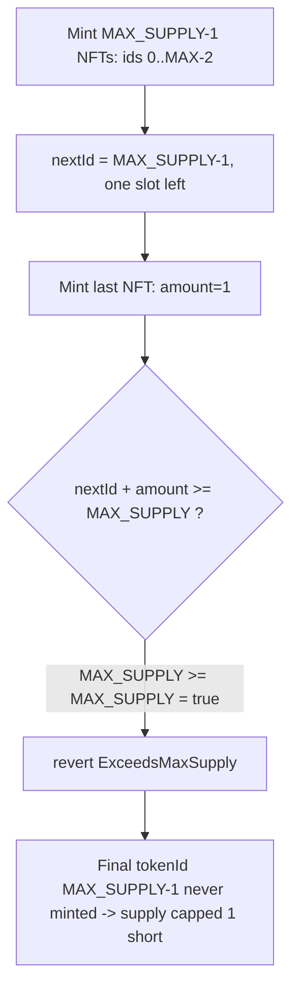

# MuseumOfMahomes — last NFT of the supply can't be minted (off-by-one `>=`)

> **Vulnerability classes:** vuln/logic/off-by-one · vuln/dos/permanent-mint-block · vuln/loss-of-funds/protocol-value-loss

> **Reproduction:** a self-contained Foundry PoC that compiles & runs in an
> isolated project with **only `forge-std`** — no fork, no RPC, no `anvil_state`.
> Full trace: [output.txt](output.txt). PoC:
> [test/26477-h-01-last-nft-from-the-supply-cant-be-minted-pashov-none-mus_exp.sol](test/26477-h-01-last-nft-from-the-supply-cant-be-minted-pashov-none-mus_exp.sol).

<!-- non-defihacklabs -->
<!-- source-auditvault: https://github.com/Auditware/AuditVault/blob/main/findings/26477-h-01-last-nft-from-the-supply-cant-be-minted-pashov-none-mus.md -->
<!-- date: 2023-09 -->

---

## Key info

| | |
|---|---|
| **Impact** | **HIGH** — the final NFT of the collection (tokenId `MAX_SUPPLY-1`) can never be minted; the supply is permanently capped one below its intended `MAX_SUPPLY` (value loss to the protocol) |
| **Protocol** | MuseumOfMahomes — ERC721 NFT collection (mint / mintPhysical) |
| **Vulnerable code** | `MuseumOfMahomes.mint` / `mintPhysical` — `if (nextId + amount >= MAX_SUPPLY) revert ExceedsMaxSupply();` |
| **Bug class** | Off-by-one: `>=` should be `>` |
| **Finding** | Pashov Audit Group — MuseumOfMahomes, 2023-09 · #26477 · reporter **Pashov** |
| **Report** | [Pashov / 2023-09-01-MuseumOfMahomes](https://github.com/solodit/solodit_content/blob/main/reports/Pashov%20Audit%20Group/2023-09-01-MuseumOfMahomes.md) |
| **Source** | [AuditVault](https://github.com/Auditware/AuditVault/blob/main/findings/26477-h-01-last-nft-from-the-supply-cant-be-minted-pashov-none-mus.md) |
| **Status** | Audit finding — caught in review (fixed before/at deploy; the on-chain contract uses `>`). Reproduced here from the audited pre-fix source. |
| **Compiler** | `^0.8.21` (PoC) |

This is an **audit finding**, not a historical on-chain incident. The PoC copies the
audited `mint()` body verbatim (with the vulnerable `>=` guard) and replaces the
solady ERC721 base and unrelated metadata/delegation/royalty code with a minimal
faithful `_mint`. `MAX_SUPPLY` is scaled from 3090 to 5 so the in-browser recorder
does not replay thousands of mint iterations; the off-by-one boundary is independent
of that constant's value.

---

## TL;DR

1. `mint()` guards the supply with `if (nextId + amount >= MAX_SUPPLY) revert ExceedsMaxSupply();`.
2. Valid tokenIds are `0 .. MAX_SUPPLY-1` (that is `MAX_SUPPLY` tokens), and minting
   starts at `nextId = 0`.
3. When `nextId == MAX_SUPPLY-1` and `amount == 1`, the sum equals `MAX_SUPPLY`
   *exactly* — a mint that fills the collection — yet `>=` treats it as exceeding
   the supply and reverts.
4. The final tokenId (`MAX_SUPPLY-1`) can therefore **never** be minted. The
   collection is permanently one NFT short of its advertised supply — direct value
   loss to the protocol.

---

## The vulnerable code

`MuseumOfMahomes.mint` (body copied verbatim from the audited source; `@>` is the bug):

```solidity
function mint(address to, uint256 amount, bool mintBoxSet) external payable {
    if (msg.value != amount * price && !treasury[msg.sender]) revert WrongEthAmount();
    if (amount == 0) revert MintZero();
    if (nextId + amount >= MAX_SUPPLY) revert ExceedsMaxSupply();   // @> off-by-one: `>=` blocks the last NFT
    ...
    unchecked {
        uint256 length = nextId + amount;
        for (uint256 tokenId = nextId; tokenId < length; ++tokenId) {
            _mint(to, tokenId);
        }
        nextId += amount;
        totalSupply += amount;
    }
}
```

`mintPhysical()` carries the identical guard.

---

## Root cause

`MAX_SUPPLY` is a *count* (3090 tokens), and the highest valid tokenId is
`MAX_SUPPLY-1`. Reaching a full collection means `nextId + amount == MAX_SUPPLY`. The
`>=` comparison rejects that boundary case, so the last unit is unreachable. The
correct guard is `>`: it only rejects sums that would *exceed* the supply.

## Attack walkthrough

From [output.txt](output.txt) (PoC uses `MAX_SUPPLY = 5`):

1. Mint `MAX_SUPPLY-1 = 4` NFTs (tokenIds 0..3). The guard `4 >= 5` is false, so this
   succeeds; `nextId` becomes 4, one slot remaining.
2. Attempt to mint the final NFT (`amount = 1`). Now `nextId + amount = 5`, and
   `5 >= 5` is true → `ExceedsMaxSupply()` → revert.
3. **HARM:** tokenId 4 (the 3090th NFT in production) is never minted; `totalSupply`
   is stuck at `MAX_SUPPLY-1`. A control mint of the last NFT reverts with
   `ExceedsMaxSupply` — proving the `>=` is what blocks it.

## Diagrams



## Remediation

```diff
- if (nextId + amount >= MAX_SUPPLY) revert ExceedsMaxSupply();
+ if (nextId + amount >  MAX_SUPPLY) revert ExceedsMaxSupply();
```

Apply the same change in both `mint` and `mintPhysical`.

## How to reproduce

```bash
cd ~/RustroverProjects/audits/evm-hack-registry/26477-h-01-last-nft-from-the-supply-cant-be-minted-pashov-none-mus_exp
forge test -vvv
# Fully local — no fork, no RPC, no anvil_state required.
# Expected: test PASSES — all-but-one mints succeed, the final NFT reverts with
#           ExceedsMaxSupply, and tokenId MAX_SUPPLY-1 stays unminted.
```

PoC source: [test/26477-h-01-last-nft-from-the-supply-cant-be-minted-pashov-none-mus_exp.sol](test/26477-h-01-last-nft-from-the-supply-cant-be-minted-pashov-none-mus_exp.sol)
— the verbatim vulnerable `mint()` plus a driver that mints all-but-one and shows the
final NFT is un-mintable.

> Note: `MAX_SUPPLY` is reduced 3090 → 5 and the ERC721 base is a minimal faithful
> stand-in (real MuseumOfMahomes uses solady ERC721). The off-by-one guard and its
> revert are reproduced exactly; only the supply magnitude is scaled for recording.

---

*Reference: finding **#26477** ([H-01]) by **Pashov** in the [Pashov Audit Group MuseumOfMahomes review (Sep 2023)](https://github.com/solodit/solodit_content/blob/main/reports/Pashov%20Audit%20Group/2023-09-01-MuseumOfMahomes.md) · curated by [AuditVault](https://github.com/Auditware/AuditVault/blob/main/findings/26477-h-01-last-nft-from-the-supply-cant-be-minted-pashov-none-mus.md)*
