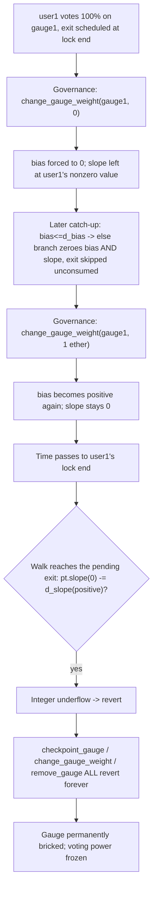
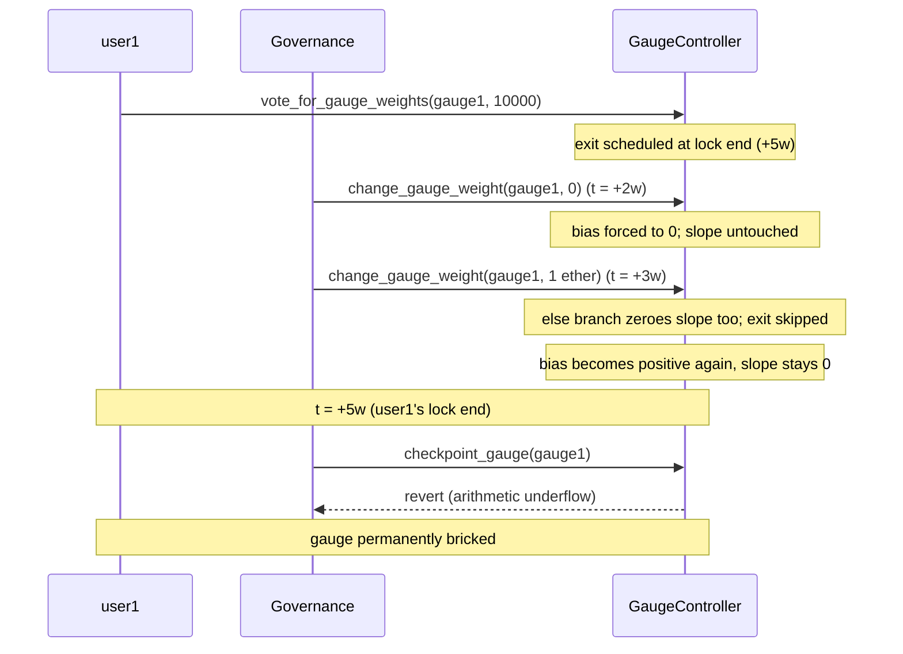

# Canto (veRWA) — an integer underflow can permanently DoS a gauge in `GaugeController`

> **Vulnerability classes:** vuln/arithmetic/underflow · vuln/dos/frozen-funds · vuln/logic/incomplete-state-reset

> **Reproduction:** a self-contained Foundry PoC that compiles & runs in an
> isolated project with **only `forge-std`** — no fork, no RPC, no `anvil_state`.
> Full trace: [output.txt](output.txt). PoC:
> [test/26973-h-05-it-is-possible-to-dos-all-the-functions-related-to-some_exp.sol](test/26973-h-05-it-is-possible-to-dos-all-the-functions-related-to-some_exp.sol).

<!-- non-defihacklabs -->
<!-- source-auditvault: https://github.com/Auditware/AuditVault/blob/main/findings/26973-h-05-it-is-possible-to-dos-all-the-functions-related-to-some.md -->
<!-- date: 2023-08 -->

**AuditVault taxonomy:** `lang/solidity` · `platform/code4rena` · `has/github` · `has/poc` · `severity/high` · `vuln/arithmetic/underflow` · `vuln/dos/frozen-funds` · `impact/mev/frontrun` · genome: `underflow` · `frozen-funds` · `frontrun` · `dos-resistance` · `integer-bounds` · `timestamp-dependence` · `vote-delegation-loop`

---

## Key info

| | |
|---|---|
| **Impact** | **HIGH** — a single governance weight decrease can permanently brick a gauge: every function touching it (including removal) reverts forever, freezing all voting power allocated to it |
| **Protocol** | [Canto veRWA](https://code4rena.com/reports/2023-08-verwa) — `GaugeController.sol`, a Solidity port of Curve DAO's gauge weight voting system |
| **Vulnerable code** | `GaugeController._get_weight()` — `pt.slope -= d_slope;` without checking `pt.slope >= d_slope` |
| **Bug class** | Integer underflow from an incomplete state reset: `change_gauge_weight` overwrites a checkpoint's `bias` but never its `slope` |
| **Finding** | Code4rena — Canto veRWA, 2023-08 · #26973 (H-05) · reporter **bart1e** |
| **Report** | [2023-08-verwa](https://code4rena.com/reports/2023-08-verwa) |
| **Source** | [AuditVault](https://github.com/Auditware/AuditVault/blob/main/findings/26973-h-05-it-is-possible-to-dos-all-the-functions-related-to-some.md) |
| **Status** | Audit finding — caught in review (not exploited on-chain). Reproduced here as a standalone local PoC. |
| **Compiler** | `^0.8.24` (PoC, `via-ir`) |

This is an **audit finding**, not a historical on-chain incident. `GaugeController`
is kept essentially **verbatim** from the audited repo (only its `VotingEscrow`
dependency is replaced by a minimal configurable mock), so the blamed
`pt.slope -= d_slope;` line executes exactly as in the audited code.

---

## TL;DR

1. Users vote their voting power onto a gauge. Each vote schedules a **future
   exit** — when the voter's lock ends, `changes_weight[gauge][lockEnd]`
   records how much slope should be subtracted from the gauge's running total
   at that point.
2. Governance later **decreases the gauge's weight** via `change_gauge_weight`
   — a perfectly ordinary admin action the code explicitly anticipates. This
   overwrites the checkpoint's `bias` to a smaller (even `0`) value but **never
   touches `slope`**.
3. Once `bias` is pinned at (or decays to) `0`, the checkpoint loop keeps
   taking the "already zero" branch every week, **silently skipping over** any
   pending vote-exits without ever consuming them from `changes_weight`.
4. Governance later **raises the weight again** (e.g. to re-incentivize the
   gauge). The checkpoint now has a positive `bias` but `slope` is still `0`.
5. The next time the checkpoint loop reaches one of those skipped, still-
   pending exits, it computes `pt.slope -= d_slope` with `pt.slope == 0` and
   `d_slope > 0` — an **integer underflow** that reverts.
6. HARM: **every** function that touches the gauge — `checkpoint_gauge`,
   `change_gauge_weight`, `vote_for_gauge_weights`, and even `remove_gauge` —
   calls `_get_weight` first, so the revert is now permanent. The gauge is
   bricked forever and all voting power allocated to it is frozen.

---

## The vulnerable code

`_get_weight`'s catch-up loop (verbatim, `GaugeController.sol`):

```solidity
function _get_weight(address _gauge_addr) private returns (uint256) {
    uint256 t = time_weight[_gauge_addr];
    if (t > 0) {
        Point memory pt = points_weight[_gauge_addr][t];
        for (uint256 i; i < 500; ++i) {
            if (t > block.timestamp) break;
            t += WEEK;
            uint256 d_bias = pt.slope * WEEK;
            if (pt.bias > d_bias) {
                pt.bias -= d_bias;
                uint256 d_slope = changes_weight[_gauge_addr][t];
                pt.slope -= d_slope;               // @> VULN: no floor check
            } else {
                pt.bias = 0;
                pt.slope = 0;
            }
            points_weight[_gauge_addr][t] = pt;
            if (t > block.timestamp) time_weight[_gauge_addr] = t;
        }
        return pt.bias;
    } else {
        return 0;
    }
}
```

Governance's weight override only ever writes `bias`:

```solidity
function _change_gauge_weight(address _gauge, uint256 _weight) internal {
    uint256 old_gauge_weight = _get_weight(_gauge);
    uint256 old_sum = _get_sum();
    uint256 next_time = ((block.timestamp + WEEK) / WEEK) * WEEK;

    points_weight[_gauge][next_time].bias = _weight;   // @> slope at next_time is left untouched
    time_weight[_gauge] = next_time;
    ...
}
```

---

## Root cause

The checkpoint's `bias` and `slope` are supposed to evolve together — `slope`
is only ever meant to be reduced by consuming a scheduled `changes_weight`
entry exactly when the walk reaches that entry's timestamp. `change_gauge_weight`
breaks this invariant by rewriting `bias` out of band. Once `bias` is forced to
(or naturally decays to) `0`, `slope` gets zeroed too via the `else` branch —
but **without consuming** whatever `changes_weight` entries lie ahead. Those
entries are permanently orphaned: future walks only ever look **forward** from
the current checkpoint, never re-reading a timestamp already passed. If
governance later raises the weight again before the walk reaches one of those
orphaned entries, the checkpoint is left with a **positive bias and a zero
slope** — and the very next scheduled exit the walk reaches underflows.

## Preconditions

- At least one vote has been cast on the gauge, scheduling a future exit.
- Governance decreases the gauge's weight (to `0` or any value low enough to
  reach the `else` branch) while that exit is still unprocessed — an
  explicitly anticipated, ordinary admin action (the code's own `else` branch
  exists to handle exactly this).
- Governance later raises the weight again before the walk has caught up to
  the pending exit.

**Frontrunning note (from the finding):** it is also possible for a whale to
front-run a `change_gauge_weight` call that lowers the weight to some value
`x`, allocate exactly `x` voting power to the gauge, then immediately withdraw
it — leaving the gauge at weight `0` and forcing governance's hand exactly as
above. So it is enough that governance decreases a gauge's weight **at any
point** — no cooperation or malice from governance is required.

## Attack walkthrough

From [output.txt](output.txt) (`test_fullTimeWarpReproduction`, using clean
WEEK-aligned numbers to make every step independently verifiable):

1. `user1` votes 100% on `gauge1` with a lock ending in exactly 5 weeks.
2. Two weeks later, governance calls `change_gauge_weight(gauge1, 0)`. The
   internal catch-up naturally decays `bias`, then the call force-overwrites
   it to `0` — `slope` is left at `user1`'s nonzero value.
3. One week later, governance raises the weight: `change_gauge_weight(gauge1, 1 ether)`.
   This call's own catch-up sees `bias == 0`, takes the `else` branch, and
   zeroes `slope` too — **skipping over** `user1`'s scheduled exit (still one
   week away) without consuming it. The weight override then writes a
   positive `bias` at that same checkpoint, with `slope` still `0`.
4. At exactly `user1`'s lock end (5 weeks after the vote, one week after the
   raise), **any** call touching the gauge walks forward into the pending
   exit: `pt.slope (0) -= d_slope (positive)` underflows.
5. **HARM:** `checkpoint_gauge`, `change_gauge_weight`, and `remove_gauge` all
   revert. The gauge — and every user's voting power on it — is permanently
   stuck. The control test `test_control_noPriorZeroing_neverUnderflows`
   confirms the same multi-week catch-up never underflows when governance
   never zeroed the weight first, isolating that step as the root cause.

## Diagrams





## Remediation

Per the report, guard the subtraction:

```solidity
if (pt.slope >= d_slope) {
    pt.slope -= d_slope;
} else {
    pt.slope = 0;
}
```

## How to reproduce

```bash
cd ~/RustroverProjects/audits/evm-hack-registry/26973-h-05-it-is-possible-to-dos-all-the-functions-related-to-some_exp
forge test -vvv
# Fully local — no fork, no RPC, no anvil_state required.
# Expected: all three tests PASS:
#   test_exploit                          (self-contained Exploit, precondition planted via vm.store)
#   test_fullTimeWarpReproduction         (independent rebuild using REAL vm.warp across several weeks)
#   test_control_noPriorZeroing_neverUnderflows  (control: no prior zeroing -> no underflow)
```

PoC source: [test/26973-h-05-it-is-possible-to-dos-all-the-functions-related-to-some_exp.sol](test/26973-h-05-it-is-possible-to-dos-all-the-functions-related-to-some_exp.sol).

> **Why the storage-seeding step:** the cheatcode-free `Exploit.run()` (shared
> between the registry test and the browser Playground) executes at a single
> fixed `block.timestamp`, so it cannot itself fast-forward the several real
> weeks the bug's precondition needs. `test_exploit` plants exactly the
> end-state that multi-week sequence produces directly into `GaugeController`'s
> storage via `vm.store` (the Playground config does the identical thing via
> its `setup.steps`, which run before the traced attack call) — every effect of
> `run()` itself, including the underflow and the resulting permanent DoS, is
> then produced by `GaugeController`'s real, unmodified code executing
> normally. `test_fullTimeWarpReproduction` independently confirms the same
> outcome using only real `vm.warp` calls and ordinary contract interactions,
> with no storage shortcuts at all.

> Note: `GaugeController` here is a faithful, near-verbatim reduction of
> `src/GaugeController.sol` from the audited repo
> ([code-423n4/2023-08-verwa@a693b4d](https://github.com/code-423n4/2023-08-verwa/blob/a693b4db05b9e202816346a6f9cada94f28a2698/src/GaugeController.sol)) —
> only the `VotingEscrow` dependency is replaced by a minimal mock exposing the
> two view functions `vote_for_gauge_weights` reads. Every blamed line and the
> checkpoint/weight-override control-flow are unchanged from the audited source.

---

*Reference: finding **#26973 (H-05)** by **bart1e** in the [Code4rena Canto veRWA review (Aug 2023)](https://code4rena.com/reports/2023-08-verwa) · curated by [AuditVault](https://github.com/Auditware/AuditVault/blob/main/findings/26973-h-05-it-is-possible-to-dos-all-the-functions-related-to-some.md)*
