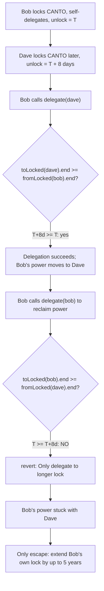
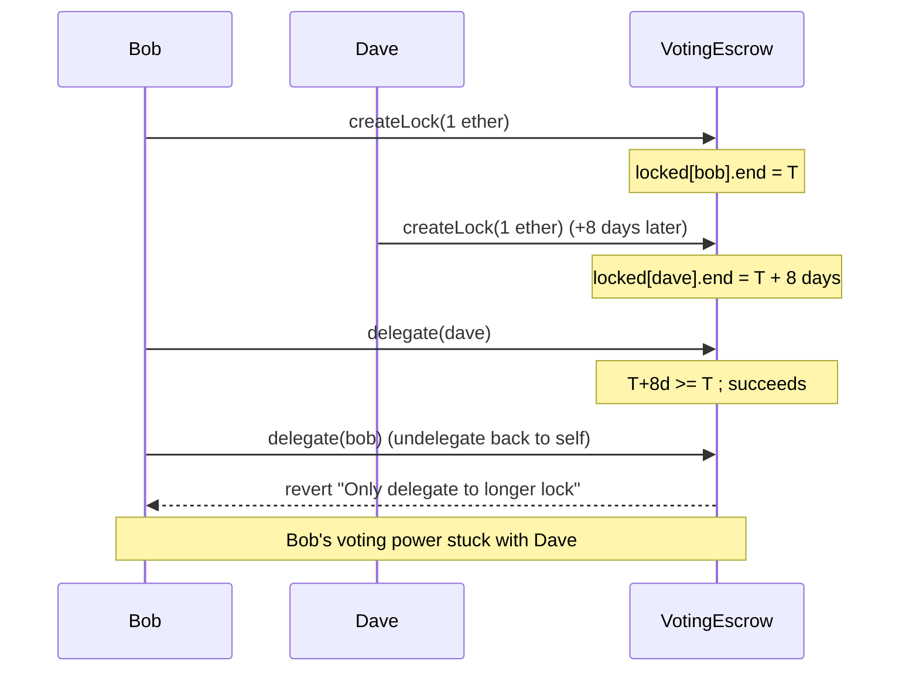

# Canto (veRWA) — undelegating back to yourself can force a 5-year lock extension

> **Vulnerability classes:** vuln/logic/wrong-comparison-operand · vuln/governance/forced-lock-extension · vuln/access-control/missing-caller-check

> **Reproduction:** a self-contained Foundry PoC that compiles & runs in an
> isolated project with **only `forge-std`** — no fork, no RPC, no `anvil_state`.
> Full trace: [output.txt](output.txt). PoC:
> [test/26974-h-06-users-may-be-forced-into-long-lock-times-to-be-able-to_exp.sol](test/26974-h-06-users-may-be-forced-into-long-lock-times-to-be-able-to_exp.sol).

<!-- non-defihacklabs -->
<!-- source-auditvault: https://github.com/Auditware/AuditVault/blob/main/findings/26974-h-06-users-may-be-forced-into-long-lock-times-to-be-able-to.md -->
<!-- date: 2023-08 -->

**AuditVault taxonomy:** `lang/solidity` · `platform/code4rena` · `has/github` · `has/poc` · `severity/high` · `sector/governance` · `sector/staking` · genome: `missing-modifier` · `locked-funds` · `vote-delegation-loop`

---

## Key info

| | |
|---|---|
| **Impact** | **HIGH** — a user who delegates to a lock created even one second later than their own can be permanently blocked from undelegating back to themselves without extending their own lock by up to 5 years |
| **Protocol** | [Canto veRWA](https://code4rena.com/reports/2023-08-verwa) — `VotingEscrow.sol`, forked from FIAT DAO's `VotingEscrow` |
| **Vulnerable code** | `VotingEscrow.delegate()` — `require(toLocked.end >= fromLocked.end, "Only delegate to longer lock")` |
| **Bug class** | Wrong comparison operand: the check compares against the lock being vacated, not the caller's own lock |
| **Finding** | Code4rena — Canto veRWA, 2023-08 · #26974 (H-06) · reporter **ADM** |
| **Report** | [2023-08-verwa](https://code4rena.com/reports/2023-08-verwa) |
| **Source** | [AuditVault](https://github.com/Auditware/AuditVault/blob/main/findings/26974-h-06-users-may-be-forced-into-long-lock-times-to-be-able-to.md) |
| **Status** | Audit finding — caught in review (not exploited on-chain). Reproduced here as a standalone local PoC. |
| **Compiler** | `^0.8.24` (PoC, `via-ir`) |

This is an **audit finding**, not a historical on-chain incident. `VotingEscrow`
is kept essentially **verbatim** from the audited repo (only OpenZeppelin's
`ReentrancyGuard` is replaced by a one-line inline guard), so the blamed
`require(toLocked.end >= fromLocked.end, ...)` line executes exactly as in the
audited code.

---

## TL;DR

1. Bob locks CANTO for the (fixed) 5-year duration and, by default, self-delegates.
2. Bob delegates his voting power to Dave, whose lock happens to unlock
   **later** than Bob's own (the ordinary case whenever two locks were not
   created in the exact same block — `VotingEscrow` always resets the lock
   duration to a fixed 5 years on every action, so absolute unlock times never
   converge again once they diverge).
3. Later, Bob wants his voting power back and calls `delegate(bob)` — the
   documented way to undelegate.
4. **Blocked.** `delegate()` checks `toLocked.end >= fromLocked.end` where
   `fromLocked` is **Dave's** lock (the one being vacated), not Bob's own. Since
   Bob's lock unlocks earlier than Dave's, the check fails.
5. HARM: Bob cannot reclaim his own voting power without first extending his
   **own** lock by up to the full 5-year `LOCKTIME` — an unwanted, potentially
   very costly commitment (5 years of price risk on locked CANTO) just to undo
   a delegation he is entitled to reverse.

---

## The vulnerable code

`delegate()` (verbatim, `VotingEscrow.sol`):

```solidity
function delegate(address _addr) external nonReentrant {
    LockedBalance memory locked_ = locked[msg.sender];
    require(locked_.amount > 0, "No lock");
    require(locked_.delegatee != _addr, "Already delegated");
    ...
    if (delegatee == msg.sender) {
        // Delegate
        fromLocked = locked_;
        toLocked = locked[_addr];
    } else if (_addr == msg.sender) {
        // Undelegate
        fromLocked = locked[delegatee];   // @> the lock being vacated
        toLocked = locked_;                // @> the caller's OWN lock
    } else {
        ...
    }
    require(toLocked.amount > 0, "Delegatee has no lock");
    require(toLocked.end > block.timestamp, "Delegatee lock expired");
    require(toLocked.end >= fromLocked.end, "Only delegate to longer lock"); // @> VULN
    ...
}
```

In the **undelegate** branch, `toLocked` is set to the caller's own lock
(`locked_`) and `fromLocked` is the lock being vacated (the old delegatee's).
The check then requires the caller's own lock (`toLocked`) to unlock **no
earlier** than the old delegatee's lock (`fromLocked`) — exactly backwards from
what "give me my own power back" should require.

## Root cause

The check is meant to stop voting power from outliving the CANTO backing it —
i.e., you should only be able to delegate power INTO a lock that unlocks at
least as late as the power's own origin. That's the right rule for the
**delegate** direction. For the **undelegate** direction, the "origin" and the
"destination" are the SAME lock (the caller's own) — but the code still
compares against the OLD delegatee's lock, a value that has nothing to do with
whether the caller is entitled to their own power back.

## Preconditions

- The caller has delegated their voting power to another lock.
- That other lock's unlock time is later than the caller's own current lock's
  unlock time — the ordinary case, since two locks created even one second
  apart in a system with a fixed rolling lock duration will (almost) never
  share the exact same absolute unlock time again.

## Attack walkthrough

From [output.txt](output.txt) (`test_realTimeGapReproduction`, using a real
8-day gap between the two `createLock` calls):

1. Bob locks `1 ether` of CANTO — self-delegated, unlock time `T`.
2. 8 real days later, Dave locks `1 ether` — unlock time `T + 8 days` (later
   than Bob's).
3. Bob delegates to Dave: `delegate(dave)` succeeds (`T+8d >= T`).
4. Bob calls `delegate(bob)` to reclaim his power: **reverts** `"Only delegate
   to longer lock"` (`T < T+8d`).
5. **HARM:** Bob's voting power remains stuck with Dave. The only way out is
   for Bob to extend his own lock — up to the full 5-year `LOCKTIME` — purely
   to satisfy a check that has nothing to do with his own entitlement to his
   own power. The control test `test_control_sameEpoch_canUndelegate` confirms
   that when both locks share the exact same unlock time, undelegation works
   fine — isolating the lock-time **mismatch**, not delegation itself, as the
   root cause.

## Diagrams





## Remediation

Per the report, compare against the caller's own current lock instead:

```solidity
require(toLocked.end >= locked_.end, "Only delegate to self or longer lock");
```

## How to reproduce

```bash
cd ~/RustroverProjects/audits/evm-hack-registry/26974-h-06-users-may-be-forced-into-long-lock-times-to-be-able-to_exp
forge test -vvv
# Fully local — no fork, no RPC, no anvil_state required.
# Expected: all three tests PASS:
#   test_exploit                         (self-contained Exploit; lock-time gap planted via vm.store)
#   test_realTimeGapReproduction         (independent rebuild using a REAL 8-day gap between createLock calls)
#   test_control_sameEpoch_canUndelegate (control: identical unlock times -> undelegation works fine)
```

PoC source: [test/26974-h-06-users-may-be-forced-into-long-lock-times-to-be-able-to_exp.sol](test/26974-h-06-users-may-be-forced-into-long-lock-times-to-be-able-to_exp.sol).

> **Why the storage-seeding step:** `VotingEscrow`'s lock duration is always
> reset to a fixed 5 years from "now", so two `createLock` calls made at the
> SAME instant (the only option inside a cheatcode-free, single-timestamp
> `run()` — see the synthetic file's header) get an IDENTICAL unlock time.
> `test_exploit` bumps Dave's `locked[dave].end` by exactly one WEEK via
> `vm.store` — representing Dave having locked one epoch later than Bob (the
> Playground config does the identical thing via its `setup.steps`, which run
> before the traced attack call). Every effect of `run()` itself — Bob
> delegating to Dave and then being unable to undelegate — is produced by
> `VotingEscrow`'s real, unmodified `delegate()` logic executing normally.
> `test_realTimeGapReproduction` independently confirms the same outcome using
> only a real elapsed 8-day gap between the two `createLock` calls, with no
> storage shortcuts at all.

> Note: `VotingEscrow` here is a faithful, near-verbatim reduction of
> `src/VotingEscrow.sol` from the audited repo
> ([code-423n4/2023-08-verwa@a693b4d](https://github.com/code-423n4/2023-08-verwa/blob/a693b4db05b9e202816346a6f9cada94f28a2698/src/VotingEscrow.sol)) —
> only OpenZeppelin's `ReentrancyGuard` is replaced by a one-line inline guard.
> Every blamed line and the lock/delegation control-flow are unchanged from the
> audited source.

---

*Reference: finding **#26974 (H-06)** by **ADM** in the [Code4rena Canto veRWA review (Aug 2023)](https://code4rena.com/reports/2023-08-verwa) · curated by [AuditVault](https://github.com/Auditware/AuditVault/blob/main/findings/26974-h-06-users-may-be-forced-into-long-lock-times-to-be-able-to.md)*
