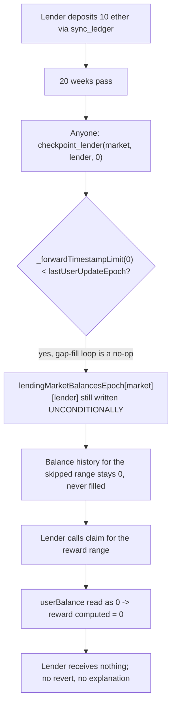
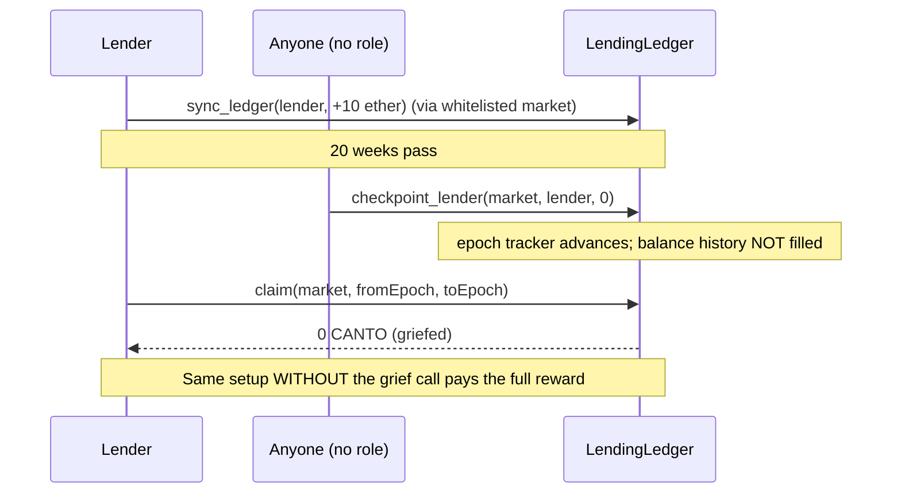

# Canto (veRWA) — unguarded `checkpoint_lender`/`checkpoint_market` let anyone grief a lender's reward to 0

> **Vulnerability classes:** vuln/access-control/missing-modifier · vuln/dos/griefing · vuln/logic/incomplete-guard

> **Reproduction:** a self-contained Foundry PoC that compiles & runs in an
> isolated project with **only `forge-std`** — no fork, no RPC, no `anvil_state`.
> Full trace: [output.txt](output.txt). PoC:
> [test/26975-h-07-lack-of-access-control-in-lendingledgersolcheckpoint-le_exp.sol](test/26975-h-07-lack-of-access-control-in-lendingledgersolcheckpoint-le_exp.sol).

<!-- non-defihacklabs -->
<!-- source-auditvault: https://github.com/Auditware/AuditVault/blob/main/findings/26975-h-07-lack-of-access-control-in-lendingledgersolcheckpoint-le.md -->
<!-- date: 2023-08 -->

**AuditVault taxonomy:** `lang/solidity` · `platform/code4rena` · `has/github` · `has/poc` · `severity/high` · `sector/lending` · `vuln/dos/griefing` · `fix/add-access-control` · genome: `griefing` · `add-access-control` · `reward-theft` · `reward-accounting` · `dos-resistance`

---

## Key info

| | |
|---|---|
| **Impact** | **HIGH** — anyone, with zero permissions, can silently zero out a lender's accrued reward for an entire time range, at negligible gas cost |
| **Protocol** | [Canto veRWA](https://code4rena.com/reports/2023-08-verwa) — `LendingLedger.sol`, the reward-accrual ledger for whitelisted lending markets |
| **Vulnerable code** | `checkpoint_lender()` / `checkpoint_market()` — no access control, and their internal bodies write the epoch tracker unconditionally |
| **Bug class** | Missing access control combined with an incomplete guard around historical-gap propagation |
| **Finding** | Code4rena — Canto veRWA, 2023-08 · #26975 (H-07) · reporter **ladboy233** |
| **Report** | [2023-08-verwa](https://code4rena.com/reports/2023-08-verwa) |
| **Source** | [AuditVault](https://github.com/Auditware/AuditVault/blob/main/findings/26975-h-07-lack-of-access-control-in-lendingledgersolcheckpoint-le.md) |
| **Status** | Audit finding — found during Code4rena's earlier "test coverage" competition and confirmed/fixed before the main audit; documented in the main report for completeness. Reproduced here as a standalone local PoC using the pre-fix code the finding quotes. |
| **Compiler** | `^0.8.24` (PoC, `via-ir`) |

This is an **audit finding**, not a historical on-chain incident. Note: the
currently published audited-repo snapshot already contains the fix for this
specific bug (it predates the main audit), so this PoC reconstructs
`LendingLedger` using the exact **pre-fix** checkpoint bodies the finding
quotes and describes, exactly as `AuditVault` curated it.

---

## TL;DR

1. A lender deposits cNote into a whitelisted lending market. `sync_ledger`
   records the deposit and tracks the epoch it was last updated at.
2. `checkpoint_lender(market, lender, _forwardTimestampLimit)` and
   `checkpoint_market(market, _forwardTimestampLimit)` have **no access
   control** — anyone can call them for anyone.
3. Their internal `_checkpoint_*` bodies write the epoch tracker
   **unconditionally** at the end of the function — even when the "fill
   historical gaps" branch above it never actually ran (because the caller
   passed a `_forwardTimestampLimit` lower than the last recorded epoch, e.g.
   `0`).
4. An attacker calls `checkpoint_lender(market, victim, 0)`. This skips the
   propagation of the victim's balance into later epochs but still advances
   the epoch tracker — silently corrupting the victim's history instead of
   reverting.
5. HARM: when the victim later calls `claim()`, the reward computation reads
   the (now-unfilled) balance for the affected epoch as `0`, so their reward
   for that stretch is silently `0` — no revert, no explanation, and no funds
   ever moved on the attacker's side.

---

## The vulnerable code

`_checkpoint_lender`, reconstructed from the finding's description (mirroring
the same defect the finding quotes verbatim for `_checkpoint_market`):

```solidity
function _checkpoint_lender(address _market, address _lender, uint256 _forwardTimestampLimit) private {
    uint256 currEpoch = (block.timestamp / WEEK) * WEEK;
    uint256 lastUserUpdateEpoch = lendingMarketBalancesEpoch[_market][_lender];
    uint256 updateUntilEpoch = Math.min(currEpoch, _forwardTimestampLimit);
    if (lastUserUpdateEpoch == 0) {
        userClaimedEpoch[_market][_lender] = currEpoch;
    } else if (lastUserUpdateEpoch < currEpoch) {
        uint256 lastUserBalance = lendingMarketBalances[_market][_lender][lastUserUpdateEpoch];
        for (uint256 i = lastUserUpdateEpoch; i <= updateUntilEpoch; i += WEEK) {
            lendingMarketBalances[_market][_lender][i] = lastUserBalance;
        }
    }
    lendingMarketBalancesEpoch[_market][_lender] = updateUntilEpoch; // @> VULN: unconditional
}
```

The finding's own quoted vulnerable `_checkpoint_market` (verbatim):

```solidity
function _checkpoint_market(address _market, uint256 _forwardTimestampLimit) private {
    uint256 currEpoch = (block.timestamp / WEEK) * WEEK;
    uint256 lastMarketUpdateEpoch = lendingMarketTotalBalanceEpoch[_market];
    uint256 updateUntilEpoch = Math.min(currEpoch, _forwardTimestampLimit);
    if (lastMarketUpdateEpoch > 0 && lastMarketUpdateEpoch < currEpoch) {
        uint256 lastMarketBalance = lendingMarketTotalBalance[_market][lastMarketUpdateEpoch];
        for (uint256 i = lastMarketUpdateEpoch; i <= updateUntilEpoch; i += WEEK) {
            lendingMarketTotalBalance[_market][i] = lastMarketBalance;
        }
    }
    lendingMarketTotalBalanceEpoch[_market] = updateUntilEpoch;
}
```

And the external entry points that expose them with **no access control**:

```solidity
function checkpoint_market(address _market, uint256 _forwardTimestampLimit)
    external is_valid_epoch(_forwardTimestampLimit)
{
    require(lendingMarketTotalBalanceEpoch[_market] > 0, "No deposits for this market");
    _checkpoint_market(_market, _forwardTimestampLimit); // @> VULN: no onlyGovernance / onlyMarket
}

function checkpoint_lender(address _market, address _lender, uint256 _forwardTimestampLimit)
    external is_valid_epoch(_forwardTimestampLimit)
{
    require(lendingMarketBalancesEpoch[_market][_lender] > 0, "No deposits for this lender in this market");
    _checkpoint_lender(_market, _lender, _forwardTimestampLimit); // @> VULN: no access control
}
```

`is_valid_epoch` only checks that the timestamp is divisible by `WEEK` (or is
`type(uint256).max`) — `0` passes that check trivially.

---

## Root cause

Two independent gaps compound into one bug:

1. **No caller restriction.** These functions are documented as "never needs
   to be called explicitly" — an optimization for reducing gas on other calls
   — but nothing stops an arbitrary, unrelated address from calling them with
   an adversarial `_forwardTimestampLimit`.
2. **The epoch tracker advances unconditionally.** Even when a low
   `_forwardTimestampLimit` makes the historical-gap-fill branch a no-op, the
   final assignment still runs — moving the "last known epoch" pointer
   forward (or, on a fresh corruption, snapping it to whatever epoch a later
   `claim()`/`sync_ledger` call happens to pass) **without** the balance
   history actually having been filled in for the skipped range. Every future
   read of that range sees a default `0` instead of the correct
   carried-forward balance.

## Preconditions

- The victim has an existing deposit recorded in the ledger (an ordinary,
  permissionless prerequisite for the "no deposits" guard to pass).
- Some calendar time has passed since the lender's last checkpoint (the
  ordinary case for any lender who isn't checkpointing every single week).

## Attack walkthrough

From [output.txt](output.txt) (`test_realTimeGriefReproduction`, using a real
`sync_ledger` deposit and a real 20-week `vm.warp`):

1. A lender deposits `10 ether` of cNote into a whitelisted market.
2. 20 weeks pass with no further activity.
3. A completely unrelated third party — no role, no whitelist membership —
   calls `checkpoint_lender(market, lender, 0)`. Nothing in the contract stops
   it.
4. The lender calls `claim()` for the reward range that was set up in advance.
5. **HARM:** the lender receives `0` CANTO — not because there were no
   rewards (the same setup pays a full reward when the checkpoint call is
   never made — see `test_control_noGrief_fullReward`), but because the
   griefing call silently corrupted the epoch bookkeeping the reward
   calculation depends on.

## Diagrams





## Remediation

Per the report (OpenCoreCH's fix), only advance the epoch tracker when the
gap-fill actually ran:

```solidity
if (lastMarketUpdateEpoch > 0 && lastMarketUpdateEpoch < currEpoch) {
    uint256 lastMarketBalance = lendingMarketTotalBalance[_market][lastMarketUpdateEpoch];
    for (uint256 i = lastMarketUpdateEpoch; i <= updateUntilEpoch; i += WEEK) {
        lendingMarketTotalBalance[_market][i] = lastMarketBalance;
    }
    if (updateUntilEpoch > lastMarketUpdateEpoch) {
        lendingMarketTotalBalanceEpoch[_market] = updateUntilEpoch;
    }
}
```

(with the analogous fix applied to `_checkpoint_lender`). Adding access
control to the two external entry points is a reasonable defense-in-depth
addition but does not by itself fix the underlying epoch-tracker regression
bug.

## How to reproduce

```bash
cd ~/RustroverProjects/audits/evm-hack-registry/26975-h-07-lack-of-access-control-in-lendingledgersolcheckpoint-le_exp
forge test -vvv
# Fully local — no fork, no RPC, no anvil_state required.
# Expected: all three tests PASS:
#   test_exploit                    (self-contained Exploit; deposit history planted via vm.store)
#   test_realTimeGriefReproduction  (independent rebuild using real sync_ledger + vm.warp)
#   test_control_noGrief_fullReward (control: no grief call -> full reward paid)
```

PoC source: [test/26975-h-07-lack-of-access-control-in-lendingledgersolcheckpoint-le_exp.sol](test/26975-h-07-lack-of-access-control-in-lendingledgersolcheckpoint-le_exp.sol).

> **Why the storage-seeding step:** the cheatcode-free `Exploit.run()` (shared
> between the registry test and the browser Playground) executes at a single
> fixed `block.timestamp`, so it cannot itself simulate a deposit having
> happened, and then real time having elapsed. `test_exploit` plants exactly
> that end-state (victim deposited one epoch ago, in two markets) directly
> into `LendingLedger`'s storage via `vm.store` (the Playground config does
> the identical thing via its `setup.steps`, which run before the traced
> attack call). Every effect of `run()` itself — the unauthorized checkpoint
> call and the resulting zeroed reward — is then produced by `LendingLedger`'s
> real, unmodified code executing normally. `test_realTimeGriefReproduction`
> independently confirms the same outcome using only a real `sync_ledger`
> deposit and a real `vm.warp`, with no storage shortcuts at all.

> Note: `LendingLedger` here reconstructs the **pre-fix** checkpoint bodies
> the finding itself quotes and describes (the currently published
> audited-repo snapshot at
> [code-423n4/2023-08-verwa@a693b4d](https://github.com/code-423n4/2023-08-verwa/blob/a693b4db05b9e202816346a6f9cada94f28a2698/src/LendingLedger.sol)
> already contains OpenCoreCH's fix, since this bug predates the main audit).
> `gaugeController.gauge_relative_weight_write` is replaced by a minimal mock
> returning a constant 100% weight — irrelevant to this bug, which is entirely
> about `LendingLedger`'s own per-lender/per-market epoch bookkeeping. Every
> other function (`sync_ledger`, `claim`, `setRewards`,
> `whiteListLendingMarket`) matches the audited source.

---

*Reference: finding **#26975 (H-07)** by **ladboy233** in the [Code4rena Canto veRWA review (Aug 2023)](https://code4rena.com/reports/2023-08-verwa) · curated by [AuditVault](https://github.com/Auditware/AuditVault/blob/main/findings/26975-h-07-lack-of-access-control-in-lendingledgersolcheckpoint-le.md)*
