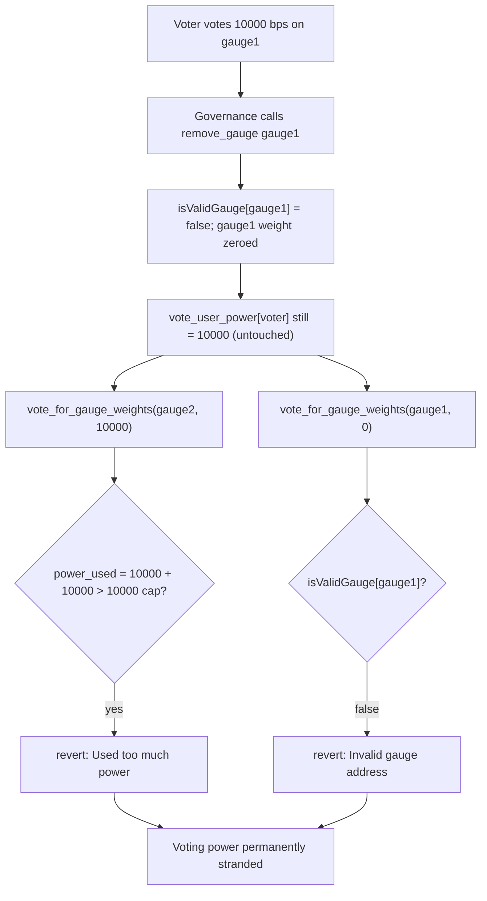
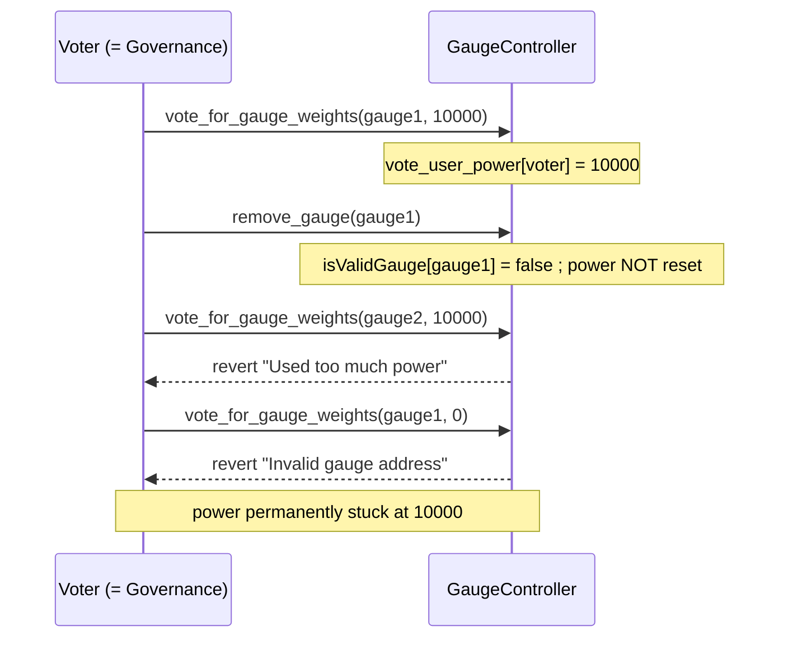

# Canto (veRWA) — removing a gauge permanently strands a voter's voting power

> **Vulnerability classes:** vuln/access-control/missing-state-reset · vuln/governance/stranded-voting-power · vuln/logic/incomplete-invalidation

> **Reproduction:** a self-contained Foundry PoC that compiles & runs in an
> isolated project with **only `forge-std`** — no fork, no RPC, no `anvil_state`.
> Full trace: [output.txt](output.txt). PoC:
> [test/26976-h-08-if-governance-removes-a-gauge-users-voting-power-for-th_exp.sol](test/26976-h-08-if-governance-removes-a-gauge-users-voting-power-for-th_exp.sol).

<!-- non-defihacklabs -->
<!-- source-auditvault: https://github.com/Auditware/AuditVault/blob/main/findings/26976-h-08-if-governance-removes-a-gauge-users-voting-power-for-th.md -->
<!-- date: 2023-08 -->

**AuditVault taxonomy:** `lang/solidity` · `lang/vyper` · `platform/code4rena` · `has/github` · `has/poc` · `severity/high` · `sector/governance` · genome: `frozen-funds` · `locked-funds` · `access-roles`

---

## Key info

| | |
|---|---|
| **Impact** | **HIGH** — a voter who allocates voting power to a gauge that governance later removes can never move OR reclaim that power; it is permanently stranded |
| **Protocol** | [Canto veRWA](https://code4rena.com/reports/2023-08-verwa) — `GaugeController.sol`, a Solidity port of Curve DAO's gauge weight voting system |
| **Vulnerable code** | `GaugeController.vote_for_gauge_weights()` requiring `isValidGauge[_gauge_addr]` unconditionally, combined with `remove_gauge()` never clearing the voter's own allocation |
| **Bug class** | Incomplete invalidation: removing a gauge invalidates the gauge but not outstanding per-voter state that references it |
| **Finding** | Code4rena — Canto veRWA, 2023-08 · #26976 (H-08) · reporter **popular00** |
| **Report** | [2023-08-verwa](https://code4rena.com/reports/2023-08-verwa) |
| **Source** | [AuditVault](https://github.com/Auditware/AuditVault/blob/main/findings/26976-h-08-if-governance-removes-a-gauge-users-voting-power-for-th.md) |
| **Status** | Audit finding — caught in review (not exploited on-chain). Reproduced here as a standalone local PoC. |
| **Compiler** | `^0.8.24` (PoC, `via-ir`) |

This is an **audit finding**, not a historical on-chain incident. The real
`GaugeController` depends on a `VotingEscrow` contract for a voter's lock/slope
data; the PoC keeps `GaugeController` essentially **verbatim** (only the
`VotingEscrow` type is swapped for a minimal configurable mock — none of the
vulnerable control-flow is touched) so the blamed checks execute exactly as in
the audited code.

---

## TL;DR

1. A voter commits **100% (10,000 bps)** of their voting power to `gauge1` via
   `vote_for_gauge_weights(gauge1, 10000)`.
2. Governance later calls `remove_gauge(gauge1)` — for any legitimate reason
   (the pool was faulty, became illiquid, or its incentive period expired).
3. `remove_gauge()` sets `isValidGauge[gauge1] = false` and zeroes the gauge's
   total weight, but it **never touches** `vote_user_power[voter]` or
   `vote_user_slopes[voter][gauge1]` — the voter's own bookkeeping is untouched.
4. The voter tries to redirect their power to `gauge2`: **blocked** — the stale
   10,000 bps allocated to the removed `gauge1` is still counted against the
   10,000 bps cap in `vote_for_gauge_weights`.
5. The voter tries to vote `0` on `gauge1` just to release the power: **blocked
   too** — `vote_for_gauge_weights` requires `isValidGauge[_gauge_addr]` even
   for a zero-weight vote, and `gauge1` no longer validates.
6. HARM in the PoC: after removal, `vote_user_power[voter]` still reads
   `10,000` and BOTH escape attempts revert. The voter's power is permanently
   and irrecoverably stranded — a portion of the protocol's whole voting supply
   is now dead weight forever.

---

## The vulnerable code

`remove_gauge` never resets the remover's own vote (verbatim,
`GaugeController.sol`):

```solidity
function remove_gauge(address _gauge) external onlyGovernance {
    require(isValidGauge[_gauge], "Invalid gauge address");
    isValidGauge[_gauge] = false;
    _change_gauge_weight(_gauge, 0);   // @> VULN: never clears vote_user_slopes/vote_user_power for _gauge
    emit GaugeRemoved(_gauge);
}
```

`vote_for_gauge_weights` then shuts the door on recovering that power (verbatim):

```solidity
function vote_for_gauge_weights(address _gauge_addr, uint256 _user_weight) external {
    require(_user_weight >= 0 && _user_weight <= 10_000, "Invalid user weight");
    require(isValidGauge[_gauge_addr], "Invalid gauge address"); // @> VULN: blocks even a 0-weight "give my power back" vote
    ...
    uint256 power_used = vote_user_power[msg.sender];
    power_used = power_used + new_slope.power - old_slope.power;
    require(power_used >= 0 && power_used <= 10_000, "Used too much power"); // @> stale allocation still counted here
    ...
}
```

Since `_gauge_addr` must satisfy `isValidGauge[_gauge_addr]` no matter what
`_user_weight` is, a removed gauge can never again appear in a
`vote_for_gauge_weights` call — not even with weight `0`.

---

## Root cause

`remove_gauge` treats "invalidate the gauge" and "invalidate everyone's votes
on the gauge" as the same operation, but only does the first. The gauge's
*global* weight is reset, yet every voter's *individual* `vote_user_power` /
`vote_user_slopes` entry for that gauge survives untouched. Because
`vote_for_gauge_weights` gates on gauge validity for *every* call including a
0-weight release, there is no code path left that can zero out a stale
allocation once its gauge is gone — the voter is stuck with a permanently
"used" chunk of their 10,000 bps budget.

## Preconditions

- The voter has voted a nonzero weight for some gauge.
- Governance removes that gauge for any reason (this is explicitly an
  anticipated, ordinary admin action — not a malicious or unusual one).

## Attack walkthrough

From [output.txt](output.txt):

1. The voter votes `10,000` bps (100%) on `gauge1`.
2. Governance calls `remove_gauge(gauge1)` — `isValidGauge[gauge1]` becomes
   `false`, `gauge1`'s weight is zeroed, but `vote_user_power[voter] == 10,000`
   is untouched.
3. `vote_for_gauge_weights(gauge2, 10000)` reverts `"Used too much power"` —
   the stale 10,000 bps on `gauge1` is still on the books.
4. `vote_for_gauge_weights(gauge1, 0)` reverts `"Invalid gauge address"` — the
   only function that could release the power refuses to run on an invalid
   gauge.
5. **HARM:** `vote_user_power[voter]` still reads `10,000` with no way left to
   reduce it. The control test `test_removingAnUnusedGauge_isHarmless` confirms
   the defect is specific to voters who had an outstanding allocation — removing
   an unvoted gauge is harmless, isolating the missing state-reset as the root
   cause.

## Diagrams





## Remediation

Per the report, the simplest fix is to allow zero-weight votes on invalid
gauges purely to release the allocation:

```solidity
require(_user_weight == 0 || isValidGauge[_gauge_addr], "Can only vote 0 on non-gauges");
```

Alternatively (or additionally), `remove_gauge` could walk/void outstanding
votes itself, or an external "force-release" function could be added for
voters stuck on a removed gauge.

## How to reproduce

```bash
cd ~/RustroverProjects/audits/evm-hack-registry/26976-h-08-if-governance-removes-a-gauge-users-voting-power-for-th_exp
forge test -vvv
# Fully local — no fork, no RPC, no anvil_state required.
# Expected: all three tests PASS:
#   test_exploit                          (self-contained Exploit: power stranded)
#   test_removedGaugeStrandsVotingPower   (standalone rebuild mirroring the finding's PoC)
#   test_removingAnUnusedGauge_isHarmless (control: removing an unvoted gauge is safe)
```

PoC source: [test/26976-h-08-if-governance-removes-a-gauge-users-voting-power-for-th_exp.sol](test/26976-h-08-if-governance-removes-a-gauge-users-voting-power-for-th_exp.sol)
— drives the cheatcode-free `Exploit`, plus a standalone rebuild and a control test.

> Note: `GaugeController` here is a faithful, near-verbatim reduction of
> `src/GaugeController.sol` from the audited repo
> ([code-423n4/2023-08-verwa@a693b4d](https://github.com/code-423n4/2023-08-verwa/blob/a693b4db05b9e202816346a6f9cada94f28a2698/src/GaugeController.sol)) —
> only the `VotingEscrow` dependency is replaced by a minimal mock exposing the
> two view functions `vote_for_gauge_weights` reads (`getLastUserPoint`,
> `lockEnd`); it does not affect the bug. Every blamed line and the voting/removal
> control-flow are unchanged from the audited source.

---

*Reference: finding **#26976 (H-08)** by **popular00** in the [Code4rena Canto veRWA review (Aug 2023)](https://code4rena.com/reports/2023-08-verwa) · curated by [AuditVault](https://github.com/Auditware/AuditVault/blob/main/findings/26976-h-08-if-governance-removes-a-gauge-users-voting-power-for-th.md)*
