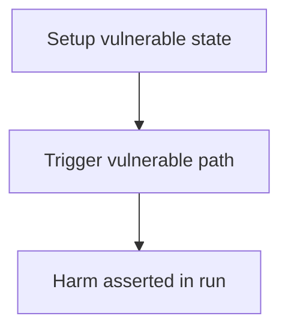

# Livepeer — Underflow in updateTranscoderWithFees can cause corrupted data and loss of winning tickets

> **Vulnerability classes:** see taxonomy below

> **Reproduction:** a self-contained Foundry PoC that compiles & runs in an
> isolated project with **only `forge-std`** — no fork, no RPC, no `anvil_state`.
> Full trace: [output.txt](output.txt). PoC:
> [test/27047-h-01-underflow-in-updatetranscoderwithfees-can-cause-corrupt_exp.sol](test/27047-h-01-underflow-in-updatetranscoderwithfees-can-cause-corrupt_exp.sol).

<!-- non-defihacklabs -->
<!-- source-auditvault: https://github.com/Auditware/AuditVault/blob/main/findings/27047-h-01-underflow-in-updatetranscoderwithfees-can-cause-corrupt.md -->
<!-- date: 2023-08 -->

---

## Key info

| | |
|---|---|
| **Impact** | **HIGH** — MathUtils used on PreciseMath cut rate underflows; winning-ticket redeem DoS after skipped reward; 1000 FEE locked |
| **Protocol** | Livepeer |
| **Finding** | Code4rena · reporter **VAD37** |
| **Report** | [https://code4rena.com/reports/2023-08-livepeer](https://code4rena.com/reports/2023-08-livepeer) |
| **Source** | [AuditVault](https://github.com/Auditware/AuditVault/blob/main/findings/27047-h-01-underflow-in-updatetranscoderwithfees-can-cause-corrupt.md) |
| **Status** | Audit finding — reproduced as a standalone local PoC. |
| **Compiler** | `^0.8.24` (PoC) |

This is an **audit finding**, not a historical on-chain incident.

---

## TL;DR

1. treasuryRewardCutRate stored as PreciseMathUtils % (1e27).\n2. updateTranscoderWithFees uses MathUtils.percOf (1e6).\n3. 10% cut (1e26) → treasuryRewards >> rewards → underflow.\n4. Ticket redeem after skipped reward always reverts; ticket expires; fees lost.

## Diagrams

## Impact

MathUtils used on PreciseMath cut rate underflows; winning-ticket redeem DoS after skipped reward; 1000 FEE locked

## Sources

- [AuditVault finding](https://github.com/Auditware/AuditVault/blob/main/findings/27047-h-01-underflow-in-updatetranscoderwithfees-can-cause-corrupt.md)
- [Code4rena report](https://code4rena.com/reports/2023-08-livepeer)
- Reduced synthetic: `test/27047-h-01-underflow-in-updatetranscoderwithfees-can-cause-corrupt.sol` (C2 local-deploy)
