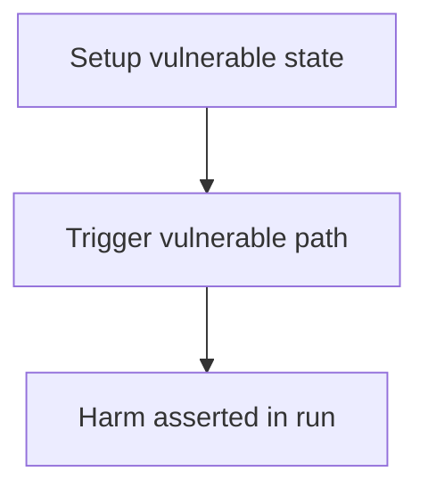

# Livepeer — By delegating to a non-transcoder, a delegator can reduce someone else's vote tally

> **Vulnerability classes:** see taxonomy below

> **Reproduction:** a self-contained Foundry PoC that compiles & runs in an
> isolated project with **only `forge-std`** — no fork, no RPC, no `anvil_state`.
> Full trace: [output.txt](output.txt). PoC:
> [test/27048-h-02-by-delegating-to-a-non-transcoder-a-delegator-can-reduc_exp.sol](test/27048-h-02-by-delegating-to-a-non-transcoder-a-delegator-can-reduc_exp.sol).

<!-- non-defihacklabs -->
<!-- source-auditvault: https://github.com/Auditware/AuditVault/blob/main/findings/27048-h-02-by-delegating-to-a-non-transcoder-a-delegator-can-reduc.md -->
<!-- date: 2023-08 -->

---

## Key info

| | |
|---|---|
| **Impact** | **HIGH** — Missing isTranscoder check in vote override lets Bob cancel 1000 ungranted For votes and vote Against |
| **Protocol** | Livepeer |
| **Finding** | Code4rena · reporter **Banditx0x** |
| **Report** | [https://code4rena.com/reports/2023-08-livepeer](https://code4rena.com/reports/2023-08-livepeer) |
| **Source** | [AuditVault](https://github.com/Auditware/AuditVault/blob/main/findings/27048-h-02-by-delegating-to-a-non-transcoder-a-delegator-can-reduc.md) |
| **Status** | Audit finding — reproduced as a standalone local PoC. |
| **Compiler** | `^0.8.24` (PoC) |

This is an **audit finding**, not a historical on-chain incident.

---

## TL;DR

1. Non-transcoder Alice votes For with 100; Carol For 5000 → For=5100.\n2. Bob delegates 1000 to Alice, votes Against.\n3. Override subtracts 1000 from For without Alice ever holding that weight.\n4. For=4100, Against=1000 — double influence.

## Diagrams

## Impact

Missing isTranscoder check in vote override lets Bob cancel 1000 ungranted For votes and vote Against

## Sources

- [AuditVault finding](https://github.com/Auditware/AuditVault/blob/main/findings/27048-h-02-by-delegating-to-a-non-transcoder-a-delegator-can-reduc.md)
- [Code4rena report](https://code4rena.com/reports/2023-08-livepeer)
- Reduced synthetic: `test/27048-h-02-by-delegating-to-a-non-transcoder-a-delegator-can-reduc.sol` (C2 local-deploy)
