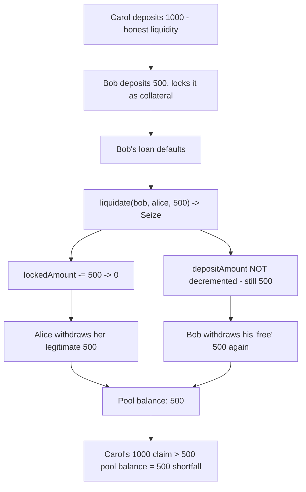
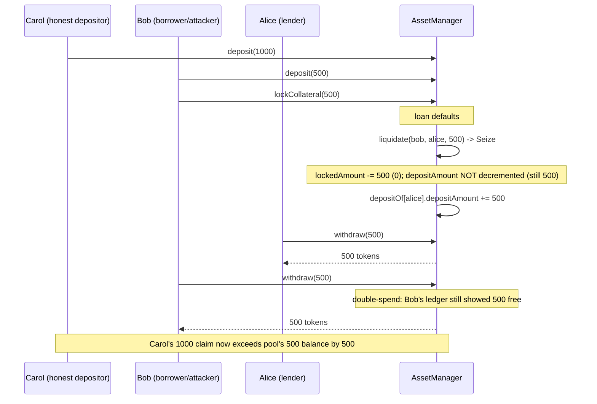

# Lumin — Collateral double-spend post liquidation is possible

> **Vulnerability classes:** vuln/logic/accounting-desync · vuln/loss-of-funds/bad-debt · vuln/access-control/missing-check

> **Reproduction:** a self-contained Foundry PoC that compiles & runs in an
> isolated project with **only `forge-std`** — no fork, no RPC, no `anvil_state`.
> Full trace: [output.txt](output.txt). PoC:
> [test/27233-c-01-collateral-double-spend-post-liquidation-is-possible-pa_exp.sol](test/27233-c-01-collateral-double-spend-post-liquidation-is-possible-pa_exp.sol).

<!-- non-defihacklabs -->
<!-- source-auditvault: https://github.com/Auditware/AuditVault/blob/main/findings/27233-c-01-collateral-double-spend-post-liquidation-is-possible-pa.md -->
<!-- date: 2023-09 -->

---

## Key info

| | |
|---|---|
| **Impact** | **HIGH** — a liquidated borrower can withdraw their already-seized collateral a second time, draining funds that belong to other depositors (socialized loss) |
| **Protocol** | Lumin — lending protocol (collateral/loan accounting core) |
| **Vulnerable code** | `AssetManager::assetTransferOnLoanAction`, the `Seize` branch |
| **Bug class** | Accounting desync: decrements `lockedAmount` but never `depositAmount` on liquidation |
| **Finding** | Pashov Audit Group, 2023-09 · [C-01] · #27233 |
| **Report** | [2023-09-01-Lumin.md](https://github.com/solodit/solodit_content/blob/main/reports/Pashov/2023-09-01-Lumin.md) |
| **Source** | [AuditVault](https://github.com/Auditware/AuditVault/blob/main/findings/27233-c-01-collateral-double-spend-post-liquidation-is-possible-pa.md) |
| **Status** | Audit finding — caught in review (not exploited on-chain). Reproduced here as a standalone local PoC. |
| **Compiler** | `^0.8.24` (PoC) |

This is an **audit finding**, not a historical on-chain incident. The finding's
own report quotes the vulnerable `assetTransferOnLoanAction` branch directly (the
Lumin client repo is not linked from the report); this reduction keeps that quoted
branch **verbatim** and builds the minimal multi-user scaffolding needed to turn it
into a measurable fund-loss.

---

## TL;DR

1. `AssetManager` tracks each user's collateral in a `UserDeposit{depositAmount,
   lockedAmount}` struct. Withdrawals are gated on the *free* balance:
   `depositAmount - lockedAmount`.
2. On liquidation, the `Seize` branch of `assetTransferOnLoanAction` runs
   `userDepositFrom.lockedAmount -= amount` and credits the lender's
   `depositAmount`, but **never** decrements the borrower's own `depositAmount`.
3. Once `lockedAmount` returns to 0, the borrower's ledger shows the seized
   collateral as fully free again — even though it was already paid to the
   lender.
4. The borrower withdraws it a **second time**: a double-spend of already-seized
   collateral, paid for out of an honest depositor's real funds.
5. Result: the honest depositor's claim now exceeds the pool's real token
   balance by exactly the double-spent amount — she cannot be made whole.

---

## The vulnerable code

The accounting desync (verbatim, `AssetManager::assetTransferOnLoanAction`,
`Seize` branch):

```solidity
} else if (action == AssetActionType.Seize) {
        userDepositFrom.lockedAmount -= amount;
+       userDepositFrom.depositAmount -= amount;   // <- MISSING in the vulnerable code
        userDepositTo.depositAmount += amount;
    }
```

(diff shown per the finding's own recommended fix — the `+` line does not exist in
the vulnerable code; this reduction keeps the two lines that DO exist, verbatim,
and marks the missing one.)

---

## Root cause

`depositAmount` and `lockedAmount` are meant to move together during a seize:
collateral that leaves the borrower's *locked* bucket must also leave their
*deposit* bucket, since it has been paid out to someone else. The Seize branch
only updates one side of that pair. The withdrawal gate (`depositAmount -
lockedAmount`) then computes a "free balance" that still counts funds that no
longer belong to the borrower.

## Preconditions

- A borrower has posted collateral and locked it against a loan.
- The loan is liquidated (defaults) — liquidation is permissionless in the
  original finding ("a random user liquidates Bob's loan").
- The pool holds enough *other* depositors' real tokens for the double-spent
  withdrawal to actually succeed (otherwise the borrower's second withdrawal
  itself would revert on insufficient token balance, and the loss would instead
  show up as a stuck honest depositor).

## Attack walkthrough

From [output.txt](output.txt):

1. Carol deposits **1000** units as an honest liquidity provider. Pool balance:
   1000.
2. Bob deposits **500** units and locks all of it as loan collateral. Pool
   balance: 1500.
3. Bob's loan defaults; anyone calls `liquidate`, seizing his 500 locked
   collateral for Alice (the lender). `lockedAmount` drops to 0, but
   `depositAmount` **stays at 500** — the bug.
4. Alice withdraws her legitimately-paid 500. Pool balance: 1000.
5. **HARM:** Bob ALSO withdraws "his" 500 — the exact same collateral already
   paid to Alice. Pool balance drops to 500.
6. **HARM:** Carol's honest 1000 claim now exceeds the pool's real 500 token
   balance by exactly 500 — the double-spent amount. She cannot be made whole.

A control test confirms that, absent a liquidation, a normal deposit/withdraw
cycle correctly zeroes out and a further withdrawal reverts — proving the bug
only fires once the Seize branch has run.

## Diagrams





## Remediation

Also decrement the borrower's `depositAmount` in the `Seize` branch:

```diff
 } else if (action == AssetActionType.Seize) {
     userDepositFrom.lockedAmount -= amount;
+    userDepositFrom.depositAmount -= amount;
     userDepositTo.depositAmount += amount;
 }
```

## How to reproduce

```bash
cd ~/RustroverProjects/audits/evm-hack-registry/27233-c-01-collateral-double-spend-post-liquidation-is-possible-pa_exp
forge test -vvv
# Fully local — no fork, no RPC, no anvil_state required.
# Expected: both tests PASS:
#   test_CollateralDoubleSpendPostLiquidation   (attack: Bob double-spends 500; Carol short by 500)
#   test_Control_NoLiquidation_NoDoubleSpend    (control: no liquidation -> no double-spend possible)
```

PoC source: [test/27233-c-01-collateral-double-spend-post-liquidation-is-possible-pa_exp.sol](test/27233-c-01-collateral-double-spend-post-liquidation-is-possible-pa_exp.sol)
— the verbatim vulnerable `Seize` branch plus a minimal multi-user
deposit/lock/liquidate/withdraw scaffold and a control test.

> Note: Lumin's real `AssetManager` supports multiple assets, loan configs, and
> full loan lifecycle bookkeeping (out of scope here); this reduction keeps a
> single asset and the exact accounting lines the finding blames — the bug class
> (Seize forgets to decrement the borrower's own deposit ledger → double-spend of
> liquidated collateral) and the verbatim vulnerable lines are faithful to the
> finding's own quoted diff.

---

*Reference: finding **#27233 [C-01]** by **Pashov Audit Group** in the [2023-09-01-Lumin.md report](https://github.com/solodit/solodit_content/blob/main/reports/Pashov/2023-09-01-Lumin.md) · curated by [AuditVault](https://github.com/Auditware/AuditVault/blob/main/findings/27233-c-01-collateral-double-spend-post-liquidation-is-possible-pa.md)*
