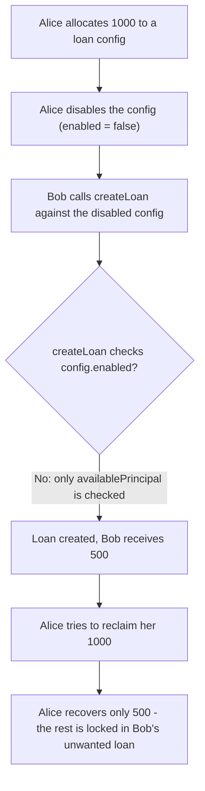
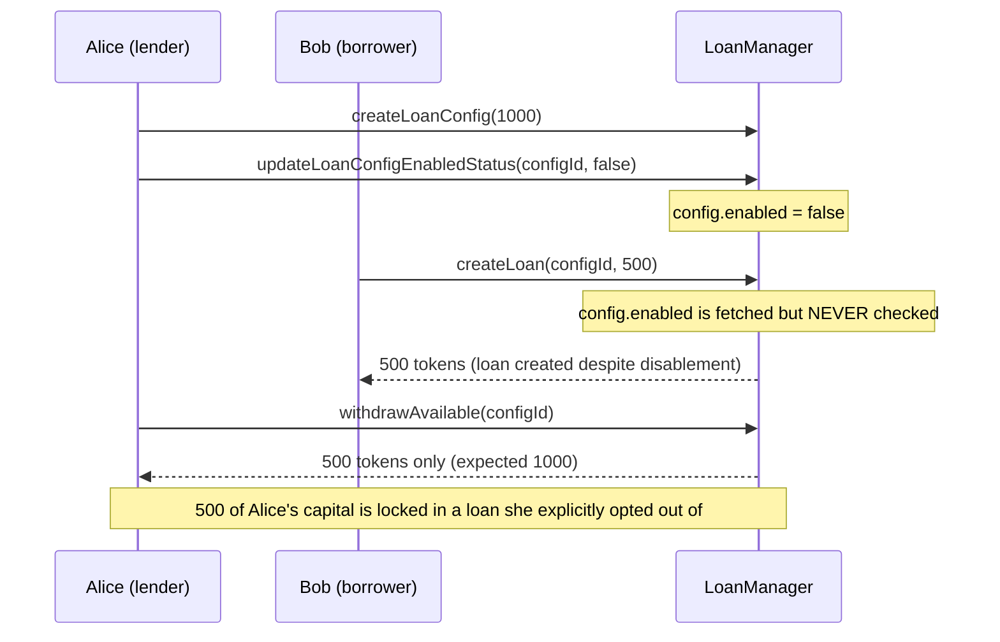

# Lumin — Disabled lender's loan configuration can be used by a borrower

> **Vulnerability classes:** vuln/access-control/missing-check · vuln/logic/state-flag-ignored

> **Reproduction:** a self-contained Foundry PoC that compiles & runs in an
> isolated project with **only `forge-std`** — no fork, no RPC, no `anvil_state`.
> Full trace: [output.txt](output.txt). PoC:
> [test/27234-h-01-disabled-lenders-loan-configuration-can-be-used-by-a-bo_exp.sol](test/27234-h-01-disabled-lenders-loan-configuration-can-be-used-by-a-bo_exp.sol).

<!-- non-defihacklabs -->
<!-- source-auditvault: https://github.com/Auditware/AuditVault/blob/main/findings/27234-h-01-disabled-lenders-loan-configuration-can-be-used-by-a-bo.md -->
<!-- date: 2023-09 -->

---

## Key info

| | |
|---|---|
| **Impact** | **HIGH** (per AuditVault severity tag) — a lender's only lever to stop new loans against her capital never actually works; a borrower can keep drawing against a config she explicitly disabled |
| **Protocol** | Lumin — lending protocol (loan configuration / loan-creation core) |
| **Vulnerable code** | `LoanManager::createLoan` — never reads `LoanConfig.enabled` |
| **Bug class** | Missing check: a state flag is set and can be flipped, but the function that should honor it never reads it |
| **Finding** | Pashov Audit Group, 2023-09 · [H-01] · #27234 |
| **Report** | [2023-09-01-Lumin.md](https://github.com/solodit/solodit_content/blob/main/reports/Pashov/2023-09-01-Lumin.md) |
| **Source** | [AuditVault](https://github.com/Auditware/AuditVault/blob/main/findings/27234-h-01-disabled-lenders-loan-configuration-can-be-used-by-a-bo.md) |
| **Status** | Audit finding — caught in review (not exploited on-chain). Reproduced here as a standalone local PoC. |
| **Compiler** | `^0.8.24` (PoC) |

This is an **audit finding**, not a historical on-chain incident. The finding's
own report quotes the vulnerable `createLoan` snippet directly (the Lumin client
repo is not linked from the report); this reduction keeps that omission — the
missing `enabled` check — verbatim and builds the minimal lender/borrower
scaffolding needed to turn it into a measurable, quantified loss of control over
the lender's capital.

---

## TL;DR

1. A `LoanConfig` has an `enabled` flag, `true` by default, that a lender can
   flip to `false` via `updateLoanConfigEnabledStatus` — her only lever to stop
   further loans from being drawn against her allocated capital.
2. `LoanManager::createLoan` fetches the `LoanConfig` from storage and checks
   only that the requested principal fits under `availablePrincipal`. It never
   checks `enabled`.
3. A borrower can therefore draw a brand-new loan against a config the lender
   has explicitly disabled — the "disable" lever has zero effect.
4. Result: the lender's capital gets committed to a loan she opted out of, and
   she cannot reclaim it on demand — a real loss of control over her own funds'
   liquidity, quantifiable as exactly the amount borrowed after she disabled
   the config.

---

## The vulnerable code

The missing check (verbatim, `LoanManager::createLoan`):

```solidity
function createLoan(uint256 configId, uint256 principalAmount) external returns (uint256 loanId) {
    LoanConfig storage config = loanConfigs[configId];  // @> config.enabled is fetched but never checked below
    require(principalAmount <= config.availablePrincipal, "exceeds available principal");
    ...
```

The report's own recommendation: *"Check if a loan config is enabled in
`LoanManager::createLoan` and revert the transaction if it is not."* No such check
exists anywhere in the function.

---

## Root cause

`enabled` is a first-class, mutable piece of state — a lender can create it,
read it, and flip it — but no code path that consumes `LoanConfig` ever
consults it. The `createLoan` entry point validates only the numeric
`availablePrincipal` cap, leaving `enabled` a dead flag: setting it has no
observable effect on protocol behavior.

## Preconditions

- A lender has created a `LoanConfig` with allocated capital.
- The lender calls `updateLoanConfigEnabledStatus(configId, false)`.
- A borrower calls `createLoan` against that same `configId` while capital
  remains under the (still-decreasing) `availablePrincipal` cap.

## Attack walkthrough

From [output.txt](output.txt):

1. Alice (lender) allocates **1000** units of capital to a new loan config.
2. Alice disables the config immediately, expecting no further loans can touch
   her capital and that she can reclaim the full 1000 on demand.
3. **HARM:** Bob (borrower) calls `createLoan(configId, 500)` against the
   disabled config anyway — it succeeds, and Bob receives 500 tokens.
4. **HARM:** Alice tries to reclaim her allocation. She disabled the config
   *before* any borrow occurred, so she expects the full 1000 back — but she
   can only recover 500. The other 500 was committed to Bob's loan against her
   explicit choice to stop lending, and she has no way to get it back on
   demand.

Two control tests strengthen the finding: an `availablePrincipal`-exceeding
borrow still correctly reverts (the numeric cap works fine — only `enabled` is
ignored), and an **enabled** config is borrowed against in exactly the same way
as the disabled one in the main exploit — proving the flag has literally zero
effect on `createLoan`'s behavior.

## Diagrams





## Remediation

Check `config.enabled` before drawing down `availablePrincipal`:

```diff
 function createLoan(uint256 configId, uint256 principalAmount) external returns (uint256 loanId) {
     LoanConfig storage config = loanConfigs[configId];
+    require(config.enabled, "config disabled");
     require(principalAmount <= config.availablePrincipal, "exceeds available principal");
     ...
```

## How to reproduce

```bash
cd ~/RustroverProjects/audits/evm-hack-registry/27234-h-01-disabled-lenders-loan-configuration-can-be-used-by-a-bo_exp
forge test -vvv
# Fully local — no fork, no RPC, no anvil_state required.
# Expected: all three tests PASS:
#   test_DisabledLoanConfigCanStillBeUsed        (attack: Bob borrows 500 from a disabled config; Alice only reclaims 500 of 1000)
#   test_Control_ExceedsAvailablePrincipal_Reverts (control: the numeric cap still works)
#   test_Control_EnabledConfigBehavesIdentically   (control: an enabled config behaves identically - enabled has zero effect)
```

PoC source: [test/27234-h-01-disabled-lenders-loan-configuration-can-be-used-by-a-bo_exp.sol](test/27234-h-01-disabled-lenders-loan-configuration-can-be-used-by-a-bo_exp.sol)
— the verbatim vulnerable `createLoan` (with `enabled` fetched but unchecked)
plus a minimal lender/borrower scaffold and two control tests.

> Note: Lumin's real `LoanManager` supports collateral posting, interest
> accrual, and full loan lifecycle bookkeeping (out of scope here); this
> reduction keeps a single loan config and the exact omission the finding
> blames — the bug class (a mutable safety flag that no code path ever reads)
> and the verbatim vulnerable line are faithful to the finding's own quoted
> snippet.

---

*Reference: finding **#27234 [H-01]** by **Pashov Audit Group** in the [2023-09-01-Lumin.md report](https://github.com/solodit/solodit_content/blob/main/reports/Pashov/2023-09-01-Lumin.md) · curated by [AuditVault](https://github.com/Auditware/AuditVault/blob/main/findings/27234-h-01-disabled-lenders-loan-configuration-can-be-used-by-a-bo.md)*
